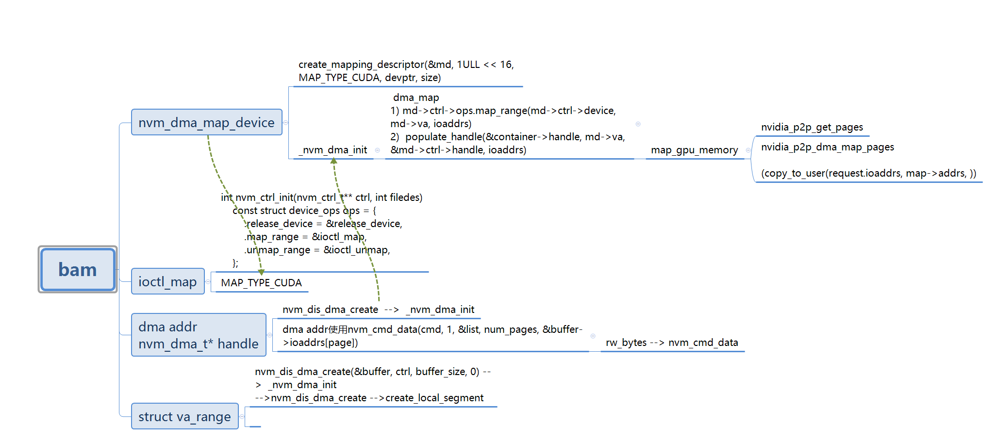

#  proj

[ZaidQureshi/bam](https://github.com/ZaidQureshi/bam)   


#  smartio
***bam/deprecated/examples/read-blocks/smartio.c***   


+ nvm_dis_dma_create(&buffer, ctrl, buffer_size, 0)  创建buffer,buffer是nvidia_p2p_dma_map_pages后的dma address

+ 

 
```
   status = nvm_dis_dma_create(&buffer, ctrl, buffer_size, 0);
    if (!nvm_ok(status))
    {
        fprintf(stderr, "Failed to create data buffer: %s\n", nvm_strerror(status));
        goto leave;
    }

    // Create memory for completion queue
    status = nvm_dis_dma_create(&cq_mem, ctrl, ctrl->page_size, SCI_MEMACCESS_HOST_READ | SCI_MEMACCESS_DEVICE_WRITE);
    if (!nvm_ok(status))
    {
        fprintf(stderr, "Failed to create completion queue memory: %s\n", nvm_strerror(status));
        goto leave;
    }

    // Create memory for submission queue and PRP lists
    size_t n_prp_lists = args.queue_size;

    status = nvm_dis_dma_create(&sq_mem, ctrl, 
            NVM_SQ_PAGES(ctrl, args.queue_size) * ctrl->page_size + ctrl->page_size * (n_prp_lists + 1), 
            SCI_MEMACCESS_HOST_WRITE | SCI_MEMACCESS_DEVICE_READ); 
    if (!nvm_ok(status))
    {
        goto leave;
    }

    // Create queues
    status = create_queue_pair(aq_ref, &queues, cq_mem, sq_mem, args.queue_size);
    if (!nvm_ok(status))
    {
        goto leave;
    }

    if (args.input != NULL)
    {
        status = write_blocks(&info, &queues, buffer, &args);
        if (status != 0)
        {
            goto leave;
        }
    }

    status = read_and_dump(&info, &queues, buffer, &args);
```


> ## map_gpu_memory  

 nvm_dma_map_device   -->  create_mapping_descriptor(&md, 1ULL << 16, MAP_TYPE_CUDA, devptr, size) -->
 map_device_memory --> map_gpu_memory

```
struct map* map_device_memory(struct list* list, const struct ctrl* ctrl, u64 vaddr, unsigned long n_pages, struct list* ctrl_list)
{
    int err;
    struct map* md = NULL;

    if (n_pages < 1)
    {
        return ERR_PTR(-EINVAL);
    }

    md = create_descriptor(ctrl, vaddr & GPU_PAGE_MASK, n_pages);
    if (IS_ERR(md))
    {
        return md;
    }

    md->page_size = GPU_PAGE_SIZE;
    md->ctrl_list = ctrl_list;
    err = map_gpu_memory(md, ctrl_list);
    if (err != 0)
    {
        unmap_and_release(md);
        return ERR_PTR(err);
    }

    list_insert(list, &md->list);

    //printk(KERN_DEBUG "Mapped %lu GPU pages starting at address %llx\n", 
    //        md->n_addrs, md->vaddr);
    return md;
}
```


```
int map_gpu_memory(struct map* map, struct list* list)
{
    unsigned long i;
    uint32_t j;
    int err;
    struct gpu_region* gd;
    const struct list_node* element;
    struct ctrl* ctrl;

    gd = kmalloc(sizeof(struct gpu_region), GFP_KERNEL);
    if (gd == NULL)
    {
        printk(KERN_CRIT "Failed to allocate mapping descriptor\n");
        return -ENOMEM;
    }

    gd->mappings = (nvidia_p2p_dma_mapping_t**)  kmalloc(sizeof(nvidia_p2p_dma_mapping_t*) * max_num_ctrls, GFP_KERNEL);
    
    if (gd->mappings == NULL)
    {
        printk(KERN_CRIT "Failed to allocate mapping descriptor\n");
        kfree(gd);
        return -ENOMEM;
    }
    for (j = 0; j < max_num_ctrls; j++)
        gd->mappings[j] = NULL;

    gd->pages = NULL;
    //gd->mappings = NULL;

    map->page_size = GPU_PAGE_SIZE;
    map->data = gd;
    map->release = release_gpu_memory;

    err = nvidia_p2p_get_pages(0, 0, map->vaddr, GPU_PAGE_SIZE * map->n_addrs, &gd->pages, 
            (void (*)(void*)) force_release_gpu_memory, map);
    if (err != 0)
    {
        printk(KERN_ERR "nvidia_p2p_get_pages() failed: %d\n", err);
        return err;
    }

    element = list_next(&list->head);


    j = 0;
    while (element != NULL)
    {
        ctrl = container_of(element, struct ctrl, list);

        err = nvidia_p2p_dma_map_pages(ctrl->pdev, gd->pages, gd->mappings + (j++));
        if (err != 0)
        {
            //printk(KERN_ERR "nvidia_p2p_dma_map_pages() failed for nvme%u: %d\n", j-1, err);
            return err;
        }
        //for (i = 0; i < map->n_addrs; ++i)
        //{

        //   printk("device: %u\ti: %lu\tpaddr: %llx\n", (j-1), i, (uint64_t)  gd->mappings[j-1]->dma_addresses[i]);
        //}
        if (j == 1) {
            for (i = 0; i < map->n_addrs; ++i)
            {
                map->addrs[i] = gd->mappings[0]->dma_addresses[i];
                //printk("++paddr: %llx\n", (uint64_t) map->addrs[i]);
            }
        }
        element = list_next(element);
    }


    if (map->n_addrs != gd->pages->entries)
    {
        printk(KERN_WARNING "Requested %lu GPU pages, but only got %u\n", map->n_addrs, gd->pages->entries);
    }

    map->n_addrs = gd->pages->entries;

    //printk("vaddr: %llx\n", (uint64_t) map->vaddr);
//    for (j = 0; j < map->n_addrs; j++)
//        printk("\tpaddr: %llx\n", (uint64_t) map->addrs[j]);
    
    return 0;
}
```  

> ## dma  populate_handle

```
static void populate_handle(nvm_dma_t* handle, const struct va_range* va, const nvm_ctrl_t* ctrl, const uint64_t* ioaddrs)
{
    size_t i_page;
    size_t page_size = va->page_size;

    // Set handle members
    handle->vaddr = (void*) va->vaddr;
    handle->page_size = ctrl->page_size;
    handle->n_ioaddrs = n_ctrl_pages(ctrl, page_size, va->n_pages);

    // Calculate logical page addresses
    handle->contiguous = true;
    for (i_page = 0; i_page < handle->n_ioaddrs; ++i_page)
    {
        size_t current_page = (i_page * handle->page_size) / page_size;
        size_t offset_within_page = (i_page * handle->page_size) % page_size;

        handle->ioaddrs[i_page] = ioaddrs[current_page] + offset_within_page;

        if (i_page > 0 && handle->ioaddrs[i_page - 1] + handle->page_size != handle->ioaddrs[i_page])
        {
            handle->contiguous = false;
        }
    }
}
```