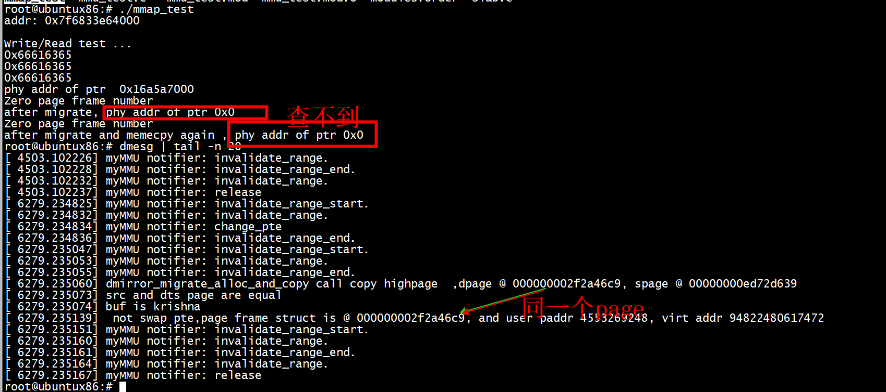

# test1

```
#if 1
        ret = posix_memalign((void **)&ptr, pagesize, pagesize);
        if(!ret)
        {
            memcpy(ptr, "krishna", strlen("krishna"));
            printf("phy addr of ptr  0x%lx \n",mem_virt2phy(ptr));
            //read(fd, ptr, pagesize);

            write(fd, ptr, pagesize);
            printf("after migrate, phy addr of ptr 0x%lx \n",mem_virt2phy(addr));
            //read(fd, ptr, pagesize);
#if 0
            memcpy(ptr, "krishna2", strlen("krishna"));
            printf("after migrate and memecpy again , phy addr of ptr 0x%lx \n", mem_virt2phy(addr));
            //read(fd, ptr, pagesize);
#endif
            free(ptr);
        }
        else
        {
            fprintf(stderr, "posix_memalign: %s\n", strerror (ret));
        }
#endif
```

```
root@ubuntux86:# ./mmap_test 
addr: 0x7fa88136e000 

Write/Read test ...
0x66616365
0x66616365
0x66616365
phy addr of ptr  0x13a36d000 
Zero page frame number
after migrate, phy addr of ptr 0x0 
root@ubuntux86:# 
```


# test2

```
#if 1
        ret = posix_memalign((void **)&ptr, pagesize, pagesize);
        if(!ret)
        {
            memcpy(ptr, "krishna", strlen("krishna"));
            printf("phy addr of ptr  0x%lx \n",mem_virt2phy(ptr));
            //read(fd, ptr, pagesize);

            write(fd, ptr, pagesize);
            printf("after migrate, phy addr of ptr 0x%lx \n",mem_virt2phy(addr));
            //read(fd, ptr, pagesize);
#if 1
            memcpy(ptr, "krishna2", strlen("krishna"));
            printf("after migrate and memecpy again , phy addr of ptr 0x%lx \n", mem_virt2phy(addr));
            //read(fd, ptr, pagesize);
#endif
            free(ptr);
        }
        else
        {
            fprintf(stderr, "posix_memalign: %s\n", strerror (ret));
        }
#endif
```
第二次memcpy(ptr, "krishna2", strlen("krishna"));导致程序coredump   

```
root@ubuntux86:# ./mmap_test 
addr: 0x7faa2b798000 

Write/Read test ...
0x66616365
0x66616365
0x66616365
phy addr of ptr  0x14742a000 
Zero page frame number
after migrate, phy addr of ptr 0x0 
Segmentation fault
root@ubuntux86:# dmesg | tail -n 60
```

> ## do_swap_page
```
[   43.984917] PKRU: 55555554
[   43.984920] Call Trace:
[   43.984924]  <TASK>
[   43.984929]  migration_entry_wait+0xa1/0xb0
[   43.984936]  do_swap_page+0x657/0x730
[   43.984948]  __handle_mm_fault+0x882/0x8e0
[   43.984956]  handle_mm_fault+0xda/0x2b0
[   43.984962]  do_user_addr_fault+0x1bb/0x650
[   43.984969]  exc_page_fault+0x7d/0x170
[   43.984977]  ? asm_exc_page_fault+0x8/0x30
[   43.984988]  asm_exc_page_fault+0x1e/0x30
[   43.984996] RIP: 0033:0x7f54783829ae
```

```
vm_fault_t do_swap_page(struct vm_fault *vmf)
{
        struct vm_area_struct *vma = vmf->vma;
        struct page *page = NULL, *swapcache;
        struct swap_info_struct *si = NULL;
        rmap_t rmap_flags = RMAP_NONE;
        bool exclusive = false;
        swp_entry_t entry;
        pte_t pte;
        int locked;
        vm_fault_t ret = 0;
        void *shadow = NULL;

        if (!pte_unmap_same(vmf))
                goto out;

        entry = pte_to_swp_entry(vmf->orig_pte);
        if (unlikely(non_swap_entry(entry))) {
                if (is_migration_entry(entry)) {
                        migration_entry_wait(vma->vm_mm, vmf->pmd,
                                             vmf->address);
                } else if (is_device_exclusive_entry(entry)) {
                        vmf->page = pfn_swap_entry_to_page(entry);
                        ret = remove_device_exclusive_entry(vmf);
                } else if (is_device_private_entry(entry)) {
                        vmf->page = pfn_swap_entry_to_page(entry);
                        ret = vmf->page->pgmap->ops->migrate_to_ram(vmf);
                }


```

***是个迁移页***       
```
if (is_migration_entry(entry)) {
                        migration_entry_wait(vma->vm_mm, vmf->pmd,
                                             vmf->address);
```

## migrate_vma_finalize之后执行zap_vma_ptes

```
        dmirror_migrate_alloc_and_copy(&args);
        migrate_vma_finalize(&args);
        zap_vma_ptes(vma, vma->vm_start, vma->vm_end - vma->vm_start);
```
仍然发生coredump    
```
[  102.167746]  <TASK>
[  102.167751]  migration_entry_wait+0xa1/0xb0
[  102.167759]  do_swap_page+0x657/0x730
[  102.167771]  __handle_mm_fault+0x882/0x8e0
[  102.167779]  handle_mm_fault+0xda/0x2b0
[  102.167785]  do_user_addr_fault+0x1bb/0x650
[  102.167792]  ? __x64_sys_write+0x1a/0x20
[  102.167799]  exc_page_fault+0x7d/0x170
[  102.167807]  ? asm_exc_page_fault+0x8/0x30
[  102.167818]  asm_exc_page_fault+0x1e/0x30
[  102.167825] RIP: 0033:0x7fae059549ae
```

## 加上migrate_vma_pages(&args)解决coredump      


```
        dmirror_migrate_alloc_and_copy(&args);
        migrate_vma_pages(&args);
        migrate_vma_finalize(&args);
        //zap_vma_ptes(vma, vma->vm_start, vma->vm_end - vma->vm_start);
        //test_migrate_vma_finalize(&args);
```
migrate_vma_pages会调用
migrate_vma_insert_page(migrate, addr, newpage,&migrate->src[i]);     
```
 *  migrate_vma_pages()
	 *    migrate_vma_insert_page()
	 *      page_add_new_anon_rmap()
	 *        __page_set_anon_rmap()
	 *          ...checks page->mapping, via PageAnon(page) call,
	 *            and incorrectly concludes that the page is an
	 *            anonymous page. Therefore, it incorrectly,
	 *            silently fails to set up the new anon rmap.
```

  

通过pagemap2观察    
```
root@ubuntux86:# ./pagemap2 3663 | grep 564e2164e000
bash: ./pagemap2: No such file or directory
root@ubuntux86:# cd /work/kernel_learn/pagemap/
root@ubuntux86:# ./pagemap2 3663 | grep 564e2164e000
0x564e2164e000     : pfn 15bf72           soft-dirty 1 file/shared 0 swapped 0 present 1 library [heap]
root@ubuntux86:# ./pagemap2 3663 | grep 564e2164e000
0x564e2164e000     : pfn 10d528           soft-dirty 1 file/shared 0 swapped 0 present 1 library [heap]
root@ubuntux86:# ./pagemap2 3663 | grep 564e2164e000
0x564e2164e000     : pfn 10d528           soft-dirty 1 file/shared 0 swapped 0 present 1 library [heap]
root@ubuntux86:# 
```

## 构造 pte

```
static void migrate_vma_insert_page(struct migrate_vma *migrate,
                                    unsigned long addr,
                                    struct page *page,
                                    unsigned long *src)
{
        struct vm_area_struct *vma = migrate->vma;
        struct mm_struct *mm = vma->vm_mm;
        bool flush = false;
        spinlock_t *ptl;
        pte_t entry;
        pgd_t *pgdp;
        p4d_t *p4dp;
        pud_t *pudp;
        pmd_t *pmdp;
        pte_t *ptep;

        /* Only allow populating anonymous memory */
        if (!vma_is_anonymous(vma))
                goto abort;

        pgdp = pgd_offset(mm, addr);
        p4dp = p4d_alloc(mm, pgdp, addr);
        if (!p4dp)
                goto abort;
        pudp = pud_alloc(mm, p4dp, addr);
        if (!pudp)
                goto abort;
        pmdp = pmd_alloc(mm, pudp, addr);
        if (!pmdp)
                goto abort;

        if (pmd_trans_huge(*pmdp) || pmd_devmap(*pmdp))
                goto abort;

        /*
         * Use pte_alloc() instead of pte_alloc_map().  We can't run
         * pte_offset_map() on pmds where a huge pmd might be created
         * from a different thread.
         *
         * pte_alloc_map() is safe to use under mmap_write_lock(mm) or when
         * parallel threads are excluded by other means.
         *
         * Here we only have mmap_read_lock(mm).
         */
        if (pte_alloc(mm, pmdp))
                goto abort;
}
```

旧 ptep   
```
 ptep = pte_offset_map_lock(mm, pmdp, addr, &ptl);

        if (check_stable_address_space(mm))
                goto unlock_abort;

        if (pte_present(*ptep)) {
                unsigned long pfn = pte_pfn(*ptep);

                if (!is_zero_pfn(pfn))
                        goto unlock_abort;
                flush = true;
        } else if (!pte_none(*ptep))
                goto unlock_abort;

```
pte置换   
+ ptep_clear_flush_notify  
+ set_pte_at_notify   
```
    if (flush) {
                flush_cache_page(vma, addr, pte_pfn(*ptep));
                ptep_clear_flush_notify(vma, addr, ptep);
                set_pte_at_notify(mm, addr, ptep, entry);
                update_mmu_cache(vma, addr, ptep);
        } else {
                /* No need to invalidate - it was non-present before */
                set_pte_at(mm, addr, ptep, entry);
                update_mmu_cache(vma, addr, ptep);
        }
```

#  nouveau_dmem_migrate_to_ram
```
static vm_fault_t nouveau_dmem_migrate_to_ram(struct vm_fault *vmf)
{
	struct nouveau_drm *drm = page_to_drm(vmf->page);
	struct nouveau_dmem *dmem = drm->dmem;
	struct nouveau_fence *fence;
	struct nouveau_svmm *svmm;
	struct page *spage, *dpage;
	unsigned long src = 0, dst = 0;
	dma_addr_t dma_addr = 0;
	vm_fault_t ret = 0;
	struct migrate_vma args = {
		.vma		= vmf->vma,
		.start		= vmf->address,
		.end		= vmf->address + PAGE_SIZE,
		.src		= &src,
		.dst		= &dst,
		.pgmap_owner	= drm->dev,
		.flags		= MIGRATE_VMA_SELECT_DEVICE_PRIVATE,
	};

	/*
	 * FIXME what we really want is to find some heuristic to migrate more
	 * than just one page on CPU fault. When such fault happens it is very
	 * likely that more surrounding page will CPU fault too.
	 */
	if (migrate_vma_setup(&args) < 0)
		return VM_FAULT_SIGBUS;
	if (!args.cpages)
		return 0;

	spage = migrate_pfn_to_page(src);
	if (!spage || !(src & MIGRATE_PFN_MIGRATE))
		goto done;

	dpage = alloc_page_vma(GFP_HIGHUSER, vmf->vma, vmf->address);
	if (!dpage)
		goto done;

	dst = migrate_pfn(page_to_pfn(dpage));

	svmm = spage->zone_device_data;
	mutex_lock(&svmm->mutex);
	nouveau_svmm_invalidate(svmm, args.start, args.end);
	ret = nouveau_dmem_copy_one(drm, spage, dpage, &dma_addr);
	mutex_unlock(&svmm->mutex);
	if (ret) {
		ret = VM_FAULT_SIGBUS;
		goto done;
	}

	nouveau_fence_new(dmem->migrate.chan, false, &fence);
	migrate_vma_pages(&args);
	nouveau_dmem_fence_done(&fence);
	dma_unmap_page(drm->dev->dev, dma_addr, PAGE_SIZE, DMA_BIDIRECTIONAL);
done:
	migrate_vma_finalize(&args);
	return ret;
}
```

#  __kvmppc_svm_page_out  
```
/*
 * Provision a new page on HV side and copy over the contents
 * from secure memory using UV_PAGE_OUT uvcall.
 * Caller must held kvm->arch.uvmem_lock.
 */
static int __kvmppc_svm_page_out(struct vm_area_struct *vma,
		unsigned long start,
		unsigned long end, unsigned long page_shift,
		struct kvm *kvm, unsigned long gpa)
{
	unsigned long src_pfn, dst_pfn = 0;
	struct migrate_vma mig;
	struct page *dpage, *spage;
	struct kvmppc_uvmem_page_pvt *pvt;
	unsigned long pfn;
	int ret = U_SUCCESS;

	memset(&mig, 0, sizeof(mig));
	mig.vma = vma;
	mig.start = start;
	mig.end = end;
	mig.src = &src_pfn;
	mig.dst = &dst_pfn;
	mig.pgmap_owner = &kvmppc_uvmem_pgmap;
	mig.flags = MIGRATE_VMA_SELECT_DEVICE_PRIVATE;

	/* The requested page is already paged-out, nothing to do */
	if (!kvmppc_gfn_is_uvmem_pfn(gpa >> page_shift, kvm, NULL))
		return ret;

	ret = migrate_vma_setup(&mig);
	if (ret)
		return -1;

	spage = migrate_pfn_to_page(*mig.src);
	if (!spage || !(*mig.src & MIGRATE_PFN_MIGRATE))
		goto out_finalize;

	if (!is_zone_device_page(spage))
		goto out_finalize;

	dpage = alloc_page_vma(GFP_HIGHUSER, vma, start);
	if (!dpage) {
		ret = -1;
		goto out_finalize;
	}

	lock_page(dpage);
	pvt = spage->zone_device_data;
	pfn = page_to_pfn(dpage);

	/*
	 * This function is used in two cases:
	 * - When HV touches a secure page, for which we do UV_PAGE_OUT
	 * - When a secure page is converted to shared page, we *get*
	 *   the page to essentially unmap the device page. In this
	 *   case we skip page-out.
	 */
	if (!pvt->skip_page_out)
		ret = uv_page_out(kvm->arch.lpid, pfn << page_shift,
				  gpa, 0, page_shift);

	if (ret == U_SUCCESS)
		*mig.dst = migrate_pfn(pfn) | MIGRATE_PFN_LOCKED;
	else {
		unlock_page(dpage);
		__free_page(dpage);
		goto out_finalize;
	}

	migrate_vma_pages(&mig);

out_finalize:
	migrate_vma_finalize(&mig);
	return ret;
}
```