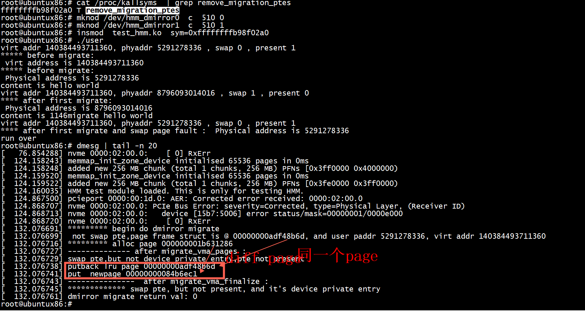
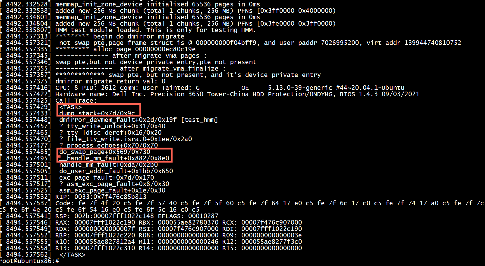
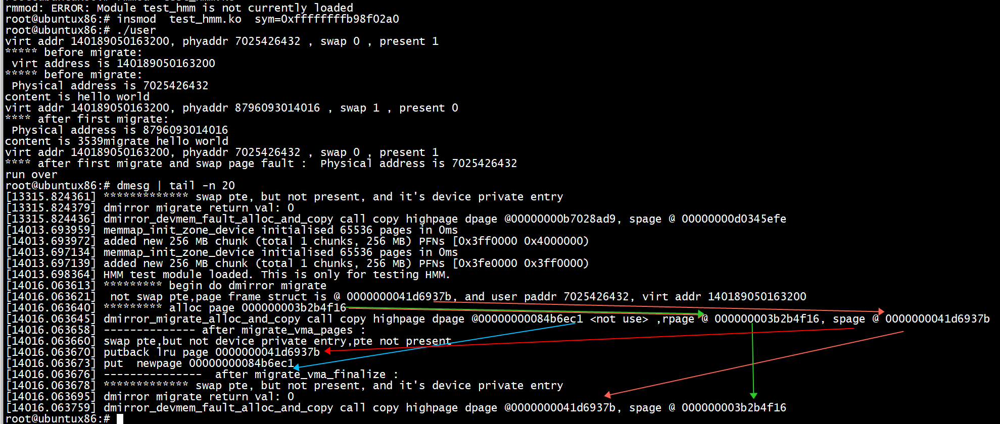
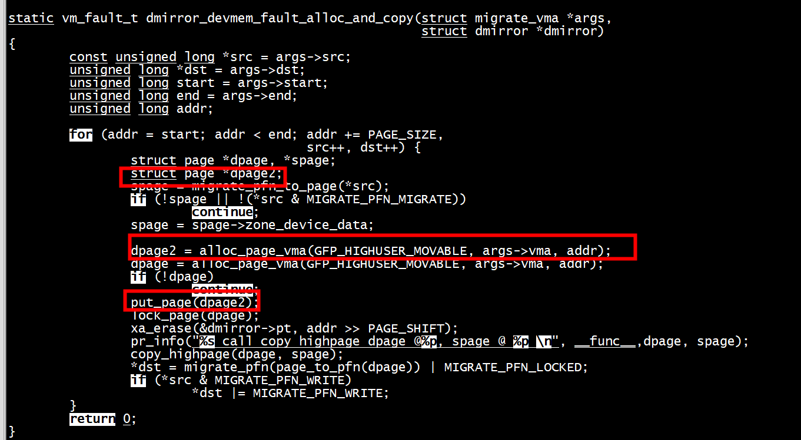
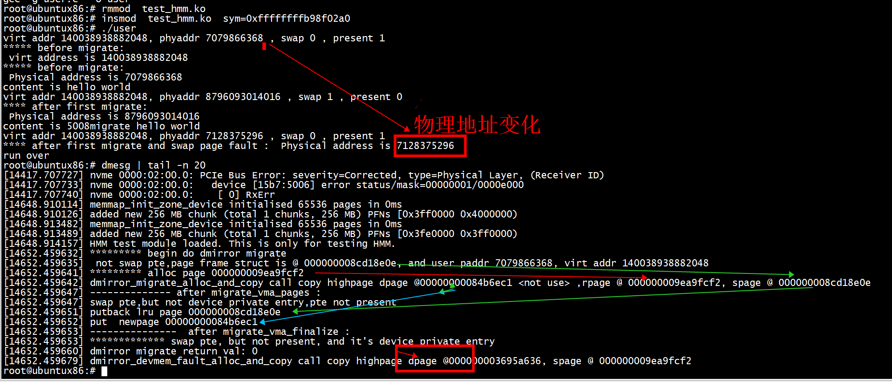

#  remove_migration_ptes
insmod  test_hmm.ko  vm_page_find=0xffffffff95c97400  

```Sehll
root@ubuntux86:# mknod /dev/hmm_dmirror0  c  510 0
root@ubuntux86:# mknod /dev/hmm_dmirror1  c  510 1
root@ubuntux86:# insmod  test_hmm.ko  sym=0xffffffffb98f02a0
root@ubuntux86:# ./user 
virt addr 140384493711360, phyaddr 5291278336 , swap 0 , present 1 
***** before migrate: 
 virt address is 140384493711360
***** before migrate: 
 Physical address is 5291278336
content is hello world 
virt addr 140384493711360, phyaddr 8796093014016 , swap 1 , present 0 
**** after first migrate: 
 Physical address is 8796093014016
content is 1146migrate hello world 
virt addr 140384493711360, phyaddr 5291278336 , swap 0 , present 1 
**** after first migrate and swap page fault :  Physical address is 5291278336
run over 
root@ubuntux86:# dmesg | tail -n 20
[   76.854288] nvme 0000:02:00.0:    [ 0] RxErr                 
[  124.158243] memmap_init_zone_device initialised 65536 pages in 0ms
[  124.158248] added new 256 MB chunk (total 1 chunks, 256 MB) PFNs [0x3ff0000 0x4000000)
[  124.159520] memmap_init_zone_device initialised 65536 pages in 0ms
[  124.159522] added new 256 MB chunk (total 1 chunks, 256 MB) PFNs [0x3fe0000 0x3ff0000)
[  124.160035] HMM test module loaded. This is only for testing HMM.
[  124.867500] pcieport 0000:00:1d.0: AER: Corrected error received: 0000:02:00.0
[  124.868707] nvme 0000:02:00.0: PCIe Bus Error: severity=Corrected, type=Physical Layer, (Receiver ID)
[  124.868713] nvme 0000:02:00.0:   device [15b7:5006] error status/mask=00000001/0000e000
[  124.868720] nvme 0000:02:00.0:    [ 0] RxErr                 
[  132.076691] ********* begin do dmirror migrate
[  132.076699]  not swap pte,page frame struct is @ 00000000adf48b6d, and user paddr 5291278336, virt addr 140384493711360
[  132.076716] ********* alloc page 000000001b631286 
[  132.076727] -------------- after migrate_vma_pages : 
[  132.076729] swap pte,but not device private entry,pte not present
[  132.076738] putback lru page 00000000adf48b6d 
[  132.076741] put  newpage 00000000084b6ec1 
[  132.076743] ---------------  after migrate_vma_finalize : 
[  132.076745] ************* swap pte, but not present, and it's device private entry
[  132.076761] dmirror migrate return val: 0 

```


# 页迁移

执行hmm_dmirror_cmd(self->fd0, HMM_DMIRROR_MIGRATE, buffer, 1)会发生页迁移   
+ 迁移之前phyaddr 4700110848 ,swap 0 , present 1   
+ 迁移之后phyaddr 8796093014016 ,swap 1 , present 0***物理地址也变了***   
+ 发起 memcpy(buf, buffer->ptr, sizeof(buf) -1)读取操作，***swap 缺页处理***，phyaddr 4700110848 ,swap 0 , present 1   

```
root@ubuntux86:# ./user 
virt addr 140528086761472, phyaddr 4700110848 , swap 0 , present 1 
***** before migrate: 
 virt address is 140528086761472
***** before migrate: 
 Physical address is 4700110848
content is hello world 
virt addr 140528086761472, phyaddr 8796093014016 , swap 1 , present 0 
**** after first migrate: 
 Physical address is 8796093014016
content is -155migrate hello world 
virt addr 140528086761472, phyaddr 4700110848 , swap 0 , present 1 
**** after first migrate and swap page fault :  Physical address is 4700110848
run over 
```

# migrate_vma_setup 、 migrate_vma_finalize
+ 1) 删除旧的pte   
migrate_vma_setup --> migrate_vma_unmap --> remove_migration_ptes  

+ 2)  获得sys page  
 migrate_vma_setup -->…… migrate_vma_collect_pmd -->  vm_normal_page
 
+ 3)  migrate_vma_setup 将src page设置为“swap pte,but not device private entry,pte not present” ,swap 1 , present 0,is_device_private_entry = false *****       
+ 4） migrate_vma_finalize  将src page设置为" swap pte, but not present, and it's device private entry“,swap 1 , present 0,is_device_private_entry = true      

```
[ 7237.766499] memmap_init_zone_device initialised 65536 pages in 0ms
[ 7237.766511] added new 256 MB chunk (total 1 chunks, 256 MB) PFNs [0x3ff0000 0x4000000)
[ 7237.769841] memmap_init_zone_device initialised 65536 pages in 0ms
[ 7237.769847] added new 256 MB chunk (total 1 chunks, 256 MB) PFNs [0x3fe0000 0x3ff0000)
[ 7237.771152] HMM test module loaded. This is only for testing HMM.
[ 7239.834630] ********* begin do dmirror migrate
[ 7239.834637]  not swap pte,page frame struct is @ 000000008608f53e, and user paddr 5799804928, virt addr 140307764649984
[ 7239.834643] sys buf is hello world 
[ 7239.834657] ********* alloc page 000000008826856a 
[ 7239.834665] -------------- after migrate_vma_pages : 
[ 7239.834667] swap pte,but not device private entry,pte not present
[ 7239.834676] ---------------  after migrate_vma_finalize : 
[ 7239.834678] ************* swap pte, but not present, and it's device private entry
[ 7239.834692] dmirror migrate return val: 0 
```

 ```
         for (addr = start; addr < end; addr = next) {
                vma = find_vma(mm, addr);
                if (!vma || addr < vma->vm_start ||
                    !(vma->vm_flags & VM_READ)) {
                        ret = -EINVAL;
                        goto out;
                }
                next = min(end, addr + (ARRAY_SIZE(src_pfns) << PAGE_SHIFT));
                if (next > vma->vm_end)
                        next = vma->vm_end;

                args.vma = vma;
                args.src = src_pfns;
                args.dst = dst_pfns;
                args.start = addr;
                args.end = next;
                args.pgmap_owner = dmirror->mdevice;
                args.flags = MIGRATE_VMA_SELECT_SYSTEM;
                ret = migrate_vma_setup(&args);
                if (ret)
                        goto out;

                dmirror_migrate_alloc_and_copy(&args, dmirror);
                migrate_vma_pages(&args);
                pr_info("-------------- after migrate_vma_pages : \n");
                test_walk_page_table(mm, g_addr);
                dmirror_migrate_finalize_and_map(&args, dmirror);
                if(0 == sym)
                {
                    migrate_vma_finalize(&args);
                 }
                else
                {
                    test_migrate_vma_finalize(&args);
                 }
                pr_info("---------------  after migrate_vma_finalize : \n");
                test_walk_page_table(mm, g_addr);
        }
 ```
 
 #  handle_mm_fault
 
 调用vmf->page->pgmap->ops->migrate_to_ram
 
 ```
 handle_mm_fault
vm_fault_t do_swap_page(struct vm_fault *vmf)
{
  
        entry = pte_to_swp_entry(vmf->orig_pte);
        if (unlikely(non_swap_entry(entry))) {
                if (is_migration_entry(entry)) {
                        migration_entry_wait(vma->vm_mm, vmf->pmd,
                                             vmf->address);
                } else if (is_device_private_entry(entry)) {
                        vmf->page = device_private_entry_to_page(entry);
                        ret = vmf->page->pgmap->ops->migrate_to_ram(vmf);
                } else if (is_hwpoison_entry(entry)) {
                        ret = VM_FAULT_HWPOISON;
                } else {
                        print_bad_pte(vma, vmf->address, vmf->orig_pte, NULL);
                        ret = VM_FAULT_SIGBUS;
                }
                goto out;
        }
 ```
 
 在dmirror_devmem_fault 中设置dump_stack();   
 
 
 ```
         if (migrate_vma_setup(&args))
                return VM_FAULT_SIGBUS;

        ret = dmirror_devmem_fault_alloc_and_copy(&args, dmirror);
        if (ret)
                return ret;
        migrate_vma_pages(&args);
        /*
         * No device finalize step is needed since
         * dmirror_devmem_fault_alloc_and_copy() will have already
         * invalidated the device page table.
         */
        migrate_vma_finalize(&args);
 ```
 
 
 ```Shell
root@ubuntux86:# insmod  test_hmm.ko  sym=0xffffffffb98f02a0
root@ubuntux86:# ./user 
virt addr 140189050163200, phyaddr 7025426432 , swap 0 , present 1 
***** before migrate: 
 virt address is 140189050163200
***** before migrate: 
 Physical address is 7025426432
content is hello world 
virt addr 140189050163200, phyaddr 8796093014016 , swap 1 , present 0 
**** after first migrate: 
 Physical address is 8796093014016
content is 3539migrate hello world 
virt addr 140189050163200, phyaddr 7025426432 , swap 0 , present 1 
**** after first migrate and swap page fault :  Physical address is 7025426432
run over 
root@ubuntux86:# dmesg | tail -n 20 
[14013.693959] memmap_init_zone_device initialised 65536 pages in 0ms
[14013.693972] added new 256 MB chunk (total 1 chunks, 256 MB) PFNs [0x3ff0000 0x4000000)
[14013.697134] memmap_init_zone_device initialised 65536 pages in 0ms
[14013.697139] added new 256 MB chunk (total 1 chunks, 256 MB) PFNs [0x3fe0000 0x3ff0000)
[14013.698364] HMM test module loaded. This is only for testing HMM.
[14016.063613] ********* begin do dmirror migrate
[14016.063621]  not swap pte,page frame struct is @ 0000000041d6937b, and user paddr 7025426432, virt addr 140189050163200
[14016.063640] ********* alloc page 000000003b2b4f16 
[14016.063645] dmirror_migrate_alloc_and_copy call copy highpage dpage @00000000084b6ec1 <not use> ,rpage @ 000000003b2b4f16, spage @ 0000000041d6937b 
[14016.063658] -------------- after migrate_vma_pages : 
[14016.063660] swap pte,but not device private entry,pte not present
[14016.063670] putback lru page 0000000041d6937b 
[14016.063673] put  newpage 00000000084b6ec1 
[14016.063676] ---------------  after migrate_vma_finalize : 
[14016.063678] ************* swap pte, but not present, and it's device private entry
[14016.063695] dmirror migrate return val: 0 
[14016.063759] dmirror_devmem_fault_alloc_and_copy call copy highpage dpage @0000000041d6937b, spage @ 000000003b2b4f16 
root@ubuntux86:# 

 ```
  + 1) 一开始 page frame struct is @ 0000000041d6937b。系统分配 alloc page @000000003b2b4f16   
  + 2） dmirror_migrate_alloc_and_copy 调用 copy highpage把  spage @ 0000000041d6937b 的数据拷贝到rpage @ 000000003b2b4f16,  
  + 3） putback lru page 释放page @ 0000000041d6937b 
  + 4)   dmirror_devmem_fault_alloc_and_copy调用 alloc_page_vma分配dpage @0000000041d6937b
  + 5)    copy_highpage(dpage, spage)把spage @ 000000003b2b4f16 拷贝  dpage @0000000041d6937b
 

 
 migrate_vma_pages  --> __migrate_device_pages --> migrate_folio
 
 
 
 ## test2
  在dmirror_devmem_fault_alloc_and_copy函数中把putback lru page的page 抢占   
  
 
 ```
 root@ubuntux86:# insmod  test_hmm.ko  sym=0xffffffffb98f02a0
root@ubuntux86:# ./user 
virt addr 140038938882048, phyaddr 7079866368 , swap 0 , present 1 
***** before migrate: 
 virt address is 140038938882048
***** before migrate: 
 Physical address is 7079866368
content is hello world 
virt addr 140038938882048, phyaddr 8796093014016 , swap 1 , present 0 
**** after first migrate: 
 Physical address is 8796093014016
content is 5008migrate hello world 
virt addr 140038938882048, phyaddr 7128375296 , swap 0 , present 1 
**** after first migrate and swap page fault :  Physical address is 7128375296
run over 
root@ubuntux86:# dmesg | tail -n 20
[14417.707727] nvme 0000:02:00.0: PCIe Bus Error: severity=Corrected, type=Physical Layer, (Receiver ID)
[14417.707733] nvme 0000:02:00.0:   device [15b7:5006] error status/mask=00000001/0000e000
[14417.707740] nvme 0000:02:00.0:    [ 0] RxErr                 
[14648.910114] memmap_init_zone_device initialised 65536 pages in 0ms
[14648.910126] added new 256 MB chunk (total 1 chunks, 256 MB) PFNs [0x3ff0000 0x4000000)
[14648.913482] memmap_init_zone_device initialised 65536 pages in 0ms
[14648.913489] added new 256 MB chunk (total 1 chunks, 256 MB) PFNs [0x3fe0000 0x3ff0000)
[14648.914157] HMM test module loaded. This is only for testing HMM.
[14652.459632] ********* begin do dmirror migrate
[14652.459635]  not swap pte,page frame struct is @ 000000008cd18e0e, and user paddr 7079866368, virt addr 140038938882048
[14652.459641] ********* alloc page 000000009ea9fcf2 
[14652.459642] dmirror_migrate_alloc_and_copy call copy highpage dpage @00000000084b6ec1 <not use> ,rpage @ 000000009ea9fcf2, spage @ 000000008cd18e0e 
[14652.459647] -------------- after migrate_vma_pages : 
[14652.459647] swap pte,but not device private entry,pte not present
[14652.459651] putback lru page 000000008cd18e0e 
[14652.459652] put  newpage 00000000084b6ec1 
[14652.459653] ---------------  after migrate_vma_finalize : 
[14652.459653] ************* swap pte, but not present, and it's device private entry
[14652.459660] dmirror migrate return val: 0 
[14652.459679] dmirror_devmem_fault_alloc_and_copy call copy highpage dpage @000000003695a636, spage @ 000000009ea9fcf2 
root@ubuntux86:# 
 ```
  
  + 1）dmirror_devmem_fault_alloc_and_copy 调用 alloc_page_vma分配 dpage @000000003695a636而不是page frame struct is @ 000000008cd18e0e       
  + 2） 物理地址从 phyaddr 7079866368变为 Physical address is 7128375296   
 