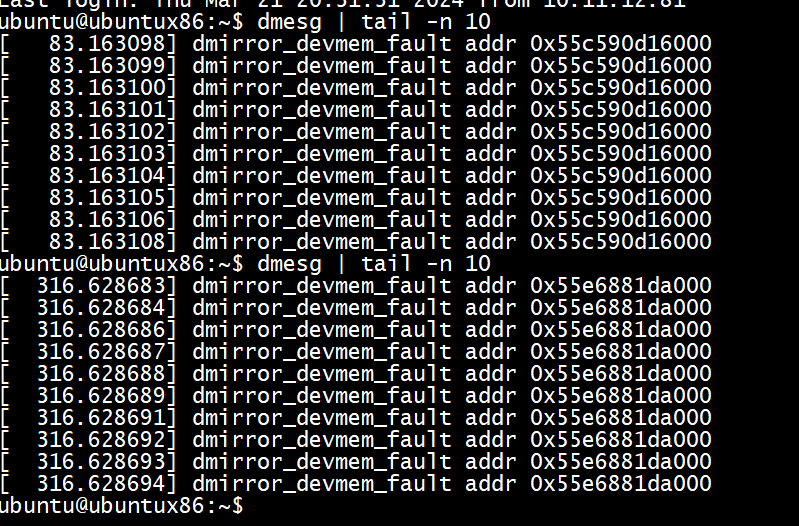
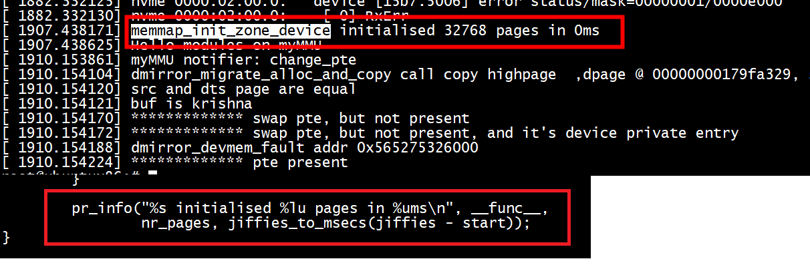

# run

```
root@ubuntux86:# insmod mmu_test.ko 
root@ubuntux86:# ./mmap_test 
addr: 0x7f47b1596000 

Write/Read test ...
0x66616365
0x66616365
0x66616365
virt addr 0x557dd2595000, phy addr of ptr  0x159ca8000 
Zero page frame number
after migrate, phy addr of ptr 0x0 
Zero page frame number
after migrate and memecpy again , phy addr of ptr 0x0 
Zero page frame number
after migrate and memecpy again , phy addr of ptr 0x0 

root@ubuntux86:# dmesg | tail -n 5
[11838.292958] src and dts page are equal 
[11838.292960] buf is krishna 
[11838.293017] dmirror_devmem_fault addr 0x557dd2595000 
[11838.293052] ------------- pte present 
[11838.293054]  not swap pte,page frame struct is @ 00000000afd28eda, and user paddr 0x159ca8000, virt addr 0x557dd2595000 
root@ubuntux86:# 
```
not swap pte,page frame struct is @ 00000000afd28eda,物理页是存在的，但是mem_virt2phy(addr)获取不到物理地址        
# 不断触发dmirror_devmem_fault addr 0x55c590d16000 




```
[  196.593364]  dump_stack+0x7d/0x9c
[  196.593365]  dmirror_devmem_fault+0x2d/0x1a1 [mmu_test]
[  196.593367]  do_swap_page+0x569/0x730
[  196.593369]  __handle_mm_fault+0x882/0x8e0
[  196.593371]  handle_mm_fault+0xda/0x2b0
[  196.593372]  do_user_addr_fault+0x1bb/0x650
[  196.593373]  exc_page_fault+0x7d/0x170
[  196.593374]  ? asm_exc_page_fault+0x8/0x30
[  196.593375]  asm_exc_page_fault+0x1e/0x30
[  196.593377] RIP: 0033:0x7fefb63079ae
```


把两次migrate的args.pgmap_owner设置成一样，不能设置成空    

```
        args.vma = vma;
        args.src = src_pfns;
        args.dst = dst_pfns;
        args.start = addr;
        args.end = next;
        args.pgmap_owner = &dmirror_device;
        args.flags = MIGRATE_VMA_SELECT_SYSTEM;
        ret = migrate_vma_setup(&args);
```

```
static vm_fault_t dmirror_devmem_fault(struct vm_fault *vmf)
{

        /* FIXME demonstrate how we can adjust migrate range */
        args.vma = vmf->vma;
        args.start = vmf->address;
        args.end = args.start + PAGE_SIZE;
        args.src = &src_pfns;
        args.dst = &dst_pfns;
        args.pgmap_owner = &dmirror_device;
        args.flags = MIGRATE_VMA_SELECT_DEVICE_PRIVATE;

```


```
static int handle_pte_fault(struct vm_fault *vmf)
{
    pte_t entry;
......
    vmf->pte = pte_offset_map(vmf->pmd, vmf->address);
    vmf->orig_pte = *vmf->pte;
......
    if (!vmf->pte) {
        if (vma_is_anonymous(vmf->vma))
            return do_anonymous_page(vmf);
        else
            return do_fault(vmf);
    }
 
 
    if (!pte_present(vmf->orig_pte))
        return do_swap_page(vmf);
......
}
```


# 从folio分配内存   

```
static inline struct page *alloc_page_vma(gfp_t gfp,
                struct vm_area_struct *vma, unsigned long addr)
{
        struct folio *folio = vma_alloc_folio(gfp, 0, vma, addr, false);

        return &folio->page;
}
struct folio *__folio_alloc(gfp_t gfp, unsigned int order, int preferred_nid,
                nodemask_t *nodemask)
{
        struct page *page = __alloc_pages(gfp | __GFP_COMP, order,
                        preferred_nid, nodemask);

        if (page && order > 1)
                prep_transhuge_page(page);
        return (struct folio *)page;
}
EXPORT_SYMBOL(__folio_alloc);
```


#  memmap_init_zone_device



 pagemap_range  -->  memmap_init_zone_device   
```
void __ref memmap_init_zone_device(struct zone *zone,
                                   unsigned long start_pfn,
                                   unsigned long nr_pages,
                                   struct dev_pagemap *pgmap)
{
        unsigned long pfn, end_pfn = start_pfn + nr_pages;
        struct pglist_data *pgdat = zone->zone_pgdat;
        struct vmem_altmap *altmap = pgmap_altmap(pgmap);
        unsigned int pfns_per_compound = pgmap_vmemmap_nr(pgmap);
        unsigned long zone_idx = zone_idx(zone);
        unsigned long start = jiffies;
        int nid = pgdat->node_id;

        if (WARN_ON_ONCE(!pgmap || zone_idx(zone) != ZONE_DEVICE))
                return;

        /*
         * The call to memmap_init should have already taken care
         * of the pages reserved for the memmap, so we can just jump to
         * the end of that region and start processing the device pages.
         */
        if (altmap) {
                start_pfn = altmap->base_pfn + vmem_altmap_offset(altmap);
                nr_pages = end_pfn - start_pfn;
        }

        for (pfn = start_pfn; pfn < end_pfn; pfn += pfns_per_compound) {
                struct page *page = pfn_to_page(pfn);

                __init_zone_device_page(page, pfn, zone_idx, nid, pgmap);

                if (pfns_per_compound == 1)
                        continue;

                memmap_init_compound(page, pfn, zone_idx, nid, pgmap,
                                     compound_nr_pages(altmap, pfns_per_compound));
        }

        pr_info("%s initialised %lu pages in %ums\n", __func__,
                nr_pages, jiffies_to_msecs(jiffies - start));
}
```

#  dmirror_devmem_free


```
[ 2364.046856]  <TASK>
[ 2364.046861]  dump_stack+0x7d/0x9c
[ 2364.046879]  dmirror_devmem_free+0x18/0x3e [mmu_test]
[ 2364.046889]  free_devmap_managed_page+0x59/0x60
[ 2364.046898]  put_devmap_managed_page+0x53/0x60
[ 2364.046909]  migrate_vma_finalize+0x263/0x290
[ 2364.046917]  dmirror_devmem_fault+0x1df/0x230 [mmu_test]
[ 2364.046927]  do_swap_page+0x569/0x730
[ 2364.046939]  __handle_mm_fault+0x882/0x8e0
[ 2364.046947]  handle_mm_fault+0xda/0x2b0
[ 2364.046953]  do_user_addr_fault+0x1bb/0x650
[ 2364.046961]  exc_page_fault+0x7d/0x170
[ 2364.046969]  ? asm_exc_page_fault+0x8/0x30
[ 2364.046979]  asm_exc_page_fault+0x1e/0x30
```


```
static void dmirror_devmem_free(struct page *page)
{
        struct page *rpage = page->zone_device_data;

        if (rpage)
           __free_page(rpage);
        page->zone_device_data = head;
        head = page;
}
```

> ## host to device （dmirror_migrate_alloc_and_copy）

+ 1 dpage->zone_device_data = rpage   

+ 2 为什么 copy_highpage(rpage, spage)，将spage拷贝到rpage而不是 dpage    
   这和dmirror_devmem_free的实现有关   
   
+ 3  MIGRATE_VMA_SELECT_SYSTEM

```
dmirror_migrate_alloc_and_copy
                if (!(*src & MIGRATE_PFN_MIGRATE))
                        continue;

                /*
                 * Note that spage might be NULL which is OK since it is an
                 * unallocated pte_none() or read-only zero page.
                 */
                spage = migrate_pfn_to_page(*src);

#if 0
                dpage = alloc_page(GFP_HIGHUSER);
#else
                rpage = alloc_page(GFP_HIGHUSER);
                //rpage = alloc_page_vma(GFP_HIGHUSER, vma, start);
                //dpage = alloc_page_vma(GFP_HIGHUSER, vmf->vma, vmf->address);

                dpage = get_dpage();
                dpage->zone_device_data = rpage;
#endif
                get_page(dpage);
                lock_page(dpage);
                if (spage)
                {
                        pr_info("%s call copy highpage  ,dpage @ %p, spage @ %p \n", __func__,rpage, spage);
                        copy_highpage(rpage, spage);
                        if(addr == args->start)
                        {
                            cmp_page(current->mm, spage, rpage);
                        }
                }

#if 1
                *dst = migrate_pfn(page_to_pfn(dpage)) |
                            MIGRATE_PFN_LOCKED;
                if ((*src & MIGRATE_PFN_WRITE) ||
                    (!spage && args->vma->vm_flags & VM_WRITE))
                        *dst |= MIGRATE_PFN_WRITE;
#endif
                // need to free page

#if 1
```

+  *dst = migrate_pfn(page_to_pfn(dpage)) 而不是 *dst = migrate_pfn(page_to_pfn(rpage))


> ##  device to host  （dmirror_migrate_alloc_and_copy）
 
 + MIGRATE_VMA_SELECT_DEVICE_PRIVATE     
 +  vmf->page->zone_device_data  （vmf->page竟然不是空 ）
 + migrate_vma_setup会设置args.src    
 
 
 ```
 static vm_fault_t dmirror_devmem_fault(struct vm_fault *vmf)
{
        struct migrate_vma args;
        unsigned long src_pfns;
        unsigned long dst_pfns;
        struct page *rpage;
        vm_fault_t ret;
        //dump_stack();

        /*
         * Normally, a device would use the page->zone_device_data to point to
         * the mirror but here we use it to hold the page for the simulated
         * device memory and that page holds the pointer to the mirror.
         */
        rpage = vmf->page->zone_device_data;

        /* FIXME demonstrate how we can adjust migrate range */
        args.vma = vmf->vma;
        args.start = vmf->address;
        args.end = args.start + PAGE_SIZE;
        args.src = &src_pfns;
        args.dst = &dst_pfns;
        args.pgmap_owner = &dmirror_device;
        args.flags = MIGRATE_VMA_SELECT_DEVICE_PRIVATE;

        if (migrate_vma_setup(&args))
                return VM_FAULT_SIGBUS;

        ret = dmirror_devmem_fault_alloc_and_copy(&args);
        if (ret)
                return ret;
        migrate_vma_pages(&args);
        /*
         * No device finalize step is needed since
         * dmirror_devmem_fault_alloc_and_copy() will have already
         * invalidated the device page table.
         */
        migrate_vma_finalize(&args);
        pr_info("%s addr 0x%lx \n",__func__,vmf->address);
        return 0;
}
 dmirror_devmem_fault
 static vm_fault_t dmirror_devmem_fault_alloc_and_copy(struct migrate_vma *args)
{
        const unsigned long *src = args->src;
        unsigned long *dst = args->dst;
        unsigned long start = args->start;
        unsigned long end = args->end;
        unsigned long addr;

        for (addr = start; addr < end; addr += PAGE_SIZE,
                                       src++, dst++) {
                struct page *dpage, *spage;

                spage = migrate_pfn_to_page(*src);
                if (!spage || !(*src & MIGRATE_PFN_MIGRATE))
                        continue;
                spage = spage->zone_device_data;

                dpage = alloc_page_vma(GFP_HIGHUSER_MOVABLE, args->vma, addr);
                if (!dpage)
                        continue;

                lock_page(dpage);
                copy_highpage(dpage, spage);
                *dst = migrate_pfn(page_to_pfn(dpage)) | MIGRATE_PFN_LOCKED;
                if (*src & MIGRATE_PFN_WRITE)
                        *dst |= MIGRATE_PFN_WRITE;
        }
        return 0;
}
 ```