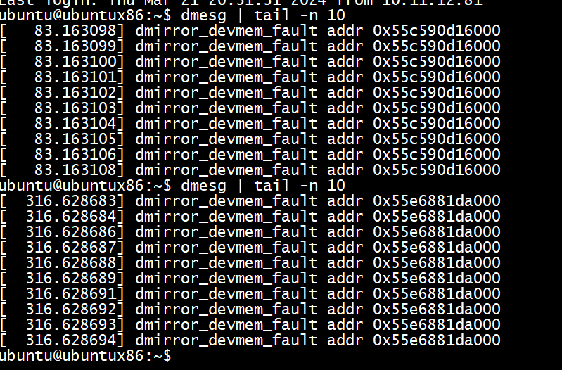
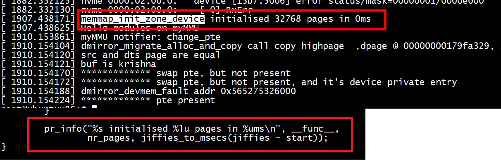

# 不断触发dmirror_devmem_fault addr 0x55c590d16000 




```
[  196.593364]  dump_stack+0x7d/0x9c
[  196.593365]  dmirror_devmem_fault+0x2d/0x1a1 [mmu_test]
[  196.593367]  do_swap_page+0x569/0x730
[  196.593369]  __handle_mm_fault+0x882/0x8e0
[  196.593371]  handle_mm_fault+0xda/0x2b0
[  196.593372]  do_user_addr_fault+0x1bb/0x650
[  196.593373]  exc_page_fault+0x7d/0x170
[  196.593374]  ? asm_exc_page_fault+0x8/0x30
[  196.593375]  asm_exc_page_fault+0x1e/0x30
[  196.593377] RIP: 0033:0x7fefb63079ae
```
把两次migrate的args.pgmap_owner设置成一样，不能设置成空    
```
        args.vma = vma;
        args.src = src_pfns;
        args.dst = dst_pfns;
        args.start = addr;
        args.end = next;
        args.pgmap_owner = &dmirror_device;
        args.flags = MIGRATE_VMA_SELECT_SYSTEM;
        ret = migrate_vma_setup(&args);
```

```
static vm_fault_t dmirror_devmem_fault(struct vm_fault *vmf)
{

        /* FIXME demonstrate how we can adjust migrate range */
        args.vma = vmf->vma;
        args.start = vmf->address;
        args.end = args.start + PAGE_SIZE;
        args.src = &src_pfns;
        args.dst = &dst_pfns;
        args.pgmap_owner = &dmirror_device;
        args.flags = MIGRATE_VMA_SELECT_DEVICE_PRIVATE;

```

#  memmap_init_zone_device



 pagemap_range  -->  memmap_init_zone_device   
```
void __ref memmap_init_zone_device(struct zone *zone,
                                   unsigned long start_pfn,
                                   unsigned long nr_pages,
                                   struct dev_pagemap *pgmap)
{
        unsigned long pfn, end_pfn = start_pfn + nr_pages;
        struct pglist_data *pgdat = zone->zone_pgdat;
        struct vmem_altmap *altmap = pgmap_altmap(pgmap);
        unsigned int pfns_per_compound = pgmap_vmemmap_nr(pgmap);
        unsigned long zone_idx = zone_idx(zone);
        unsigned long start = jiffies;
        int nid = pgdat->node_id;

        if (WARN_ON_ONCE(!pgmap || zone_idx(zone) != ZONE_DEVICE))
                return;

        /*
         * The call to memmap_init should have already taken care
         * of the pages reserved for the memmap, so we can just jump to
         * the end of that region and start processing the device pages.
         */
        if (altmap) {
                start_pfn = altmap->base_pfn + vmem_altmap_offset(altmap);
                nr_pages = end_pfn - start_pfn;
        }

        for (pfn = start_pfn; pfn < end_pfn; pfn += pfns_per_compound) {
                struct page *page = pfn_to_page(pfn);

                __init_zone_device_page(page, pfn, zone_idx, nid, pgmap);

                if (pfns_per_compound == 1)
                        continue;

                memmap_init_compound(page, pfn, zone_idx, nid, pgmap,
                                     compound_nr_pages(altmap, pfns_per_compound));
        }

        pr_info("%s initialised %lu pages in %ums\n", __func__,
                nr_pages, jiffies_to_msecs(jiffies - start));
}
```
 