# virtqueue_kick


*1)* 块设备  
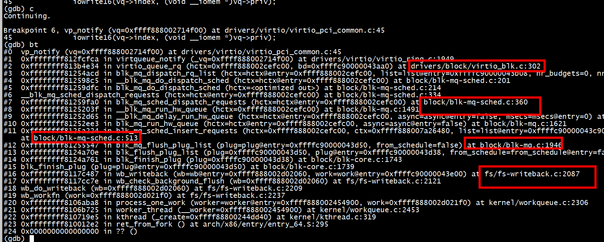  
virtio_queue_rq->virtqueue_notify->vp_notify  
*2)* 网络设备  
2.1 设备配置  
比如 ifconfig eth0 promisc  
virtnet_set_rx_mode-> virtnet_send_command-> ***virtqueue_kick***->virtqueue_notify ->vp_notify  
2.2  发送数据  
start_xmit->virtqueue_notify->vp_notify  
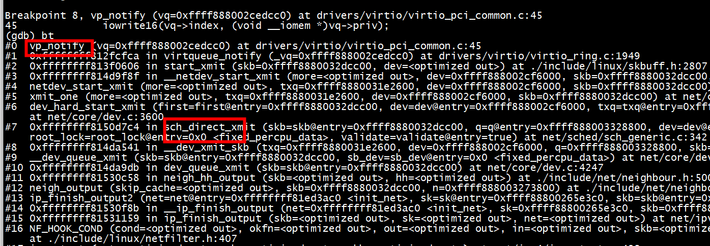  

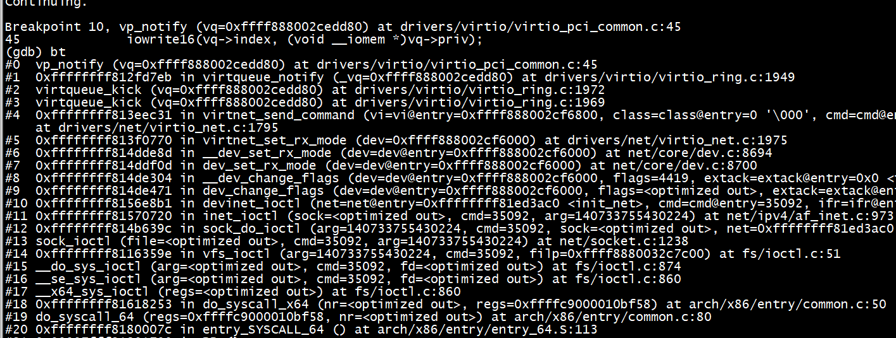  
```C
bool vp_notify(struct virtqueue *vq)
{
	/* we write the queue's selector into the notification register to
	 * signal the other end */
	iowrite16(vq->index, (void __iomem *)vq->priv);
	return true;
}
```
iowrite VIRTIO_PCI_QUEUE_NOTIFY后会产生一个VM exit，KVM会判断exit_reason，IO操作对应的执行函数是handle_io()


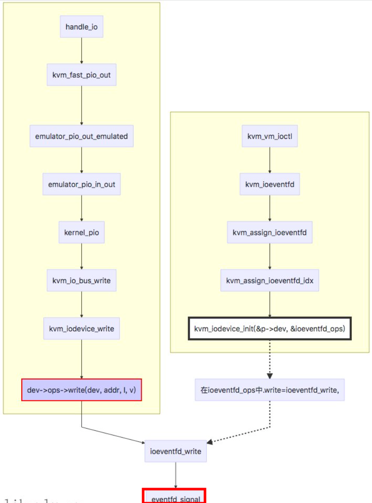

## ifconfig eth0 promisc 
 ifconfig eth0 promisc    
1)虚拟机侧  
virtnet_set_rx_mode-> virtnet_send_command-> ***virtqueue_kick***->virtqueue_notify ->vp_notify      
2) qemu 侧  
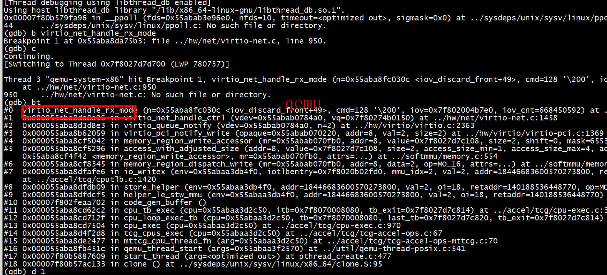 

```C
static int virtio_net_handle_rx_mode(VirtIONet *n, uint8_t cmd,
                                     struct iovec *iov, unsigned int iov_cnt)
{
    uint8_t on;
    size_t s;
    NetClientState *nc = qemu_get_queue(n->nic);

    s = iov_to_buf(iov, iov_cnt, 0, &on, sizeof(on));
    if (s != sizeof(on)) {
        return VIRTIO_NET_ERR;
    }

    if (cmd == VIRTIO_NET_CTRL_RX_PROMISC) {
        n->promisc = on;
``` 

# 设置中断 kvm_set_irq  

```
gdb qemu-system-x86_64
set args   -enable-kvm -smp 4 -m 8G -machine q35 -hda focal-server-cloudimg-amd64-disk-kvm.img -nographic
```

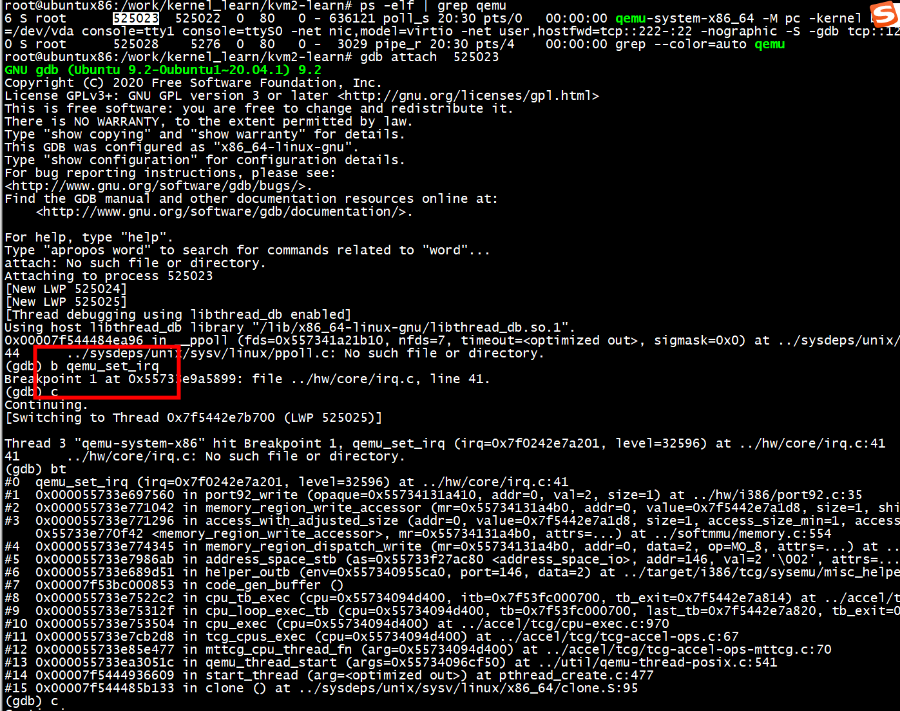
qemu_set_irq是qemu进程调用
```C
(gdb) bt
#0  qemu_set_irq (irq=0x0, level=0) at ../hw/core/irq.c:41
#1  0x000055733e6097ec in qemu_irq_raise (irq=0x557340e38700) at /work/xenomai/qemu-6.1.0/include/hw/irq.h:12
#2  0x000055733e60a0f8 in pic_update_irq (s=0x55734090b920) at ../hw/intc/i8259.c:114
#3  0x000055733e60a2b2 in pic_set_irq (opaque=0x55734090b920, irq=0, level=1) at ../hw/intc/i8259.c:156
#4  0x000055733e9a58d5 in qemu_set_irq (irq=0x557340e581e0, level=1) at ../hw/core/irq.c:45
#5  0x000055733e6ca9d2 in gsi_handler (opaque=0x557340a90660, n=0, level=1) at ../hw/i386/x86.c:596
#6  0x000055733e9a58d5 in qemu_set_irq (irq=0x557340a90870, level=1) at ../hw/core/irq.c:45
#7  0x000055733e5bc150 in hpet_handle_legacy_irq (opaque=0x5573410c3a60, n=0, level=1) at ../hw/timer/hpet.c:709
#8  0x000055733e9a58d5 in qemu_set_irq (irq=0x5573410c5540, level=1) at ../hw/core/irq.c:45
#9  0x000055733e592f95 in pit_irq_timer_update (s=0x5573408055a8, current_time=54925402) at ../hw/timer/i8254.c:264
#10 0x000055733e593005 in pit_irq_timer (opaque=0x5573408055a8) at ../hw/timer/i8254.c:281
#11 0x000055733ea7205c in timerlist_run_timers (timer_list=0x5573407109d0) at ../util/qemu-timer.c:573
#12 0x000055733ea72102 in qemu_clock_run_timers (type=QEMU_CLOCK_VIRTUAL) at ../util/qemu-timer.c:587
#13 0x000055733ea723f8 in qemu_clock_run_all_timers () at ../util/qemu-timer.c:669
#14 0x000055733ea6d5e3 in main_loop_wait (nonblocking=0) at ../util/main-loop.c:542
#15 0x000055733e763897 in qemu_main_loop () at ../softmmu/runstate.c:726
#16 0x000055733e3af0fa in main (argc=17, argv=0x7fffbd9a8928, envp=0x7fffbd9a89b8) at ../softmmu/main.c:50
```

> ## 串口kvm_set_irq

为了一窥中断处理的具体流程，这里我们选择最简单模拟串口为例进行分析。qemu作为设备模拟器会模拟很多传统的设备，isa-serial就是其中之一。我们看下串口触发中断时候的调用栈：
```
#0  0x00005555557dd543 in kvm_set_irq (s=0x5555568f4440, irq=4, level=1) at /home/fang/code/qemu/accel/kvm/kvm-all.c:991
#1  0x0000555555881c0f in kvm_pic_set_irq (opaque=0x0, irq=4, level=1) at /home/fang/code/qemu/hw/i386/kvm/i8259.c:114
#2  0x00005555559cb0aa in qemu_set_irq (irq=0x5555577c9dc0, level=1) at hw/core/irq.c:45
#3  0x0000555555881fda in kvm_pc_gsi_handler (opaque=0x555556b61970, n=4, level=1) at /home/fang/code/qemu/hw/i386/kvm/ioapic.c:55
#4  0x00005555559cb0aa in qemu_set_irq (irq=0x555556b63660, level=1) at hw/core/irq.c:45
#5  0x00005555559c06e7 in qemu_irq_raise (irq=0x555556b63660) at /home/fang/code/qemu/include/hw/irq.h:16
#6  0x00005555559c09b3 in serial_update_irq (s=0x555557b77770) at hw/char/serial.c:145
#7  0x00005555559c138c in serial_ioport_write (opaque=0x555557b77770, addr=1, val=2, size=1) at hw/char/serial.c:404
```
可以看到qemu用户态有个函数kvm_set_irq，这个函数是用户态通知kvm内核态触发一个中断的入口。函数中通过调用 kvm_vm_ioctl注入一个中断，调用号是 KVM_IRQ_LINE（pic类型中断），入参是一个 kvm_irq_level 的数据结构（传入了irq编号和中断的电平信息）。模拟isa串口是个isa设备使用边沿触发，所以注入中断会调用2次这个函数前后2次电平相反。
```
int kvm_set_irq(KVMState *s, int irq, int level)
{
    struct kvm_irq_level event;
    int ret;

    assert(kvm_async_interrupts_enabled());

    event.level = level;
    event.irq = irq;
    ret = kvm_vm_ioctl(s, s->irq_set_ioctl, &event);
    if (ret < 0) {
        perror("kvm_set_irq");
        abort();
    }

    return (s->irq_set_ioctl == KVM_IRQ_LINE) ? 1 : event.status;
}
```
这个ioctl在内核的处理对应到下面这段代码，pic类型中断进而会调用到kvm_vm_ioctl_irq_line函数。
```
kvm_vm_ioctl
{
    ......
#ifdef __KVM_HAVE_IRQ_LINE
    case KVM_IRQ_LINE_STATUS:
    case KVM_IRQ_LINE: {            /* 处理pic上产生的中断 */
        struct kvm_irq_level irq_event;

        r = -EFAULT;
        if (copy_from_user(&irq_event, argp, sizeof(irq_event)))
            goto out;

        r = kvm_vm_ioctl_irq_line(kvm, &irq_event,
                    ioctl == KVM_IRQ_LINE_STATUS);
        if (r)
            goto out;

        r = -EFAULT;
        if (ioctl == KVM_IRQ_LINE_STATUS) {
            if (copy_to_user(argp, &irq_event, sizeof(irq_event)))
                goto out;
        }

        r = 0;
        break;
    }
#endif
#ifdef CONFIG_HAVE_KVM_IRQ_ROUTING      /* 处理ioapic的中断 */
    case KVM_SET_GSI_ROUTING: {
        struct kvm_irq_routing routing;
        struct kvm_irq_routing __user *urouting;
        struct kvm_irq_routing_entry *entries = NULL;

        r = -EFAULT;
        if (copy_from_user(&routing, argp, sizeof(routing)))
            goto out;
        r = -EINVAL;
        if (!kvm_arch_can_set_irq_routing(kvm))
            goto out;
        if (routing.nr > KVM_MAX_IRQ_ROUTES)
            goto out;
        if (routing.flags)
            goto out;
        if (routing.nr) {
            r = -ENOMEM;
            entries = vmalloc(routing.nr * sizeof(*entries));
            if (!entries)
                goto out;
            r = -EFAULT;
            urouting = argp;
            if (copy_from_user(entries, urouting->entries,
                    routing.nr * sizeof(*entries)))
                goto out_free_irq_routing;
        }
        r = kvm_set_irq_routing(kvm, entries, routing.nr,
                    routing.flags);
out_free_irq_routing:
        vfree(entries);
        break;
    }
    ......
}
```
kvm_vm_ioctl_irq_line函数中会进一步调用内核态的kvm_set_irq函数（用户态用同名函数额），这个函数是整个中断处理的入口：
```
int kvm_vm_ioctl_irq_line(struct kvm *kvm, struct kvm_irq_level *irq_event,
            bool line_status)
{
    if (!irqchip_in_kernel(kvm))
        return -ENXIO;

    irq_event->status = kvm_set_irq(kvm, KVM_USERSPACE_IRQ_SOURCE_ID,
                    irq_event->irq, irq_event->level,
                    line_status);
    return 0;
}
```
## gdb attach 
***没有采用vhost***


```
qemu-system-x86_64 -enable-kvm -smp 4 -m 8G -machine q35 -hda focal-server-cloudimg-amd64-disk-kvm.img -nographic
```
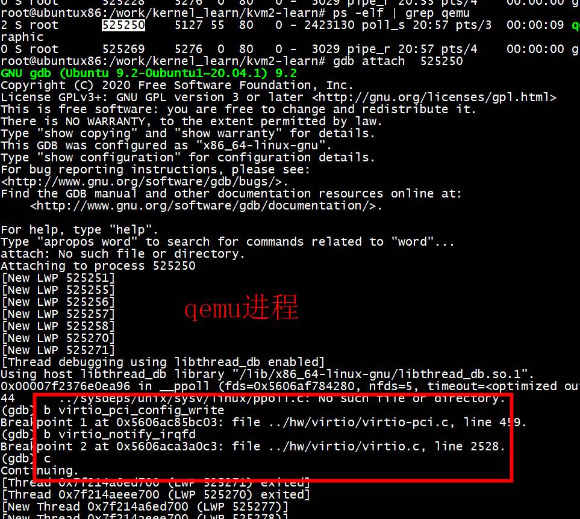

***产生中断***

## 申请中断
vp_interrupt->vp_vring_interrupt->vring_interrupt

```
vp_dev->vqs = kcalloc(nvqs, sizeof(*vp_dev->vqs), GFP_KERNEL);

vp_request_msix_vectors(vdev, nvectors, per_vq_vectors, desc);

for (i = 0; i < nvqs; ++i) {
	vqs[i] = vp_setup_vq(vdev, queue_idx++, callbacks[i], names[i], ctx[i], msix_vec);

	request_irq(pci_irq_vector(vp_dev->pci_dev, msix_vec), vring_interrupt, 0,
				vp_dev->msix_names[msix_vec], vqs[i]);
}
```


## 注入中断

虚拟环境下如何向一个apic发送中断，或者应该讲如何做到操作apic来发送中断的。又因为在内核和qemu中分别模拟了apic设备，所以在这里也是有两种情况。在qemu和kernel中分别对应了两个内存处理的ops  
1）kvm_apic_io_ops   
2） apic_mmio_ops   

### 注入中断 qemu部分
当guest通过kvm_apic_io_ops写寄存器时就会触发对应apic中断的流程   
```
kvm_apic_mem_write()
    kvm_send_msi()
        kvm_irqchip_send_msi(kvm_state, *msg)
            kvm_vm_ioctl(s, KVM_SIGNAL_MSI, &msi)
            route = kvm_lookup_msi_route(s, msg)
            kvm_set_irq(s, route->kroute.gsi, 1)
                kvm_vm_ioctl(s, s->irq_set_ioctl, $event)  KVM_IRQ_LINE/_STATUS
```
### 注入中断 kernel部分
内核部分从来源上又分成两个部分。
1）从qemu通过ioctl发送中断   
2）在内核中通过直接写lapic发送中断   
因为第二中情况最后会调用到第一种情况，所以下面先展示在内核中如何接收到guest的一次lapic的请求并发送中断的。  
```C
vcpu_mmio_write
       kvm_iodevice_write(vcpu, vcpu->arch.apic->dev)
       apic_mmio_in_range()
       apic_mmio_write()
           kvm_lapic_reg_write()
              APIC_ID
              APIC_TASKPRI
              APIC_EOI
              APIC_LDR
              APIC_DFR
              APIC_SPIV
              APIC_ICR
                 apic_send_ipi()
                     kvm_irq_delivery_to_apic()
```
*****kvm_irq_delivery_to_apic*****
内核在接收到这个mmio写操作时，如果判断这个是在apic的范围内，那么就会调用到我们之前注册的apic_mmio_ops的write函数apic_mmio_write()。

其中会向其他apic发送ipi中断的操作最后调用到了*****kvm_irq_delivery_to_apic*****。记住这个函数，一会儿我们还会看到。
接下来看内核中在收到了来自qemu的中断操作请求是如何响应的。
```
   kvm_send_userspace_msi(kvm, &msi)
        kvm_set_msi(KVM_USERSPACE_IRQ_SOURCE_ID)
           kvm_msi_route_invalid()
           kvm_set_msi_irq()
           kvm_irq_delivery_to_apic()
```
*****kvm_irq_delivery_to_apic*****

## 注入中断 kvm_apic_mem_write( msi)

1) 采用-hda focal-server-cloudimg-amd64-disk-kvm.img 

```
qemu-system-x86_64 -enable-kvm -smp 4 -m 8G -machine pc-q35-4.2 -hda focal-server-cloudimg-amd64-disk-kvm.img -nographic -netdev tap,id=tap0,ifname=tap0,script=no,downscript=no -device virtio-net-pci,netdev=tap0,mac=52:55:00:d1:55:01
```

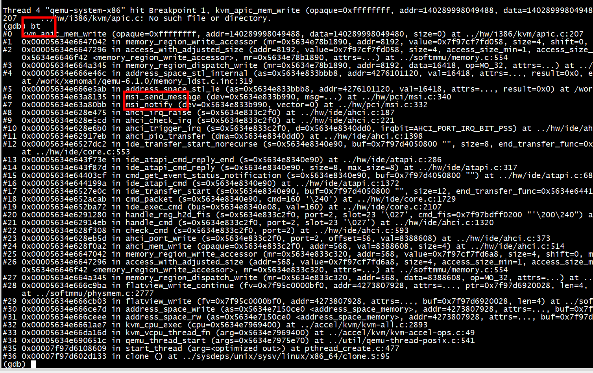 

## 注入中断 virtio_notify_vector （非msi）

virtio_notify_vector其实就是简单的调用了virtio_pci_notify函数，virtio_pci_notify这里根据不同的类型，采用不同的方式向客户机注入中断(msix_enabled)  

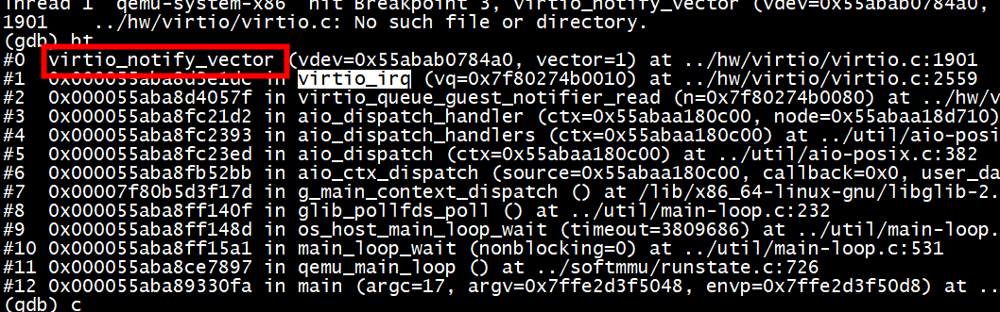 

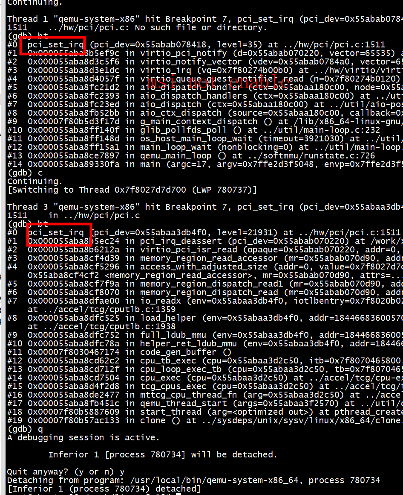 

```C

static void virtio_pci_notify(DeviceState *d, uint16_t vector)
{
    VirtIOPCIProxy *proxy = to_virtio_pci_proxy_fast(d);

    if (msix_enabled(&proxy->pci_dev))
        msix_notify(&proxy->pci_dev, vector);
    else {
        VirtIODevice *vdev = virtio_bus_get_device(&proxy->bus);
        pci_set_irq(&proxy->pci_dev, atomic_read(&vdev->isr) & 1);
    }
}
```

## 注入中断  virtio_notify_irqfd

virtio_notify_irqfd 触发时间，KVM内核模块中的irqfd poll就收到一个POLL_IN事件，然后将MSIx中断自动投递给对应的LAPIC。 大致流程是：POLL_IN -> irqfd_wakeup -> kvm_arch_set_irq_inatomic -> kvm_set_msi_irq, kvm_irq_delivery_to_apic_fast  

```
irqfd_wakeup(wait_queue_entry_t *wait, unsigned mode, int sync, void *key)
{
        if (flags & EPOLLIN) {
                idx = srcu_read_lock(&kvm->irq_srcu);
                do {
                        seq = read_seqcount_begin(&irqfd->irq_entry_sc);
                        irq = irqfd->irq_entry;
                } while (read_seqcount_retry(&irqfd->irq_entry_sc, seq));
                /* An event has been signaled, inject an interrupt */
                if (kvm_arch_set_irq_inatomic(&irq, kvm,
                                             KVM_USERSPACE_IRQ_SOURCE_ID, 1,
                                             false) == -EWOULDBLOCK)
                        schedule_work(&irqfd->inject);
                srcu_read_unlock(&kvm->irq_srcu, idx);
        }
```

## 虚拟机侧

```
gdb ./build/linux-5.15.18/vmlinux
(gdb) b vring_interrupt
Note: breakpoint 2 also set at pc 0xffffffff81304350.
Breakpoint 3 at 0xffffffff81304350
(gdb)  b virtqueue_notify
```

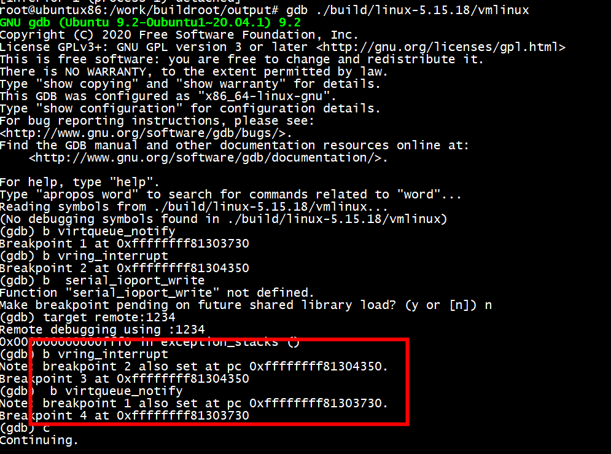

# 虚拟机调试

```
qemu-system-x86_64 -M pc -kernel bzImage -drive file=rootfs.ext2,if=virtio,format=raw -append "rootwait root=/dev/vda console=tty1 console=ttyS0" \
        -netdev tap,id=tap0,ifname=tap0,script=no,downscript=no -device virtio-net-pci,netdev=tap0,mac=52:55:00:d1:55:01 -nographic  -S -gdb tcp::1234
```

# references

[KVM HOST IN A FEW LINES OF CODE](https://zserge.com/posts/kvm/)  
[KVM host and test kernel image](https://gist.github.com/zserge/ae9098a75b2b83a1299d19b79b5fe488)  
[Qemu/kernel中断模拟](https://richardweiyang-2.gitbook.io/understanding_qemu/00-advance_interrupt_controller/02-qemu_kernel_emulate)   