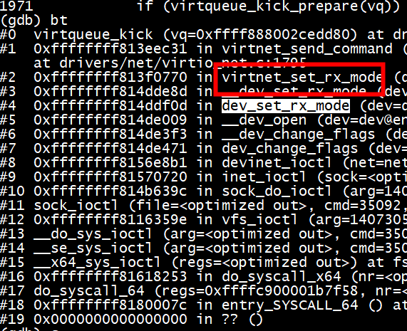

# 1 run

```
ip tuntap add dev tap0 mode tap user root
ip link set dev tap0 up
brctl addbr br0 
ip link set tap0 master br0
ifconfig br0 up
ip a add 192.168.11.33/24 dev br0
```

```
qemu-system-x86_64 -enable-kvm -smp 4 -m 8G -machine pc-q35-4.2 -hda focal-server-cloudimg-amd64-disk-kvm.img -nographic -netdev tap,id=tap0,ifname=tap0,script=no,downscript=no -device virtio-net-pci,netdev=tap0,mac=52:55:00:d1:55:01
```

# 1.1 gdb attach qemu

```
 gdb attach 2762
```

#1.2  virtio_pci_notify  virtio_notify_vector函数,virtio_notify_vector其实就是简单的调用了virtio_pci_notify函数，virtio_pci_notify这里根据不同的类型，采用不同的方式向客户机注入中断，这里主要由MSI-x和普通注入两种方式


virtio_pci_notify …… ->msi_send_message…… ->***memory_region_dispatch_write……*** -> kvm_apic_mem_write
virtio_pci_notify …… ->msi_send_message…… ->kvm_apic_mem_write

```
(gdb) bt
(gdb) bt
#0  kvm_apic_mem_write (opaque=0xffffffff, addr=140720635718736, data=140720635718728, size=0) at ../hw/i386/kvm/apic.c:207
#1  0x00005596bc3ce042 in memory_region_write_accessor (mr=0x5596be2f31f0, addr=4096, value=0x7ffc13812bd8, size=4, shift=0, mask=4294967295, attrs=...) at ../softmmu/memory.c:492
#2  0x00005596bc3ce296 in access_with_adjusted_size (addr=4096, value=0x7ffc13812bd8, size=4, access_size_min=1, access_size_max=4, access_fn=
    0x5596bc3cdf42 <memory_region_write_accessor>, mr=0x5596be2f31f0, attrs=...) at ../softmmu/memory.c:554
#3  0x00005596bc3d1345 in memory_region_dispatch_write (mr=0x5596be2f31f0, addr=4096, data=16418, op=MO_32, attrs=...) at ../softmmu/memory.c:1504
#4  0x00005596bc3f546c in address_space_stl_internal (as=0x5596bf04aed8, addr=4276097024, val=16418, attrs=..., result=0x0, endian=DEVICE_LITTLE_ENDIAN)
    at /work/xenomai/qemu-6.1.0/memory_ldst.c.inc:319
#5  0x00005596bc3f55ab in address_space_stl_le (as=0x5596bf04aed8, addr=4276097024, val=16418, attrs=..., result=0x0) at /work/xenomai/qemu-6.1.0/memory_ldst.c.inc:357
#6  0x00005596bc12f135 in msi_send_message (dev=0x5596bf04acb0, msg=...) at ../hw/pci/msi.c:340
#7  0x00005596bc0c3a5a in msix_notify (dev=0x5596bf04acb0, vector=2) at ../hw/pci/msix.c:503
#8  0x00005596bc237f61 in virtio_pci_notify (d=0x5596bf04acb0, vector=2) at ../hw/virtio/virtio-pci.c:74
#9  0x00005596bc4155f6 in virtio_notify_vector (vdev=0x5596bf052f30, vector=2) at ../hw/virtio/virtio.c:1910
#10 0x00005596bc4171dc in virtio_irq (vq=0x7f97e00310b0) at ../hw/virtio/virtio.c:2559
#11 0x00005596bc417282 in virtio_notify (vdev=0x5596bf052f30, vq=0x7f97e00310b0) at ../hw/virtio/virtio.c:2571
#12 0x00005596bc484a4c in virtio_net_flush_tx (q=0x5596bf05f260) at ../hw/net/virtio-net.c:2576
#13 0x00005596bc484e47 in virtio_net_tx_bh (opaque=0x5596bf05f260) at ../hw/net/virtio-net.c:2683
#14 0x00005596bc68dd58 in aio_bh_call (bh=0x5596bf0662c0) at ../util/async.c:141
#15 0x00005596bc68de66 in aio_bh_poll (ctx=0x5596be227e00) at ../util/async.c:169
#16 0x00005596bc69b3e1 in aio_dispatch (ctx=0x5596be227e00) at ../util/aio-posix.c:381
#17 0x00005596bc68e2bb in aio_ctx_dispatch (source=0x5596be227e00, callback=0x0, user_data=0x0) at ../util/async.c:311
#18 0x00007f97e4ffc17d in g_main_context_dispatch () at /lib/x86_64-linux-gnu/libglib-2.0.so.0
#19 0x00005596bc6ca40f in glib_pollfds_poll () at ../util/main-loop.c:232
#20 0x00005596bc6ca48d in os_host_main_loop_wait (timeout=0) at ../util/main-loop.c:255
#21 0x00005596bc6ca5a1 in main_loop_wait (nonblocking=0) at ../util/main-loop.c:531
#22 0x00005596bc3c0897 in qemu_main_loop () at ../softmmu/runstate.c:726
#23 0x00005596bc00c0fa in main (argc=15, argv=0x7ffc1381b1e8, envp=0x7ffc1381b268) at ../softmmu/main.c:50
```

```C

static void virtio_pci_notify(DeviceState *d, uint16_t vector)
{
    VirtIOPCIProxy *proxy = to_virtio_pci_proxy_fast(d);

    if (msix_enabled(&proxy->pci_dev))
        msix_notify(&proxy->pci_dev, vector);
    else {
        VirtIODevice *vdev = virtio_bus_get_device(&proxy->bus);
        pci_set_irq(&proxy->pci_dev, atomic_read(&vdev->isr) & 1);
    }
}

```


```
MemTxResult memory_region_dispatch_write(MemoryRegion *mr,
                                         hwaddr addr,
                                         uint64_t data,
                                         MemOp op,
                                         MemTxAttrs attrs)
{
    unsigned size = memop_size(op);

    if (!memory_region_access_valid(mr, addr, size, true, attrs)) {
        unassigned_mem_write(mr, addr, data, size);
        return MEMTX_DECODE_ERROR;
    }

    adjust_endianness(mr, &data, op);

    if ((!kvm_eventfds_enabled()) &&
        memory_region_dispatch_write_eventfds(mr, addr, data, size, attrs)) {
        return MEMTX_OK;
    }

    if (mr->ops->write) {
        return access_with_adjusted_size(addr, &data, size,
                                         mr->ops->impl.min_access_size,
                                         mr->ops->impl.max_access_size,
                                         memory_region_write_accessor, mr,
                                         attrs);
    } else {
        return
            access_with_adjusted_size(addr, &data, size,
                                      mr->ops->impl.min_access_size,
                                      mr->ops->impl.max_access_size,
                                      memory_region_write_with_attrs_accessor,
                                      mr, attrs);
    }
}
```
memory_region_dispatch_write_eventfds 发送信号
```
/* Return true if an eventfd was signalled */
static bool memory_region_dispatch_write_eventfds(MemoryRegion *mr,
                                                    hwaddr addr,
                                                    uint64_t data,
                                                    unsigned size,
                                                    MemTxAttrs attrs)
{
    MemoryRegionIoeventfd ioeventfd = {
        .addr = addrrange_make(int128_make64(addr), int128_make64(size)),
        .data = data,
    };
    unsigned i;

    for (i = 0; i < mr->ioeventfd_nb; i++) {
        ioeventfd.match_data = mr->ioeventfds[i].match_data;
        ioeventfd.e = mr->ioeventfds[i].e;

        if (memory_region_ioeventfd_equal(&ioeventfd, &mr->ioeventfds[i])) {
            event_notifier_set(ioeventfd.e);
            return true;
        }
    }

    return false;
}
```

# 1.3 qemu_set_irq 

```
(gdb) bt
#0  qemu_set_irq (irq=0x5596bee5e110, level=21910) at ../hw/core/irq.c:41
#1  0x00005596bc1c4ca8 in qemu_irq_raise (irq=0x5596bee5e110) at /work/xenomai/qemu-6.1.0/include/hw/irq.h:12
#2  0x00005596bc1c4da6 in ide_set_irq (bus=0x5596bee58178) at /work/xenomai/qemu-6.1.0/include/hw/ide/internal.h:576
#3  0x00005596bc1c678e in ide_atapi_cmd_reply_end (s=0x5596bee58200) at ../hw/ide/atapi.c:296
#4  0x00005596bc1c687d in ide_atapi_cmd_reply (s=0x5596bee58200, size=8, max_size=8) at ../hw/ide/atapi.c:317
#5  0x00005596bc1c73cf in cmd_get_event_status_notification (s=0x5596bee58200, buf=0x7f97e0287800 "") at ../hw/ide/atapi.c:686
#6  0x00005596bc1c899a in ide_atapi_cmd (s=0x5596bee58200) at ../hw/ide/atapi.c:1372
#7  0x00005596bc2aee0c in ide_transfer_start (s=0x5596bee58200, buf=0x7f97e0287800 "", size=12, end_transfer_func=0x5596bc1c86f1 <ide_atapi_cmd>) at ../hw/ide/core.c:561
#8  0x00005596bc2b1cab in cmd_packet (s=0x5596bee58200, cmd=160 '\240') at ../hw/ide/core.c:1729
#9  0x00005596bc2b2a72 in ide_exec_cmd (bus=0x5596bee58178, val=160) at ../hw/ide/core.c:2107
#10 0x00005596bc018280 in handle_reg_h2d_fis (s=0x5596bee531a0, port=2, slot=6 '\006', cmd_fis=0x7f97c9fa4700 "'\200\240") at ../hw/ide/ahci.c:1269
#11 0x00005596bc0184eb in handle_cmd (s=0x5596bee531a0, port=2, slot=6 '\006') at ../hw/ide/ahci.c:1320
#12 0x00005596bc016308 in check_cmd (s=0x5596bee531a0, port=2) at ../hw/ide/ahci.c:593
#13 0x00005596bc015b5d in ahci_port_write (s=0x5596bee531a0, port=2, offset=56, val=64) at ../hw/ide/ahci.c:373
#14 0x00005596bc0160a2 in ahci_mem_write (opaque=0x5596bee531a0, addr=568, val=64, size=4) at ../hw/ide/ahci.c:514
#15 0x00005596bc3ce042 in memory_region_write_accessor (mr=0x5596bee531d0, addr=568, value=0x7f97e24326a8, size=4, shift=0, mask=4294967295, attrs=...) at ../softmmu/memory.c:492
#16 0x00005596bc3ce296 in access_with_adjusted_size (addr=568, value=0x7f97e24326a8, size=4, access_size_min=1, access_size_max=4, access_fn=
    0x5596bc3cdf42 <memory_region_write_accessor>, mr=0x5596bee531d0, attrs=...) at ../softmmu/memory.c:554
#17 0x00005596bc3d1345 in memory_region_dispatch_write (mr=0x5596bee531d0, addr=568, data=64, op=MO_32, attrs=...) at ../softmmu/memory.c:1504
#18 0x00005596bc3f39ba in flatview_write_continue (fv=0x7f97d8422ee0, addr=4273807928, attrs=..., ptr=0x7f97e535c028, len=4, addr1=568, l=4, mr=0x5596bee531d0)
    at ../softmmu/physmem.c:2777
#19 0x00005596bc3f3b03 in flatview_write (fv=0x7f97d8422ee0, addr=4273807928, attrs=..., buf=0x7f97e535c028, len=4) at ../softmmu/physmem.c:2817
#20 0x00005596bc3f3e7d in address_space_write (as=0x5596bced7ce0 <address_space_memory>, addr=4273807928, attrs=..., buf=0x7f97e535c028, len=4) at ../softmmu/physmem.c:2909
#21 0x00005596bc3f3eee in address_space_rw (as=0x5596bced7ce0 <address_space_memory>, addr=4273807928, attrs=..., buf=0x7f97e535c028, len=4, is_write=true) at ../softmmu/physmem.c:2919
#22 0x00005596bc3e8ae7 in kvm_cpu_exec (cpu=0x5596be47f3c0) at ../accel/kvm/kvm-all.c:2893
#23 0x00005596bc46116d in kvm_vcpu_thread_fn (arg=0x5596be47f3c0) at ../accel/kvm/kvm-accel-ops.c:49
#24 0x00005596bc68d51c in qemu_thread_start (args=0x5596be48c530) at ../util/qemu-thread-posix.c:541
#25 0x00007f97e4b44609 in start_thread (arg=<optimized out>) at pthread_create.c:477
#26 0x00007f97e4a69133 in clone () at ../sysdeps/unix/sysv/linux/x86_64/clone.S:95
```

```
(gdb) bt
#0  qemu_set_irq (irq=0x3f8, level=21910) at ../hw/core/irq.c:41
#1  0x00005596bc116b9a in qemu_irq_lower (irq=0x5596beaa8060) at /work/xenomai/qemu-6.1.0/include/hw/irq.h:17
#2  0x00005596bc11712a in serial_update_irq (s=0x5596beb25d90) at ../hw/char/serial.c:144
#3  0x00005596bc117bd0 in serial_ioport_write (opaque=0x5596beb25d90, addr=0, val=114, size=1) at ../hw/char/serial.c:357
#4  0x00005596bc3ce042 in memory_region_write_accessor (mr=0x5596beb25ef0, addr=0, value=0x7f97e0c2f668, size=1, shift=0, mask=255, attrs=...) at ../softmmu/memory.c:492
#5  0x00005596bc3ce296 in access_with_adjusted_size (addr=0, value=0x7f97e0c2f668, size=1, access_size_min=1, access_size_max=1, access_fn=
    0x5596bc3cdf42 <memory_region_write_accessor>, mr=0x5596beb25ef0, attrs=...) at ../softmmu/memory.c:554
#6  0x00005596bc3d1345 in memory_region_dispatch_write (mr=0x5596beb25ef0, addr=0, data=114, op=MO_8, attrs=...) at ../softmmu/memory.c:1504
#7  0x00005596bc3f39ba in flatview_write_continue (fv=0x7f97d8000f60, addr=1016, attrs=..., ptr=0x7f97e5354000, len=1, addr1=0, l=1, mr=0x5596beb25ef0) at ../softmmu/physmem.c:2777
#8  0x00005596bc3f3b03 in flatview_write (fv=0x7f97d8000f60, addr=1016, attrs=..., buf=0x7f97e5354000, len=1) at ../softmmu/physmem.c:2817
#9  0x00005596bc3f3e7d in address_space_write (as=0x5596bced7c80 <address_space_io>, addr=1016, attrs=..., buf=0x7f97e5354000, len=1) at ../softmmu/physmem.c:2909
#10 0x00005596bc3f3eee in address_space_rw (as=0x5596bced7c80 <address_space_io>, addr=1016, attrs=..., buf=0x7f97e5354000, len=1, is_write=true) at ../softmmu/physmem.c:2919
#11 0x00005596bc3e8299 in kvm_handle_io (port=1016, attrs=..., data=0x7f97e5354000, direction=1, size=1, count=1) at ../accel/kvm/kvm-all.c:2632
#12 0x00005596bc3e8a97 in kvm_cpu_exec (cpu=0x5596be4d1590) at ../accel/kvm/kvm-all.c:2883
#13 0x00005596bc46116d in kvm_vcpu_thread_fn (arg=0x5596be4d1590) at ../accel/kvm/kvm-accel-ops.c:49
#14 0x00005596bc68d51c in qemu_thread_start (args=0x5596be4de600) at ../util/qemu-thread-posix.c:541
#15 0x00007f97e4b44609 in start_thread (arg=<optimized out>) at pthread_create.c:477
#16 0x00007f97e4a69133 in clone () at ../sysdeps/unix/sysv/linux/x86_64/clone.S:95
(gdb) 
```
# gdb kernel

```
qemu-system-x86_64 -M pc  -kernel bzImage -drive file=rootfs.ext2,if=virtio,format=raw -append "rootwait root=/dev/vda console=tty1 console=ttyS0 nokaslr" \
        -netdev tap,id=tap0,ifname=tap0,script=no,downscript=no,vhost=on -device virtio-net-pci,netdev=tap0,mac=52:55:00:d1:55:01 -nographic -S -gdb tcp::1234
```

##  virtnet_set_rx_mode
virtnet_set_rx_mode：virtnet_send_command(vi, VIRTIO_NET_CTRL_RX, CTRL_RX_PROMISC | CTRL_RX_ALLMULTI | CTRL_MAC_TABLE_SET, sg, NULL)，向后端发送命令进入混杂模式，接收所有组播报文, 并设置MAC地址过滤表。

#  vhost run2 

```
 modprobe vhost
root@ubuntux86:/work/# lsmod | grep vhost
vhost                  53248  0
vhost_iotlb            16384  1 vhost
```

```
 iptables -t nat -A PREROUTING -d <IP4> -p tcp --dport 8580 -j DNAT --to-destination <guest IP>:80
```

