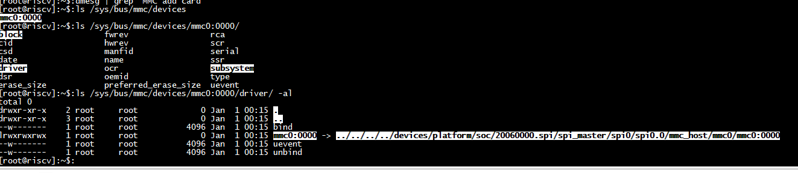
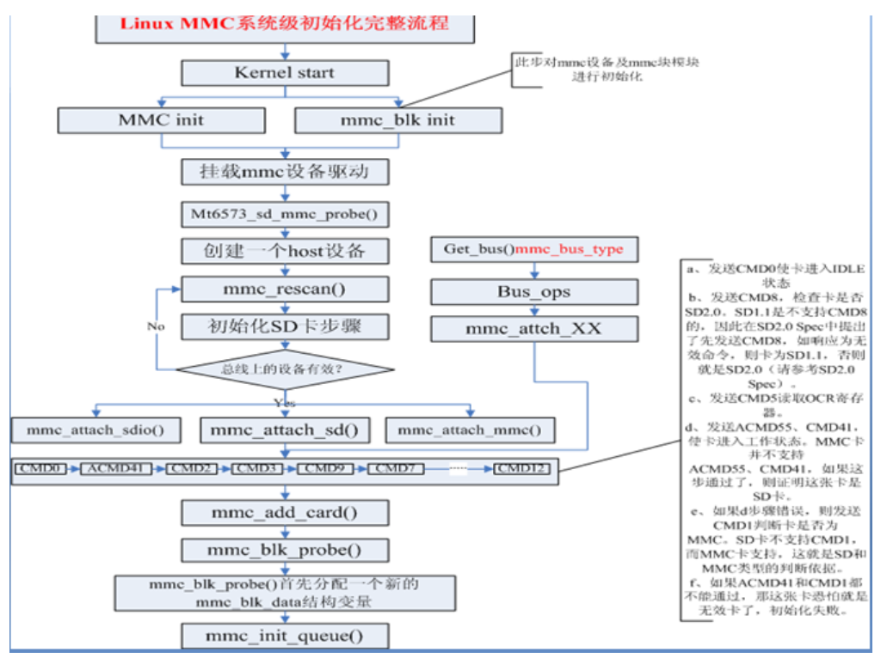
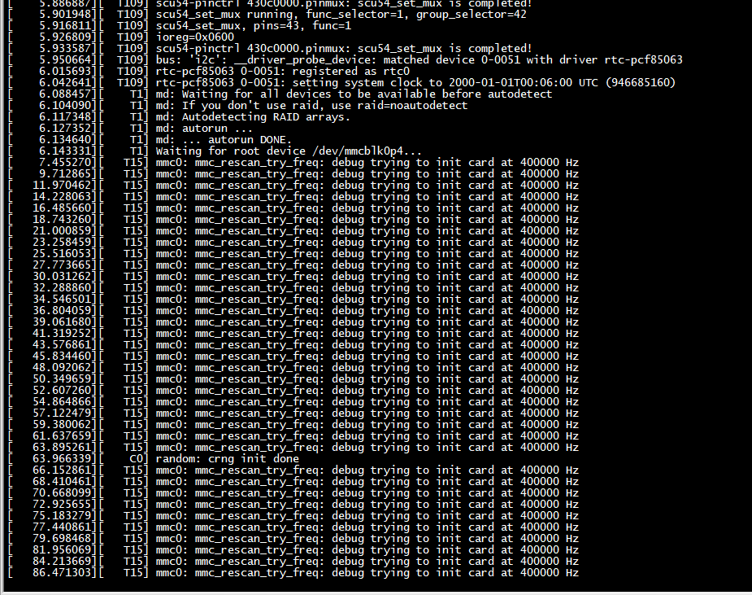
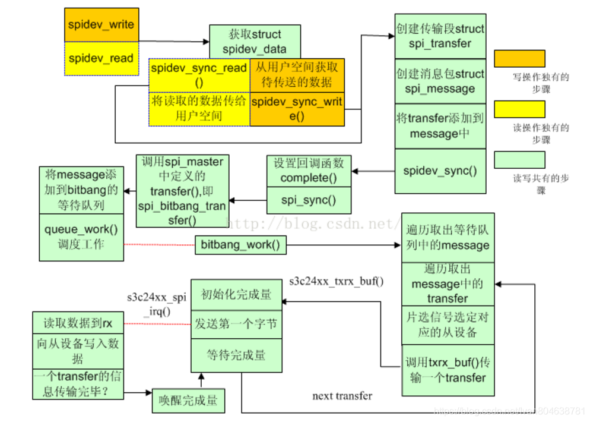

# mmc

# spi-dw驱动

 spi读写流程，device驱动封装读写接口，调用spi框架的传输API。  
spi_sync()，执行device所属的控制器驱动挂接的transfer_one()接口，实现总线层面的数据访问，传输完成后，spi_sync()返回阻塞的读写进程，得到spi访问的结果。

***以SPI FLASH驱动m25p80为例：***
##  read流程
(1) mtd_debug 或者其它应用程序 -> m25p80_read_reg()  
-> spi_sync(spi, &message)  
-> spi_transfer_one_message() -> dw_spi_transfer_one()  

-> wait_for_completion_timeout() 阻塞  

(2) dw ssi控制器spi传输  
dw_spi_irq() -> dw_reader() -> complete() 通知阻塞流程继续往下执行  

(3) mtd_debug 或者其它应用程序得到spi访问数据。  
其中dw ssi控制器的传输接口dw_spi_transfer_one()支持三种传输方式：轮询，中断，dma。
(1)轮询  
调用dw_spi_poll_transfer(dws, transfer)完成传输，边发边收。  
(2)中断  
调用dw_spi_irq_setup(dws)设置中断，后续数据收发在ssi中断处理中完成。
(3)dma  
调用dw_spi_dma_transfer()触发dma传输，后续传输由dma完成，dma中断确认完成状态。spi-dw驱动在初始化时需要事先从通用dma申请通道资源。
spi框架中先map buf，再传输message，提交dma描述符，挂接回调，传输发起后阻塞等待completion；  
dma传输，dma中断处理确认通道传输完成，调度vchan tasklet；  
vchan tasklet调用dma描述符的callback回调，complete传输；  
spi框架从阻塞处继续执行，unmap buf，message传输完成。  
函数返回0。
 

# references

[Linux 内核 MMC 驱动子系统 源码剖析](https://zhuanlan.zhihu.com/p/447812392)  

[Linux mmc](https://www.cnblogs.com/r1chie/p/14792384.html)  

[Linux SPI总线和设备驱动架构之四：SPI数据传输的队列化 ](https://www.cnblogs.com/wanghuaijun/p/7079033.html)  

[Linux下驱动开发_块设备驱动开发(硬件上采用SD卡](https://ost.51cto.com/posts/18132)

[Linux驱动之MMC子系统（二）实现分析](https://carlyleliu.github.io/2020/Linux%E9%A9%B1%E5%8A%A8%E4%B9%8BMMC%E5%AD%90%E7%B3%BB%E7%BB%9F%EF%BC%88%E4%BA%8C%EF%BC%89%E5%AE%9E%E7%8E%B0%E5%88%86%E6%9E%90/)