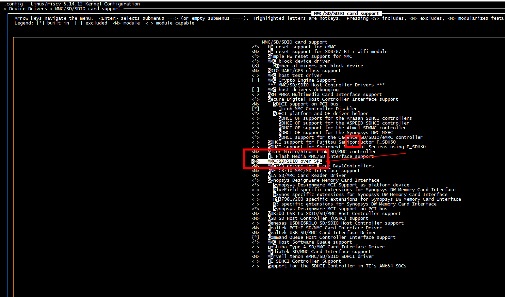
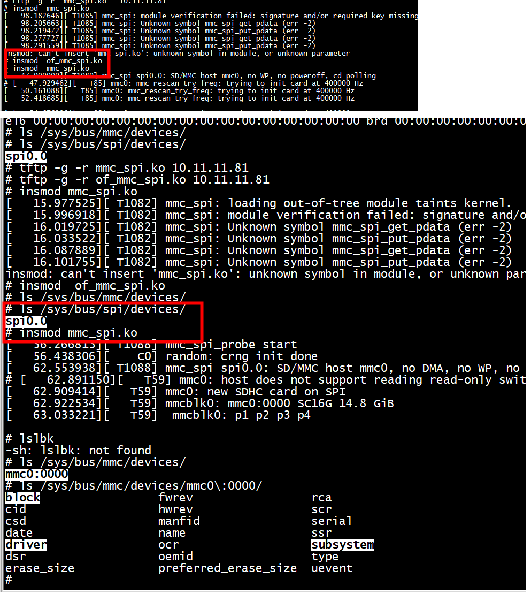
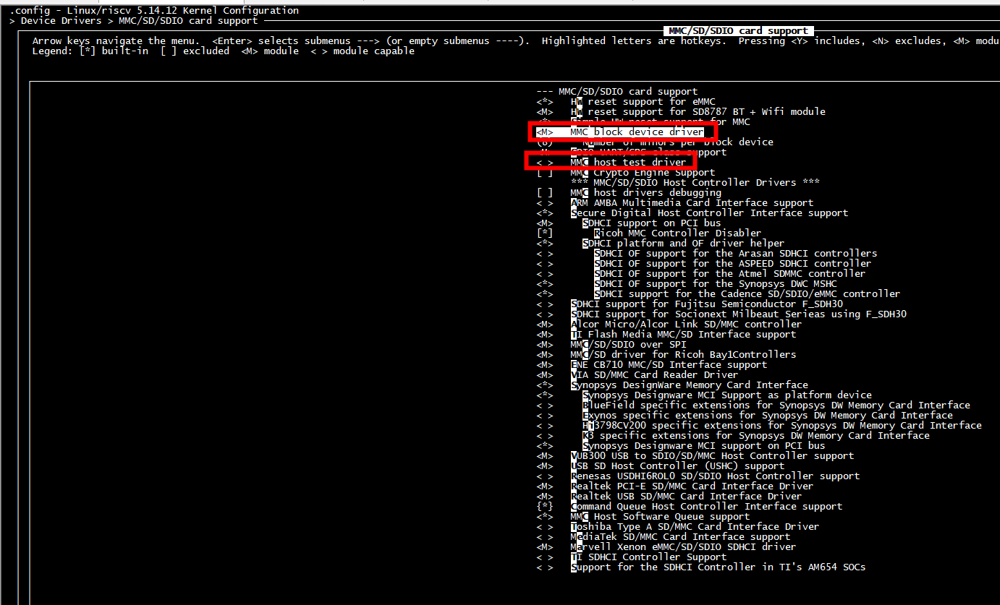
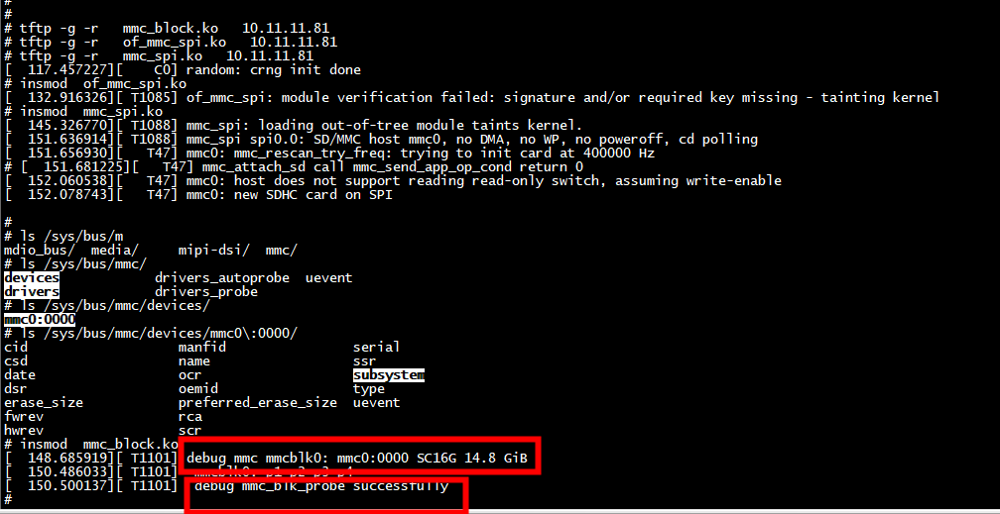

#  mmc_spi.ko



```
 grep CONFIG_MMC_SPI .config 
CONFIG_MMC_SPI=m
```

```
  LD [M]  drivers/mmc/host/of_mmc_spi.ko
  LD [M]  drivers/mmc/host/mmc_spi.ko
```


```
# tftp -g -r  of_mmc_spi.ko 10.11.11.81
# tftp -g -r  mmc_spi.ko 10.11.11.81
```

```
# insmod  of_mmc_spi.ko 
# insmod  mmc_spi.ko 
```



# spi

```

# ls /sys/bus/spi/devices/
spi0.0
# ls /sys/bus/spi/devices/spi0.0/
driver_override  of_node          subsystem
modalias         statistics       uevent
# 
```

# 设置mmc block

 mmc/core/block.c
 
 

# insmod  mmc_spi.ko 



```
# ls /sys/bus/mmc/drivers/mmcblk
bind       mmc0:0000  uevent     unbind
# 
```

**mmc_add_card输出消息mmc0: new SDHC card on SPI**
```C
int mmc_add_card(struct mmc_card *card)
{
     

        if (mmc_card_uhs(card) &&
                (card->sd_bus_speed < ARRAY_SIZE(uhs_speeds)))
                uhs_bus_speed_mode = uhs_speeds[card->sd_bus_speed];

        if (mmc_host_is_spi(card->host)) {
                pr_info("%s: new %s%s%s card on SPI\n",
                        mmc_hostname(card->host),
                        mmc_card_hs(card) ? "high speed " : "",
                        mmc_card_ddr52(card) ? "DDR " : "",
                        type);
        }
```

**mmc_blk_alloc_req 输出消息debug mmc mmcblk0: mmc0:0000 SC16G 14.8 GiB**

```C
static struct mmc_blk_data *mmc_blk_alloc_req(struct mmc_card *card,
                                              struct device *parent,
                                              sector_t size,
                                              bool default_ro,
                                              const char *subname,
                                              int area_type)
{

        if (mmc_card_mmc(card) &&
            md->flags & MMC_BLK_CMD23 &&
            ((card->ext_csd.rel_param & EXT_CSD_WR_REL_PARAM_EN) ||
             card->ext_csd.rel_sectors)) {
                md->flags |= MMC_BLK_REL_WR;
                blk_queue_write_cache(md->queue.queue, true, true);
        }

        string_get_size((u64)size, 512, STRING_UNITS_2,
                        cap_str, sizeof(cap_str));
        pr_info("debug mmc %s: %s %s %s %s\n",
                md->disk->disk_name, mmc_card_id(card), mmc_card_name(card),
                cap_str, md->read_only ? "(ro)" : "");
}
```

# test2
```
# insmod  of_mmc_spi.ko 
```
执行 insmod  mmc_spi.ko 出现如下： 
 

开启dma   
```
grep -i spi .config | grep -i dma
CONFIG_SPI_DW_DMA=y
```
在mmc_spi.c中添加#undef CONFIG_HAS_DMA

# references

[（十四）Linux kernel mmc 框架说明，包括mmc_test使用方法](https://www.cnblogs.com/zhangshenghui/p/11718486.html)