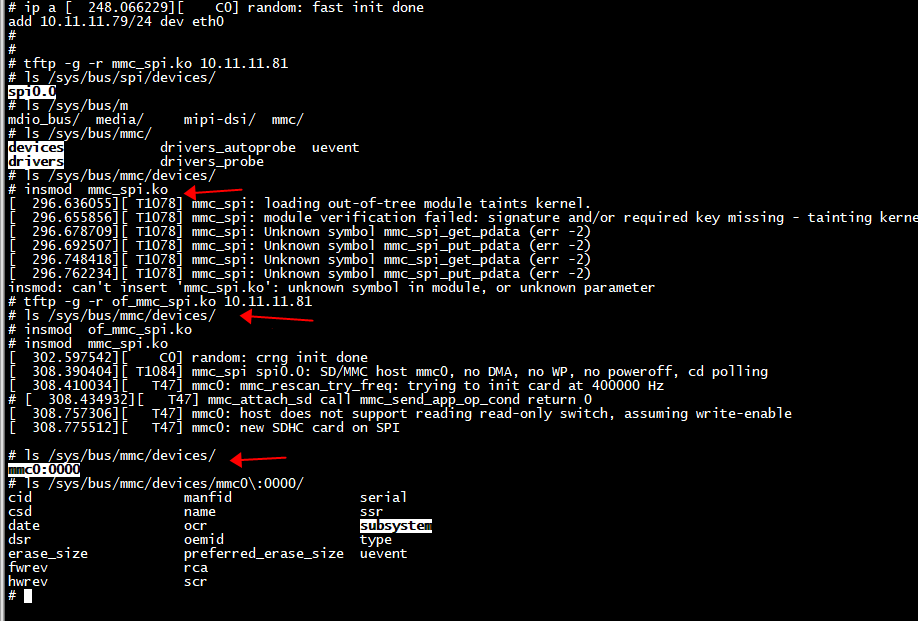
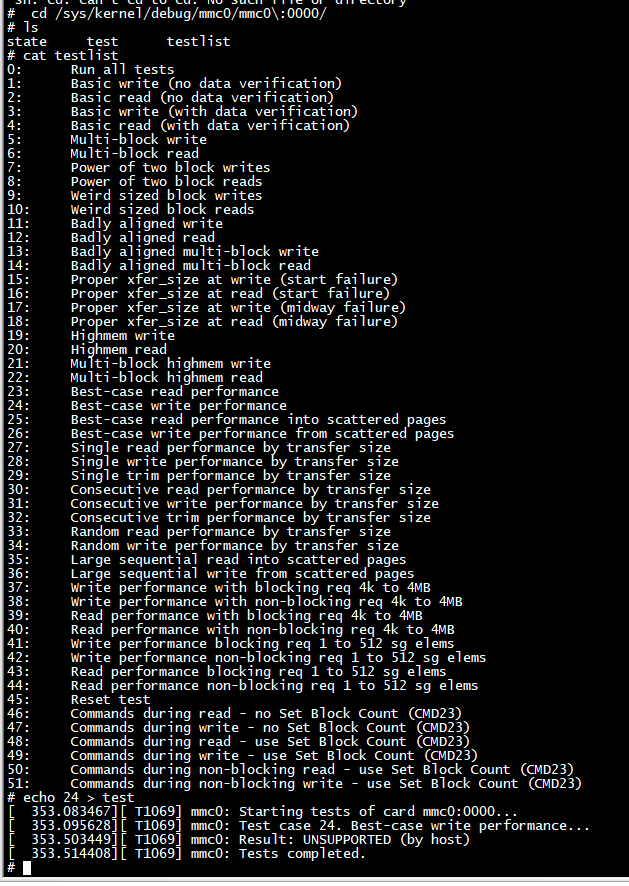

#  insmod  mmc_spi.ko 



```
# mount -t debugfs none /sys/kernel/debug
# insmod  mmc_test.ko 
[  319.748057][ T1098] mmc_test mmc0:0000: Card claimed for testing.
# ls /sys/bus/mmc/drivers/
mmc_test
# ls /sys/bus/mmc/drivers/mmc_test/
bind       mmc0:0000  uevent     unbind
# 
```

```
# echo 24 > test
[  353.083467][ T1069] mmc0: Starting tests of card mmc0:0000...
[  353.095628][ T1069] mmc0: Test case 24. Best-case write performance...
[  353.503449][ T1069] mmc0: Result: UNSUPPORTED (by host)
[  353.514408][ T1069] mmc0: Tests completed.
# 
```

#   mmc_test_start_areq


```

static int mmc_test_start_areq(struct mmc_test_card *test,
                               struct mmc_request *mrq,
                               struct mmc_request *prev_mrq)
{
        struct mmc_host *host = test->card->host;
        int err = 0;

        if (mrq) {
                init_completion(&mrq->completion);
                mrq->done = mmc_test_wait_done;
                mmc_pre_req(host, mrq);
        }

        if (prev_mrq) {
                wait_for_completion(&prev_mrq->completion);
                err = mmc_test_wait_busy(test);
                if (!err)
                        err = mmc_test_check_result(test, prev_mrq);
        }

        if (!err && mrq) {
                err = mmc_start_request(host, mrq);
                if (err)
                        mmc_retune_release(host);
        }

        if (prev_mrq)
                mmc_post_req(host, prev_mrq, 0);

        if (err && mrq)
                mmc_post_req(host, mrq, err);

        return err;
}

```

##   mmc_post_req
 
```
kmap_atomic+0xf4 
dma_cache_maint_page 
__dma_page_dev_to_cpu 
arm_dma_unmap_sg 
__irq_svc 
msmsdcc_post_req 
mmc_post_req 
mmc_start_req 
mmc_blk_issue_rw_rq 
mmc_blk_issue_rq 
mmc_queue_thread 
```
 