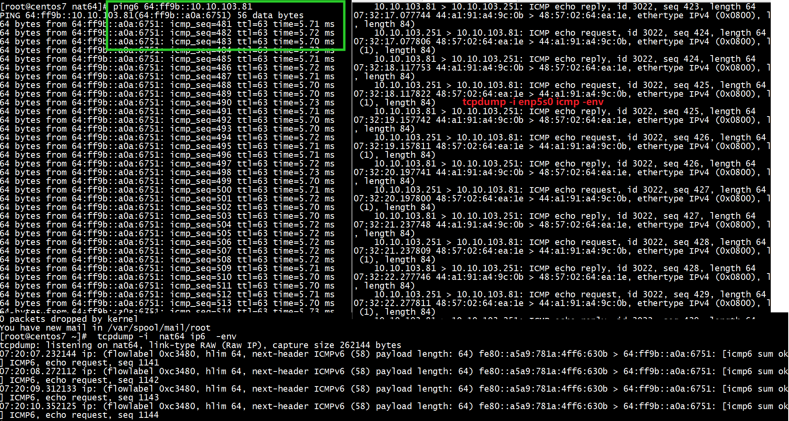
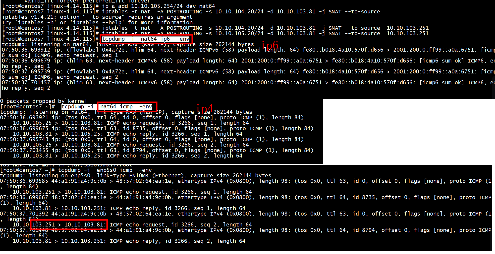

# NAT64 address   
Let's use the following IPv4 address as an example. We need to convert each octet of the address into hexadecimal.
```
185.130.44.9
```
We'll use the Python programming language REPL to convert each octet into hexadecimal:
```
>>> hex(185)
'0xb9'
>>> hex(130)
'0x82'
>>> hex(44)
'0x2c'
>>> hex(9)
'0x9'
```
We ignore the leading 0x. You may notice the last octet (9) resulted in just a single hex character 9 - so we need to prepend 0 to make it into 2 characters, i.e. 09.   

If we put them all together, we get b9822c09 - but each "chunk" / "segment" of an IPv6 address only holds 4 hex characters, so we split it across the last two 16-bit chunks in an IPv6 address: ::b982:2c09   

Finally, we need to prepend a prefix to the hex-encoded IP address, to make it into a valid IPv6 address. Most networks use the well-known prefix of 64:ff9b::/96 - so we prepend 64:ff9b:: to the hex-encoded address:
```
64:ff9b::b982:2c09  
```
Now we have a valid NAT64 address!   

# insmod nat64.ko 

```
[root@centos7 nat64]# insmod nat64.ko ipv4_prefix=198.51.100.0/24
[root@centos7 nat64]# 
```

```
[root@centos7 nat64]# rmmod  nat64.ko 
[root@centos7 nat64]# insmod nat64.ko ipv4_prefix=10.10.104.81/24 ipv6_prefix=2001:200:0:ff99::
[root@centos7 nat64]# ip link set nat64 up
[root@centos7 nat64]# ip -6 route add 2001:200:0:ff99::/96 dev nat64
```

##  dev->type = ARPHRD_NONE   

没有arp请求   
```

static void nat64_netdev_setup(struct net_device *dev)
{
        dev->netdev_ops = &nat64_netdev_ops;

        dev->type = ARPHRD_NONE;
        dev->hard_header_len = 0;
        dev->addr_len = 0;
        dev->mtu = ETH_DATA_LEN;
        dev->features = NETIF_F_NETNS_LOCAL;
        dev->flags = IFF_NOARP | IFF_POINTOPOINT;
}
```


## 正确配置   


```
[root@centos7 nat64]# insmod nat64.ko ipv4_prefix=10.10.104.81/24 ipv6_prefix=2001:200:0:ff99::
[root@centos7 nat64]# ip link set nat64 up
```


+ 1 10.10.103.251/24 网段路由（进出口）    

```
6: enp5s0: <BROADCAST,MULTICAST,UP,LOWER_UP> mtu 1500 qdisc mq state UP group default qlen 1000
    link/ether 44:a1:91:a4:9c:0b brd ff:ff:ff:ff:ff:ff
    inet 10.10.103.251/24 scope global enp5s0
       valid_lft forever preferred_lft forever
```

+ 2 nat64设备IP配置 和ipv6路由   


```
[root@centos7 linux-4.14.115]# ip a add 10.10.104.254/24 dev nat64
[root@centos7 nat64]# ip -6 route add 64:ff9b::/96 dev nat64
[root@centos7 linux-4.14.115]# ip a sh nat64
16: nat64: <POINTOPOINT,NOARP,UP,LOWER_UP> mtu 1500 qdisc noqueue state UNKNOWN group default qlen 1000
    link/none 
    inet 10.10.104.254/24 scope global nat64
       valid_lft forever preferred_lft forever
    inet6 fe80::a5a9:781a:4ff6:630b/64 scope link flags 800 
       valid_lft forever preferred_lft forever
[root@centos7 linux-4.14.115]# 
```
+ 需要配置ip a add 10.10.104.254/24 dev nat64,否则enp5s0收到reply，做了snat的方向操作不知道转给那个设备    
+ 可以看出前缀是64:ff9b::才有效    


+ 3 nat    
```
[root@centos7 ~]# iptables -t nat  -A POSTROUTING -s 10.10.104.20/24 -d 10.10.103.81 -j SNAT --to-source 10.10.103.251
[root@centos7 ~]# iptables -t nat  -nvL
```

+ 4 rp_filter
```
sysctl -w net.ipv4.conf.all.rp_filter=0
sysctl -w net.ipv4.conf.nat64.rp_filter=0
```
这里需要注意的是，要修改两个地方，一个是全局all的rp_filter，一个是收到数据包接口的rp_filter。

+ 5 ping6   

```
[root@centos7 nat64]# ping6 64:ff9b::10.10.103.81
PING 64:ff9b::10.10.103.81(64:ff9b::a0a:6751) 56 data bytes
```

+ 6 tcpdump     
```
[root@centos7 linux-4.14.115]# tcpdump -i enp5s0 icmp -env
tcpdump: listening on enp5s0, link-type EN10MB (Ethernet), capture size 262144 bytes
07:25:00.287770 44:a1:91:a4:9c:0b > 48:57:02:64:ea:1e, ethertype IPv4 (0x0800), length 98: (tos 0x0, ttl 63, id 0, offset 0, flags [none], proto ICMP (1), length 84)
    10.10.103.251 > 10.10.103.81: ICMP echo request, id 3022, seq 4, length 64
07:25:00.287828 48:57:02:64:ea:1e > 44:a1:91:a4:9c:0b, ethertype IPv4 (0x0800), length 98: (tos 0x0, ttl 64, id 29557, offset 0, flags [none], proto ICMP (1), length 84)
    10.10.103.81 > 10.10.103.251: ICMP echo reply, id 3022, seq 4, length 64
07:25:01.317753 44:a1:91:a4:9c:0b > 48:57:02:64:ea:1e, ethertype IPv4 (0x0800), length 98: (tos 0x0, ttl 63, id 0, offset 0, flags [none], proto ICMP (1), length 84)
    10.10.103.251 > 10.10.103.81: ICMP echo request, id 3022, seq 5, length 64
07:25:01.317794 48:57:02:64:ea:1e > 44:a1:91:a4:9c:0b, ethertype IPv4 (0x0800), length 98: (tos 0x0, ttl 64, id 29645, offset 0, flags [none], proto ICMP (1), length 84)
    10.10.103.81 > 10.10.103.251: ICMP echo reply, id 3022, seq 5, length 64
07:25:02.357755 44:a1:91:a4:9c:0b > 48:57:02:64:ea:1e, ethertype IPv4 (0x0800), length 98: (tos 0x0, ttl 63, id 0, offset 0, flags [none], proto ICMP (1), length 84)
    10.10.103.251 > 10.10.103.81: ICMP echo request, id 3022, seq 6, length 64
07:25:02.357811 48:57:02:64:ea:1e > 44:a1:91:a4:9c:0b, ethertype IPv4 (0x0800), length 98: (tos 0x0, ttl 64, id 29707, offset 0, flags [none], proto ICMP (1), length 84)
    10.10.103.81 > 10.10.103.251: ICMP echo reply, id 3022, seq 6, length 64
```


### demo2

nat64设备配置   
```
[root@centos7 nat64]# insmod nat64.ko ipv4_prefix=10.10.105.81/24 ipv6_prefix=2001:200:0:ff99::
[root@centos7 nat64]# ip link set nat64 up
[root@centos7 nat64]# ip -6 route add 2001:200:0:ff99::/96 dev nat64
[root@centos7 nat64]# 
```
配置  nat    

```
[root@centos7 linux-4.14.115]# ip a add 10.10.105.254/24 dev nat64
[root@centos7 linux-4.14.115]# iptables -t nat  -A POSTROUTING -s 10.10.105.20/24 -d 10.10.103.81 -j SNAT --to-source  10.10.103.251
[root@centos7 linux-4.14.115]# 
```




# reference

[ How to setup NAT64 and DNS64 on ubuntu](https://www.wide.ad.jp/About/report/pdf2011/cd/02-2_wide-memo-camp1109-hack-eden-nat64-dns64-settings-00.txt)   

[NAT64/DNS64 under linux](https://forums.he.net/index.php?topic=1998.0)    

[What is NAT64 and DNS64 with tayga)?](https://www.privex.io/articles/what-is-nat64/)      