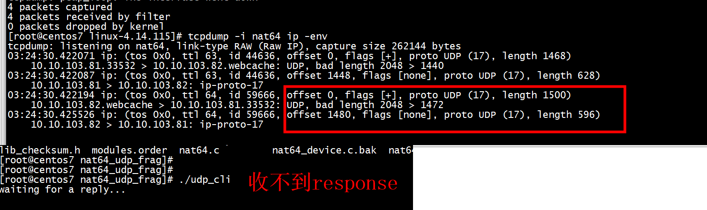
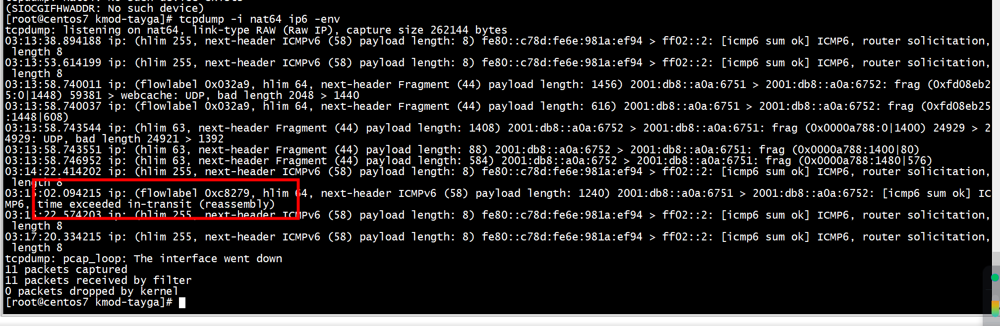

# 关闭防火墙

```
iptables -F
```

# ipv6 tcp pseudo-header


```Text
IPv6的TCP伪首部（pseudo-header）是一种用于计算TCP校验和的虚拟协议头部。IPv6的TCP伪首部与IPv4的TCP伪首部类似，但是由于IPv6和IPv4协议头部的差异，IPv6的TCP伪首部也有所不同。

IPv6的TCP伪首部包括以下字段：

源IPv6地址：128位源IPv6地址。
目标IPv6地址：128位目标IPv6地址。
零：8位零字段，用于对齐。
上层协议：8位上层协议字段，取值为6，表示TCP。
TCP报文长度：16位TCP报文长度字段，表示TCP报文的长度，包括TCP头部和数据部分。
在计算TCP校验和时，将TCP头部和数据部分与IPv6的TCP伪首部拼接成一个伪数据报文，对该伪数据报文进行校验和计算。具体的计算方法可以参考RFC 2460和RFC 793。

需要注意的是，IPv6的TCP伪首部只用于计算TCP校验和，不会在实际的数据报文中传输。同时，IPv6的TCP伪首部的长度为40字节，比IPv4的TCP伪首部要长一些。
```
注意到IPv6首部并没有包含校验和字段，这也是与IPv4的一个显著不同点。IPv6协议的设计延展了互联网设计端到端原则，取消首部校验和字段简化了路由器的处理过程，加快了IPv6报文网络传输。对报文数据完整度的保护可由链路层或端点间高层协议（TCP/UDP）的差错检测功能完成。这也是***为什么IPv6强制要求UDP层设定首部校验和字段的原因***。

# run

```
[root@centos7 nat64_udp_frag]# insmod nat64_device.ko 
[root@centos7 nat64_udp_frag]# ip a add 2001:db8::a0a:6751/96 dev nat64
[root@centos7 nat64_udp_frag]# ip l set nat64 up
ip a add 10.10.103.82/24 dev nat64
```

udp client 访问的server： #define SERVADDR "2001:db8::a0a:6752"    
udp_srv绑定的地址： inet_pton(AF_INET, "10.10.103.82", &servaddr.sin_addr);   

```

32: nat64: <POINTOPOINT,MULTICAST,NOARP,UP,LOWER_UP> mtu 1500 qdisc mq state UNKNOWN group default qlen 500
    link/none 
    inet 10.10.103.82/24 scope global nat64
       valid_lft forever preferred_lft forever
    inet6 2001:db8::a0a:6751/96 scope global 
       valid_lft forever preferred_lft forever
    inet6 fe80::b078:3e98:69e0:bbe6/64 scope link flags 800 
       valid_lft forever preferred_lft forever
```


```
[root@centos7 nat64_udp_frag]# ./udp_cli 
client send susscessfully 
[root@centos7 nat64_udp_frag]# ping6  2001:db8::a0a:6752
PING 2001:db8::a0a:6752(2001:db8::a0a:6752) 56 data bytes
64 bytes from 2001:db8::a0a:6752: icmp_seq=1 ttl=64 time=0.047 ms
64 bytes from 2001:db8::a0a:6752: icmp_seq=2 ttl=64 time=0.017 ms
^C
--- 2001:db8::a0a:6752 ping statistics ---
2 packets transmitted, 2 received, 0% packet loss, time 1054ms
rtt min/avg/max/mdev = 0.017/0.032/0.047/0.015 ms
[root@centos7 nat64_udp_frag]# 
```


#  unreachable - admin prohibited

关闭防火墙   
```
[root@centos7 nat64_udp_frag]# iptables -F
[root@centos7 nat64_udp_frag]# 
```

```
tcpdump: listening on nat64, link-type RAW (Raw IP), capture size 262144 bytes
22:52:08.948032 ip: (flowlabel 0x7caa7, hlim 64, next-header UDP (17) payload length: 17) 2001:db8::a0a:6751.42854 > 2001:db8::a0a:6752.webcache: [udp sum ok] UDP, length 9
22:52:08.948042 ip: (tos 0x0, ttl 63, id 30261, offset 0, flags [DF], proto UDP (17), length 37)
    10.10.103.81.42854 > 10.10.103.82.webcache: UDP, length 9
22:53:27.134487 ip: (flowlabel 0x0a0a8, hlim 64, next-header UDP (17) payload length: 17) 2001:db8::a0a:6751.40759 > 2001:db8::a0a:6752.webcache: [udp sum ok] UDP, length 9
22:53:27.134501 ip: (tos 0x0, ttl 63, id 40905, offset 0, flags [DF], proto UDP (17), length 37)
    10.10.103.81.40759 > 10.10.103.82.webcache: UDP, length 9
22:53:27.134555 ip: (tos 0xc0, ttl 64, id 50663, offset 0, flags [none], proto ICMP (1), length 65)
    10.10.103.82 > 10.10.103.81: ICMP host 10.10.103.82 unreachable - admin prohibited, length 45
        (tos 0x0, ttl 63, id 40905, offset 0, flags [DF], proto UDP (17), length 37)
    10.10.103.81.40759 > 10.10.103.82.webcache: UDP, length 9
22:58:36.079667 ip: (flowlabel 0xe7fe8, hlim 64, next-header UDP (17) payload length: 17) 2001:db8::a0a:6751.50800 > 2001:db8::a0a:6752.webcache: [udp sum ok] UDP, length 9
22:58:36.079680 ip: (tos 0x0, ttl 63, id 26149, offset 0, flags [DF], proto UDP (17), length 37)
    10.10.103.81.50800 > 10.10.103.82.webcache: UDP, length 9
```

# udp 丢包



```
03:24:30.422194 ip: (tos 0x0, ttl 64, id 59666, offset 0, flags [+], proto UDP (17), length 1500)
    10.10.103.82.webcache > 10.10.103.81.33532: UDP, bad length 2048 > 1472
```
udp数据长度，1472 - 8 = 1464

1464 + 40（ipv6 header） + 8 (ipv6 frag header) =1512    

此分片在 xlate_4to6_data函数中又要进行一次分片     


#   ICMP6, time exceeded in-transit (reassembly)



#  xlate_4to6_data
```
[290723.617069] [<ffff000000c407f4>] xlate_4to6_data+0x528/0x5d4 [nat64_device]
[290723.624086] [<ffff000000c40adc>] handle_ip4+0x1b8/0x1bc [nat64_device]
[290723.630669] [<ffff000000c41388>] nat64_start_xmit+0x160/0x1a0 [nat64_device]
[290723.637778] [<ffff000008720f08>] dev_hard_start_xmit+0xc4/0x258
[290723.643760] [<ffff000008754aa0>] sch_direct_xmit+0x168/0x244
[290723.649479] [<ffff000008721428>] __dev_queue_xmit+0x254/0x764
[290723.655286] [<ffff00000872195c>] dev_queue_xmit+0x24/0x30
[290723.660749] [<ffff00000872ee64>] neigh_direct_output+0x20/0x28
[290723.666642] [<ffff0000087757ac>] ip_finish_output2+0x1d8/0x3a8
[290723.672534] [<ffff000008776230>] ip_do_fragment+0x6e0/0x7b8
[290723.678166] [<ffff000008776e60>] ip_fragment.constprop.40+0x64/0xbc
[290723.684490] [<ffff000008776fac>] ip_finish_output+0xf4/0x208
[290723.690210] [<ffff000008777b34>] ip_output+0xf0/0x114
[290723.695325] [<ffff000008777290>] ip_local_out+0x58/0x68
[290723.700611] [<ffff0000087784ac>] ip_send_skb+0x2c/0x80
[290723.705815] [<ffff0000087a3444>] udp_send_skb+0xf8/0x2b0
[290723.711189] [<ffff0000087a67e4>] udp_sendmsg+0x1f4/0x7e0
[290723.716564] [<ffff0000087b1860>] inet_sendmsg+0x5c/0xf8
[290723.721852] [<ffff0000086fc350>] sock_sendmsg+0x54/0x60
[290723.727141] [<ffff0000086fda8c>] SyS_sendto+0xe0/0x124
```

#  dev->needed_headroom for skb_push
```
static void nat64_setup(struct net_device *dev)
{
        struct nat64_if_info *nif = (struct nat64_if_info *)netdev_priv(dev);

        /* Point-to-Point interface */
        dev->netdev_ops = &nat64_netdev_ops;
        dev->hard_header_len = 0;
        dev->addr_len = 0;
        dev->mtu = 1500;
        dev->needed_headroom = sizeof(struct ip6) - sizeof(struct ip4) + sizeof(ETH_HLEN);

        /* Zero header length */
        dev->type = ARPHRD_NONE;
        dev->flags = IFF_POINTOPOINT | IFF_NOARP | IFF_MULTICAST;
        dev->tx_queue_len = 500;  /* We prefer our own queue length */

        /* Setup private data */
        memset(nif, 0x0, sizeof(nif[0]));
        nif->dev = dev;
}
```


# xlate_header_6to4  xlate_payload_6to4
```
static void xlate_6to4_data(struct pkt *p)
{
	struct {
		struct ip4 ip4;
	} __attribute__ ((__packed__)) header;
	struct sk_buff *skb = p->skb;

	if (map_ip6_to_ip4(&header.ip4.dest, &p->ip6->dest, 0)) {
		host_send_icmp6_error(1, 0, 0, p);
		kfree_skb(skb);
		return;
	}

	if (map_ip6_to_ip4(&header.ip4.src, &p->ip6->src, 1)) {
		host_send_icmp6_error(1, 5, 0, p);
		kfree_skb(skb);
		return;
	}

	if (sizeof(struct ip6) + p->header_len + p->data_len > gcfg.mtu) {
		host_send_icmp6_error(2, 0, gcfg.mtu, p);
		kfree_skb(skb);
		return;
	}

	xlate_header_6to4(p, &header.ip4, p->data_len);
	--header.ip4.ttl;

	if (xlate_payload_6to4(p, &header.ip4) < 0) {
		kfree_skb(skb);
		return;
	}

	header.ip4.cksum = htons(swap_u16(ip_checksum(&header.ip4, sizeof(header.ip4))));

	skb_pull(skb, (unsigned)(p->data - sizeof(header) - skb->data));
	skb->protocol = htons(ETH_P_IP);
	skb_reset_network_header(skb);
	memcpy(ip_hdr(skb), &header, sizeof(header));
	skb->dev = p->dev;

	p->dev->stats.rx_bytes += skb->len;
	p->dev->stats.rx_packets++;
	netif_rx(skb);
}
```