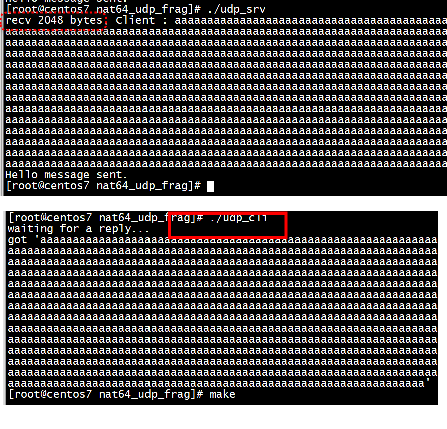
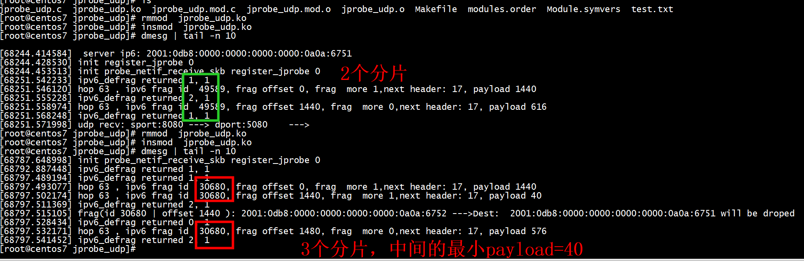
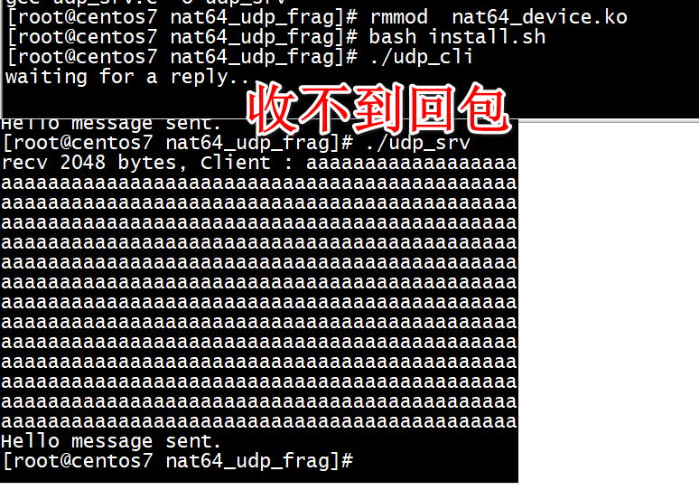

# 丢包


[ipv6: defrag: drop non-last frags smaller than min mtu](https://lists.linaro.org/archives/list/linux-stable-mirror@lists.linaro.org/message/MWJB32QVPVELA73EWNAKSJM5CQQEMJKQ/)     


```
---
 net/ipv6/netfilter/nf_conntrack_reasm.c |    4 ++++
 net/ipv6/reassembly.c                   |    4 ++++
 2 files changed, 8 insertions(+)


--- a/net/ipv6/netfilter/nf_conntrack_reasm.c
+++ b/net/ipv6/netfilter/nf_conntrack_reasm.c
@@ -565,6 +565,10 @@ int nf_ct_frag6_gather(struct net *net,
    hdr = ipv6_hdr(skb);
    fhdr = (struct frag_hdr *)skb_transport_header(skb);


+	if (skb->len - skb_network_offset(skb) < IPV6_MIN_MTU &&
+	    fhdr->frag_off & htons(IP6_MF))
+		return -EINVAL;
+
    skb_orphan(skb);
    fq = fq_find(net, fhdr->identification, user, hdr,
    	     skb->dev ? skb->dev->ifindex : 0);
--- a/net/ipv6/reassembly.c
+++ b/net/ipv6/reassembly.c
@@ -522,6 +522,10 @@ static int ipv6_frag_rcv(struct sk_buff
    	return 1;
    }


+	if (skb->len - skb_network_offset(skb) < IPV6_MIN_MTU &&
+	    fhdr->frag_off & htons(IP6_MF))
+		goto fail_hdr;
+
    iif = skb->dev ? skb->dev->ifindex : 0;
    fq = fq_find(net, fhdr->identification, hdr, iif);
    if (fq) {


```

```
int nf_ct_frag6_gather(struct net *net, struct sk_buff *skb, u32 user)
{
	u16 savethdr = skb->transport_header;
	struct net_device *dev = skb->dev;
	int fhoff, nhoff, ret;
	struct frag_hdr *fhdr;
	struct frag_queue *fq;
	struct ipv6hdr *hdr;
	u8 prevhdr;

	/* Jumbo payload inhibits frag. header */
	if (ipv6_hdr(skb)->payload_len == 0) {
		pr_debug("payload len = 0\n");
		return 0;
	}

	if (find_prev_fhdr(skb, &prevhdr, &nhoff, &fhoff) < 0)
		return 0;

	if (!pskb_may_pull(skb, fhoff + sizeof(*fhdr)))
		return -ENOMEM;

	skb_set_transport_header(skb, fhoff);
	hdr = ipv6_hdr(skb);
	fhdr = (struct frag_hdr *)skb_transport_header(skb);

	if (skb->len - skb_network_offset(skb) < IPV6_MIN_MTU &&
	    fhdr->frag_off & htons(IP6_MF))
		return -EINVAL;

	skb_orphan(skb);
	fq = fq_find(net, fhdr->identification, user, hdr,
		     skb->dev ? skb->dev->ifindex : 0);
	if (fq == NULL) {
		pr_debug("Can't find and can't create new queue\n");
		return -ENOMEM;
	}

	spin_lock_bh(&fq->q.lock);

	ret = nf_ct_frag6_queue(fq, skb, fhdr, nhoff);
	if (ret < 0) {
		if (ret == -EPROTO) {
			skb->transport_header = savethdr;
			ret = 0;
		}
		goto out_unlock;
	}

	/* after queue has assumed skb ownership, only 0 or -EINPROGRESS
	 * must be returned.
	 */
	ret = -EINPROGRESS;
	if (fq->q.flags == (INET_FRAG_FIRST_IN | INET_FRAG_LAST_IN) &&
	    fq->q.meat == fq->q.len &&
	    nf_ct_frag6_reasm(fq, skb, dev))
		ret = 0;
	else
		skb_dst_drop(skb);

out_unlock:
	spin_unlock_bh(&fq->q.lock);
	inet_frag_put(&fq->q);
	return ret;
}
EXPORT_SYMBOL_GPL(nf_ct_frag6_gather);
```

```
static int ipv6_frag_rcv(struct sk_buff *skb)
{
	struct frag_hdr *fhdr;
	struct frag_queue *fq;
	const struct ipv6hdr *hdr = ipv6_hdr(skb);
	struct net *net = dev_net(skb_dst(skb)->dev);
	int iif;

	if (IP6CB(skb)->flags & IP6SKB_FRAGMENTED)
		goto fail_hdr;

	__IP6_INC_STATS(net, ip6_dst_idev(skb_dst(skb)), IPSTATS_MIB_REASMREQDS);

	/* Jumbo payload inhibits frag. header */
	if (hdr->payload_len == 0)
		goto fail_hdr;

	if (!pskb_may_pull(skb, (skb_transport_offset(skb) +
				 sizeof(struct frag_hdr))))
		goto fail_hdr;

	hdr = ipv6_hdr(skb);
	fhdr = (struct frag_hdr *)skb_transport_header(skb);

	if (!(fhdr->frag_off & htons(0xFFF9))) {
		/* It is not a fragmented frame */
		skb->transport_header += sizeof(struct frag_hdr);
		__IP6_INC_STATS(net,
				ip6_dst_idev(skb_dst(skb)), IPSTATS_MIB_REASMOKS);

		IP6CB(skb)->nhoff = (u8 *)fhdr - skb_network_header(skb);
		IP6CB(skb)->flags |= IP6SKB_FRAGMENTED;
		return 1;
	}

	if (skb->len - skb_network_offset(skb) < IPV6_MIN_MTU &&
	    fhdr->frag_off & htons(IP6_MF))
		goto fail_hdr;
```

# ipv4 mtu - sizeof(struct iphdr) <  ipv6 mtu -sizeof(struct ip6hdr) - sizeof(struct ip6frag)

+ ipv4 mtu   
```
dev->mtu = 1460;
```

```
16: nat64: <POINTOPOINT,MULTICAST,NOARP,UP,LOWER_UP> mtu 1460 qdisc mq state UNKNOWN group default qlen 500
    link/none 
    inet 10.10.103.82/24 scope global nat64
       valid_lft forever preferred_lft forever
    inet6 2001:db8::a0a:6751/96 scope global 
       valid_lft forever preferred_lft forever
    inet6 fe80::a72d:9140:721b:9bb3/64 scope link flags 800 
       valid_lft forever preferred_lft forever
```

+ ipv6 mtu  
```
#define IPV6_OFFLINK_MTU 1492
#define G_MTU 1492
```

## test

+ 1 client
client 发送#define UDP_BIG_PKT_LEN 2048字节，

+ 2 server  
server 回复#define UDP_BIG_PKT_LEN 2048字节，

```
[root@centos7 jprobe_udp]# dmesg | tail -n 10
 
[68244.414584]  server ip6: 2001:0db8:0000:0000:0000:0000:0a0a:6751 
[68244.428530] init register_jprobe 0
[68244.453513] init probe_netif_receive_skb register_jprobe 0
[68251.542233] ipv6_defrag returned 1, 1 
[68251.546120] hop 63 , ipv6 frag id  49589, frag offset 0, frag  more 1,next header: 17, payload 1440 
[68251.555228] ipv6_defrag returned 2, 1 
[68251.558974] hop 63 , ipv6 frag id  49589, frag offset 1440, frag  more 0,next header: 17, payload 616 
[68251.568248] ipv6_defrag returned 1, 1 
[68251.571998] udp recv: sport:8080 ---> dport:5080    ---> 
[root@centos7 jprobe_udp]# 
```



只有两个分片


# ipv4 mtu - sizeof(struct iphdr) > ipv6 mtu -sizeof(struct ip6hdr) - sizeof(struct ip6frag)


+ ipv4 mtu   
```
dev->mtu = 1500;
```

```
17: nat64: <POINTOPOINT,MULTICAST,NOARP,UP,LOWER_UP> mtu 1500 qdisc mq state UNKNOWN group default qlen 500
    link/none 
    inet 10.10.103.82/24 scope global nat64
       valid_lft forever preferred_lft forever
    inet6 2001:db8::a0a:6751/96 scope global 
       valid_lft forever preferred_lft forever
    inet6 fe80::91ff:b194:23cb:c4a5/64 scope link flags 800 
       valid_lft forever preferred_lft forever
```

+ ipv6 mtu  
```
#define IPV6_OFFLINK_MTU 1492
#define G_MTU 1492
```

## test

+ 1 client
client 发送#define UDP_BIG_PKT_LEN 2048字节，

+ 2 server  
server 回复#define UDP_BIG_PKT_LEN 2048字节，








> ## jprobe

+ 1  对ipv6_defrag的返回值进行trace:
```
static int ret_handler2(struct kretprobe_instance *ri, struct pt_regs *regs)
{
    unsigned int verdict = regs_return_value(regs);
    if (NF_DROP ==  verdict)
    {
        printk(KERN_INFO "%s returned %u , drop skb\n", func_name2, verdict);
    }
    return 0;
}
```

```
[53878.103223] ipv6_defrag returned 0 , drop skb
```

+ 2 对于kfree_skb进行trace     


```
static void kfree_skb_wrap(struct sk_buff *skb)
{
    //skb probably is NULL
    if(NULL != skb && SKB_MARK == (SKB_MARK & skb->mark))
    {
         //will coredump
         printk("Caller is %s\n",__func__ );
         dump_stack();
    }
    jprobe_return();
    return 0;
}
```

```
[53878.132085] [<ffff000008089e14>] dump_backtrace+0x0/0x23c
[53878.137461] [<ffff00000808a074>] show_stack+0x24/0x2c
[53878.142489] [<ffff0000088568a8>] dump_stack+0x84/0xa8
[53878.147521] [<ffff000002fd0590>] kfree_skb_wrap+0x50/0x68 [jprobe_udp]
[53878.154018] [<ffff000008766cec>] nf_hook_slow+0xc0/0xe0
[53878.159218] [<ffff0000087f7e1c>] ipv6_rcv+0x374/0x528
```

```
[53878.089892] frag(id 20944 | offset 1440 ): 2001:0db8:0000:0000:0000:0000:0a0a:6752 --->Dest:  2001:0db8:0000:0000:0000:0000:0a0a:6751 will be droped 
[53878.103223] ipv6_defrag returned 0 , drop skb
[53878.107560] Caller is kfree_skb_wrap
[53878.111122] CPU: 20 PID: 16295 Comm: udp_srv Tainted: G        W  OE  ------------   4.14.0-115.el7a.0.1.aarch64 #1
[53878.121507] Hardware name: Huawei TaiShan 200 (Model 2280)/BC82AMDD, BIOS 1.08 12/14/2019
[53878.129645] Call trace:
[53878.132085] [<ffff000008089e14>] dump_backtrace+0x0/0x23c
[53878.137461] [<ffff00000808a074>] show_stack+0x24/0x2c
[53878.142489] [<ffff0000088568a8>] dump_stack+0x84/0xa8
[53878.147521] [<ffff000002fd0590>] kfree_skb_wrap+0x50/0x68 [jprobe_udp]
[53878.154018] [<ffff000008766cec>] nf_hook_slow+0xc0/0xe0
[53878.159218] [<ffff0000087f7e1c>] ipv6_rcv+0x374/0x528
[53878.164247] [<ffff00000871bb98>] __netif_receive_skb_core+0x320/0xa84
[53878.170657] [<ffff00000871eccc>] __netif_receive_skb+0x34/0x7c
[53878.176462] [<ffff00000871edc0>] process_backlog+0xac/0x190
[53878.182009] [<ffff000008722b34>] net_rx_action+0x314/0x470
[53878.187469] [<ffff000008081a9c>] __do_softirq+0x11c/0x2f0
[53878.192844] [<ffff0000080db478>] do_softirq+0x70/0x74
[53878.197871] [<ffff0000080db518>] __local_bh_enable_ip+0x9c/0xa0
[53878.203763] [<ffff0000087757c0>] ip_finish_output2+0x1ec/0x3a8
[53878.209568] [<ffff000008776230>] ip_do_fragment+0x6e0/0x7b8
[53878.215115] [<ffff000008776e60>] ip_fragment.constprop.40+0x64/0xbc
[53878.221353] [<ffff000008776fac>] ip_finish_output+0xf4/0x208
[53878.226985] [<ffff000008777b34>] ip_output+0xf0/0x114
[53878.232013] [<ffff000008777290>] ip_local_out+0x58/0x68
[53878.237213] [<ffff0000087784ac>] ip_send_skb+0x2c/0x80
[53878.242328] [<ffff0000087a3444>] udp_send_skb+0xf8/0x2b0
[53878.247614] [<ffff0000087a67e4>] udp_sendmsg+0x1f4/0x7e0
[53878.252901] [<ffff0000087b1860>] inet_sendmsg+0x5c/0xf8
[53878.258101] [<ffff0000086fc350>] sock_sendmsg+0x54/0x60
[53878.263301] [<ffff0000086fda8c>] SyS_sendto+0xe0/0x124
```