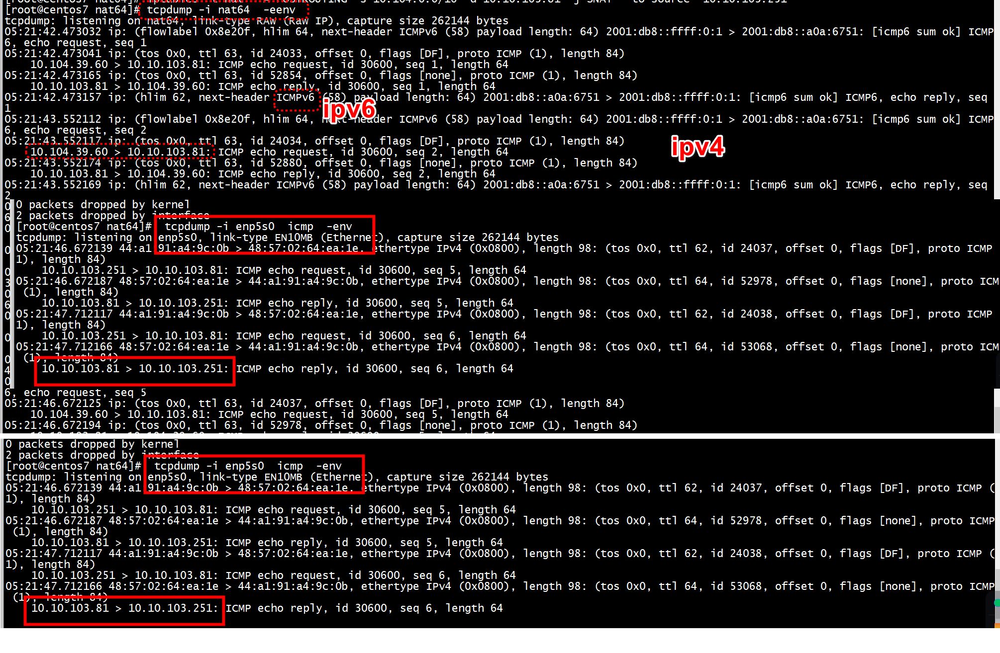
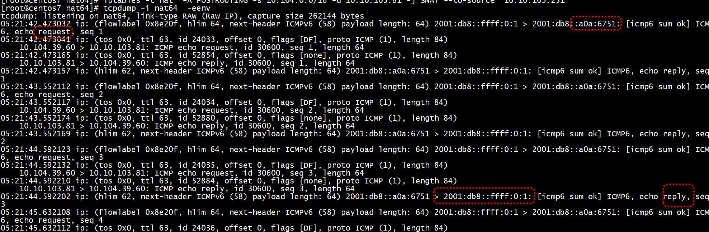
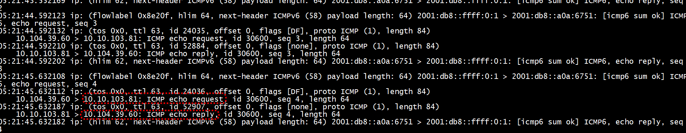

#  arp

IFF_NOARP    ARPHRD_NONE   

没有arp邻居   
```
[root@centos7 src]# ping6  2001:db8:0:0::10.10.103.81
PING 2001:db8:0:0::10.10.103.81(2001:db8::a0a:6751) 56 data bytes
64 bytes from 2001:db8::a0a:6751: icmp_seq=1 ttl=62 time=7.51 ms
64 bytes from 2001:db8::a0a:6751: icmp_seq=2 ttl=62 time=0.085 ms
^C
--- 2001:db8:0:0::10.10.103.81 ping statistics ---
2 packets transmitted, 2 received, 0% packet loss, time 1001ms
rtt min/avg/max/mdev = 0.085/3.800/7.516/3.716 ms
[root@centos7 src]# ip n | grep 2001
[root@centos7 src]# 
```

```
static void nat64_setup(struct net_device *dev)
{
        struct nat64_if_info *nif = (struct nat64_if_info *)netdev_priv(dev);

        /* Point-to-Point interface */
        dev->netdev_ops = &nat64_netdev_ops;
        dev->hard_header_len = 0;
        dev->addr_len = 0;
        dev->mtu = 1500;
        dev->needed_headroom = sizeof(struct ip6) - sizeof(struct ip4);

        /* Zero header length */
        dev->type = ARPHRD_NONE;
        dev->flags = IFF_POINTOPOINT | IFF_NOARP | IFF_MULTICAST;
        dev->tx_queue_len = 500;  /* We prefer our own queue length */

        /* Setup private data */
        memset(nif, 0x0, sizeof(nif[0]));
        nif->dev = dev;
}
```

> ##  arp_send_dst of  IFF_NOARP   
```
/* Create and send an arp packet. */
static void arp_send_dst(int type, int ptype, __be32 dest_ip,
                         struct net_device *dev, __be32 src_ip,
                         const unsigned char *dest_hw,
                         const unsigned char *src_hw,
                         const unsigned char *target_hw,
                         struct dst_entry *dst)
{
        struct sk_buff *skb;

        /* arp on this interface. */
        if (dev->flags & IFF_NOARP)
                return;

        skb = arp_create(type, ptype, dest_ip, dev, src_ip,
                         dest_hw, src_hw, target_hw);
        if (!skb)
                return;

        skb_dst_set(skb, dst_clone(dst));
        arp_xmit(skb);
}
```
> ##  eth_header of  IFF_NOARP   
采用eth_zero_addr

```
static inline void eth_zero_addr(u8 *addr)
{
        memset(addr, 0x00, ETH_ALEN);
}
```

```
int eth_header(struct sk_buff *skb, struct net_device *dev,
               unsigned short type,
               const void *daddr, const void *saddr, unsigned int len)
{
        struct ethhdr *eth = skb_push(skb, ETH_HLEN);

        if (type != ETH_P_802_3 && type != ETH_P_802_2)
                eth->h_proto = htons(type);
        else
                eth->h_proto = htons(len);

        /*
         *      Set the source hardware address.
         */

        if (!saddr)
                saddr = dev->dev_addr;
        memcpy(eth->h_source, saddr, ETH_ALEN);

        if (daddr) {
                memcpy(eth->h_dest, daddr, ETH_ALEN);
                return ETH_HLEN;
        }

        /*
         *      Anyway, the loopback-device should never use this function...
         */

        if (dev->flags & (IFF_LOOPBACK | IFF_NOARP)) {
                eth_zero_addr(eth->h_dest);
                return ETH_HLEN;
        }

        return -ETH_HLEN;
}
EXPORT_SYMBOL(eth_header);
```

# IFF_POINTOPOINT

arp  

```
static inline struct neighbour *__ipv4_neigh_lookup_noref(struct net_device *dev, u32 key)
{
	if (dev->flags & (IFF_LOOPBACK | IFF_POINTOPOINT))
		key = INADDR_ANY;

	return ___neigh_lookup_noref(&arp_tbl, neigh_key_eq32, arp_hashfn, &key, dev);
}
```

# run 

Note:   
  IPv6 subnet must be /64, IPv4 subnet must be /16
Example:   
  setup-nat64.sh 2001:db8:0:0::/64 10.10.0.0/16   
  
+ 1 insmod    
```
[root@centos7 src]#  ../tools/setup-nat64.sh  2001:db8:0:0::/64 10.104.0.0/16
+ insmod tayga.ko ipv6_addr=2001:db8:0:0:0:ffff:0:2 ipv4_addr=10.104.255.2 prefix=2001:db8:0:0::/96 dynamic_pool=10.104.0.0/17
+ ip link set nat64 up
+ ip addr add 2001:db8:0:0:0:ffff:0:1/64 dev nat64
+ ip addr add 10.104.255.1/16 dev nat64
[root@centos7 src]# 
``` 

+ 2 配置route   
```
 [root@centos7 src]# ip -6 route add 2001:db8:0:0::/64  dev nat64
```

+ 3 配置nat   

物理网卡ip    

```
6: enp5s0: <BROADCAST,MULTICAST,UP,LOWER_UP> mtu 1500 qdisc mq state UP group default qlen 1000
    link/ether 44:a1:91:a4:9c:0b brd ff:ff:ff:ff:ff:ff
    inet 10.10.103.251/24 scope global enp5s0
       valid_lft forever preferred_lft forever
```


```
[root@centos7 nat64]# iptables -t nat  -A POSTROUTING -s 10.104.0.0/16 -d 10.10.103.81 -j SNAT --to-source  10.10.103.251
[root@centos7 nat64]# 
```

+ 4 rp_filter

```
sysctl -w net.ipv4.conf.all.rp_filter=0
sysctl -w net.ipv4.conf.nat64.rp_filter=0

```


+ 5 ping

```
[root@centos7 src]# ping6  2001:db8:0:0::10.10.103.81
PING 2001:db8:0:0::10.10.103.81(2001:db8::a0a:6751) 56 data bytes
64 bytes from 2001:db8::a0a:6751: icmp_seq=1 ttl=62 time=0.126 ms
64 bytes from 2001:db8::a0a:6751: icmp_seq=2 ttl=62 time=0.094 ms
^C
--- 2001:db8:0:0::10.10.103.81 ping statistics ---
2 packets transmitted, 2 received, 0% packet loss, time 1023ms
rtt min/avg/max/mdev = 0.094/0.110/0.126/0.016 ms
[root@centos7 src]# 
```

  

icmp6 请求和回复  




icmp4 请求和回复  


#  handle_ip6

   handle_ip6  -->  parse_ip6 进行解析  
   

## frag 处理


```
static void xlate_header_6to4(struct pkt *p, struct ip4 *ip4,
		int payload_length)
{
	ip4->ver_ihl = 0x45;
	ip4->tos = (ntohl(p->ip6->ver_tc_fl) >> 20) & 0xff;
	ip4->length = htons(sizeof(struct ip4) + payload_length);
	if (p->ip6_frag) {
		ip4->ident = htons(ntohl(p->ip6_frag->ident) & 0xffff);
		ip4->flags_offset =
			htons(ntohs(p->ip6_frag->offset_flags) >> 3);
		if (p->ip6_frag->offset_flags & htons(IP6_F_MF))
			ip4->flags_offset |= htons(IP4_F_MF);
	} /* else if (dest && (dest->flags & CACHE_F_GEN_IDENT) &&
			p->header_len + payload_length <= 1280) {
		ip4->ident = htons(dest->ip4_ident++);
		ip4->flags_offset = 0;
		if (dest->ip4_ident == 0)
			dest->ip4_ident++;
	} */ else {
		ip4->ident = select_ip4_ipid();
		ip4->flags_offset = htons(IP4_F_DF);
	}
	ip4->ttl = p->ip6->hop_limit;
	ip4->proto = p->data_proto == 58 ? 1 : p->data_proto;
	ip4->cksum = 0;
}
```