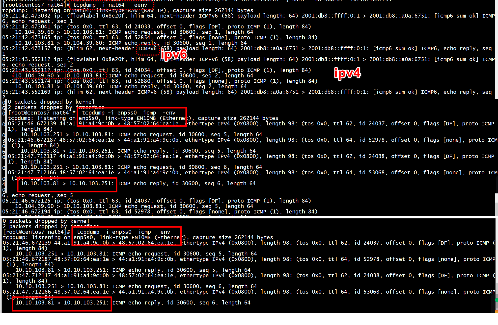
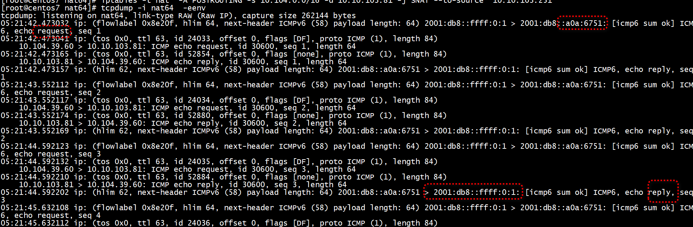
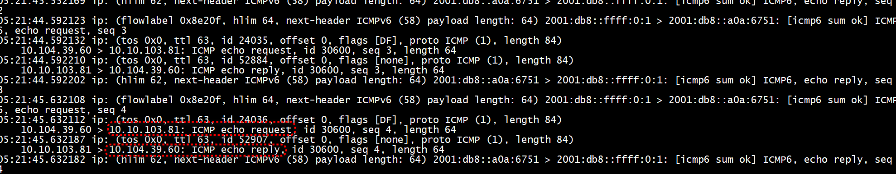

#  arp

IFF_NOARP    ARPHRD_NONE   

没有arp邻居   
```
[root@centos7 src]# ping6  2001:db8:0:0::10.10.103.81
PING 2001:db8:0:0::10.10.103.81(2001:db8::a0a:6751) 56 data bytes
64 bytes from 2001:db8::a0a:6751: icmp_seq=1 ttl=62 time=7.51 ms
64 bytes from 2001:db8::a0a:6751: icmp_seq=2 ttl=62 time=0.085 ms
^C
--- 2001:db8:0:0::10.10.103.81 ping statistics ---
2 packets transmitted, 2 received, 0% packet loss, time 1001ms
rtt min/avg/max/mdev = 0.085/3.800/7.516/3.716 ms
[root@centos7 src]# ip n | grep 2001
[root@centos7 src]# 
```

```
static void nat64_setup(struct net_device *dev)
{
        struct nat64_if_info *nif = (struct nat64_if_info *)netdev_priv(dev);

        /* Point-to-Point interface */
        dev->netdev_ops = &nat64_netdev_ops;
        dev->hard_header_len = 0;
        dev->addr_len = 0;
        dev->mtu = 1500;
        dev->needed_headroom = sizeof(struct ip6) - sizeof(struct ip4);

        /* Zero header length */
        dev->type = ARPHRD_NONE;
        dev->flags = IFF_POINTOPOINT | IFF_NOARP | IFF_MULTICAST;
        dev->tx_queue_len = 500;  /* We prefer our own queue length */

        /* Setup private data */
        memset(nif, 0x0, sizeof(nif[0]));
        nif->dev = dev;
}
```
# run 

Note:   
  IPv6 subnet must be /64, IPv4 subnet must be /16
Example:   
  setup-nat64.sh 2001:db8:0:0::/64 10.10.0.0/16   
  
+ 1 insmod    
```
[root@centos7 src]#  ../tools/setup-nat64.sh  2001:db8:0:0::/64 10.104.0.0/16
+ insmod tayga.ko ipv6_addr=2001:db8:0:0:0:ffff:0:2 ipv4_addr=10.104.255.2 prefix=2001:db8:0:0::/96 dynamic_pool=10.104.0.0/17
+ ip link set nat64 up
+ ip addr add 2001:db8:0:0:0:ffff:0:1/64 dev nat64
+ ip addr add 10.104.255.1/16 dev nat64
[root@centos7 src]# 
``` 

+ 2 配置route   
```
 [root@centos7 src]# ip -6 route add 2001:db8:0:0::/64  dev nat64
```

+ 3 配置nat   

物理网卡ip    

```
6: enp5s0: <BROADCAST,MULTICAST,UP,LOWER_UP> mtu 1500 qdisc mq state UP group default qlen 1000
    link/ether 44:a1:91:a4:9c:0b brd ff:ff:ff:ff:ff:ff
    inet 10.10.103.251/24 scope global enp5s0
       valid_lft forever preferred_lft forever
```


```
[root@centos7 nat64]# iptables -t nat  -A POSTROUTING -s 10.104.0.0/16 -d 10.10.103.81 -j SNAT --to-source  10.10.103.251
[root@centos7 nat64]# 
```

+ 4 rp_filter

```
sysctl -w net.ipv4.conf.all.rp_filter=0
sysctl -w net.ipv4.conf.nat64.rp_filter=0

```


+ 5 ping

```
[root@centos7 src]# ping6  2001:db8:0:0::10.10.103.81
PING 2001:db8:0:0::10.10.103.81(2001:db8::a0a:6751) 56 data bytes
64 bytes from 2001:db8::a0a:6751: icmp_seq=1 ttl=62 time=0.126 ms
64 bytes from 2001:db8::a0a:6751: icmp_seq=2 ttl=62 time=0.094 ms
^C
--- 2001:db8:0:0::10.10.103.81 ping statistics ---
2 packets transmitted, 2 received, 0% packet loss, time 1023ms
rtt min/avg/max/mdev = 0.094/0.110/0.126/0.016 ms
[root@centos7 src]# 
```

  

icmp6 请求和回复  




icmp4 请求和回复  
