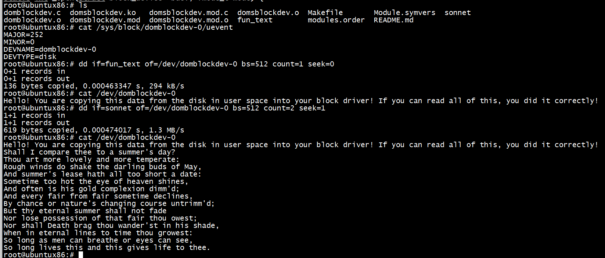
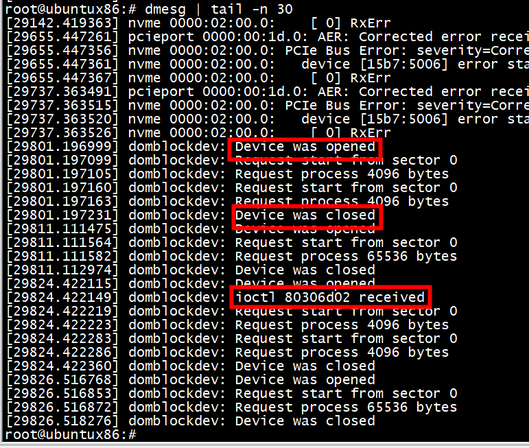

# The Block Party

Let's have some fun with block devices and Shakespeare. I promise this is more fun than it sounds. Well, for me it is anyways.

Start by downloading the four files here: `domblockdev.c`, the `Makefile`, `fun_text`, and `sonnet`. Next, use `make` from the command line to create the usual kernel object. This time it will be called `domsblockdev.ko` (creatively named after some person named Dom). Insert the module like usual:



```shell
$ insmod domsblockdev.ko
```

With dmesg looking like this:

```shell
[ +13.834971] domblockdev: The block device was created! Congrats!
```

First, let's check on some info about our ramdisk that was just created:

```shell
$ cat /sys/block/domblockdev-0/uevent

MAJOR=252
MINOR=0
DEVNAME=domblockdev-0
DEVTYPE=disk
```

This all looks good. Now, let's write some info to the disk. Let's start with the sample text found in `fun_text`:

```shell
$ dd if=fun_text of=/dev/domblockdev-0 bs=512 count=1 seek=0
```

- This takes the text from the file fun_text and writes it to the start of domblockdev-0 
- We have set the block size to 512 (a good default because the kernel counts in 512 byte increments for file transfer)
- We set the count to 1 (number of blocks to transfer)
- We set seek to 0 (the offest of where to start writing, in 512-byte chunks)

dmesg will look like this while the write takes place:

```shell
[Apr26 14:41] domblockdev: Device was opened
[  +0.000101] domblockdev: Request start from sector 0 
[  +0.000004] domblockdev: Request process 4096 bytes
[  +0.000143] domblockdev: Request start from sector 0 
[  +0.000006] domblockdev: Request process 4096 bytes
[  +0.000098] domblockdev: Device was closed
```

And we can read our ramdisk now with this command to see the contents of that file:

```
$ cat /dev/domblockdev-0 

Hello! You are copying this data from the disk in user space
into your block driver! If you can read all of this, you did it correctly!
```

Now, let's have a bit more fun with Shakespeare. I have included one of his wonderful sonnets in a file called `sonnet` that is about 619 bytes long (longer than that magic 512 byte size thing that the kernel likes). Let's start by writing the sonnet to the ram disk AFTER our current text that we have. We do that with:

```shell
$ dd if=sonnet of=/dev/domblockdev-0 bs=512 count=2 seek=1


1+1 records in
1+1 records out
619 bytes copied, 0.00066355 s, 933 kB/s
```

- We use sonnet as the `if` argument for dd to write that data to the disk (see `man dd` for more info). 
- We use the same block size of 512 bytes
- We use a count of 2 because our file is larger than the 512 size
- We set seek to 1 to write AFTER the first block of 512 bytes that we already wrote to before

The result is the ram disk looks like this:

```shell
$ cat /dev/domblockdev-0 

Hello! You are copying this data from the disk in user space into your block driver!
If you can read all of this, you did it correctly!
Shall I compare thee to a summer's day?
Thou art more lovely and more temperate:
Rough winds do shake the darling buds of May,
And summer's lease hath all too short a date:
Sometime too hot the eye of heaven shines,
And often is his gold complexion dimm'd;
And every fair from fair sometime declines,
By chance or nature's changing course untrimm'd;
But thy eternal summer shall not fade
Nor lose possession of that fair thou owest;
Nor shall Death brag thou wander'st in his shade,
When in eternal lines to time thou growest:
So long as men can breathe or eyes can see,
So long lives this and this gives life to thee.
```

There we have it! We have now stored multiple different files into different locations on the ramdisk. Now, lets dump all of the ramdisk data into a file on our real disk:

```shell
$ dd if=/dev/domblockdev-0 of=testoutput bs=512 count=3 seek=0

3+0 records in
3+0 records out
1536 bytes (1.5 kB, 1.5 KiB) copied, 0.00057702 s, 2.7 MB/s
```

- Here we use /dev/domblockdev-0 as the `if` argument
  - We want to copy from this device now
- We create a new file called `testoutput` to dump the data into
- Same block size
- Count is now 3 to include ALL the data we wrote
- Seek is 0 because we started writing data at the beginning of our ramdisk

We can then check the file we just created with:

```shell
$ cat testoutput 

Hello! You are copying this data from the disk in user space into your block driver! 
If you can read all of this, you did it correctly!
Shall I compare thee to a summer's day?
Thou art more lovely and more temperate:
Rough winds do shake the darling buds of May,
And summer's lease hath all too short a date:
Sometime too hot the eye of heaven shines,
And often is his gold complexion dimm'd;
And every fair from fair sometime declines,
By chance or nature's changing course untrimm'd;
But thy eternal summer shall not fade
Nor lose possession of that fair thou owest;
Nor shall Death brag thou wander'st in his shade,
When in eternal lines to time thou growest:
So long as men can breathe or eyes can see,
So long lives this and this gives life to thee.
```

It matched! Look at that! Now, play around with this driver and see how it works in detail with reading and writing. There are a lot of cool things you can do to explore (and break) this driver. Have fun!

# fops

```C
static const struct block_device_operations _fops = {
        .owner = THIS_MODULE,
        .open = _open,
        .release = _release,
        .ioctl = _ioctl,
};
```


