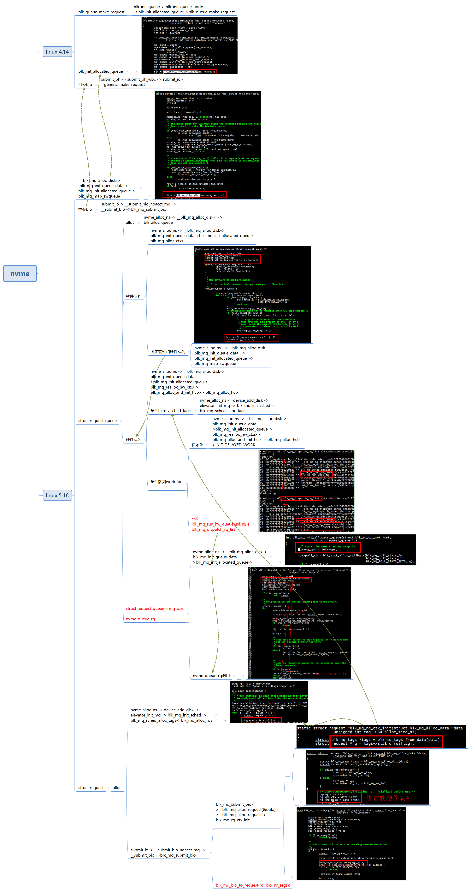
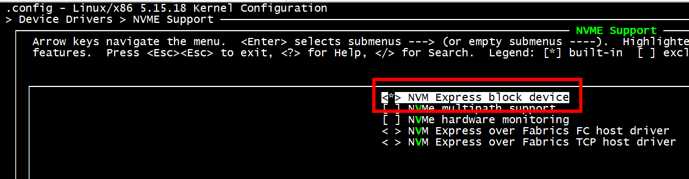
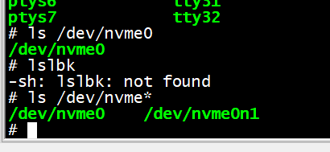
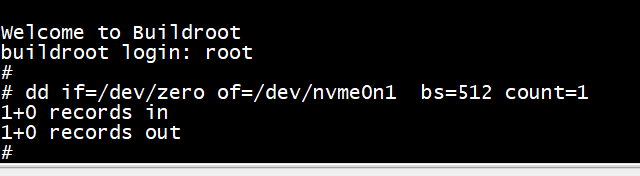
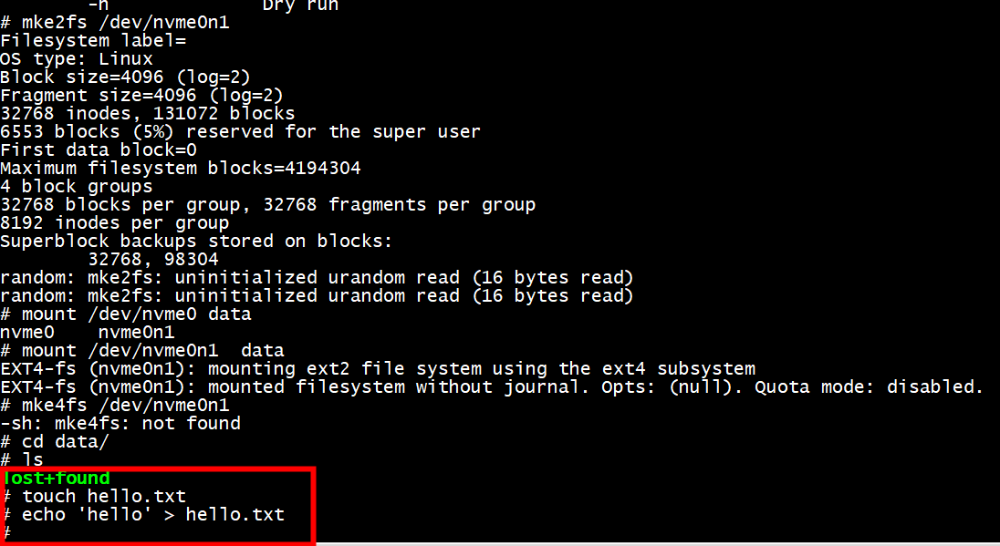
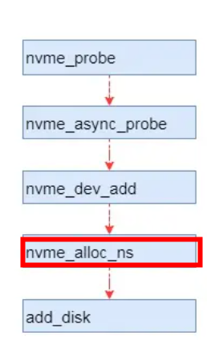
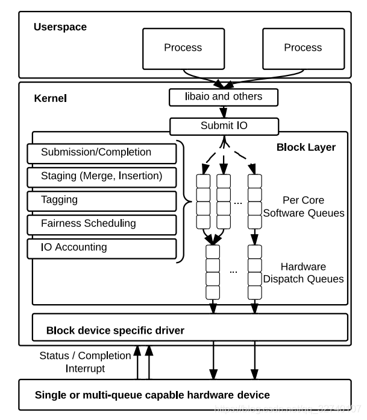
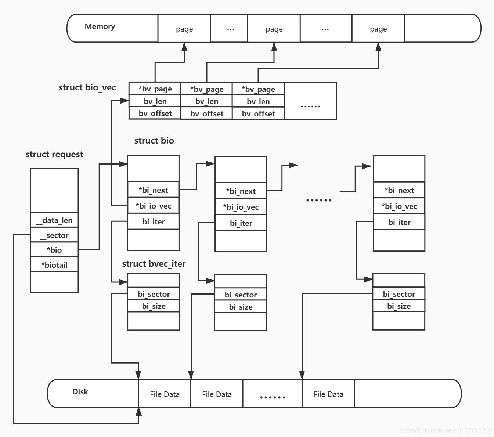
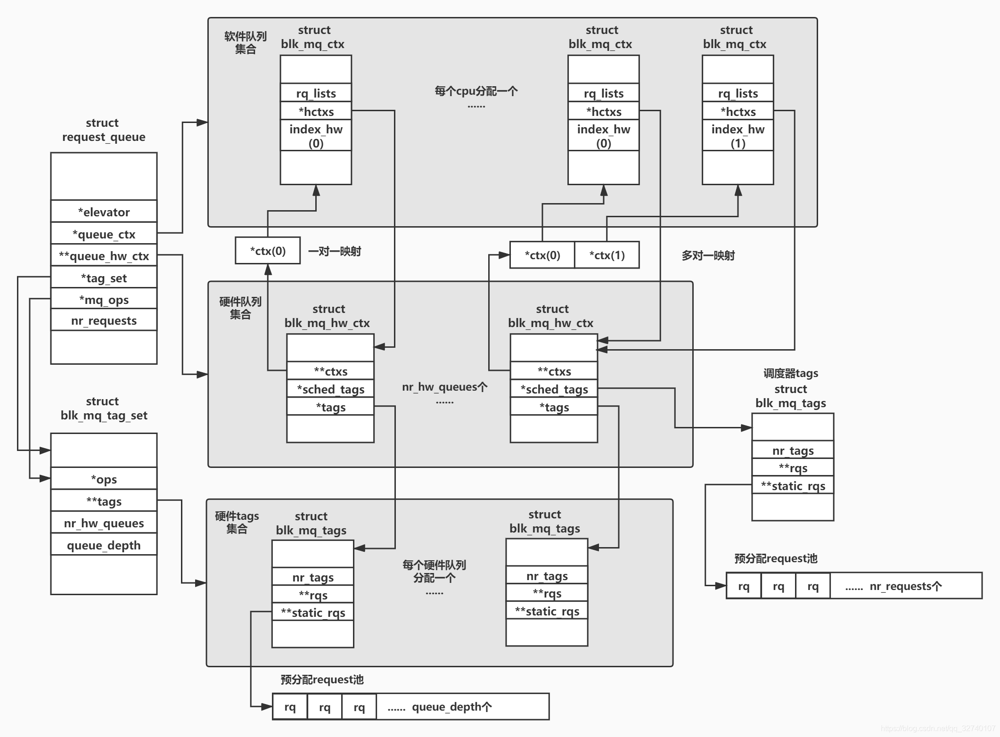

## 软硬件队列和cpu的关系

参考如下操作系统
```
[root@centos7 mybrd]# uname -a
Linux centos7 4.14.0-115.el7a.0.1.aarch64 #1 SMP Sun Nov 25 20:54:21 UTC 2018 aarch64 aarch64 aarch64 GNU/Linux
[root@centos7 mybrd]
```

```C
// refer to  blk_mq_init_cpu_queues  blk_mq_map_swqueue
static void print_request_queue(struct request_queue *q)
{
    unsigned int i, j,hctx_idx;
    //unsigned int nr_queues = set->nr_hw_queues;
    struct blk_mq_ctx *ctx;
    struct blk_mq_hw_ctx *hctx;
    struct blk_mq_tag_set *set = q->tag_set;
    for_each_possible_cpu(i) {
            hctx_idx = q->mq_map[i];
                    /* unmapped hw queue can be remapped after CPU topo changed */
                //if (!set->tags[hctx_idx] &&
                //    !__blk_mq_alloc_rq_map(set, hctx_idx)) {
                if (!set->tags[hctx_idx]){
                    /*
                   * If tags initialization fail for some hctx,
                   * that hctx won't be brought online.  In this
                   * case, remap the current ctx to hctx[0] which
                   * is guaranteed to always have tags allocated
                   */
                        q->mq_map[i] = 0;
                }
            hctx = blk_mq_map_queue(q, i);
            ctx = per_cpu_ptr(q->queue_ctx, i);

    }
}
```

# kernel

```
root@ubuntux86:/work/buildroot/output/build/linux-5.15.18# grep -i nvme .config
# NVME Support
CONFIG_NVME_CORE=y
CONFIG_BLK_DEV_NVME=y
# CONFIG_NVME_MULTIPATH is not set
# CONFIG_NVME_HWMON is not set
# CONFIG_NVME_FC is not set
# CONFIG_NVME_TCP is not set
# end of NVME Support
# CONFIG_NVMEM is not set
```


# qemu

```
ip tuntap add dev tap0 mode tap user root
ip link set dev tap0 up
brctl addbr br0 
ip link set tap0 master br0
ifconfig br0 up
ip a add 192.168.11.33/24 dev br0
```
虚拟机ip
```
ip a add 192.168.11.22/24  dev ens4
```

虚拟机网关
```
ip route add default via 192.168.11.33 dev ens4
```
host nat
```
root@ubuntux86:# iptables -t nat  -L POSTROUTING  -n --line-number 
Chain POSTROUTING (policy ACCEPT)
num  target     prot opt source               destination         
root@ubuntux86:# iptables -t nat -A POSTROUTING  ! -d  192.168.11.22/24  -s 192.168.11.22 -o wlxe0e1a91deeb2 -j MASQUERADE
root@ubuntux86:# iptables -t nat  -L POSTROUTING  -n --line-number 
Chain POSTROUTING (policy ACCEPT)
num  target     prot opt source               destination         
1    MASQUERADE  all 
```

```
qemu-img create -f raw nvme.img 512M
```

```
 qemu-system-x86_64 -M pc -kernel  bzImage.nvme -drive file=rootfs.ext2,if=virtio,format=raw -append "console=ttyS0 root=/dev/vda"   -drive file=nvme.img,if=none,format=raw,id=drv0 -device nvme,drive=drv0,serial=foo -netdev tap,id=tap0,ifname=tap0,script=no,downscript=no,vhost=on  -device virtio-net-pci,netdev=tap0,mac=52:55:00:d1:55:01  -nographic
```

调试:nokaslr

```
qemu-system-x86_64 -M pc -kernel  bzImage.nvme -drive file=rootfs.ext2,if=virtio,format=raw -append "console=ttyS0 root=/dev/vda nokaslr"   -drive file=nvme.img,if=none,format=raw,id=drv0 -device nvme,drive=drv0,serial=foo -netdev tap,id=tap0,ifname=tap0,script=no,downscript=no,vhost=on  -device virtio-net-pci,netdev=tap0,mac=52:55:00:d1:55:01  -nographic  -S -gdb tcp::1234
```



nvme逻辑盘用struct nvme_ns结构表示，该结构包含通用盘设备结构：struct gendisk

## dd


```Shell
dd if=/dev/zero of=/dev/nvme0n1  bs=512 count=1
```

## mke2fs /dev/nvme0n1


## 查看 nvme 进程
```
# ps -elf | grep nvme
   26 root     [nvme-wq]
   27 root     [nvme-reset-wq]
   28 root     [nvme-delete-wq]
  137 root     grep nvme
# 
```
# lspci -vmm
```
Slot:   02:00.0
Class:  Non-Volatile memory controller
Vendor: Sandisk Corp
Device: Device 5006
SVendor:        Sandisk Corp
SDevice:        Device 5006
ProgIf: 02
NUMANode:       0
```
```
[    1.325876] nvme nvme0: pci function 0000:02:00.0
[    1.336142] nvme nvme0: 20/0/0 default/read/poll queues
[    1.339192]  nvme0n1: p1 p2
[    2.884423] EXT4-fs (nvme0n1p2): mounted filesystem with ordered data mode. Opts: (null). Quota mode: none.
[    3.148410] EXT4-fs (nvme0n1p2): re-mounted. Opts: errors=remount-ro. Quota mode: none.
[  269.157217] nvme 0000:02:00.0: PCIe Bus Error: severity=Corrected, type=Physical Layer, (Receiver ID)
[  269.157223] nvme 0000:02:00.0:   device [15b7:5006] error status/mask=00000001/0000e000
[  269.157230] nvme 0000:02:00.0:    [ 0] RxErr                 
```

# nvme probe



# block

## Block multi-queue 

multiqueue核心思路是为每个CPU分配一个软件队列，为存储设备的每个硬件队列分配一个硬件派发队列，再将软件队列与硬件派发队列做绑定，减少了IO请求过程中对锁的竞争，从而提高IO性能。  


## request
IO调度的最小单元，描述一段物理地址连续的IO请求，对应一个或者多个连续的bio。操作类型，作用磁盘，优先级等数据由相关的bio转换而来，还包含了调度器及软硬件队列管理request时需要使用的链表节点结构。 
```C
struct request {
	struct request_queue *q;        //所属的request_queue
	struct blk_mq_ctx *mq_ctx;        //所属的软件队列
	struct blk_mq_hw_ctx *mq_hctx;    //所属的硬件队列
 
	unsigned int cmd_flags;		/* op and common flags */
	req_flags_t rq_flags;
 
	int tag;
	int internal_tag;
 
	/* the following two fields are internal, NEVER access directly */
	unsigned int __data_len;	/* total data len */   //所有bio请求数据之和 
	sector_t __sector;		/* sector cursor */    //请求的起始扇区，等于第一个bio的起始扇区
 
	struct bio *bio;        //起始bio
	struct bio *biotail;   
 
    struct list_head queuelist;    //用于在各个队列链表中索引排序
    ...
    ...
}
``` 






# references

[linux里的nvme驱动代码分析（加载初始化）](https://blog.csdn.net/panzhenjie/article/details/51581063?utm_medium=distribute.pc_relevant.none-task-blog-2~default~baidujs_baidulandingword~default-4-51581063-blog-52766693.235^v32^pc_relevant_default_base3&spm=1001.2101.3001.4242.3&utm_relevant_index=7)

