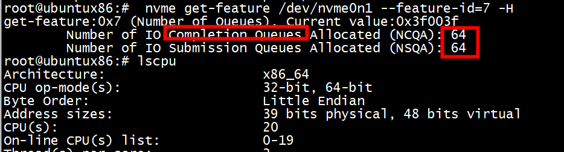

 
# interrupt
cpu个数： 254   
```
lscpu
Architecture:                       x86_64
CPU op-mode(s):                     32-bit, 64-bit
Byte Order:                         Little Endian
Address sizes:                      43 bits physical, 48 bits virtual
CPU(s):                             256
On-line CPU(s) list:                0-254
Off-line CPU(s) list:               255
```
首先，我们来看一下nvme总共用的中断数。     

```
root@centos6:/home/centos6# cat /proc/interrupts |grep nvme |wc -l
516
```
该系统上一共4块盘，254个核，就有1016个中断，一个核对应一个队列，一个中断号。按道理IOqueue有254个，adminqueue也需要用中断，那么中断数应该是255*4=1020才对。

```
cat /proc/interrupts |grep -i nvme[0-3]q0|awk '{print $1,$(NF-2),$(NF-1),$NF}'
201: PCI-MSI 118489088-edge nvme1q0
203: PCI-MSI 119013376-edge nvme2q0
205: PCI-MSI 119537664-edge nvme3q0
399: PCI-MSI 117964800-edge nvme0q0
```

 
  实际上每个nvme只有128个IO队列,总共队列 128 + 1,中断数目等于4*129=516
  
  ```
 root@centos6:/home/centos6# ls /sys/class/nvme/nvme0/nvme0n1/mq/ | wc -l
128
root@centos6:/home/centos6#  cat /sys/class/nvme/nvme0/transport
pcie
root@centos6:/home/centos6# cat /sys/class/nvme/nvme0/queue_count 
129
root@centos6:/home/centos6# cat /sys/class/nvme/nvme0/address 
0000:e1:00.0
root@centos6:/home/centos6# 
  ```
# 查看队列

```
root@ubuntux86:#  nvme get-feature /dev/nvme0n1 --feature-id=7 -H
get-feature:0x7 (Number of Queues), Current value:0x3f003f
        Number of IO Completion Queues Allocated (NCQA): 64
        Number of IO Submission Queues Allocated (NSQA): 64
```


# nvme_pci_alloc_dev

```C
struct nvme_dev {
    struct nvme_queue *queues;
    unsigned int nr_allocated_queues;
    ...
}
```
1)  struct nvme_queue 抽象一个硬件队列，queues[] 数组就管理设备的所有硬件队列  
2)  nr_allocated_queues 描述 queues[] 数组的长度  

```C
static unsigned int nvme_max_io_queues(struct nvme_dev *dev)
{
        /*
         * If tags are shared with admin queue (Apple bug), then
         * make sure we only use one IO queue.
         */
        if (dev->ctrl.quirks & NVME_QUIRK_SHARED_TAGS)
                return 1;
        return num_possible_cpus() + dev->nr_write_queues + dev->nr_poll_queues;
}
```

```C
dev->nr_write_queues = write_queues;
        dev->nr_poll_queues = poll_queues;
        dev->nr_allocated_queues = nvme_max_io_queues(dev) + 1;
        dev->queues = kcalloc_node(dev->nr_allocated_queues,
                        sizeof(struct nvme_queue), GFP_KERNEL, node);

```

```
struct nvme_dev {
    struct nvme_ctrl ctrl;
    ...
}
struct nvme_ctrl {
    u32 queue_count;
    ...
}
```

# admin queue
nvme_pci_configure_admin_queue   

# IO queue
nvme_create_io_queues  

# 中断分配
内核也支持poll方式   

 nvme_create_queue --> queue_request_irq --> pci_request_irq   
 
 

# poll
```C
static unsigned int poll_queues;
module_param_cb(poll_queues, &io_queue_count_ops, &poll_queues, 0644);
MODULE_PARM_DESC(poll_queues, "Number of queues to use for polled IO.");

static int nvme_setup_io_queues(struct nvme_dev *dev)
{
	...
	dev->nr_poll_queues = poll_queues;
	...
}
```
注意事项
当只有一个IO queue时，设置poll_queues为1后，发现依然有中断。其实这是符合预取的。

```C
static int nvme_setup_irqs(struct nvme_dev *dev, unsigned int nr_io_queues)
{
	struct pci_dev *pdev = to_pci_dev(dev->dev);
	struct irq_affinity affd = {
		.pre_vectors	= 1,
		.calc_sets	= nvme_calc_irq_sets,
		.priv		= dev,
	};
	unsigned int irq_queues, poll_queues;

	/*
	 * Poll queues don't need interrupts, but we need at least one I/O queue
	 * left over for non-polled I/O.
	 */
	poll_queues = min(dev->nr_poll_queues, nr_io_queues - 1);
	dev->io_queues[HCTX_TYPE_POLL] = poll_queues;

	/*
	 * Initialize for the single interrupt case, will be updated in
	 * nvme_calc_irq_sets().
	 */
	dev->io_queues[HCTX_TYPE_DEFAULT] = 1;
	dev->io_queues[HCTX_TYPE_READ] = 0;

	/*
	 * We need interrupts for the admin queue and each non-polled I/O queue,
	 * but some Apple controllers require all queues to use the first
	 * vector.
	 */
	irq_queues = 1;
	if (!(dev->ctrl.quirks & NVME_QUIRK_SINGLE_VECTOR))
		irq_queues += (nr_io_queues - poll_queues);
	return pci_alloc_irq_vectors_affinity(pdev, 1, irq_queues,
			      PCI_IRQ_ALL_TYPES | PCI_IRQ_AFFINITY, &affd);
}
```
由上述代码可知，driver至少留一个IO queue使用interrupt而非poll。   
因此，当只有一个IOqueue时，即使driver参数设置了poll_queues为1，其实是不生效的(nvme_setup_irqs中的poll_queues变量为0)，这个唯一的IO queue使用的依然是interrupt而非poll。   
 
# spdk cpu 分配

***1) 队列深度为128，对每个设备进行512字节随机读取。***

下图显示了SPDKNVMe驱动程序在增加CPU核数量时执行I/O操作时的I/O吞吐量的性能扩展性。数据结果十分惊人，1个CPU核的每秒512字节I/O操作可达1385万。   
 
在1-4个CPU核范围内，IOPS随使用的CPU核数量的增加呈线性扩展。CPU核增加到4个以上时，IOPS逐渐接近SSD能力极限，呈非线性扩展。在8个I/O处理核的情况下，测试结果更为震撼，达8千万IOPS，平均延迟仅有25.54微秒。   
 

 
 # references
  [linux 中nvme 的中断申请及处理](https://www.cnblogs.com/10087622blog/p/8064236.html)   
 [nvme设备中断的申请与注册过程](https://blog.csdn.net/yiyeguzhou100/article/details/106171244/)  
 [nvme设备中断](https://lostjeffle.bitcron.com/post/blog/mweb/docs/16125962533978)
 [nvme_set_queue_count命令实现](https://blog.csdn.net/zhuzongpeng/article/details/127604486)   
 [nvme设备queue的创建](https://blog.csdn.net/yiyeguzhou100/article/details/105478124)
 