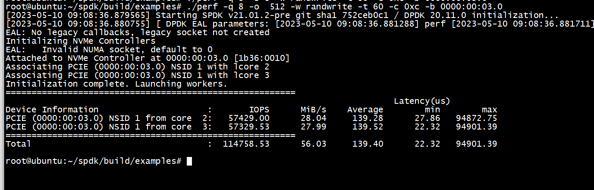
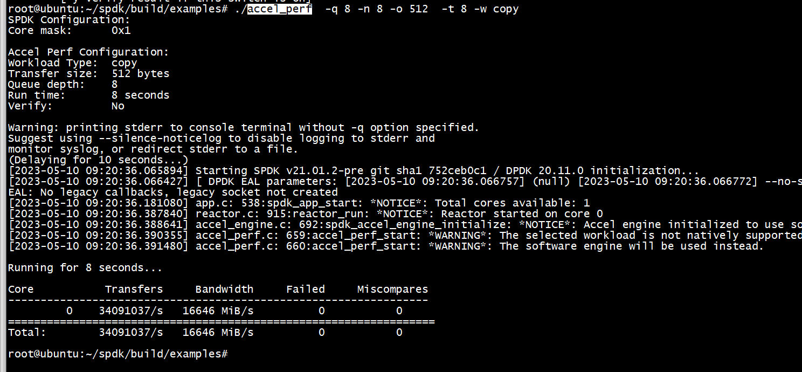

# insmod 

```
root@ubuntu:~/host# insmod  nvme_core.ko 
root@ubuntu:~/host# insmod  nvme_pci.ko 
```

```
root@ubuntu:~/host# lsblk
NAME    MAJ:MIN RM  SIZE RO TYPE MOUNTPOINT
loop0     7:0    0 91.9M  1 loop /snap/lxd/24061
loop1     7:1    0 67.8M  1 loop /snap/lxd/22753
loop2     7:2    0 53.2M  1 loop /snap/snapd/19122
loop3     7:3    0 63.3M  1 loop /snap/core20/1879
loop4     7:4    0 63.2M  1 loop /snap/core20/1634
sda       8:0    0 22.2G  0 disk 
├─sda1    8:1    0 22.1G  0 part /
├─sda14   8:14   0    4M  0 part 
└─sda15   8:15   0  106M  0 part /boot/efi
sr0      11:0    1 1024M  0 rom  
nvme0n1 259:0    0  512M  0 disk 
```

```
root@ubuntu:~/host# lspci
00:00.0 Host bridge: Intel Corporation 440FX - 82441FX PMC [Natoma] (rev 02)
00:01.0 ISA bridge: Intel Corporation 82371SB PIIX3 ISA [Natoma/Triton II]
00:01.1 IDE interface: Intel Corporation 82371SB PIIX3 IDE [Natoma/Triton II]
00:01.3 Bridge: Intel Corporation 82371AB/EB/MB PIIX4 ACPI (rev 03)
00:02.0 VGA compatible controller: Device 1234:1111 (rev 02)
00:03.0 Non-Volatile memory controller: Red Hat, Inc. Device 0010 (rev 02)
00:04.0 Ethernet controller: Red Hat, Inc. Virtio network device
root@ubuntu:~/host# dmesg  | grep '00:03.0'
[    0.177283] pci 0000:00:03.0: [1b36:0010] type 00 class 0x010802
[    0.178184] pci 0000:00:03.0: reg 0x10: [mem 0xfebd0000-0xfebd3fff 64bit]
[  861.606025] nvme nvme0: pci function 0000:00:03.0
root@ubuntu:~/host# 
```

# spdk

```
root@ubuntu:~/spdk# uname -a
Linux ubuntu 5.4.0-1078-kvm #84-Ubuntu SMP Mon Oct 17 18:19:31 UTC 2022 x86_64 x86_64 x86_64 GNU/Linux
root@ubuntu:~/spdk# 

```

1) git clone  

``` 
git clone https://github.com/spdk/spdk.git
git checkout v21.01.x
```
子模块
```
 git submodule update --init
```

2) 安装依赖
```
cd spdk
scripts/pkgdep.sh --all
```

3） make   
```
./configure
make
```

4） setup
```
root@ubuntu:~/spdk# scripts/setup.sh
ls: cannot access '/sys/kernel/iommu_groups': No such file or directory
0000:00:03.0 (1b36 0010): no driver -> uio_pci_generic
modprobe: FATAL: Module msr not found in directory /lib/modules/5.4.0-1078-kvm
root@ubuntu:~/spdk#
```
nvme0n1和内核解绑了  
```
root@ubuntu:~/spdk# lsblk
NAME    MAJ:MIN RM  SIZE RO TYPE MOUNTPOINT
loop0     7:0    0 53.2M  1 loop /snap/snapd/19122
loop1     7:1    0 91.9M  1 loop /snap/lxd/24061
loop2     7:2    0 63.3M  1 loop /snap/core20/1879
loop3     7:3    0 67.8M  1 loop /snap/lxd/22753
loop4     7:4    0 63.2M  1 loop /snap/core20/1634
sda       8:0    0 22.2G  0 disk 
├─sda1    8:1    0 22.1G  0 part /
├─sda14   8:14   0    4M  0 part 
└─sda15   8:15   0  106M  0 part /boot/efi
sr0      11:0    1 1024M  0 rom  
root@ubuntu:~/spdk# 
```


5） 运行  
spdk/examples/nvme/hello_world/hello_world.c  
./build/examples/identify  
./build/examples/hello_world  

# hello_bdev
1) scripts/setup.sh  
2) ./scripts/gen_nvme.sh --json-with-subsystems > ./build/examples/nvme.json  
3) cd build/examples/   
  ./hello_bdev -c nvme.json -b Nvme0n1  
  
```
root@ubuntu:~/spdk/build/examples# cat  nvme.json 
{
"subsystems": [
{
"subsystem": "bdev",
"config": [
{
"method": "bdev_nvme_attach_controller",
"params": {
"trtype": "PCIe",
"name":"Nvme0",
"traddr":"0000:00:03.0"
}
}
]
}
]
}
```

#  perf

```
root@ubuntu:~/spdk# scripts/setup.sh  
ls: cannot access '/sys/kernel/iommu_groups': No such file or directory
0000:00:03.0 (1b36 0010): Already using the uio_pci_generic driver
modprobe: FATAL: Module msr not found in directory /lib/modules/5.4.0-1078-kvm
```

```
 ./perf -q 8 -o  512 -w randwrite -t 60 -c 0xc -b 0000:00:03.0
```



# accel 



# references

[spdk](https://tech.gluesys.com/blog/2022/04/19/SPDK_tutorial_1.html)