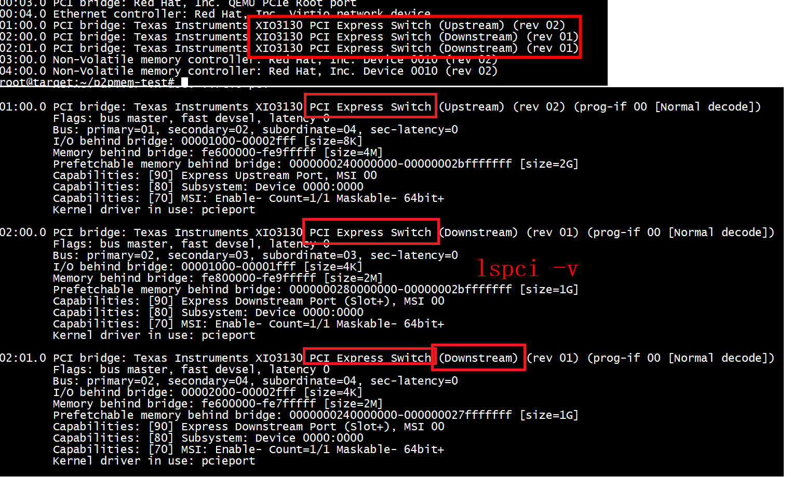

# NVMe p2pmem example

[NVMe p2pmem example](https://github.com/sbates130272/linux-p2pmem/issues/4)   

In QEMU (v6.1.0-rc2). I use the NVMe emulated device from QEMU with the following options :

```
-drive file=nvme1.qcow2,if=none,id=nvme0 -device nvme,drive=nvme0,serial=d00d0001,cmb_size_mb=1024 \
-drive file=nvme2.qcow2,if=none,id=nvme1 -device nvme,drive=nvme1,serial=d00d0002,cmb_size_mb=1024
```

```
./qemu/build/qemu-system-x86_64 -M q35 -drive file=ubuntu2104_new.qcow2,if=ide -net nic -net user,hostfwd=tcp::10022-:22 -netdev user,id=mynet0 -m 4G -smp 4 --enable-kvm -cpu host -nographic \
     -device ioh3420,id=root_port1,bus=pcie.0 \
     -device x3130-upstream,id=upstream1,bus=root_port1 \
     -device xio3130-downstream,id=downstream1,bus=upstream1,chassis=9 \
     -device xio3130-downstream,id=downstream2,bus=upstream1,chassis=10 \
     -drive file=nvme1.qcow2,if=none,id=nvme0 \
     -device nvme,drive=nvme0,serial=d00d0001,cmb_size_mb=1024,bus=downstream1 \
     -drive file=nvme2.qcow2,if=none,id=nvme1 \
     -device nvme,drive=nvme1,serial=d00d0002,cmb_size_mb=1024,bus=downstream2
```

#  linux 内核配置

```
grep CONFIG_PCI_P2PDMA .config
CONFIG_PCI_P2PDMA=y
```

# p2pmem_pci.ko


```
root@ubuntux86:# make KDIR=/work/linux-6.3.2
make -C /work/linux-6.3.2 M=$PWD modules
make[1]: Entering directory '/work/linux-6.3.2'
  CC [M]  /p2pmem-pci/p2pmem_pci.o
/p2pmem-pci/p2pmem_pci.c: In function ‘p2pmem_mmap’:
/p2pmem-pci/p2pmem_pci.c:186:16: error: assignment of read-only member ‘vm_flags’
  vma->vm_flags |= VM_MIXEDMAP;
                ^~
```
改成

```
#if 0
        vma->vm_flags |= VM_MIXEDMAP;
#else
        vm_flags_set(vma, VM_MIXEDMAP);
#endif
```


```
root@ubuntux86:# make KDIR=/work/linux-6.3.2
make -C /work/linux-6.3.2 M=$PWD modules
make[1]: Entering directory '/work/linux-6.3.2'
  CC [M]  /p2pmem-pci/p2pmem_pci.o
  MODPOST /p2pmem-pci/Module.symvers
  CC [M]  /p2pmem-pci/p2pmem_pci.mod.o
  LD [M]  /p2pmem-pci/p2pmem_pci.ko
make[1]: Leaving directory '/work/linux-6.3.2'
```

## pci unbind

```
root@target:~# echo '0000:03:00.0' > /sys/bus/pci/drivers/nvme/unbind
root@target:~# echo '0000:04:00.0' > /sys/bus/pci/drivers/nvme/unbind
root@target:~# 
```

```
root@target:~# echo -n echo '0000:03:00.0' > /sys/bus/pci/drivers/p2pmem_pci/bind 
-bash: echo: write error: No such device
```
这是因为driver不支持qemu的vendor和device，添加{ PCI_DEVICE(PCI_VENDOR_QEMU, PCI_DEV_QEMU), .driver_data = 0 },

## insmod  p2pmem_pci.ko  
```
root@target:~# insmod  p2pmem_pci.ko 
[ 2964.768518] p2pmem_pci 0000:00:03.0: unable to add p2p resource
[ 2964.818531] p2pmem_pci 0000:00:04.0: unable to add p2p resource
```
```
[ 2964.810650] PKRU: 55555554
[ 2964.810651] Call Trace:
[ 2964.810652]  <TASK>
[ 2964.810655]  add_pages+0x17/0x70
[ 2964.810659]  arch_add_memory+0x45/0x60
[ 2964.810661]  memremap_pages+0x2ff/0x6a0
[ 2964.810665]  devm_memremap_pages+0x23/0x70
[ 2964.810667]  pci_p2pdma_add_resource+0x19c/0x580
[ 2964.810671]  p2pmem_pci_probe+0x2c/0xb0 [p2pmem_pci]
[ 2964.810676]  local_pci_probe+0x48/0xb0
[ 2964.810679]  work_for_cpu_fn+0x17/0x30
[ 2964.810681]  process_one_work+0x21c/0x430
[ 2964.810683]  worker_thread+0x1fa/0x3c0
[ 2964.810684]  ? __pfx_worker_thread+0x10/0x10
[ 2964.810685]  kthread+0xee/0x120
[ 2964.810688]  ? __pfx_kthread+0x10/0x10
[ 2964.810690]  ret_from_fork+0x29/0x50
[ 2964.810694]  </TASK>
[ 2964.810695] ---[ end trace 0000000000000000 ]---
[ 2964.818531] p2pmem_pci 0000:00:04.0: unable to add p2p resource
```

drivers/nvme/host/pci.c  

```

	if (pci_p2pdma_add_resource(pdev, bar, size, offset)) {
		dev_warn(dev->ctrl.device,
			 "failed to register the CMB\n");
		return;
	}
```

hmmap/hmmap_mod/nvme_mem_backend.c   
```
	if (pci_p2pdma_add_resource(pcie_info->pcie_dev, pcie_info->res_num,
				    res_size, 0)) {
		UINFO("ERROR: NVME MEM BACKEND PCI P2PDMA ADD RESOURCE\n");
		ret = -ENXIO;
		goto out_pci_put;
	}
```


```
static int p2pmem_pci_probe(struct pci_dev *pdev,
			    const struct pci_device_id *id)
{
	struct p2pmem_dev *p;
	int err = 0;

	if (pci_enable_device_mem(pdev) < 0) {
		dev_err(&pdev->dev, "unable to enable device!\n");
		goto out;
	}

	err = pci_p2pdma_add_resource(pdev, 0, 0, 0);
	if (err) {
		dev_err(&pdev->dev, "unable to add p2p resource");
		goto out_disable_device;
	}

	pci_p2pmem_publish(pdev, true);

	p = p2pmem_create(pdev);
	if (IS_ERR(p))
		goto out_disable_device;

	pci_set_drvdata(pdev, p);

	return 0;

out_disable_device:
	pci_disable_device(pdev);
out:
	return err;
}
```
从hmmap/hmmap_mod/nvme_mem_backend.c 可以看出   
上述add_pages原因是pci_p2pdma_add_resource，这是因为传入的bar number和bar  resource size有问题
通过print bars查看IORESOURCE_MEM   

```
static int
print_bars(struct pci_dev *dev)
{
        int i, iom, iop;
        unsigned long flags;
        static const char *bar_names[PCI_STD_RESOURCE_END + 1]  = {
                "BAR0",
                "BAR1",
                "BAR2",
                "BAR3",
                "BAR4",
                "BAR5",
        };

        iom = 0;
        iop = 0;

        for (i = 0; i < ARRAY_SIZE(bar_names); i++) {
                if (pci_resource_len(dev, i) != 0 &&
                                pci_resource_start(dev, i) != 0) {
                        flags = pci_resource_flags(dev, i);
                        if (flags & IORESOURCE_MEM) {
                                pr_info("****mem  %s \n", bar_names[i]);
                                iom++;
                        } else if (flags & IORESOURCE_IO) {
                                pr_info("****io %s \n", bar_names[i]);
                                iop++;
                        }
                }
        }
        return 0;

}
```


## 查看pci mem
lspci -v   


## succ


## cannot be used for peer-to-peer DMA as the client and provider (0000:00:04.0) do not share an upstream bridge or whitelie


这是没有pcie switch,qemu启动参数有问题   

```
qemu-system-x86_64 -enable-kvm -smp 6 -m 8G  -cpu host  -kernel  /work/linux-6.3.2/k_rdma/vmlinuz-6.3.2 -append "nokaslr kgdbwait console=ttyS0 root=/dev/sda1"\
       -hda  focal-server.img -drive file=nvme.img,if=none,format=raw,id=drv0 -device nvme,drive=drv0,serial=nvme-dev,,cmb_size_mb=1024\
       -drive file=nvme2.img,if=none,format=raw,id=drv2 -device nvme,drive=drv2,serial=nvme-dev2,cmb_size_mb=1024\
       -netdev tap,id=tap0,ifname=tap0,script=no,downscript=no,vhost=on  -device virtio-net-pci,netdev=tap0,mac=52:55:00:d1:55:01  -nographic \
```

# succ run 
+ qemu   
```
 qemu-system-x86_64    -enable-kvm -smp 6 -m 8G  -cpu host  -kernel  /work/linux-6.3.2/k_rdma/vmlinuz-6.3.2 -append "nokaslr kgdbwait console=ttyS0 root=/dev/sda1"\
         -hda  focal-server.img \
         -device pcie-root-port,id=root_port1,chassis=1,slot=1 \
         -device x3130-upstream,id=upstream1,bus=root_port1 \
         -device xio3130-downstream,id=downstream1,bus=upstream1,chassis=9 \
         -device xio3130-downstream,id=downstream2,bus=upstream1,chassis=10 \
         -drive file=nvme.img,if=none,id=nvme0 \
         -device nvme,drive=nvme0,serial=d00d0001,cmb_size_mb=1024,bus=downstream1 \
         -drive file=nvme2.img,if=none,id=nvme1 \
         -device nvme,drive=nvme1,serial=d00d0002,cmb_size_mb=1024,bus=downstream2 \
         -netdev tap,id=tap0,ifname=tap0,script=no,downscript=no,vhost=on  -device virtio-net-pci,netdev=tap0,mac=52:55:00:d1:55:01  -nographic
```

+ insmod  p2pmem_pci.ko
```
insmod  p2pmem_pci.ko
root@target:~/p2pmem-test# ls /dev/p2pmem*
/dev/p2pmem0  /dev/p2pmem1
root@target:~/p2pmem-test# 
```
 
不需要unbind    
```
echo '0000:00:03.0' > /sys/bus/pci/drivers/nvme/unbind 
echo '0000:00:04.0' > /sys/bus/pci/drivers/nvme/unbind 
```
 

```
root@target:~/p2pmem-test# lspci
00:00.0 Host bridge: Intel Corporation 440FX - 82441FX PMC [Natoma] (rev 02)
00:01.0 ISA bridge: Intel Corporation 82371SB PIIX3 ISA [Natoma/Triton II]
00:01.1 IDE interface: Intel Corporation 82371SB PIIX3 IDE [Natoma/Triton II]
00:01.3 Bridge: Intel Corporation 82371AB/EB/MB PIIX4 ACPI (rev 03)
00:02.0 VGA compatible controller: Device 1234:1111 (rev 02)
00:03.0 PCI bridge: Red Hat, Inc. QEMU PCIe Root port
00:04.0 Ethernet controller: Red Hat, Inc. Virtio network device
01:00.0 PCI bridge: Texas Instruments XIO3130 PCI Express Switch (Upstream) (rev 02)
02:00.0 PCI bridge: Texas Instruments XIO3130 PCI Express Switch (Downstream) (rev 01)
02:01.0 PCI bridge: Texas Instruments XIO3130 PCI Express Switch (Downstream) (rev 01)
03:00.0 Non-Volatile memory controller: Red Hat, Inc. Device 0010 (rev 02)
04:00.0 Non-Volatile memory controller: Red Hat, Inc. Device 0010 (rev 02)
root@target:~/p2pmem-test# 
```


```
./p2pmem-test /dev/nvme0n1 /dev/nvme1n1 /dev/p2pmem0 -c 1 -s 4k --check 
```


#  CMB

[NVME CMB原理和常规使用方案详解](https://blog.csdn.net/weixin_43778179/article/details/134145730)    

`CMB用来存储nvme的CQ 和SQ，这样CQ 和SQ可以不要存储在host memory上`   

+ 1 ***CMB 控制器内存buffer (controller memory buffer)***
一些高级的NVME SSD控制器内部有自己的内存，可以把它映射到用户内存空间。和使用spdk_memory_alloc从系统内存分配的内存相比，这样能少做一次DMA拷贝。

P2PDMA 在 NVMe 驱动程序中可用，但只有具有 CMB 的设备才能作为 DMA 源或目标。NVMe 设备是目前唯一支持作为 DMA 主设备的系统。    

在NVMe SSD Controller 中有两个寄存器CMBLOC和CMBSZ是描述CMB的基本信息。在主机中可以使用NVMe-cli工具查看寄存器信息（nvme show-regs /dev/nvme0n1 -H）。   


#  pci_p2pdma_setup

   

+ a nvme_map_cmb  --> pci_p2pdma_add_resource   
+ b nvme_map_cmb  --> pci_p2pmem_publish(pdev, true)    

`pci_p2pdma_add_resource主要做了如下事情`：   

1、如果没有创建 p2pdma结构，则创建之。  

2、remap 对应pci设备需要暴露的p2p device 内存。  

3、关联remap后的内核态虚拟地址和pci bus地址的对应管理，主要是gen_pool_add_owner函数,他记录gen_pool中对应的bus地址和内核态虚拟地址的对应关系。   

`pci_p2pdma_setup`设置pdev->p2pdma:  
rcu_assign_pointer(pdev->p2pdma, p2p);   

# devm_memremap_pages

```
[ 2964.810655]  add_pages+0x17/0x70
[ 2964.810659]  arch_add_memory+0x45/0x60
[ 2964.810661]  memremap_pages+0x2ff/0x6a0
[ 2964.810665]  devm_memremap_pages+0x23/0x70
[ 2964.810667]  pci_p2pdma_add_resource+0x19c/0x580
[ 2964.810671]  p2pmem_pci_probe+0x2c/0xb0 [p2pmem_pci]
[ 2964.810676]  local_pci_probe+0x48/0xb0
[ 2964.810679]  work_for_cpu_fn+0x17/0x30
```

```
[   26.107902]  vmemmap_populate+0x20/0x34
[   26.111726]  __populate_section_memmap+0x1a4/0x1d8
[   26.116506]  sparse_add_section+0x138/0x1f4
[   26.120678]  __add_pages+0xd8/0x180
[   26.124155]  pagemap_range+0x324/0x41c
[   26.127893]  memremap_pages+0x184/0x2b4
[   26.131717]  devm_memremap_pages+0x30/0x7c
[   26.135802]  svm_migrate_init+0xd8/0x18c [amdgpu]
[   26.140993]  kgd2kfd_device_init+0x39c/0x5e0 [amdgpu]
[   26.146525]  amdgpu_amdkfd_device_init+0x13c/0x1d4 [amdgpu]
[   26.152576]  amdgpu_device_ip_init+0x53c/0x588 [amdgpu]
[   26.158276]  amdgpu_device_init+0x828/0xc60 [amdgpu]
[   26.163714]  amdgpu_driver_load_kms+0x28/0x1a0 [amdgpu]
[   26.169412]  amdgpu_pci_probe+0x1b0/0x420 [amdgpu]
[   26.174675]  local_pci_probe+0x48/0xa0
[   26.178416]  work_for_cpu_fn+0x24/0x40
[   26.178418]  process_one_work+0x1ec/0x470
[   26.178420]  worker_thread+0x200/0x410
[   26.178422]  kthread+0xec/0x100
[   26.178424]  ret_from_fork+0x10/0x20
```

#  pci_alloc_p2pmem

采用gen_pool_alloc_algo_owner进行分配   
genalloc 是 linux 内核提供的通用内存分配器，源码位于 lib/genalloc.c。这个分配器为独立于内核以外的内存块提供分配方法，采用的是最先适配原则，android 最新的 ION 内存管理器对 ION_HEAP_TYPE_CARVEOUT 类型的内存就是采用的这个分配器。    

```
        addr = devm_memremap_pages(&pdev->dev, pgmap);
        if (IS_ERR(addr)) {
                error = PTR_ERR(addr);
                goto pgmap_free;
        }

        p2pdma = rcu_dereference_protected(pdev->p2pdma, 1);
        error = gen_pool_add_owner(p2pdma->pool, (unsigned long)addr,
                        pci_bus_address(pdev, bar) + offset,
                        range_len(&pgmap->range), dev_to_node(&pdev->dev),
                        &pgmap->ref);
```

#  O_DIRECT  


# references

[NVMeDirect is a user-space I/O framework for NVMe SSD](https://github.com/nvmedirect/nvmedirect)   
[nvme-strom](https://github.com/enfiskutensykkel/nvme-strom/blob/c75422b881e76c7e48b9d43f4121d7bbd2632a83/utils/nvme_stat.c)   