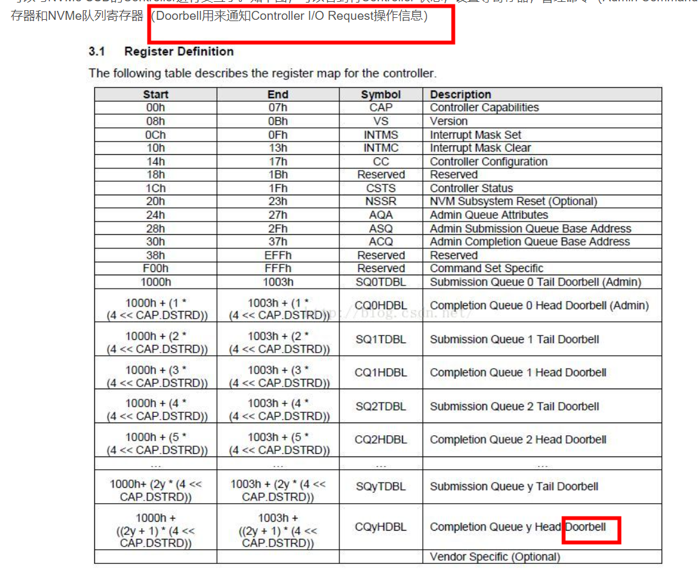

# NVMe 驱动如何使用BAR空间

[NVMe 驱动如何使用BAR空间](https://blog.csdn.net/Memblaze_2011/article/details/52766905)  

```
struct nvme_bar {
        __u64                   cap;    /* Controller Capabilities */
        __u32                   vs;     /* Version */
        __u32                   intms;  /* Interrupt Mask Set */
        __u32                   intmc;  /* Interrupt Mask Clear */
        __u32                   cc;     /* Controller Configuration */
        __u32                   rsvd1;  /* Reserved */
        __u32                   csts;   /* Controller Status */
        __u32                   rsvd2;  /* Reserved */
        __u32                   aqa;    /* Admin Queue Attributes */
        __u64                   asq;    /* Admin SQ Base Address */
        __u64                   acq;    /* Admin CQ Base Address */
};
```
 
 
#  将SQ/CQ内存地址写入寄存器


[Linux NVMe Driver学习笔记之5：Admin SQ/CQ的创建](https://mp.weixin.qq.com/s?__biz=MzIwNTUxNDgwNg==&mid=2247485095&idx=1&sn=186bf26fb6f179aad69d36666287718a&chksm=972ef7fea0597ee82958bda5234422b87235faedca22276fa0385b2787895330065574fa085f&scene=21#wechat_redirect)


```
static struct nvme_queue *nvme_alloc_queue(struct nvme_dev *dev, int qid,

							int depth)

{

	struct nvme_queue *nvmeq = kzalloc(sizeof(*nvmeq), GFP_KERNEL);
	nvmeq->cqes = dma_zalloc_coherent(dev->dev, CQ_SIZE(depth),

					  &nvmeq->cq_dma_addr, GFP_KERNEL);
	if (nvme_alloc_sq_cmds(dev, nvmeq, qid, depth))

		goto free_cqdma;
```

+ 1 首先，调用dma_zalloc_coherent为completion queue分配内存以供DMA使用。nvmeq->cqes为申请到的内存的虚拟地址，供内核使用。而nvmeq->cq_dma_addr就是这块内存的物理地址，供DMA控制器使用。   

  

+ 2 接着，调用nvme_alloc_sq_cmds来处理submission queue，假如nvme版本是1.2或者以上的，并且cmb支持submission queue，那就使用cmb。否则的话，和completion queue一样使用dma_alloc_coherent来分配内存。   

+ 3 nvme_alloc_queue分配NVMe queue后，就要将nvme admin queue的属性以及已经分配的admin SQ/CQ内存地址写入寄存器。   
```
writel(aqa, dev->bar + NVME_REG_AQA);

lo_hi_writeq(nvmeq->sq_dma_addr, dev->bar + NVME_REG_ASQ);

lo_hi_writeq(nvmeq->cq_dma_addr, dev->bar + NVME_REG_ACQ);
```


 
# 写 Submission Queue doorbell

[NVMe驱动解析-响应I/O请求](https://blog.csdn.net/Memblaze_2011/article/details/52767226)   

BIO封装成的Command会顺序存入Submission Queue中。如下，对于Submission Queue来说，使用Tail表示最后操作的Command Index（nvmeq->sq_tail）。每存入一个Command，Host就会更新Queue对应的Doorbell寄存器中的Tail值。Doorbell定义在BAR空间，通过QID可以索引到（参见附录）。NVMe没有规定Command存入队列的执行顺序，Controller可以一次取出多个Command进行批量处理，所以一个队列中的Command执行顺序是不固定的（可能导致先提交的请求后处理）。
 
 
 ```
 
         result = nvme_map_bio(nvmeq, iod, bio, dma_dir, psegs);
         if (result <= 0)
                 goto free_cmdid;
         length = result;
 
         cmnd->rw.command_id = cmdid;
         cmnd->rw.nsid = cpu_to_le32(ns->ns_id);
         length = nvme_setup_prps(nvmeq->dev, &cmnd->common, iod, length,
                                                                 GFP_ATOMIC);
         cmnd->rw.slba = cpu_to_le64(nvme_block_nr(ns, bio->bi_sector));
         cmnd->rw.length = cpu_to_le16((length >> ns->lba_shift) - 1);
         cmnd->rw.control = cpu_to_le16(control);
         cmnd->rw.dsmgmt = cpu_to_le32(dsmgmt);
 
         if (++nvmeq->sq_tail == nvmeq->q_depth)
                 nvmeq->sq_tail = 0;
         writel(nvmeq->sq_tail, nvmeq->q_db);
 ```
 # 写 Completion Queue doorbell  
 
 [NVMe驱动解析-响应I/O请求](https://blog.csdn.net/Memblaze_2011/article/details/52767226)   
 
 处理完Command后，往Completion Queue的Doorbell写入Head值，通知NVMe Controller操作完成。
 ```

 static irqreturn_t nvme_process_cq(struct nvme_queue *nvmeq)
 {
         u16 head, phase;
 
         head = nvmeq->cq_head;
         phase = nvmeq->cq_phase;
 
         for (;;) {
                 void *ctx;
                 nvme_completion_fn fn;
                 struct nvme_completion cqe = nvmeq->cqes[head];
                 if ((le16_to_cpu(cqe.status) & 1) != phase)
                         break;
                 nvmeq->sq_head = le16_to_cpu(cqe.sq_head);
                 if (++head == nvmeq->q_depth) {
                         head = 0;
                         phase = !phase;
                 }
 
                 ctx = free_cmdid(nvmeq, cqe.command_id, &fn);
                 fn(nvmeq->dev, ctx, &cqe);
         }
 
         /* If the controller ignores the cq head doorbell and continuously
          * writes to the queue, it is theoretically possible to wrap around
          * the queue twice and mistakenly return IRQ_NONE.  Linux only
          * requires that 0.1% of your interrupts are handled, so this isn't
          * a big problem.
          */
         if (head == nvmeq->cq_head && phase == nvmeq->cq_phase)
                 return IRQ_NONE;
 
         writel(head, nvmeq->q_db + (1 << nvmeq->dev->db_stride));
         nvmeq->cq_head = head;
         nvmeq->cq_phase = phase;
 
         return IRQ_HANDLED;
 }

 ```