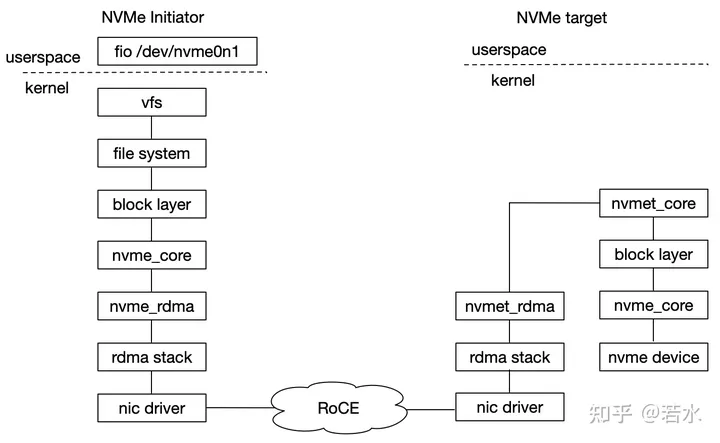
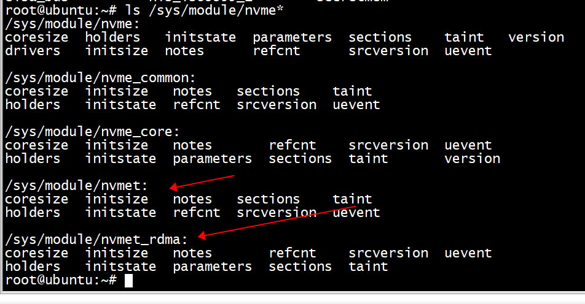
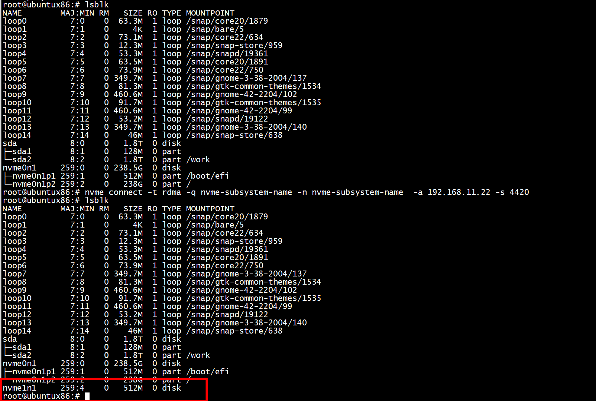

#  nvme_rdma 
NVMe over RoCE 调用关系如下图所示，内核 nvme_rdma 模块相当于胶水层，连接 rdma stack 和 nvme core接口，即 NVMe 队列接口可以对接 RDMA 队列接口，进而调用下层 rdma stack 中 verbs 传输接口。   



# target 

模块依赖
```
modprobe nvmet
modprobe nvmet-rdma
modprobe nvme-rdma
```


## 问题一
```
root@ubuntu:~# mkdir -p /sys/kernel/config/nvmet
mkdir: cannot create directory ‘/sys/kernel/config/nvmet’: Operation not permitted
```


没有 modprobe nvmet 

## 问题二

```
ln: failed to create symbolic link '/sys/kernel/config/nvmet/ports/800/subsystems/data_8': Invalid argument
```

```
linux-6.3.2/drivers/nvme$ find ./ -name nvmet-rdma.ko
./target/nvmet-rdma.ko
```

没有加载nvmet-rdma.ko 
```
root@ubuntu:~# insmod  nvmet-rdma.ko 
root@ubuntu:~# dmesg -T| grep "enabling port"
[Tue Jun  6 10:47:09 2023] nvmet_rdma: enabling port 1 (192.168.11.22:4420)
root@ubuntu:~# 
```  


```
ln -s /sys/kernel/config/nvmet/subsystems/nvme-subsystem-name /sys/kernel/config/nvmet/ports/1/subsystems/nvme-sube
[  614.057745] ib_core: exports duplicate symbol __ib_alloc_cq (owned by kernel)
[  614.067359] nvmet: transport type 1 not supported
ln: failed to create symbolic link '/sys/kernel/config/nvmet/ports/1/subsystems/nvme-subsystem-name': Invalid argument
```

1)  加载模块   
```
modprobe nvmet
modprobe nvmet-rdma
modprobe nvme-rdma (target 不需要)
```

```
root@ubuntu:~# insmod  nvmet-rdma.ko 
root@ubuntu:~# lsmod | grep nvme
nvmet_rdma             40960  0
nvmet                 180224  1 nvmet_rdma
nvme                   61440  0
nvme_core             192512  2 nvmet,nvme
nvme_common            28672  2 nvmet,nvme_core
root@ubuntu:~# 
```



2)  target  
```
root@ubuntu:~# rdma link add rxe_eth0 type rxe netdev ens4
root@ubuntu:/sys/kernel/config# modprobe nvmet
root@ubuntu:/sys/kernel/config# modprobe nvmet-rdma
root@ubuntu:/sys/kernel/config# modprobe nvme-rdma
root@ubuntu:/sys/kernel/config# mkdir /sys/kernel/config/nvmet/subsystems/nvme-subsystem-name -p
root@ubuntu:/sys/kernel/config# 
```
 
```
# NVMe target configuration
# Assuming the following:
# IP is 192.168.11.22/24
# link is up
# using ib device eth2
# modprobe nvme and rdma module

modprobe nvmet
modprobe nvmet-rdma
modprobe nvme-rdma

# 1、config nvme subsystem
mkdir /sys/kernel/config/nvmet/subsystems/nvme-subsystem-name
cd /sys/kernel/config/nvmet/subsystems/nvme-subsystem-name

# 2、allow any host to be connected to this target
echo 1 > attr_allow_any_host

# 3、create a namesapce，example: nsid=10
mkdir namespaces/10
cd namespaces/10

# 4、set the path to the NVMe device
echo -n /dev/nvme0n1> device_path
echo 1 > enable

# 5、create the following dir with an NVMe port
mkdir /sys/kernel/config/nvmet/ports/1
cd /sys/kernel/config/nvmet/ports/1

# 6、set ip address to traddr
echo "192.168.11.22" > addr_traddr

# 7、set rdma as a transport type，addr_trsvcid is unique.
echo rdma > addr_trtype
echo 4420 > addr_trsvcid

# 8、set ipv4 as the Address family
echo ipv4 > addr_adrfam

# 9、create a soft link
ln -s /sys/kernel/config/nvmet/subsystems/nvme-subsystem-name /sys/kernel/config/nvmet/ports/1/subsystems/nvme-subsystem-name

# 10、Check dmesg to make sure that the NVMe target is listening on the port
dmesg -T| grep "enabling port"
[369910.403503] nvmet_rdma: enabling port 1 (192.168.11.22:4420)
```
 
3) host


```
rdma link add rxe_eth0 type rxe netdev br0
# 探测 192.168.11.22 机器上 4420 端口 nvme ssd
nvme discover -t rdma -q nvme-subsystem-name -a 192.168.11.22 -s 4420

# 连接 192.168.11.22 4420 端口 nvme ssd
nvme connect -t rdma -q nvme-subsystem-name -n nvme-subsystem-name  -a 192.168.11.22 -s 4420

# 与target 端 nvme ssd 断开连接
nvme disconnect -n nvme-subsystem-name
```




# capsule_size

```
static int nvme_rdma_alloc_qe(struct ib_device *ibdev, struct nvme_rdma_qe *qe,
		size_t capsule_size, enum dma_data_direction dir)
{
	qe->data = kzalloc(capsule_size, GFP_KERNEL);
	if (!qe->data)
		return -ENOMEM;

	qe->dma = ib_dma_map_single(ibdev, qe->data, capsule_size, dir);
	if (ib_dma_mapping_error(ibdev, qe->dma)) {
		kfree(qe->data);
		qe->data = NULL;
		return -ENOMEM;
	}

	return 0;
}
```

```
static int nvme_rdma_post_send(struct nvme_rdma_queue *queue,
		struct nvme_rdma_qe *qe, struct ib_sge *sge, u32 num_sge,
		struct ib_send_wr *first)
{
	struct ib_send_wr wr;
	int ret;

	sge->addr   = qe->dma;
	sge->length = sizeof(struct nvme_command);
	sge->lkey   = queue->device->pd->local_dma_lkey;

	wr.next       = NULL;
	wr.wr_cqe     = &qe->cqe;
	wr.sg_list    = sge;
	wr.num_sge    = num_sge;
	wr.opcode     = IB_WR_SEND;
	wr.send_flags = IB_SEND_SIGNALED;

	if (first)
		first->next = &wr;
	else
		first = &wr;

	ret = ib_post_send(queue->qp, first, NULL);
	if (unlikely(ret)) {
		dev_err(queue->ctrl->ctrl.device,
			     "%s failed with error code %d\n", __func__, ret);
	}
	return ret;
}

static int nvme_rdma_post_recv(struct nvme_rdma_queue *queue,
		struct nvme_rdma_qe *qe)
{
	struct ib_recv_wr wr;
	struct ib_sge list;
	int ret;

	list.addr   = qe->dma;
	list.length = sizeof(struct nvme_completion);
	list.lkey   = queue->device->pd->local_dma_lkey;

	qe->cqe.done = nvme_rdma_recv_done;

	wr.next     = NULL;
	wr.wr_cqe   = &qe->cqe;
	wr.sg_list  = &list;
	wr.num_sge  = 1;

	ret = ib_post_recv(queue->qp, &wr, NULL);
	if (unlikely(ret)) {
		dev_err(queue->ctrl->ctrl.device,
			"%s failed with error code %d\n", __func__, ret);
	}
	return ret;
}
```

# references

[NVMe over RoCE 初探](https://zhuanlan.zhihu.com/p/345609031)   
[NVMe-oF,nvme_cli_initiator与tgt(spdk_tgt)之Fabrics(RDMA)流程源码分析](https://cloud.tencent.com/developer/article/2302404)   
[极致优化 SSD 并行读调度](https://segmentfault.com/a/1190000044216997)   

