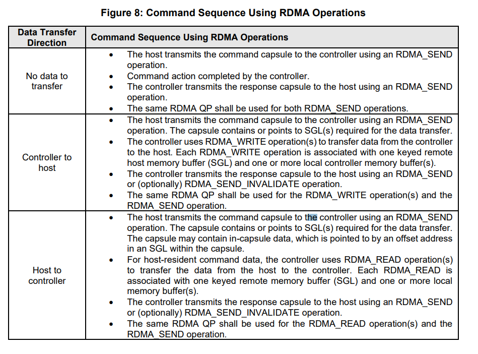
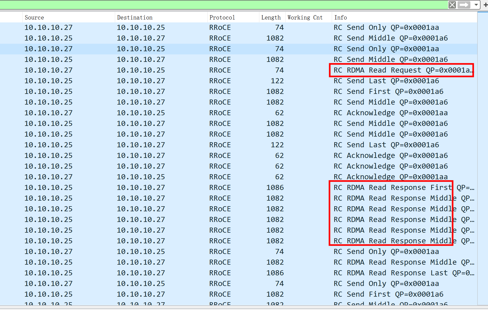
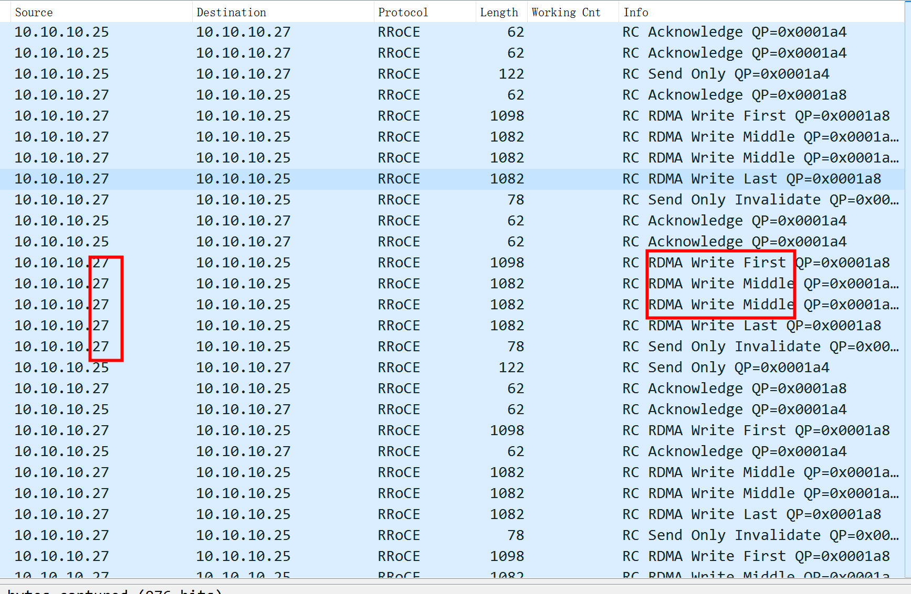

# ip

target: 10.10.10.27  
client(centos6):  10.10.10.25   

# rdma数据传输

主机和控制器之间通过RDMA_SEND或者RDMA_SEND_INVALIDATE传输Command capsules。一次RDMA_SEND操作只能携带一个命令或一个回复。
所有的RDMA_READ和RDMA_WRITE操作都只能由***控制器***发起。
``` Text
   The RDMA transport is a message-based transport that uses capsules for data transfer as defined in the
Capsules and Data Transfer section of the NVMe Base Specification.
Capsule exchanges are performed using the RDMA_SEND or RDMA_SEND_INVALIDATE operations.
The RDMA Transport at the host uses RDMA_SEND to transmit command capsules. The RDMA
Transport at the controller uses RDMA_SEND or RDMA_SEND_INVALIDATE to transmit response
capsules and optionally invalidate a host memory key. An RDMA_SEND operation contains at most one
command or response capsule.
     All RDMA_READ and RDMA_WRITE operations are initiated by the controller. Data transfers from a
controller to a host are performed using the RDMA_WRITE operation. Data transfers from a host buffer to
a controller buffer are performed using the RDMA_READ operation. Data for an I/O command may also be
exchanged from the host to the controller using a single RDMA_SEND operation that contains the
command capsule and in-capsule data within the RDMA_SEND operation’s message payload.
    Host Memory Buffer Addresses are communicated in the command’s SGL entries. Host Memory Buffer
Addresses are represented as the combination of a memory key, offset, and length. The host is responsible
for allocating the memory buffers, registering the keys, and constructing the SGL entries with the associated
Host Memory Buffer Address.
   To ensure proper command data to command completion ordering, all RDMA_WRITE data transfer
operations for a command shall be submitted onto the same RDMA QP prior to submitting the associated
response capsule onto the same RDMA QP.
    The detailed flow of the command sequences using RDMA operations is shown in Figure 8. 
```

# fio write


```
root@centos6:/home/nvme-rdma/data# fio -name=fiotest -filename=test.txt -iodepth=128 -thread -rw=randwrite -ioengine=io_uring -sqthread_poll=1 -direct=1 -bs=4k -size=4M -numjobs=1 -runtime=600 -group_reporting
fiotest: (g=0): rw=randwrite, bs=(R) 4096B-4096B, (W) 4096B-4096B, (T) 4096B-4096B, ioengine=io_uring, iodepth=128
fio-3.16
Starting 1 thread
fiotest: Laying out IO file (1 file / 4MiB)

fiotest: (groupid=0, jobs=1): err= 0: pid=1003190: Wed Sep 27 17:05:58 2023
  write: IOPS=25.6k, BW=100MiB/s (105MB/s)(4096KiB/40msec); 0 zone resets
    clat (usec): min=137, max=27485, avg=4875.18, stdev=8206.33
     lat (usec): min=137, max=27485, avg=4875.62, stdev=8206.31
    clat percentiles (usec):
```

## (RC) - RDMA READ
+ target向client发起了 Opcode: Reliable Connection (RC) - RDMA READ Request 操作   
+ client 产生 Reliable Connection (RC) - RDMA READ Response 操作   


# fio read
```
root@centos6:/home/nvme-rdma/data# fio -name=fiotest -filename=test.txt -iodepth=128 -thread -rw=randread -ioengine=io_uring -sqthread_poll=1 -direct=1 -bs=4k -size=4M -numjobs=1 -runtime=600 -group_reporting
fiotest: (g=0): rw=randread, bs=(R) 4096B-4096B, (W) 4096B-4096B, (T) 4096B-4096B, ioengine=io_uring, iodepth=128
fio-3.16
Starting 1 thread

fiotest: (groupid=0, jobs=1): err= 0: pid=1005644: Wed Sep 27 17:08:41 2023
  read: IOPS=114k, BW=444MiB/s (466MB/s)(4096KiB/9msec)
    clat (usec): min=320, max=2002, avg=1089.95, stdev=246.90
     lat (usec): min=321, max=2002, avg=1090.22, stdev=246.88
    clat percentiles (usec):
```
## (RC) - RDMA WRITE First 
target产生了Reliable Connection (RC) - RDMA WRITE First 操作   


# references
[NVMe RDMA协议阅读](https://blog.csdn.net/mavismavis/article/details/121743189)