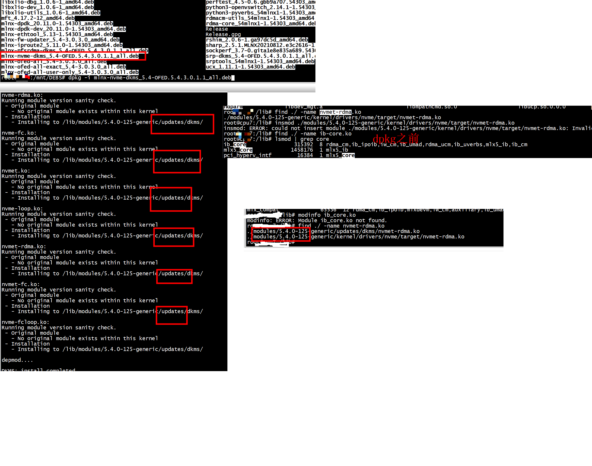
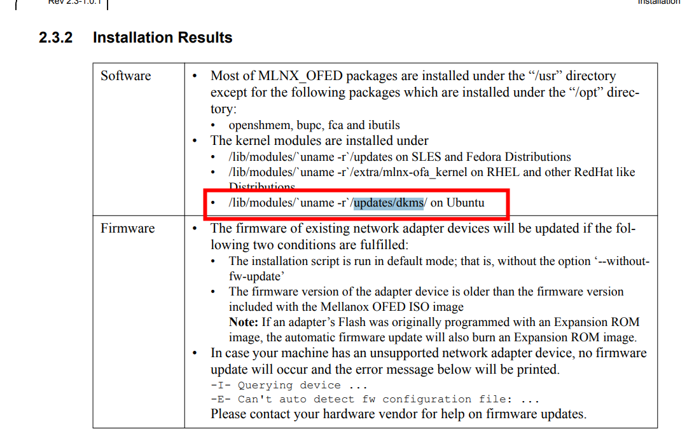
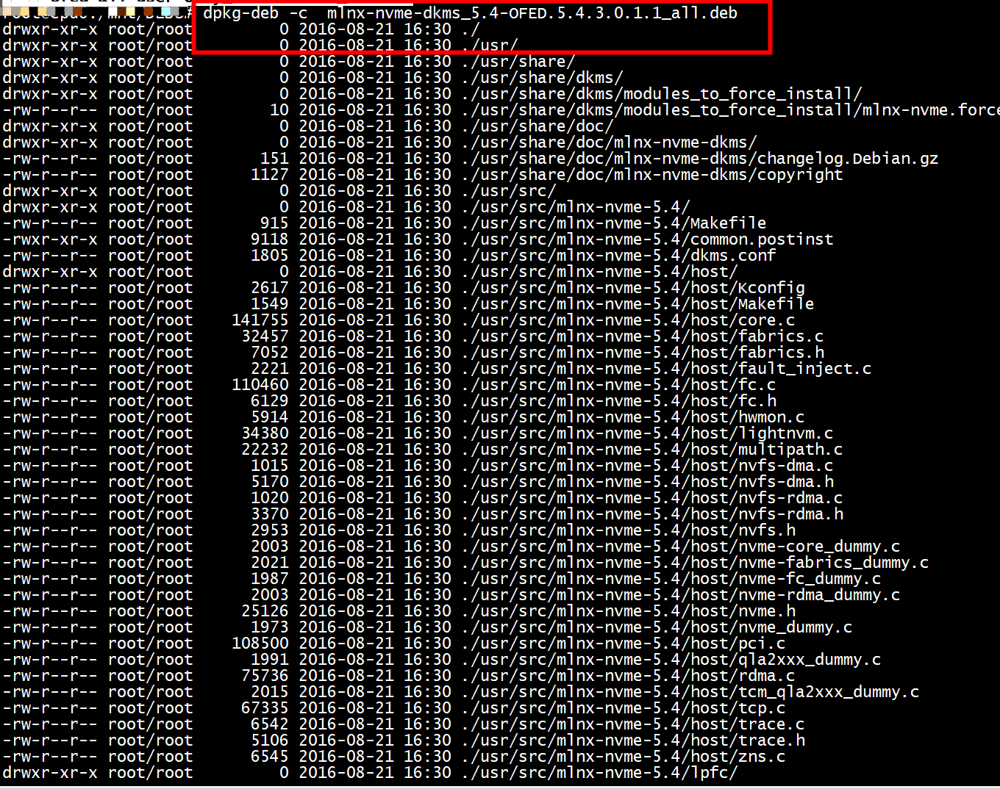
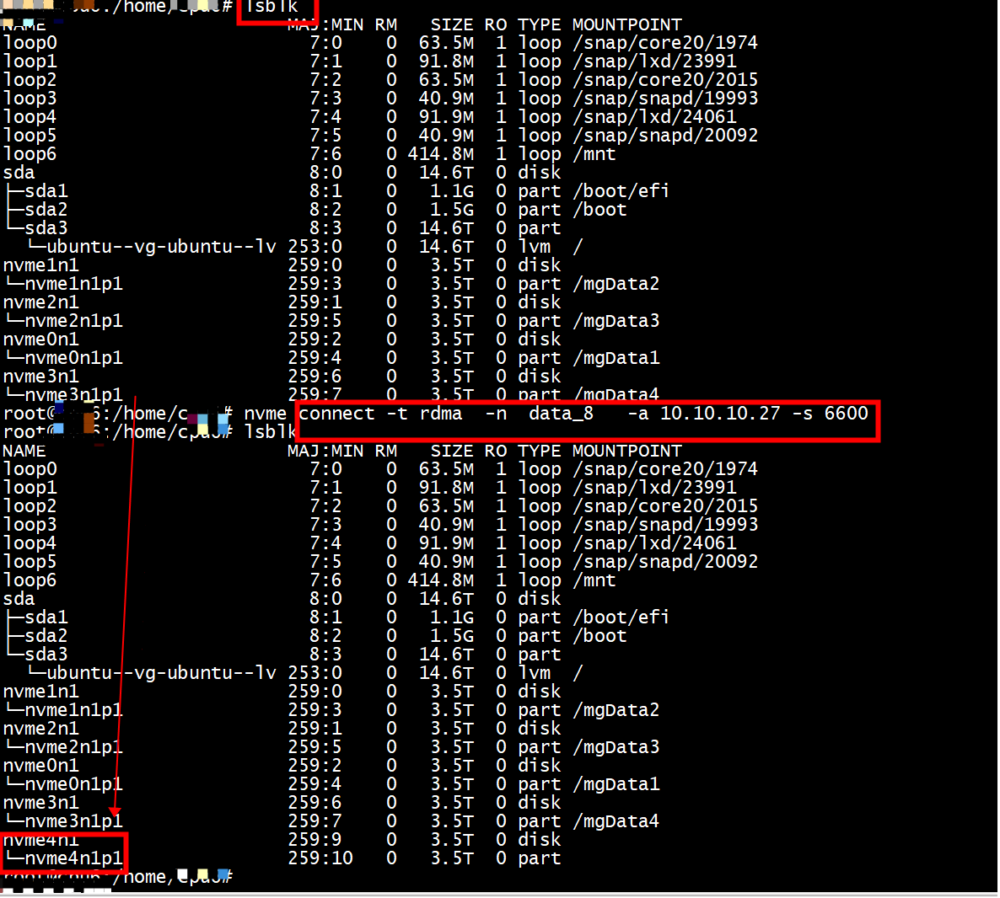
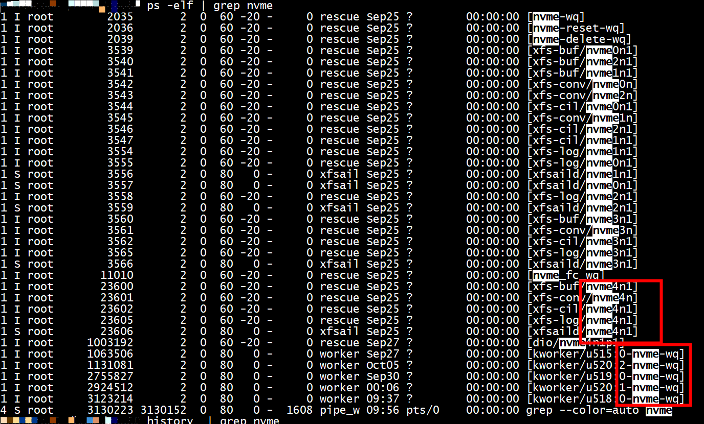
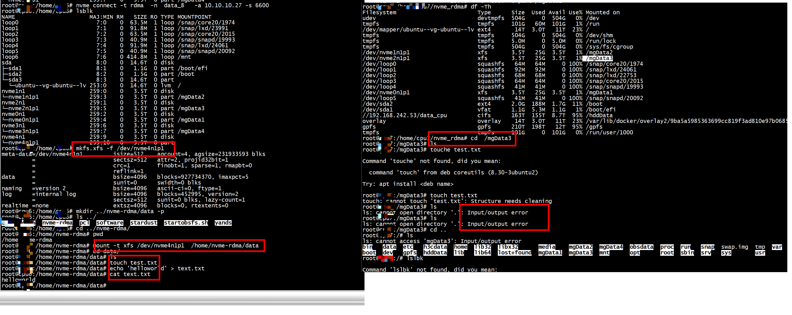

#  disagrees about version of symbol

```
[22294662.417980] nvmet_rdma: Unknown symbol ib_register_client (err -22)
[22294662.418000] nvmet_rdma: disagrees about version of symbol rdma_create_qp
[22294662.418001] nvmet_rdma: Unknown symbol rdma_create_qp (err -22)
[22294662.418023] nvmet_rdma: disagrees about version of symbol rdma_rw_ctx_wrs
[22294662.418024] nvmet_rdma: Unknown symbol rdma_rw_ctx_wrs (err -22)
[22294662.418053] nvmet_rdma: disagrees about version of symbol rdma_notify
[22294662.418054] nvmet_rdma: Unknown symbol rdma_notify (err -22)
[22294662.418069] nvmet_rdma: disagrees about version of symbol rdma_set_afonly
[22294662.418070] nvmet_rdma: Unknown symbol rdma_set_afonly (err -22)
[22294662.418090] nvmet_rdma: disagrees about version of symbol rdma_listen
[22294662.418091] nvmet_rdma: Unknown symbol rdma_listen (err -22)
[22294662.418106] nvmet_rdma: disagrees about version of symbol rdma_destroy_qp
[22294662.418107] nvmet_rdma: Unknown symbol rdma_destroy_qp (err -22)
[22294662.418128] nvmet_rdma: disagrees about version of symbol __ib_alloc_cq_user
[22294662.418129] nvmet_rdma: Unknown symbol __ib_alloc_cq_user (err -22)
[22294662.418154] nvmet_rdma: disagrees about version of symbol ib_destroy_qp_user
[22294662.418155] nvmet_rdma: Unknown symbol ib_destroy_qp_user (err -22)
[22294662.418173] nvmet_rdma: disagrees about version of symbol __rdma_accept
[22294662.418175] nvmet_rdma: Unknown symbol __rdma_accept (err -22)
[22294662.418241] nvmet_rdma: Unknown symbol ib_create_srq (err -2)
[22294662.418265] nvmet_rdma: disagrees about version of symbol ib_wc_status_msg
[22294662.418266] nvmet_rdma: Unknown symbol ib_wc_status_msg (err -22)
[22294662.418292] nvmet_rdma: disagrees about version of symbol rdma_destroy_id
[22294662.418293] nvmet_rdma: Unknown symbol rdma_destroy_id (err -22)
[22294662.418311] nvmet_rdma: disagrees about version of symbol __rdma_create_id
[22294662.418312] nvmet_rdma: Unknown symbol __rdma_create_id (err -22)
[22294662.418336] nvmet_rdma: disagrees about version of symbol ib_drain_qp
[22294662.418337] nvmet_rdma: Unknown symbol ib_drain_qp (err -22)
[22294662.418359] nvmet_rdma: disagrees about version of symbol ib_dealloc_pd_user
[22294662.418360] nvmet_rdma: Unknown symbol ib_dealloc_pd_user (err -22)
[22294662.418397] nvmet_rdma: disagrees about version of symbol rdma_rw_ctx_init
[22294662.418398] nvmet_rdma: Unknown symbol rdma_rw_ctx_init (err -22)
```


```
root@centos7:/home/centos7# modprobe nvme-rdma -v
insmod /lib/modules/5.4.0-125-generic/kernel/drivers/nvme/host/nvme-rdma.ko 
modprobe: ERROR: could not insert 'nvme_rdma': Invalid argument
root@centos7:/home/centos7# 
```
## host os
```
uname -a
Linux centos7 5.4.0-125-generic #141-Ubuntu SMP Wed Aug 10 13:42:03 UTC 2022 x86_64 x86_64 x86_64 GNU/Linux
```

安装成功后的os和modinfo，采用MLNX_OFED_LINUX-5.4-3.0.3.0-ubuntu20.04-x86_64.iso(不是5.4.0-125)    


```
root@centos7:/home/centos7/nvme_rdma# ls /lib/modules
5.4.0-125-generic
root@centos7:/home/centos7/nvme_rdma# ls /lib/modules/5.4.0-125-generic/
build   kernel             modules.builtin            modules.builtin.modinfo  modules.devname  modules.symbols      vdso
extra   modules.alias      modules.builtin.alias.bin  modules.dep              modules.order    modules.symbols.bin
initrd  modules.alias.bin  modules.builtin.bin        modules.dep.bin          modules.softdep  updates
root@centos7:/home/centos7/nvme_rdma# 
```

```
root@centos7:/home/centos7/nvme_rdma# modinfo pci
filename:       /lib/modules/5.4.0-125-generic/kernel/drivers/mtd/maps/pci.ko
```

## 多个ib_core.ko
```
root@centos7:/lib# find ./ -name nvmet-rdma.ko
./modules/5.4.0-125-generic/kernel/drivers/nvme/target/nvmet-rdma.ko
root@centos7:/lib# insmod ./modules/5.4.0-125-generic/kernel/drivers/nvme/target/nvmet-rdma.ko
insmod: ERROR: could not insert module ./modules/5.4.0-125-generic/kernel/drivers/nvme/target/nvmet-rdma.ko: Invalid parameters
root@centos7:/lib# find ./ -name ib-core.ko
root@centos7:/lib# lsmod | grep core
ib_core               315392  8 rdma_cm,ib_ipoib,iw_cm,ib_umad,rdma_ucm,ib_uverbs,mlx5_ib,ib_cm
mlx5_core            1458176  1 mlx5_ib
pci_hyperv_intf        16384  1 mlx5_core
mlxdevm               172032  1 mlx5_core
auxiliary              16384  2 mlx5_ib,mlx5_core
tls                    73728  1 mlx5_core
mlxfw                  32768  1 mlx5_core
nvme_core              98304  8 nvme,nvme_fabrics
psample                20480  1 mlx5_core
mlx_compat             65536  12 rdma_cm,ib_ipoib,mlxdevm,iw_cm,auxiliary,ib_umad,ib_core,rdma_ucm,ib_uverbs,mlx5_ib,ib_cm,mlx5_core
root@centos7:/lib# find ./ -name ib_core.ko
./modules/5.4.0-125-generic/updates/dkms/ib_core.ko
./modules/5.4.0-125-generic/kernel/drivers/infiniband/core/ib_core.ko
root@centos7:/lib# ls ./modules/5.4.0-125-generic/updates/dkms
auxiliary.ko  ib_core.ko   ib_iser.ko   ib_srp.ko   ib_uverbs.ko  knem.ko       mlx5_ib.ko     mlxdevm.ko  mst_pciconf.ko  rdma_cm.ko   scsi_transport_srp.ko
ib_cm.ko      ib_ipoib.ko  ib_isert.ko  ib_umad.ko  iw_cm.ko      mlx5_core.ko  mlx_compat.ko  mlxfw.ko    mst_pci.ko      rdma_ucm.ko
root@centos7:/lib# 
```
多个ib_core.ko,使用的是哪个目录的   
```
 modinfo ib_core
filename:       /lib/modules/5.4.0-125-generic/updates/dkms/ib_core.ko
alias:          rdma-netlink-subsys-4
license:        Dual BSD/GPL
description:    core kernel InfiniBand API
author:         Roland Dreier
alias:          net-pf-16-proto-20
alias:          rdma-netlink-subsys-5
srcversion:     432C64B04C8CCBB013B0B2E
depends:        mlx_compat
```


## updates/dkms



###  dpkg -i mlnx-nvme-dkms_5.4-OFED.5.4.3.0.1.1_all.deb
dpkg -i mlnx-nvme-dkms_5.4-OFED.5.4.3.0.1.1_all.deb之前   
```
root@centos7:/lib# ls ./modules/5.4.0-125-generic/updates/dkms
auxiliary.ko  ib_core.ko   ib_iser.ko   ib_srp.ko   ib_uverbs.ko  knem.ko       mlx5_ib.ko     mlxdevm.ko  mst_pciconf.ko  rdma_cm.ko   scsi_transport_srp.ko
ib_cm.ko      ib_ipoib.ko  ib_isert.ko  ib_umad.ko  iw_cm.ko      mlx5_core.ko  mlx_compat.ko  mlxfw.ko    mst_pci.ko      rdma_ucm.ko
```
ib_core.ko 被使用了

```
 modinfo ib_core
filename:       /lib/modules/5.4.0-125-generic/updates/dkms/ib_core.ko
alias:          rdma-netlink-subsys-4
license:        Dual BSD/GPL
description:    core kernel InfiniBand API
author:         Roland Dreier
alias:          net-pf-16-proto-20
alias:          rdma-netlink-subsys-5
srcversion:     432C64B04C8CCBB013B0B2E
depends:        mlx_compat
```

```
root@centos7:/lib# modinfo mlx5_core
filename:       /lib/modules/5.4.0-125-generic/updates/dkms/mlx5_core.ko
alias:          auxiliary:mlx5_core.eth-rep
alias:          auxiliary:mlx5_core.eth
```

```
root@centos7:/lib# dkms status
iser, 5.4, 5.4.0-125-generic, x86_64: installed
isert, 5.4, 5.4.0-125-generic, x86_64: installed
kernel-mft-dkms, 4.17.2, 5.4.0-125-generic, x86_64: installed
knem, 1.1.4.90mlnx1, 5.4.0-125-generic, x86_64: installed
mlnx-ofed-kernel, 5.4, 5.4.0-125-generic, x86_64: installed
srp, 5.4, 5.4.0-125-generic, x86_64: installed
root@centos7:/lib# 
```
####  LNX_OFED_LINUX

```
root@centos7:/home/centos7# mount -o ro,loop MLNX_OFED_LINUX-5.4-3.0.3.0-ubuntu20.04-x86_64.iso /mnt
root@centos7:/home/centos7#
```


```
root@centos7:/mnt/DEBS# ls
```
dpkg -i mlnx-nvme-dkms_5.4-OFED.5.4.3.0.1.1_all.deb之后   


```
root@centos7:/lib# ls ./modules/5.4.0-125-generic/updates/dkms/
auxiliary.ko  ib_iser.ko   ib_uverbs.ko  mlx5_ib.ko     mst_pciconf.ko   nvme-fc.ko      nvme-rdma.ko   rdma_cm.ko
ib_cm.ko      ib_isert.ko  iw_cm.ko      mlx_compat.ko  mst_pci.ko       nvme-fcloop.ko  nvmet-fc.ko    rdma_ucm.ko
ib_core.ko    ib_srp.ko    knem.ko       mlxdevm.ko     nvme-core.ko     nvme.ko         nvmet.ko       scsi_transport_srp.ko
ib_ipoib.ko   ib_umad.ko   mlx5_core.ko  mlxfw.ko       nvme-fabrics.ko  nvme-loop.ko    nvmet-rdma.ko
```
增加了nvmet-fc.ko、nvmet.ko、 nvmet-rdma.ko,nvme.ko、nvme-core.ko


####  dkms status
dpkg -i mlnx-nvme-dkms_5.4-OFED.5.4.3.0.1.1_all.deb之前  
```
root@centos7:/lib# dkms status
iser, 5.4, 5.4.0-125-generic, x86_64: installed
isert, 5.4, 5.4.0-125-generic, x86_64: installed
kernel-mft-dkms, 4.17.2, 5.4.0-125-generic, x86_64: installed
knem, 1.1.4.90mlnx1, 5.4.0-125-generic, x86_64: installed
mlnx-ofed-kernel, 5.4, 5.4.0-125-generic, x86_64: installed
srp, 5.4, 5.4.0-125-generic, x86_64: installed
```
dpkg -i mlnx-nvme-dkms_5.4-OFED.5.4.3.0.1.1_all.deb之后  

```
root@centos7:/lib/modules/5.4.0-125-generic/updates/dkms# dkms status
iser, 5.4, 5.4.0-125-generic, x86_64: installed
isert, 5.4, 5.4.0-125-generic, x86_64: installed
kernel-mft-dkms, 4.17.2, 5.4.0-125-generic, x86_64: installed
knem, 1.1.4.90mlnx1, 5.4.0-125-generic, x86_64: installed
mlnx-nvme, 5.4, 5.4.0-125-generic, x86_64: installed
mlnx-ofed-kernel, 5.4, 5.4.0-125-generic, x86_64: installed
srp, 5.4, 5.4.0-125-generic, x86_64: installed
root@centos7:/lib/modules/5.4.0-125-generic/updates/dkms# 
```
增加了mlnx-nvme   

# ofed_info

```
ofed_info -s
MLNX_OFED_LINUX-5.4-3.0.3.0
ofed_info -l
```

# 问题二 
modprobe nvme-rdma.ko   
```
[  174.187100] Initializing XFRM netlink socket
[  175.198353] cgroup: cgroup: disabling cgroup2 socket matching due to net_prio or net_cls activation
[  677.297928] nvme_fabrics: Unknown symbol nvme_host_path_error (err -2)
[  677.298015] nvme_fabrics: disagrees about version of symbol __nvme_submit_sync_cmd
[  677.298017] nvme_fabrics: Unknown symbol __nvme_submit_sync_cmd (err -22)
[  830.055874] nvme_fabrics: Unknown symbol nvme_host_path_error (err -2)
[  830.055962] nvme_fabrics: disagrees about version of symbol __nvme_submit_sync_cmd
[  830.055964] nvme_fabrics: Unknown symbol __nvme_submit_sync_cmd (err -22)
[  927.937624] nvme_fabrics: Unknown symbol nvme_host_path_error (err -2)
[  927.937710] nvme_fabrics: disagrees about version of symbol __nvme_submit_sync_cmd
[  927.937711] nvme_fabrics: Unknown symbol __nvme_submit_sync_cmd (err -22
```
采用  MLNX_OFED_LINUX-5.4-3.0.3.0-ubuntu20.04-x86_64.iso  
host os   
```
root@centos6:/mnt/DEBS# uname -a
Linux centos6 5.4.0-163-generic #180-Ubuntu SMP Tue Sep 5 13:21:23 UTC 2023 x86_64 x86_64 x86_64 GNU/Linux
root@centos6:/mnt/DEBS# 
root@centos6:/home/centos6# ls /lib/modules/5.4.0-163-generic/updates/dkms/
auxiliary.ko  ib_iser.ko   ib_uverbs.ko  mlx5_ib.ko     mst_pciconf.ko   nvme-fc.ko      nvme-rdma.ko   rdma_cm.ko
ib_cm.ko      ib_isert.ko  iw_cm.ko      mlx_compat.ko  mst_pci.ko       nvme-fcloop.ko  nvmet-fc.ko    rdma_ucm.ko
ib_core.ko    ib_srp.ko    knem.ko       mlxdevm.ko     nvme-core.ko     nvme.ko         nvmet.ko       scsi_transport_srp.ko
ib_ipoib.ko   ib_umad.ko   mlx5_core.ko  mlxfw.ko       nvme-fabrics.ko  nvme-loop.ko    nvmet-rdma.ko
```

```
root@centos6:/home/centos6# modinfo nvme
filename:       /lib/modules/5.4.0-163-generic/updates/dkms/nvme.ko
root@centos6:/home/centos6# modinfo nvme-core
filename:       /lib/modules/5.4.0-163-generic/updates/dkms/nvme-core.ko
version:        1.0
```

```
root@centos6:/lib/modules/5.4.0-163-generic/updates/dkms# ls
auxiliary.ko  ib_iser.ko   ib_uverbs.ko  mlx5_ib.ko     mst_pciconf.ko   nvme-fc.ko      nvme-rdma.ko   rdma_cm.ko
ib_cm.ko      ib_isert.ko  iw_cm.ko      mlx_compat.ko  mst_pci.ko       nvme-fcloop.ko  nvmet-fc.ko    rdma_ucm.ko
ib_core.ko    ib_srp.ko    knem.ko       mlxdevm.ko     nvme-core.ko     nvme.ko         nvmet.ko       scsi_transport_srp.ko
ib_ipoib.ko   ib_umad.ko   mlx5_core.ko  mlxfw.ko       nvme-fabrics.ko  nvme-loop.ko    nvmet-rdma.ko
root@centos6:/lib/modules/5.4.0-163-generic/updates/dkms# insmod   nvme-fabrics.ko
root@centos6:/lib/modules/5.4.0-163-generic/updates/dkms# insmod  nvme-fc.ko
root@centos6:/lib/modules/5.4.0-163-generic/updates/dkms# insmod nvme-rdma.ko
root@centos6:/lib/modules/5.4.0-163-generic/updates/dkms# 
```
dpkg-deb -c  mlnx-nvme-dkms_5.4-OFED.5.4.3.0.1.1_all.deb  包含的内容    

# 总结

1）dpkg -i mlnx-nvme-dkms_5.4-OFED.5.4.3.0.1.1_all.deb    
2）update-initramfs -u(一定要)     
3）reboot      

#  dracut


```
rpm -qa --filesbypkg | grep nvme-rdma.ko
dracut --add-drivers "mlx5_core mlxfw mlx_compat" -f /boot/initramfs-`uname -r`.img  `uname -r` 
```

```
root@centos6:/home/centos6# update-initramfs -u
update-initramfs: Generating /boot/initrd.img-5.4.0-163-generic
W: Possible missing firmware /lib/firmware/ast_dp501_fw.bin for module ast
```
#  nvme over rdma 测试

## target 
模块   
```
[Mon Sep 25 10:29:46 2023] nvmet_rdma: enabling port 800 (10.10.10.27:6600)
root@cpu7:/home/cpu7/nvme_rdma# lsmod | grep nvme
nvmet_rdma             53248  1
nvmet                 106496  7 nvmet_rdma
rdma_cm               102400  2 nvmet_rdma,rdma_ucm
ib_core               315392  9 rdma_cm,ib_ipoib,nvmet_rdma,iw_cm,ib_umad,rdma_ucm,ib_uverbs,mlx5_ib,ib_cm
nvme                   49152  6 nvmet,nvmet_rdma
nvme_core              98304  7 nvme
mlx_compat             65536  16 rdma_cm,ib_ipoib,mlxdevm,nvmet,nvme,nvmet_rdma,iw_cm,nvme_core,auxiliary,ib_umad,ib_core,rdma_ucm,ib_uverbs,mlx5_ib,ib_cm,mlx5_core
root@cpu7:/home/cpu7/nvme_rdma#
```

```
root@centos7:/home/centos7/nvme_rdma# ls  /sys/kernel/config/nvmet/subsystems/data_8/namespaces/
800
root@centos7:/home/centos7/nvme_rdma# cat  /sys/kernel/config/nvmet/subsystems/data_8/namespaces/800/device_path 
/dev/nvme2n1
root@centos7:/home/centos7/nvme_rdma# cat  /sys/kernel/config/nvmet/subsystems/data_8/namespaces/800/enable 
1
root@centos7:/home/centos7/nvme_rdma# ls /sys/kernel/config/nvmet/ports/
800
root@centos7:/home/centos7/nvme_rdma# cat /sys/kernel/config/nvmet/ports/800/addr_traddr 
10.10.10.27
root@centos7:/home/centos7/nvme_rdma# cat /sys/kernel/config/nvmet/ports/800/addr_trtype 
rdma
root@centos7:/home/centos7/nvme_rdma# cat /sys/kernel/config/nvmet/ports/800/addr_trsvcid 
6600
root@centos7:/home/centos7/nvme_rdma# cat /sys/kernel/config/nvmet/ports/800/addr_adrfam
ipv4
```

```
root@centos7:/home/centos7/nvme_rdma# ln -s /sys/kernel/config/nvmet/subsystems/data_8 /sys/kernel/config/nvmet/ports/800/subsystems/data_8
ln: failed to create symbolic link '/sys/kernel/config/nvmet/ports/800/subsystems/data_8/data_8': Operation not permitted
root@centos7:/home/centos7/nvme_rdma# dmesg -T| grep "enabling port"
[Mon Sep 25 10:29:46 2023] nvmet_rdma: enabling port 800 (10.10.10.27:6600)
root@centos7:/home/centos7/nvme_rdma# ls /sys/kernel/config/nvmet/ports/800/subsystems/
data_8
root@centos7:/home/centos7/nvme_rdma# ls   /sys/kernel/config/nvmet/ports/800/subsystems/data_8 -al
lrwxrwxrwx 1 root root 0 Sep 25 10:29 /sys/kernel/config/nvmet/ports/800/subsystems/data_8 -> ../../../../nvmet/subsystems/data_8
root@centos7:/home/centos7/nvme_rdma# 
```
软连接已经存在了   

```
root@cpu7:/home/cpu7/nvme_rdma# dmesg -T| grep "enabling port"
[Mon Sep 25 10:29:46 2023] nvmet_rdma: enabling port 800 (10.10.10.27:6600)
root@cpu7:/home/cpu7/nvme_rdma# 
```

## client
模块  
```
root@centos6:/home/centos6# lsmod | grep nvme
nvme_rdma              40960  0
nvme_fc                45056  0
nvme_fabrics           24576  2 nvme_fc,nvme_rdma
rdma_cm               102400  2 nvme_rdma,rdma_ucm
ib_core               319488  9 rdma_cm,ib_ipoib,nvme_rdma,iw_cm,ib_umad,rdma_ucm,ib_uverbs,mlx5_ib,ib_cm
nvme                   49152  4
nvme_core              98304  12 nvme,nvme_fc,nvme_rdma,nvme_fabrics
mlx_compat             65536  17 rdma_cm,ib_ipoib,mlxdevm,nvme,nvme_fc,nvme_rdma,iw_cm,nvme_core,auxiliary,nvme_fabrics,ib_umad,ib_core,rdma_ucm,ib_uverbs,mlx5_ib,ib_cm,mlx5_core
```

```
root@centos6:/home/centos6# nvme discover -t rdma -q data_8  -a 10.10.10.27 -s 6600

Discovery Log Number of Records 1, Generation counter 2
=====Discovery Log Entry 0======
trtype:  rdma
adrfam:  ipv4
subtype: nvme subsystem
treq:    not specified, sq flow control disable supported
portid:  800
trsvcid: 6600
subnqn:  data_8
traddr:  10.10.10.27
rdma_prtype: not specified
rdma_qptype: connected
rdma_cms:    rdma-cm
rdma_pkey: 0x0000
```


### 问题  Failed to write to /dev/nvme-fabrics: Connection timed out
```
root@centos6:/home/centos6# nvme discover -t rdma -q data_8  -a 10.10.10.27 -s 6600
Failed to write to /dev/nvme-fabrics: Connection timed out
root@centos6:/home/centos6# ls /dev/nv
nvme0         nvme0n1p1     nvme1n1       nvme2         nvme2n1p1     nvme3n1       nvme-fabrics  
nvme0n1       nvme1         nvme1n1p1     nvme2n1       nvme3         nvme3n1p1     nvram         
root@centos6:/home/centos6# ls /dev/nvme-fabrics 
/dev/nvme-fabrics
root@centos6:/home/centos6# 
```
重新加载

```
 modprobe -r nvme_rdma
insmod  /lib/modules/5.4.0-163-generic/updates/dkms/nvme-rdma.ko
```


#### Connection timed out 问题解决

```
root@centos6:/lib/modules/5.4.0-164-generic/updates/dkms# nvme connect -t rdma -n data_8  -a 10.10.10.27 -s 6600
Failed to write to /dev/nvme-fabrics: Connection timed out
root@centos6:/lib/modules/5.4.0-164-generic/updates/dkms# nvme connect -t rdma -n data_8  -a 10.10.10.27 -s 6600
Failed to write to /dev/nvme-fabrics: Connection timed out
```
先执行nvme discover
```
root@centos6:/lib/modules/5.4.0-164-generic/updates/dkms# nvme discover -t rdma -q data_8  -a 10.10.10.27 -s 6600

Discovery Log Number of Records 1, Generation counter 2
=====Discovery Log Entry 0======
trtype:  rdma
adrfam:  ipv4
subtype: nvme subsystem
treq:    not specified, sq flow control disable supported
portid:  800
trsvcid: 6600
subnqn:  data_8
traddr:  10.10.10.27
rdma_prtype: not specified
rdma_qptype: connected
rdma_cms:    rdma-cm
rdma_pkey: 0x0000
root@centos6:/lib/modules/5.4.0-164-generic/updates/dkms# nvme connect -t rdma -n data_8  -a 10.10.10.27 -s 6600
root@centos6:/lib/modules/5.4.0-164-generic/updates/dkms# 
```

## 读写测试

```
root@centos6# cat /sys/class/nvme/nvme4/transport
rdma
root@centos6# cat /sys/class/nvme/nvme4/address 
traddr=10.10.10.27,trsvcid=6600
root@centos6# cat /sys/class/nvme/nvme4/queue_count 
64
root@centos6# 
```

```
mkfs.xfs -f /dev/nvme4n1p1
mount -t xfs /dev/nvme4n1p1  /home/nvme-rdma/data
```




# 总结

## 客户端
```
root@centos6:/lib/modules/5.4.0-164-generic/updates/dkms# insmod  nvme-fabrics.ko 
root@centos6:/lib/modules/5.4.0-164-generic/updates/dkms# insmod  nvme-fc.ko
root@centos6:/lib/modules/5.4.0-164-generic/updates/dkms# insmod nvme-rdma.ko
root@centos6:/lib/modules/5.4.0-164-generic/updates/dkms# nvme discover -t rdma -q data_8  -a 10.10.10.27 -s 6600
root@centos6:/home/centos6#   nvme connect -t rdma -n data_8  -a 10.10.10.27 -s 6600
root@centos6:/home/centos6# mount  /dev/nvme4n1p1  /home/nvme-rdma/data 
```

```
root@centos6:/home/centos6# umount /dev/nvme4n1p1
root@centos6:/home/centos6# nvme disconnect -n data_8
NQN:data_8 disconnected 1 controller(s)
root@centos6:/home/centos6# 
```

# references
[NVMeとConnectX-4](https://blog.nishi.network/2022/06/27/nvme-over-rdma-with-rocev2/)   
[OFED NVMET and NVMET-RDMA on Ubuntu symbol errors](https://forums.developer.nvidia.com/t/ofed-nvmet-and-nvmet-rdma-on-ubuntu-symbol-errors/206456)  