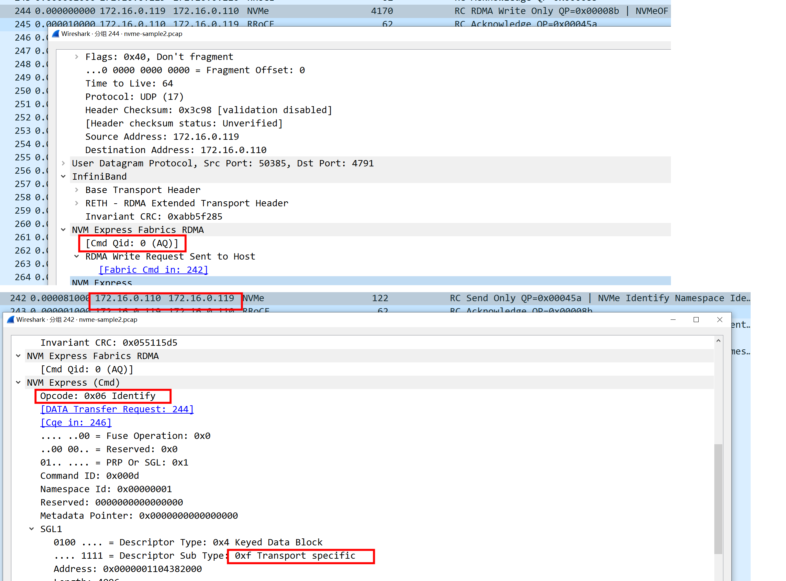
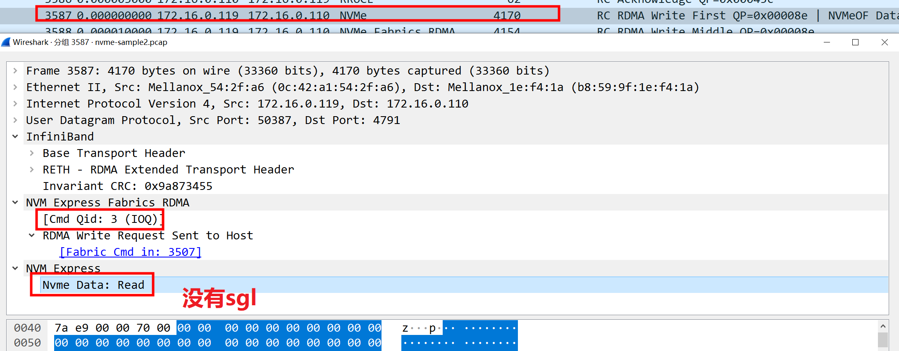

 + nvme.cmd.opc ==2 for NVMe read   
 + nvme.cmd.opc ==1 for NVMe write   
 + nvme.cmd.opc ==0x06 for Nvme Identify   
在NVMe over PCIe中，I/O命令支持SGL(Scatter Gather List 分散聚合表)和PRP(Physical Region Page 物理(内存)区域页), 而管理命令只支持PRP;而在NVMe over Fabrics中，无论是管理命令还是I/O命令都只支持SGL。NVMe over Fabrics既支持FC网络，又支持RDMA网络。众所周知，在RDMA编程中，SGL(Scatter/Gather List)是最基本的数据组织形式。 SGL是一个数组，该数组中的元素被称之为SGE(Scatter/Gather Element)，每一个SGE就是一个Data Segment(数据段)。其中，SGE的定义如下：
```
结构ibv_sge {
        uint64_t 地址；
        uint32_t 长度；
        uint32_t lkey；
};
```
# IP

target 172.16.0.119   
controller 172.16.0.110  
#  Keyed SGL Data Block descriptor
 
#  NVMe Commands and Completions
 
## host send sqe
 
  
## controller send cqe
 
 
## controller send data
 
#  admin queue
 


#  IO queue
 

# references
[NVMe Dissector: provide decoding for Set Features command, completion and transfers.](https://gitlab.com/wireshark/wireshark/-/issues/17407   )  
[https://gitlab.com/wireshark/wireshark/-/issues/13201](https://gitlab.com/wireshark/wireshark/-/issues/13201)