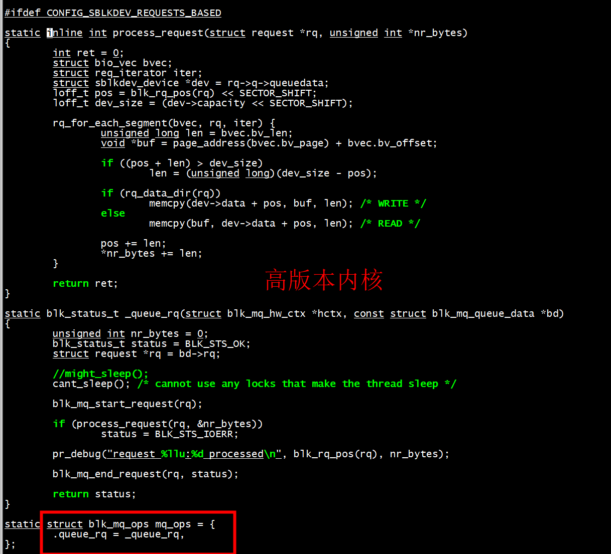
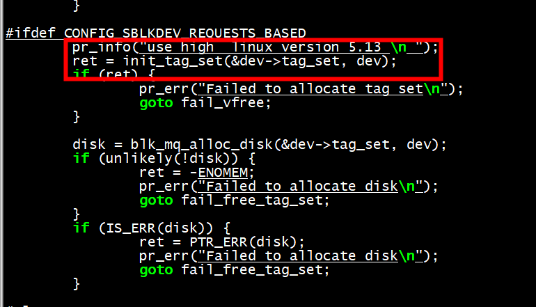
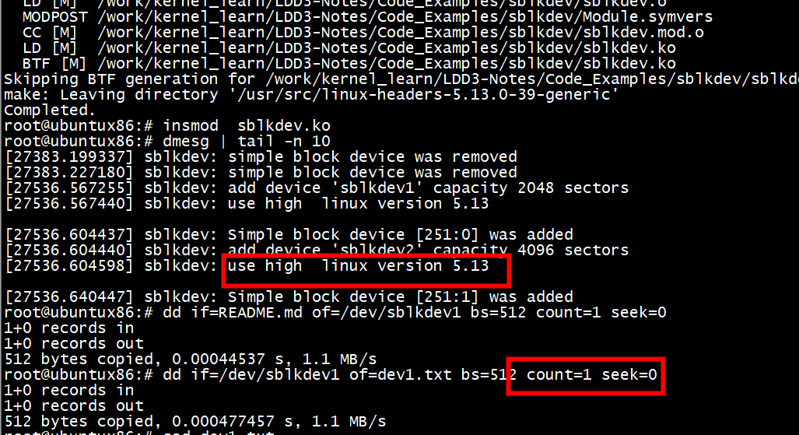

# sblkdev
Simple Block Device Linux kernel module

Contains a minimum of code to create the most primitive block device.

The Linux kernel is constantly evolving. And that's fine, but it complicates
the development of out-of-tree modules. I created this out-of-tree kernel
module to make it easier for beginners (and myself) to study the block layer.

Features:
 * Compatible with Linux kernel from 5.10 to 6.0.
 * Allows to create bio-based and request-based block devices.
 * Allows to create multiple block devices.
 * The Linux kernel code style is followed (checked by checkpatch.pl).

How to use:
* Install kernel headers and compiler
deb:
	`apt install linux-haders gcc make`
	or
	`apt install dkms`
rpm:
	yum install kernel-headers

* Compile module
	`cd ${HOME}/sblkdev; ./mk.sh build`

* Install to current system
	`cd ${HOME}/sblkdev; ./mk.sh install`

* Load module
	`modprobe sblkdev catalog="sblkdev1,2048;sblkdev2,4096"`

* Unload
	`modprobe -r sblkdev`

* Uninstall module
	`cd ${HOME}/sblkdev; ./mk.sh uninstall`

---
Feedback is welcome.

# Makefile-standalone

```
 ccflags-y += "-D CONFIG_SBLKDEV_REQUESTS_BASED"
```





# os

```Shell
root@ubuntux86:# uname -a
Linux ubuntux86 5.13.0-39-generic #44~20.04.1-Ubuntu SMP Thu Mar 24 16:43:35 UTC 2022 x86_64 x86_64 x86_64 GNU/Linux
root@ubuntux86:# 
```

# test

```
root@ubuntux86:# ./mk.sh build
Making ...
```

```
root@ubuntux86:# insmod  sblkdev.ko 
root@ubuntux86:# ls /dev/sblkdev*
/dev/sblkdev1  /dev/sblkdev2
root@ubuntux86:# 
```

dd if=/dev/zero  of=/dev/sblkdev1 bs=512 count=1 seek=0

```
root@ubuntux86:# dd if=README.md of=/dev/sblkdev1 bs=512 count=1 seek=0
1+0 records in
1+0 records out
512 bytes copied, 0.000393466 s, 1.3 MB/s
root@ubuntux86:# dd if=/dev/sblkdev1 of=dev1.txt bs=512 count=1 seek=0
1+0 records in
1+0 records out
512 bytes copied, 0.000376195 s, 1.4 MB/s
root@ubuntux86:# cat dev1.txt 
# sblkdev
Simple Block Device Linux kernel module

Contains a minimum of code to create the most primitive block device.

The Linux kernel is constantly evolving. And that's fine, but it complicates
the development of out-of-tree modules. I created this out-of-tree kernel
module to make it easier for beginners (and myself) to study the block layer.

Features:
 * Compatible with Linux kernel from 5.10 to 6.0.
 * Allows to create bio-based and request-based block devices.
 * Allows to create multiple block deroot@ubuntux86:# 
root@ubuntux86:# 
root@ubuntux86:# 
```
