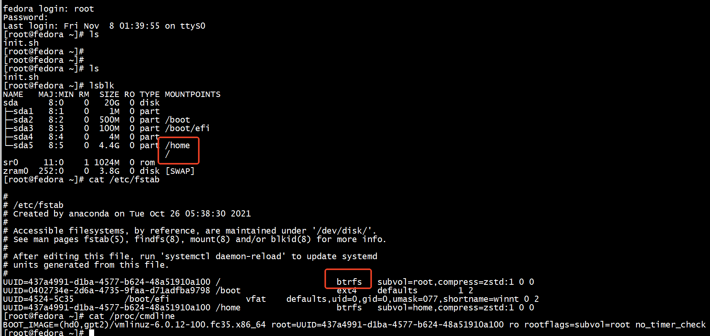
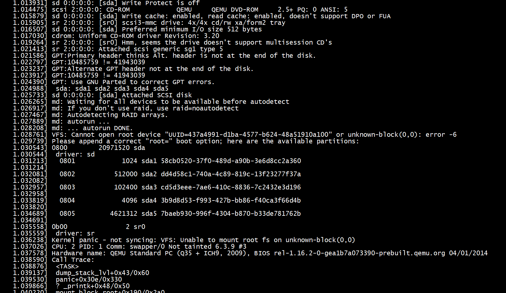
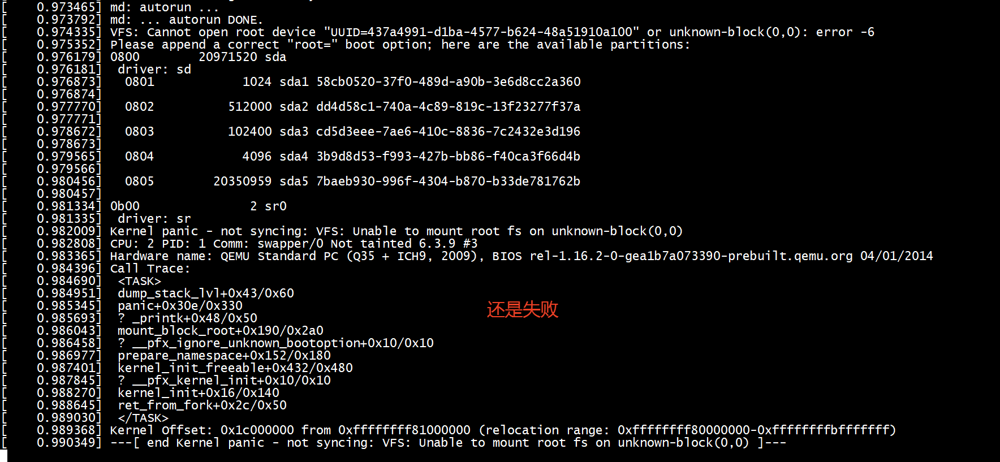
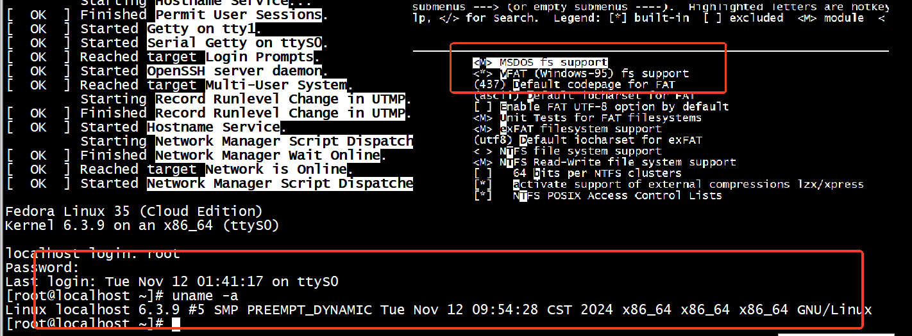
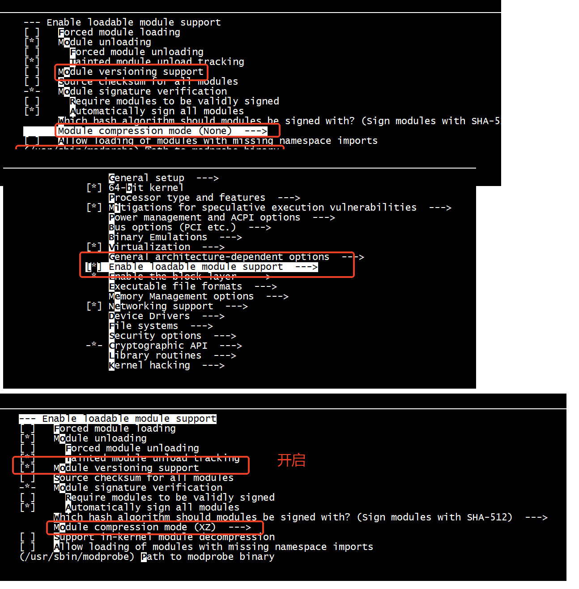
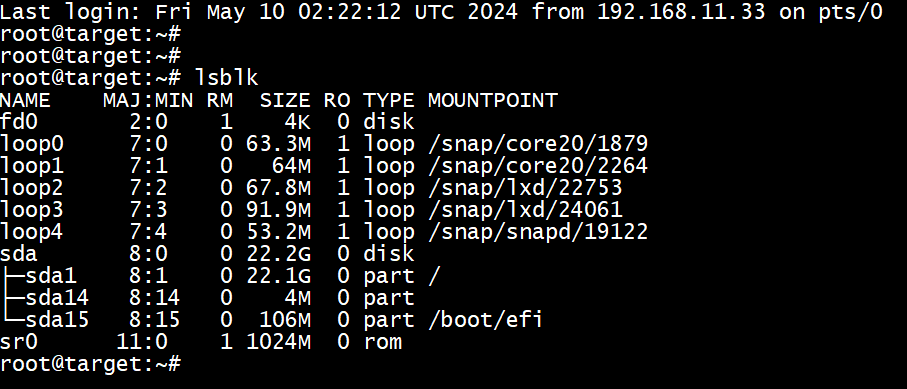

# Resize Root Filesystem in a VM
It’s possible to increase the root filesystem size of the Linux VM machine, quite easily.   

First, shut down the VM and increase the size of the qcow2 file:   
```
$ qemu-img resize disk.qcow2 60G
```
After that’s done, you can start up the VM again. Now we need to increase both the partition size, and the filesystem size. To increase the partition size, run this command from within the VM:   
```
$ sudo growpart /dev/vda 2
```
You can now grow the ext4 filesystem of the root FS while the OS is running:   
```
$ sudo resize2fs /dev/vda2
```
btrfs can be resized via   
```
$ sudo btrfs filesystem resize max /   
```
# btrfs     

  
```
[root@fedora ~]# lsblk
NAME   MAJ:MIN RM  SIZE RO TYPE MOUNTPOINTS
sda      8:0    0   20G  0 disk 
├─sda1   8:1    0    1M  0 part 
├─sda2   8:2    0  500M  0 part /boot
├─sda3   8:3    0  100M  0 part /boot/efi
├─sda4   8:4    0    4M  0 part 
└─sda5   8:5    0  4.4G  0 part /home
                                /
sr0     11:0    1 1024M  0 rom  
zram0  252:0    0  3.8G  0 disk [SWAP]
[root@fedora ~]# cat /etc/fstab 

#
# /etc/fstab
# Created by anaconda on Tue Oct 26 05:38:30 2021
#
# Accessible filesystems, by reference, are maintained under '/dev/disk/'.
# See man pages fstab(5), findfs(8), mount(8) and/or blkid(8) for more info.
#
# After editing this file, run 'systemctl daemon-reload' to update systemd
# units generated from this file.
#
UUID=437a4991-d1ba-4577-b624-48a51910a100 /                       btrfs   subvol=root,compress=zstd:1 0 0
UUID=0402734e-2d6a-4735-9faa-d71adfba9798 /boot                   ext4    defaults        1 2
UUID=4524-5C35          /boot/efi               vfat    defaults,uid=0,gid=0,umask=077,shortname=winnt 0 2
UUID=437a4991-d1ba-4577-b624-48a51910a100 /home                   btrfs   subvol=home,compress=zstd:1 0 0
[root@fedora ~]# cat /proc/cmdline 
BOOT_IMAGE=(hd0,gpt2)/vmlinuz-6.0.12-100.fc35.x86_64 root=UUID=437a4991-d1ba-4577-b624-48a51910a100 ro rootflags=subvol=root no_timer_check net.ifnames=0 console=tty1 console=ttyS0,115200n8
[root@fedora ~]# 
```


  
-append "root=UUID=437a4991-d1ba-4577-b624-48a51910a100 ro rootfstype=btrfs  rootflags=subvol=root no_timer_check net.ifnames=0 console=tty1 console=ttyS0,115200n8
"
启动失败了   


```
Command (m for help): p

Disk /dev/sda: 20 GiB, 21474836480 bytes, 41943040 sectors
Disk model: QEMU HARDDISK   
Units: sectors of 1 * 512 = 512 bytes
Sector size (logical/physical): 512 bytes / 512 bytes
I/O size (minimum/optimal): 512 bytes / 512 bytes
Disklabel type: gpt
Disk identifier: 51F3FEFD-F6F9-4C88-9423-96DCD26FD5E9

Device       Start      End Sectors  Size Type
/dev/sda1     2048     4095    2048    1M BIOS boot
/dev/sda2     4096  1028095 1024000  500M Linux filesystem
/dev/sda3  1028096  1232895  204800  100M EFI System
/dev/sda4  1232896  1241087    8192    4M PowerPC PReP boot
/dev/sda5  1241088 10483711 9242624  4.4G Linux filesystem

Command (m for help): 
```


```
[root@fedora ~]# lsblk
NAME   MAJ:MIN RM  SIZE RO TYPE MOUNTPOINTS
sda      8:0    0   20G  0 disk 
├─sda1   8:1    0    1M  0 part 
├─sda2   8:2    0  500M  0 part /boot
├─sda3   8:3    0  100M  0 part /boot/efi
├─sda4   8:4    0    4M  0 part 
└─sda5   8:5    0  4.4G  0 part /home
                                /
sr0     11:0    1 1024M  0 rom  
zram0  252:0    0  3.8G  0 disk [SWAP]
[root@fedora ~]# btrfs filesystem resize +15G /
Resize device id 1 (/dev/sda5) from 4.41GiB to 19.41GiB
ERROR: unable to resize '/': no enough free space
[root@fedora ~]# btrfs filesystem resize +10G /
Resize device id 1 (/dev/sda5) from 4.41GiB to 14.41GiB
ERROR: unable to resize '/': no enough free space
[root@fedora ~]# growpart /dev/vda 6
FAILED: /dev/vda: does not exist
[root@fedora ~]# growpart /dev/sda 6
FAILED: failed to get start and end for /dev/sda6 in /dev/sda
[root@fedora ~]# growpart /dev/sda 5
CHANGED: partition=5 start=1241088 old: size=9242624 end=10483712 new: size=40701919 end=41943007
[root@fedora ~]# btrfs filesystem resize max /
Resize device id 1 (/dev/sda5) from 4.41GiB to max
[  399.987103] BTRFS info (device sda5): resize device /dev/sda5 (devid 1) from 4732223488 to 20839378944
[root@fedora ~]# 
```
  

```
/opt/qemu-jic23/bin/qemu-system-x86_64  -kernel bzImage  -append "root=UUID=437a4991-d1ba-4577-b624-48a51910a100 ro rootfstype=btrfs  rootflags=subvol=root no_timer_check net.ifnames=0 console=
tty1 console=ttyS0,115200n8" \
         -hda  CXL-Test.qcow2   \
        -m 4G,slots=8,maxmem=8G \
        -smp 4 \
        -machine type=q35,accel=kvm,nvdimm=on,cxl=on \
        -enable-kvm \
        -netdev tap,id=tap0,ifname=tap0,script=no,downscript=no,vhost=on  -device virtio-net-pci,netdev=tap0,mac=52:55:00:d1:55:01 \
        -nographic \
        -object memory-backend-ram,size=4G,id=mem0 \
        -numa node,nodeid=0,cpus=0-3,memdev=mem0 \
        -object memory-backend-file,id=pmem0,share=on,mem-path=/tmp/cxltest.raw,size=256M \
        -object memory-backend-file,id=cxl-lsa0,share=on,mem-path=/tmp/lsa.raw,size=256M \
        -device pxb-cxl,bus_nr=12,bus=pcie.0,id=cxl.1 \
        -device cxl-rp,port=0,bus=cxl.1,id=root_port13,chassis=0,slot=2 \
        -device cxl-type3,bus=root_port13,persistent-memdev=pmem0,lsa=cxl-lsa0,id=cxl-pmem0 \
        -M cxl-fmw.0.targets.0=cxl.1,cxl-fmw.0.size=4G
```
  

```
[root@fedora ~]# blkid
/dev/sda4: PARTUUID="3b9d8d53-f993-427b-bb86-f40ca3f66d4b"
/dev/sda2: LABEL="boot" UUID="0402734e-2d6a-4735-9faa-d71adfba9798" BLOCK_SIZE="1024" TYPE="ext4" PARTUUID="dd4d58c1-740a-4c89-819c-13f23277f37a"
/dev/sda5: LABEL="fedora" UUID="437a4991-d1ba-4577-b624-48a51910a100" UUID_SUB="3fc1b71a-bcbc-4f6b-b8bf-1fda1d774e06" BLOCK_SIZE="4096" TYPE="btrfs" PARTUUID="7baeb930-996f-4304-b"
/dev/sda3: SEC_TYPE="msdos" UUID="4524-5C35" BLOCK_SIZE="512" TYPE="vfat" PARTUUID="cd5d3eee-7ae6-410c-8836-7c2432e3d196"
/dev/sda1: PARTUUID="58cb0520-37f0-489d-a90b-3e6d8cc2a360"
/dev/zram0: LABEL="zram0" UUID="525a609f-ac21-4771-8e06-a95e42ae5a3f" TYPE="swap"
[root@fedora ~]# 
```

## 问题解决

添加-initrd  选项    
```
 -initrd initrd-test/initramfs-4.18.0-305.3.1.el8.x86_64.img
```

## Failed to mount /boot/efi


```
[    4.879307] EXT4-fs (sda2): mounted filesystem 0402734e-2d6a-4735-9faa-d71adfba9798 with ordered data mode. Quota mode: none.
[    4.963072] ext4 filesystem being mounted at /boot supports timestamps until 2038 (0x7fffffff)
[  OK  ] Mounted /boot.
         Mounting /boot/efi...
[FAILED] Failed to mount /boot/efi.
```

```
[root@fedora ~]# blkid
/dev/sda4: PARTUUID="3b9d8d53-f993-427b-bb86-f40ca3f66d4b"
/dev/sda2: LABEL="boot" UUID="0402734e-2d6a-4735-9faa-d71adfba9798" BLOCK_SIZE="1024" TYPE="ext4" PARTUUID="dd4d58c1-740a-4c89-819c-13f23277f37a"
/dev/sda5: LABEL="fedora" UUID="437a4991-d1ba-4577-b624-48a51910a100" UUID_SUB="3fc1b71a-bcbc-4f6b-b8bf-1fda1d774e06" BLOCK_SIZE="4096" TYPE="btrfs" PARTUUID="7baeb930-996f-4304-b870-b33de7817"
/dev/sda3: SEC_TYPE="msdos" UUID="4524-5C35" BLOCK_SIZE="512" TYPE="vfat" PARTUUID="cd5d3eee-7ae6-410c-8836-7c2432e3d196"
/dev/sda1: PARTUUID="58cb0520-37f0-489d-a90b-3e6d8cc2a360"
/dev/zram0: LABEL="zram0" UUID="f7d8dab2-e68a-458c-b560-a0e06469fad6" TYPE="swap"
[root@fedora ~]# 
```
内核内置vfat模块，成功解决   

  

## A start job is running for /dev/zram0 (1min 5s / 1min 30s)


A start job is running for /dev/zram0 (1min 5s / 1min 30s) 这是因为，内核模块无法正常使用，出现了modprobe: FATAL: Module vfio.ko not found        


## modprobe: FATAL: Module vfio.ko not found（实际存在）

通过在内核配置中启用CONFIG_MODULE_COMPRESS选项，并选择CONFIG_MODULE_COMPRESS_XZ，然后执行make modules_install步骤，实现模块的xz压缩。
```
[root@localhost 6.3.9]# modprobe vfio.ko 
modprobe: FATAL: Module vfio.ko not found in directory /lib/modules/6.3.9
[root@localhost 6.3.9]# find "/lib/modules/$(uname -r)" -name  vfio.ko 
/lib/modules/6.3.9/kernel/drivers/vfio/vfio.ko
[root@localhost 6.3.9]# 
```
  
```
[root@localhost modules]# find ./ -name modules.dep
./5.14.10-300.fc35.x86_64/modules.dep
./6.3.9/modules.dep
[root@localhost modules]# 
```

原因是modules没有开启“Module versioning support ”  

  

```
[root@localhost ~]# find "/lib/modules/$(uname -r)" -name  vfio.ko.xz
/lib/modules/6.3.9/kernel/drivers/vfio/vfio.ko.xz
[root@localhost ~]# modprobe vfio
[  472.191648] VFIO - User Level meta-driver version: 0.3
[root@localhost ~]# lsmod | grep vfio
vfio_iommu_type1       53248  0
vfio                   57344  1 vfio_iommu_type1
[root@localhost ~]# 
```

```
/opt/qemu-jic23/bin/qemu-system-x86_64  -kernel vmlinuz-6.3.9\
        -drive file=CXL-Test.qcow2,format=qcow2,index=0,media=disk,id=hd \
        -append "root=UUID=437a4991-d1ba-4577-b624-48a51910a100 ro rootfstype=btrfs rootflags=subvol=root no_timer_check net.ifnames=0 console=tty1 console=ttyS0,115200n8 " \
        -initrd  initrd-test/initramfs-4.18.0-305.3.1.el8.x86_64.img \
        -m 4G,slots=8,maxmem=8G \
        -smp 4 \
        -machine type=q35,accel=kvm,nvdimm=on,cxl=on \
        -enable-kvm \
        -netdev tap,id=tap0,ifname=tap0,script=no,downscript=no,vhost=on  -device virtio-net-pci,netdev=tap0,mac=52:55:00:d1:55:01 \
        -nographic \
        -object memory-backend-ram,size=4G,id=mem0 \
        -numa node,nodeid=0,cpus=0-3,memdev=mem0 \
        -object memory-backend-file,id=pmem0,share=on,mem-path=/tmp/cxltest.raw,size=256M \
        -object memory-backend-file,id=cxl-lsa0,share=on,mem-path=/tmp/lsa.raw,size=256M \
        -device pxb-cxl,bus_nr=12,bus=pcie.0,id=cxl.1 \
        -device cxl-rp,port=0,bus=cxl.1,id=root_port13,chassis=0,slot=2 \
        -device cxl-type3,bus=root_port13,persistent-memdev=pmem0,lsa=cxl-lsa0,id=cxl-pmem0 \
        -M cxl-fmw.0.targets.0=cxl.1,cxl-fmw.0.size=4G
```


##  fedora     merge   /root and /home


# ext4

  
```
qemu-system-x86_64 -enable-kvm -smp 4 -m 8G  -cpu IvyBridge -kernel  /work/linux-6.3.2/k_rdma_gdb/vmlinuz-6.3.2 -append "nokaslr kgdbwait console=ttyS0 root=/dev/sda1" \
        -hda  focal-server-ovs.img    \
         -netdev tap,id=tap0,ifname=tap0,script=no,vhost=on -device virtio-net-pci,netdev=tap0,ioeventfd=on\
         -netdev tap,id=tap1,ifname=tap1,script=no,downscript=no,vhost=off  -device e1000,id=e1,netdev=tap1,mac=52:55:00:d1:55:02\
        -nographic
```

#  qemu-nbd   

```
root@ubuntux86:# qemu-img  info  Fedora-Cloud-Base-35-1.2.x86_64.raw.xz
image: Fedora-Cloud-Base-35-1.2.x86_64.raw.xz
file format: raw
virtual size: 287 MiB (300689408 bytes)
disk size: 287 MiB
root@ubuntux86:# 
```

modprobe nbd max_part=8     
```
root@ubuntux86:#  qemu-nbd --connect=/dev/nbd0 CXL-Test.qcow2 
qemu-nbd: Failed to open /dev/nbd0: No such file or directory
qemu-nbd: Disconnect client, due to: Failed to send reply: Unable to write to socket: Broken pipe
root@ubuntux86:# modprobe nbd max_part=8
root@ubuntux86:# qemu-nbd -c /dev/nbd0   CXL-Test.qcow2 
```

```
root@ubuntux86:#  fdisk /dev/nbd0

Welcome to fdisk (util-linux 2.34).
Changes will remain in memory only, until you decide to write them.
Be careful before using the write command.


Command (m for help): p
Disk /dev/nbd0: 20 GiB, 21474836480 bytes, 41943040 sectors
Units: sectors of 1 * 512 = 512 bytes
Sector size (logical/physical): 512 bytes / 512 bytes
I/O size (minimum/optimal): 512 bytes / 512 bytes
Disklabel type: gpt
Disk identifier: 51F3FEFD-F6F9-4C88-9423-96DCD26FD5E9

Device        Start      End  Sectors  Size Type
/dev/nbd0p1    2048     4095     2048    1M BIOS boot
/dev/nbd0p2    4096  1028095  1024000  500M Linux filesystem
/dev/nbd0p3 1028096  1232895   204800  100M EFI System
/dev/nbd0p4 1232896  1241087     8192    4M PowerPC PReP boot
/dev/nbd0p5 1241088 41943006 40701919 19.4G Linux filesystem

Command (m for help): 
```

```
root@ubuntux86:# mount  /dev/nbd0p5  /work/data_mnt    
root@ubuntux86:# ls /work/data_mnt/
home  root
```

```
root@ubuntux86:# umount /work/data_mnt/
root@ubuntux86:# qemu-nbd -d /dev/nbd0
/dev/nbd0 disconnected
root@ubuntux86:# 

```


```
root@ubuntux86:# qemu-nbd --connect=/dev/nbd0 CXL-Test.qcow2 
root@ubuntux86:# fdisk /dev/nbd0

Welcome to fdisk (util-linux 2.34).
Changes will remain in memory only, until you decide to write them.
Be careful before using the write command.


Command (m for help): p
Disk /dev/nbd0: 20 GiB, 21474836480 bytes, 41943040 sectors
Units: sectors of 1 * 512 = 512 bytes
Sector size (logical/physical): 512 bytes / 512 bytes
I/O size (minimum/optimal): 512 bytes / 512 bytes
Disklabel type: gpt
Disk identifier: 51F3FEFD-F6F9-4C88-9423-96DCD26FD5E9

Device        Start      End  Sectors  Size Type
/dev/nbd0p1    2048     4095     2048    1M BIOS boot
/dev/nbd0p2    4096  1028095  1024000  500M Linux filesystem
/dev/nbd0p3 1028096  1232895   204800  100M EFI System
/dev/nbd0p4 1232896  1241087     8192    4M PowerPC PReP boot
/dev/nbd0p5 1241088 41943006 40701919 19.4G Linux filesystem

Command (m for help): q

root@ubuntux86:# btrfstune -u  /dev/nbd0p5 
WARNING: it's recommended to run 'btrfs check --readonly' before this operation.
        The whole operation must finish before the filesystem can be mounted again.
        If cancelled or interrupted, run 'btrfstune -u' to restart.
We are going to change UUID, are your sure? [y/N]: y
Current fsid: 437a4991-d1ba-4577-b624-48a51910a100
New fsid: c509528d-69cc-4c73-ac5b-17ba0d168ff0
Set superblock flag CHANGING_FSID
Change fsid in extents
Change fsid on devices
Clear superblock flag CHANGING_FSID
Fsid change finished
root@ubuntux86:# 
```

```
root@ubuntux86:# mount  /dev/nbd0p2  /work/data_mnt
root@ubuntux86:# ls /work/data_mnt/
config-5.14.10-300.fc35.x86_64  efi       initramfs-5.14.10-300.fc35.x86_64.img  symvers-5.14.10-300.fc35.x86_64.gz  System.map-6.3.9.old
config-6.3.9                    extlinux  loader                                 System.map-5.14.10-300.fc35.x86_64  vmlinuz-5.14.10-300.fc35.x86_64
config-6.3.9.old                grub2     lost+found                             System.map-6.3.9                    vmlinuz-6.3.9
root@ubuntux86:# 
```

# raw and qcow2

```
qemu-img convert -O raw image-converted.qcow image-converted-from-qcow2.raw
qemu-img convert -O qcow2 original-image.raw image-converted.qcow
```

# xfs and ext4


```
root@ubuntux86:#  apt-get install jq    
./convert-qcow-image-from-xfs-to-ext4.sh  CentOS-8-4.qcow2 
```

# centos8

```
[root@localhost yum.repos.d]# cat /etc/redhat-release 
CentOS Linux release 8.4.2105
[root@localhost yum.repos.d]# 

```

```
sed -i -e 's|^mirrorlist|#mirrorlist|g' /etc/yum.repos.d/CentOS-*repo \
sed -i -e 's|^#baseurl=http://mirror|baseurl=http://vault|g' /etc/yum.repos.d/CentOS-*repo \
```