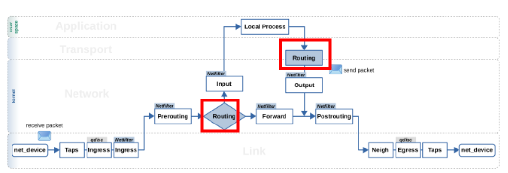
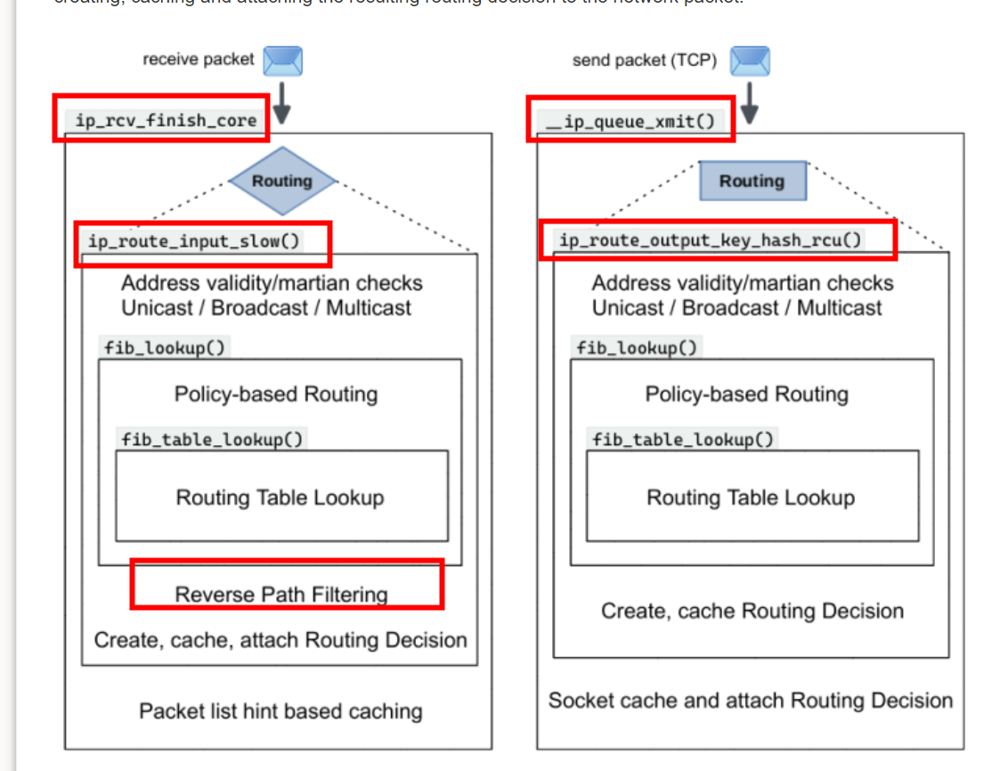

   

   


# lvs 路由查找
[IPVS系统的路由和发送](https://blog.csdn.net/sinat_20184565/article/details/102410129)   
## ip_vs_nat_xmit

__ip_vs_get_out_rt  -->   do_output_route4  -->   ip_route_output_key or( ip6_route_output)     

```
static int ip_vs_nat_xmit(struct sk_buff *skb, struct ip_vs_conn *cp)
{
    struct rtable *rt;      /* Route to the other host */
    struct iphdr  *iph;
    union ip_vs_tphdr h;
    int ihl;
    unsigned short size;
    int mtu;
    ...
    iph = skb->nh.iph;                // IP头部
    ihl = iph->ihl << 2;              // IP头部长度
    h.raw = (char*) iph + ihl;        // 传输层头部(TCP/UDP)
    size = ntohs(iph->tot_len) - ihl; // 数据长度
    ...
    // 找到真实服务器IP的路由信息
    if (!(rt = __ip_vs_get_out_rt(cp, RT_TOS(iph->tos)))) 
        goto tx_error_icmp;
    ...
    // 替换新路由信息
    dst_release(skb->dst);
    skb->dst = &rt->u.dst;
```


```
/* Get route to daddr, update *saddr, optionally bind route to saddr */
static struct rtable *do_output_route4(struct net *net, __be32 daddr,
                                       int rt_mode, __be32 *saddr)
{
        struct flowi4 fl4;
        struct rtable *rt;
        int loop = 0;

        memset(&fl4, 0, sizeof(fl4));
        fl4.daddr = daddr;
        fl4.flowi4_flags = (rt_mode & IP_VS_RT_MODE_KNOWN_NH) ?
                           FLOWI_FLAG_KNOWN_NH : 0;

retry:
        rt = ip_route_output_key(net, &fl4);
        if (IS_ERR(rt)) {
                /* Invalid saddr ? */
                if (PTR_ERR(rt) == -EINVAL && *saddr &&
                    rt_mode & IP_VS_RT_MODE_CONNECT && !loop) {
                        *saddr = 0;
                        flowi4_update_output(&fl4, 0, 0, daddr, 0);
                        goto retry;
                }
                IP_VS_DBG_RL("ip_route_output error, dest: %pI4\n", &daddr);
                return NULL;
        } else if (!*saddr && rt_mode & IP_VS_RT_MODE_CONNECT && fl4.saddr) {
                ip_rt_put(rt);
                *saddr = fl4.saddr;
                flowi4_update_output(&fl4, 0, 0, daddr, fl4.saddr);
                loop++;
                goto retry;
        }
        *saddr = fl4.saddr;
        return rt;
}
```

# infiniband
ip_route_output_key    
```
static int addr4_resolve(struct sockaddr_in *src_in,
			 struct sockaddr_in *dst_in,
			 struct rdma_dev_addr *addr)
{
	__be32 src_ip = src_in->sin_addr.s_addr;
	__be32 dst_ip = dst_in->sin_addr.s_addr;
	struct rtable *rt;
	struct flowi4 fl4;
	int ret;

	memset(&fl4, 0, sizeof(fl4));
	fl4.daddr = dst_ip;
	fl4.saddr = src_ip;
	fl4.flowi4_oif = addr->bound_dev_if;
	rt = ip_route_output_key(addr->net, &fl4);
	if (IS_ERR(rt)) {
		ret = PTR_ERR(rt);
		goto out;
	}
	src_in->sin_family = AF_INET;
	src_in->sin_addr.s_addr = fl4.saddr;

	if (rt->dst.dev->flags & IFF_LOOPBACK) {
		ret = rdma_translate_ip((struct sockaddr *)dst_in, addr, NULL);
		if (!ret)
			memcpy(addr->dst_dev_addr, addr->src_dev_addr, MAX_ADDR_LEN);
		goto put;
	}

	/* If the device does ARP internally, return 'done' */
	if (rt->dst.dev->flags & IFF_NOARP) {
		ret = rdma_copy_addr(addr, rt->dst.dev, NULL);
		goto put;
	}

	ret = dst_fetch_ha(&rt->dst, addr, &fl4.daddr);
put:
	ip_rt_put(rt);
out:
	return ret;
}

#if IS_ENABLED(CONFIG_IPV6)
static int addr6_resolve(struct sockaddr_in6 *src_in,
			 struct sockaddr_in6 *dst_in,
			 struct rdma_dev_addr *addr)
{
	struct flowi6 fl6;
	struct dst_entry *dst;
	int ret;

	memset(&fl6, 0, sizeof fl6);
	fl6.daddr = dst_in->sin6_addr;
	fl6.saddr = src_in->sin6_addr;
	fl6.flowi6_oif = addr->bound_dev_if;

	ret = ipv6_stub->ipv6_dst_lookup(addr->net, NULL, &dst, &fl6);
	if (ret < 0)
		goto put;

	if (ipv6_addr_any(&fl6.saddr)) {
		ret = ipv6_dev_get_saddr(addr->net, ip6_dst_idev(dst)->dev,
					 &fl6.daddr, 0, &fl6.saddr);
		if (ret)
			goto put;

		src_in->sin6_family = AF_INET6;
		src_in->sin6_addr = fl6.saddr;
	}

	if (dst->dev->flags & IFF_LOOPBACK) {
		ret = rdma_translate_ip((struct sockaddr *)dst_in, addr, NULL);
		if (!ret)
			memcpy(addr->dst_dev_addr, addr->src_dev_addr, MAX_ADDR_LEN);
		goto put;
	}

	/* If the device does ARP internally, return 'done' */
	if (dst->dev->flags & IFF_NOARP) {
		ret = rdma_copy_addr(addr, dst->dev, NULL);
		goto put;
	}

	ret = dst_fetch_ha(dst, addr, &fl6.daddr);
put:
	dst_release(dst);
	return ret;
}
#else
static int addr6_resolve(struct sockaddr_in6 *src_in,
			 struct sockaddr_in6 *dst_in,
			 struct rdma_dev_addr *addr)
{
	return -EADDRNOTAVAIL;
}
#endif
```

# 输入路由

```
	err = ip_route_input(skb_in, fl4_dec.daddr, fl4_dec.saddr,
				     RT_TOS(tos), rt2->dst.dev);
```


# references

[Routing Decisions in the Linux Kernel - Part 1: Lookup and packet flow](https://thermalcircle.de/doku.php?id=blog:linux:routing_decisions_in_the_linux_kernel_1_lookup_packet_flow)   
[Routing Decisions in the Linux Kernel - Part 2: Caching](https://thermalcircle.de/doku.php?id=blog:linux:routing_decisions_in_the_linux_kernel_2_caching)  