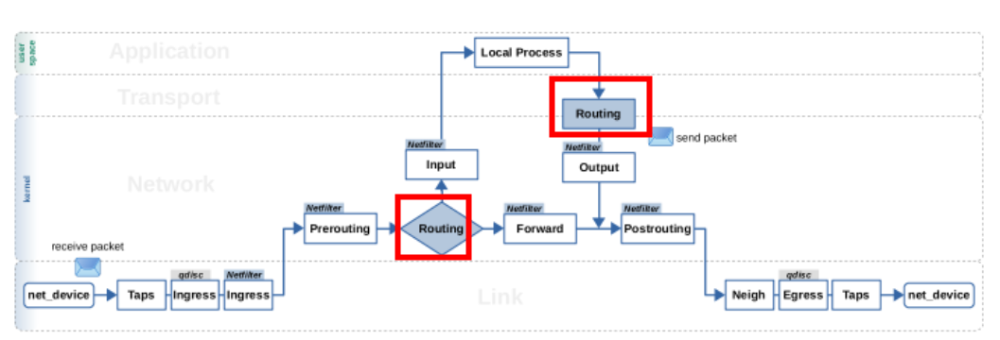
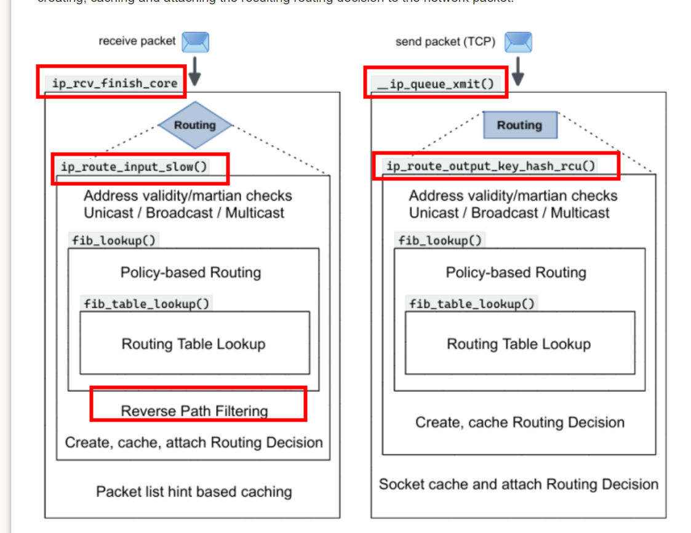

   

   
# references

[Routing Decisions in the Linux Kernel - Part 1: Lookup and packet flow](https://thermalcircle.de/doku.php?id=blog:linux:routing_decisions_in_the_linux_kernel_1_lookup_packet_flow)   
[Routing Decisions in the Linux Kernel - Part 2: Caching](https://thermalcircle.de/doku.php?id=blog:linux:routing_decisions_in_the_linux_kernel_2_caching)  