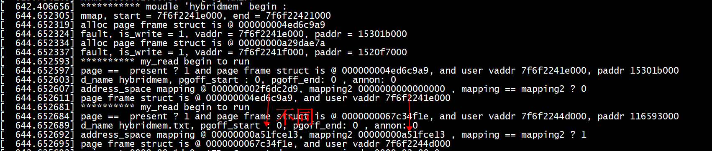
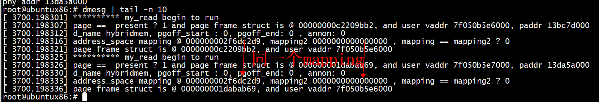

# test

设备文件准备：  
```
touch hybridmem.txt 
mknod /dev/hybridmem c 224 0  
``` 
## test1

不同的vma    
+ 1 vma1地址1 read(fd,base,64)
+ 2 vma2地址2  read(devfd,addr,64);

```
int main()
{
    int fd = open("/dev/hybridmem", O_RDWR);
    assert(fd > 0);

    int len = 3* getpagesize();
    char* base = mmap(NULL, len, PROT_READ | PROT_WRITE, MAP_SHARED, fd, 0);
    assert(base != MAP_FAILED);

    strcpy(base + 2, "helloworld");
    strcpy(base + getpagesize(), "helloworld2");

    printf("%d\n", *(base + getpagesize()+ 7));

    printf("virt addr %lx, phy addr %lx,phy addr %lx\n",(long unsigned)base, virtual_to_physical((size_t)base), mem_virt2phy(base));
    read(fd,base,64);
    //read(fd,base + getpagesize(),64);
    //printf("phy addr %lx\n", virtual_to_physical((size_t)base + getpagesize()));
    test(fd);
    munmap(base, len);
    close(fd); 
    return 0;
}
```

```
root@ubuntux86:# insmod  hybridmem_test.ko 
root@ubuntux86:# ./mmap_test 
114
virt addr 7f6f2241e000, phy addr 15301b000,phy addr 15301b000
virt addr 7f6f2244d000, phy addr 116593000
root@ubuntux86:# dmesg | tail -n 10
[  644.652593] ********** my_read begin to run 
[  644.652597] page ==  present ? 1 and page frame struct is @ 000000004ed6c9a9, and user vaddr 7f6f2241e000, paddr 15301b000 
[  644.652603] d_name hybridmem, pgoff_start : 0, pgoff_end: 0 , annon: 0 
[  644.652607] address_space mapping @ 000000002f6dc2d9, mapping2 0000000000000000 , mapping == mapping2 ? 0 
[  644.652611] page frame struct is @ 000000004ed6c9a9, and user vaddr 7f6f2241e000
[  644.652681] ********** my_read begin to run 
[  644.652684] page ==  present ? 1 and page frame struct is @ 0000000067c34f1e, and user vaddr 7f6f2244d000, paddr 116593000 
[  644.652689] d_name hybridmem.txt, pgoff_start : 0, pgoff_end: 0 , annon: 0 
[  644.652692] address_space mapping @ 00000000a51fce13, mapping2 00000000a51fce13 , mapping == mapping2 ? 1 
[  644.652695] page frame struct is @ 0000000067c34f1e, and user vaddr 7f6f2244d000
root@ubuntux86:#
```
inode->i_mapping 和page_mapping(oldpage) ：   
+ 1 /dev/hybridmem 文件，mapping == mapping2 ? 0， mapping2 等于0     
+ 2 hybridmem.txt, mapping == mapping2 ? 1 ，mapping 等于 mapping2   

  
  
## test2
同一个vma包含多个page  
+ 1 地址1 read(fd,base,64)
+ 2 地址2 read(fd,base + getpagesize(),64)

```
 int main()
{
    int fd = open("/dev/hybridmem", O_RDWR);
    assert(fd > 0);

    int len = 3* getpagesize();
    char* base = mmap(NULL, len, PROT_READ | PROT_WRITE, MAP_SHARED, fd, 0);
    assert(base != MAP_FAILED);

    strcpy(base + 2, "helloworld");
    strcpy(base + getpagesize(), "helloworld2");

    printf("%d\n", *(base + getpagesize()+ 7));

    printf("virt addr %lx, phy addr %lx,phy addr %lx\n",(long unsigned)base, virtual_to_physical((size_t)base), mem_virt2phy(base));
    read(fd,base,64);
    read(fd,base + getpagesize(),64);
    printf("phy addr %lx\n", virtual_to_physical((size_t)base + getpagesize()));
    //test(fd);
    munmap(base, len);
    close(fd);
    return 0;
}
```

```
root@ubuntux86:# ./mmap_test 
114
virt addr 7f050b5e6000, phy addr 13bc7d000,phy addr 13bc7d000
phy addr 13da5a000
root@ubuntux86:# dmesg | tail -n 10
[ 3700.198301] ********** my_read begin to run 
[ 3700.198307] page ==  present ? 1 and page frame struct is @ 00000000c2209bb2, and user vaddr 7f050b5e6000, paddr 13bc7d000 
[ 3700.198312] d_name hybridmem, pgoff_start : 0, pgoff_end: 0 , annon: 0 
[ 3700.198316] address_space mapping @ 000000002f6dc2d9, mapping2 0000000000000000 , mapping == mapping2 ? 0 
[ 3700.198321] page frame struct is @ 00000000c2209bb2, and user vaddr 7f050b5e6000
[ 3700.198325] ********** my_read begin to run 
[ 3700.198326] page ==  present ? 1 and page frame struct is @ 000000001dabab69, and user vaddr 7f050b5e7000, paddr 13da5a000 
[ 3700.198330] d_name hybridmem, pgoff_start : 0, pgoff_end: 0 , annon: 0 
[ 3700.198333] address_space mapping @ 000000002f6dc2d9, mapping2 0000000000000000 , mapping == mapping2 ? 0 
[ 3700.198336] page frame struct is @ 000000001dabab69, and user vaddr 7f050b5e6000
root@ubuntux86:# 
```
  
#  rmap_walk_file
```
static void rmap_walk_file(struct page *page, struct rmap_walk_control *rwc,
                bool locked)
{
        struct address_space *mapping = page_mapping(page);
        pgoff_t pgoff_start, pgoff_end;
        struct vm_area_struct *vma;

        /*
         * The page lock not only makes sure that page->mapping cannot
         * suddenly be NULLified by truncation, it makes sure that the
         * structure at mapping cannot be freed and reused yet,
         * so we can safely take mapping->i_mmap_rwsem.
         */
        VM_BUG_ON_PAGE(!PageLocked(page), page);

        if (!mapping)
                return;

        pgoff_start = page_to_pgoff(page);
        pgoff_end = pgoff_start + thp_nr_pages(page) - 1;
        if (!locked)
                i_mmap_lock_read(mapping);
        vma_interval_tree_foreach(vma, &mapping->i_mmap,
                        pgoff_start, pgoff_end) {
                unsigned long address = vma_address(page, vma);

                VM_BUG_ON_VMA(address == -EFAULT, vma);
                cond_resched();

                if (rwc->invalid_vma && rwc->invalid_vma(vma, rwc->arg))
                        continue;

                if (!rwc->rmap_one(page, vma, address, rwc->arg))
                        goto done;
                if (rwc->done && rwc->done(page))
                        goto done;
        }

done:
        if (!locked)
                i_mmap_unlock_read(mapping);
}
```

```
static inline unsigned long
vma_address(struct page *page, struct vm_area_struct *vma)
{
        pgoff_t pgoff;
        unsigned long address;

        VM_BUG_ON_PAGE(PageKsm(page), page);    /* KSM page->index unusable */
        pgoff = page_to_pgoff(page);
        if (pgoff >= vma->vm_pgoff) {
                address = vma->vm_start +
                        ((pgoff - vma->vm_pgoff) << PAGE_SHIFT);
                /* Check for address beyond vma (or wrapped through 0?) */
                if (address < vma->vm_start || address >= vma->vm_end)
                        address = -EFAULT;
        } else if (PageHead(page) &&
                   pgoff + compound_nr(page) - 1 >= vma->vm_pgoff) {
                /* Test above avoids possibility of wrap to 0 on 32-bit */
                address = vma->vm_start;
        } else {
                address = -EFAULT;
        }
        return address;
}

/*
 * Then at what user virtual address will none of the page be found in vma?
 * Assumes that vma_address() already returned a good starting address.
 * If page is a compound head, the entire compound page is considered.
 */
static inline unsigned long
vma_address_end(struct page *page, struct vm_area_struct *vma)
{
        pgoff_t pgoff;
        unsigned long address;

        VM_BUG_ON_PAGE(PageKsm(page), page);    /* KSM page->index unusable */
        pgoff = page_to_pgoff(page) + compound_nr(page);
        address = vma->vm_start + ((pgoff - vma->vm_pgoff) << PAGE_SHIFT);
        /* Check for address beyond vma (or wrapped through 0?) */
        if (address < vma->vm_start || address > vma->vm_end)
                address = vma->vm_end;
        return address;
}
```