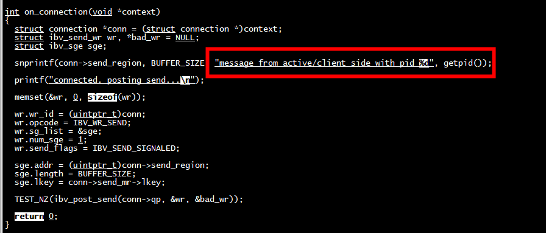

# 状态
转换QP状态RESET->INIT->RTR->RTS（ibv_modify_qp）  
状态：RESET -> INIT -> RTR -> RTS  
要严格按照顺序进行转换  
QP刚创建时状态为RESET  
INIT之后就可以调用ibv_post_recv提交一个receive buffer了  
当 QP进入RTR(ready to receive)状态以后，便开始进行接收处理  
RTR之后便可以转为RTS(ready to send)，RTS状态下可以调用ibv_post_send  

# 

1) Send（IBV_WR_SEND）操作需要对方执行相应的Receive操作  
2) Read/Write直接操作对方内存，对方无感知  


# server

1) rxe_cfg start  
2) rxe_cfg add   enp125s0f3  
3)  iptables -F   


```
[root@centos7 01_basic-client-server]# ./server  
listening on port 36805.
received connection request.
connected. posting send...
received message: message from active/client side with pid 64223
send completed successfully.
peer disconnected.

```


# client

1) rxe_cfg start  
2) rxe_cfg add   enahisic2i1  
3)  iptables -F   

```
./client    10.11.11.251  36805
address resolved.
route resolved.
connected. posting send...
received message: message from passive/server side with pid 9275
send completed successfully.
disconnected.
```

发送的消息




# reference
[the-geek-in-the-corner](https://github.com/tarickb/the-geek-in-the-corner/tree/master)  