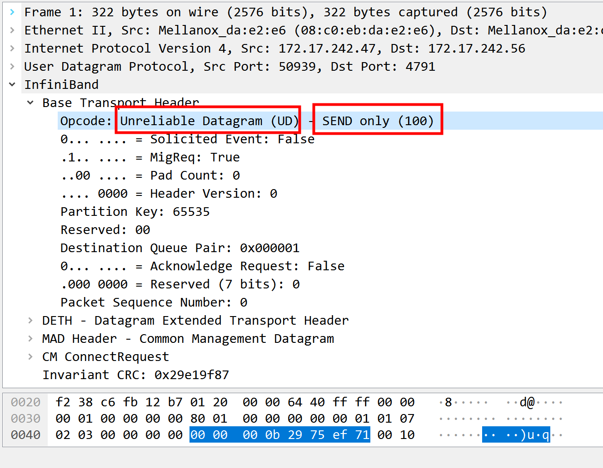
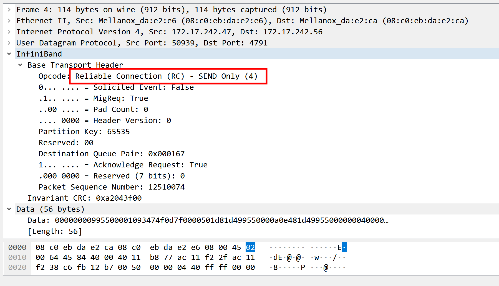
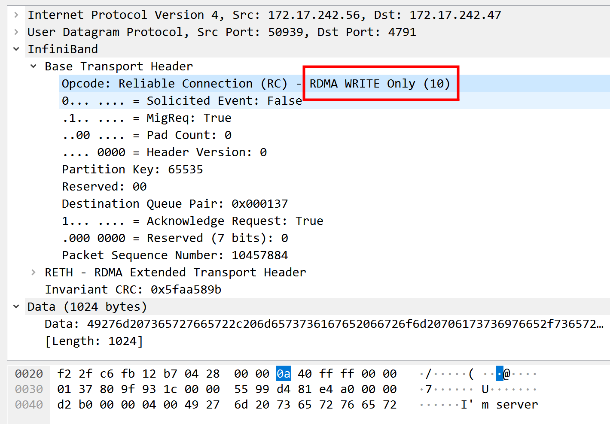

#  server
更改server代码，传入ip参数
```
/* Code acknowledgment: rping.c from librdmacm/examples */
int get_addr(char *dst, struct sockaddr *addr)
{
	struct addrinfo *res;
	int ret = -1;
	ret = getaddrinfo(dst, NULL, NULL, &res);
	if (ret) {
		rdma_error("getaddrinfo failed - invalid hostname or IP address\n");
		return ret;
	}
	memcpy(addr, res->ai_addr, sizeof(struct sockaddr_in));
	freeaddrinfo(res);
	return ret;
}

int main(int argc, char **argv)
{
  //struct sockaddr_in6 addr;
  struct sockaddr_in addr;


  memset(&addr, 0, sizeof(addr));
  //addr.sin6_family = AF_INET6;
  addr.sin_family = AF_INET;
  get_addr(argv[2],(struct sockaddr*) &addr);
```

```
root@centos12:/home/rdma/02-2-write/server# ./rdma-server write  172.17.242.56
listening on port 172.
received connection request.
**** recv msg mr 
 send mr rkey is 44972 and lkey is 44972 
send completed successfully.
received MSG_MR. writing message to remote memory...
peer mr rkey is 53936 and lkey is 53936 
send packet to client: I'm server, message from passive/server side with pid 39483 
send completed successfully.
send completed successfully.
recv packet :  I'm client . message from active/client side with pid 36269
peer disconnected.

^C
root@centos12:/home/rdma/02-2-write/server# 
```

# client

```
root@centos07:/home/rdma# ./rdma-client write 172.17.242.56 172
address resolved and pad local message.
route resolved.
send mr rkey is 53936 and lkey is 53936 
send completed successfully.
**** recv msg mr 
 received MSG_MR. writing message to remote memory...
peer mr rkey is 44972 and lkey is 44972 
send packet to server :  I'm client . message from active/client side with pid 36269 
send completed successfully.
send completed successfully.
recv packet : I'm server, message from passive/server side with pid 39483
disconnected.
```

# tcpdump

+ 1  一开始是ud send only


port 不是是172,port 是50939   
+ 2  转变为Rc send only



+ 3  write
