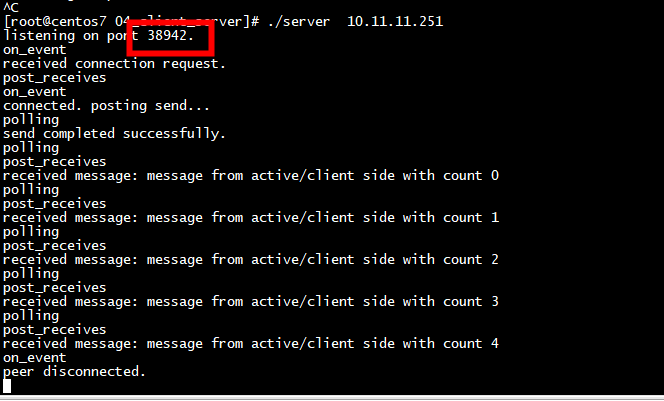
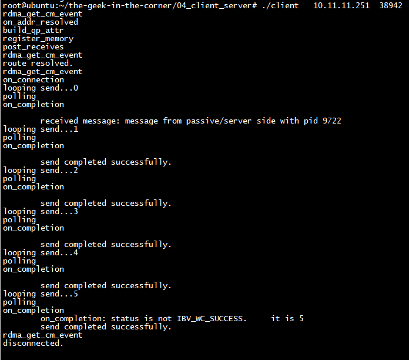
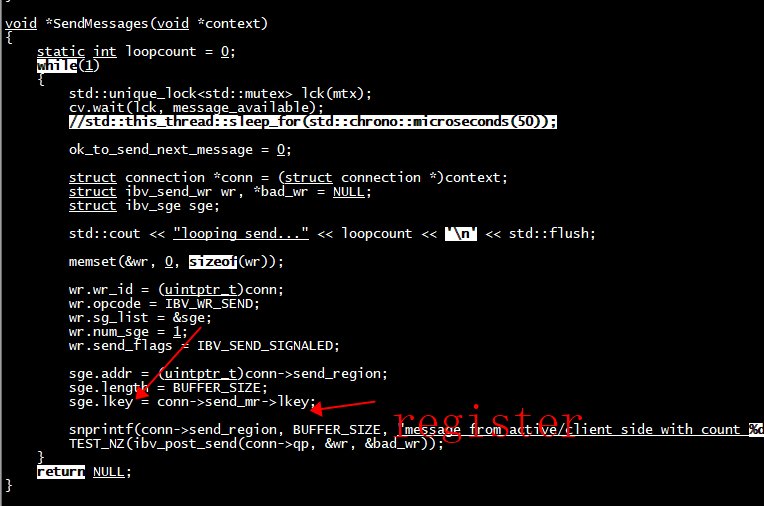

# server




# client




#  ibv_reg_mr

```
void register_memory(struct connection *conn)
{
    std::cout << "register_memory\n";

    conn->send_region = (char *)malloc(BUFFER_SIZE);
    conn->recv_region = (char *)malloc(BUFFER_SIZE);

    TEST_Z(conn->send_mr = ibv_reg_mr(
                               s_ctx->pd,
                               conn->send_region,
                               BUFFER_SIZE,
                               IBV_ACCESS_LOCAL_WRITE | IBV_ACCESS_REMOTE_WRITE));

    TEST_Z(conn->recv_mr = ibv_reg_mr(
                               s_ctx->pd,
                               conn->recv_region,
                               BUFFER_SIZE,
                               IBV_ACCESS_LOCAL_WRITE | IBV_ACCESS_REMOTE_WRITE));
}
```




## ibv_reg_mr()
这个接口用来注册MR。这一步主要完成了两件事：
1) pin住内存  
避免存放关键数据的内存被系统换页到硬盘中，导致数据收发过程中硬件读取内存不是用户所预期的。  

2) 建立虚拟地址和物理地址的映射表  
只有建立好了表之后，硬件才能根据WQE中的虚拟地址找到实际的物理地址。

rdma_post_send()：把wr发布到QP的SQ中，需要mr   
rdma_post_recv()：把wr发布到QP的RQ中，需要mr   
rdma_post_read()：把wr发布到QP的SQ中，执行RDMA READ操作，需要远程地址和rkey，以及本地存储地址和长度，以及mr
rdma_post_write()：把wr发布到QP的SQ中，RDMA  WRITE操作，需要远程的被写入地址和rkey，以及本地要发送数据的地址和长度，以及mr  


# ibv_post_send()
这个接口也讲过几次了，功能就是用户下发WR给硬件。假设用户下发了一个SEND的WQE，这一过程具体完成了哪些工作呢：  
1)从QP Buffer中获得下一个WQE的内存首地址（ibv_create_qp()中申请的）  
2)根据与硬件约定好的结构，解析WR中的内容填写到WQE中  
3)数据区域通过sge指定，sge指向的内存位于MR中（ibv_reg_mr()中注册的）  
4)填写完毕，敲Doorbell告知硬件（地址是ibv_open_device()中映射得到的）  
5)硬件从QP Buffer中取出WQE并解析其内容   
6)硬件通过映射表（ibv_reg_mr()中建立的），将存放数据的虚拟地址转换成物理地址，取出数据,硬件组包、发送数据  
从这个例子可以看出，RDMA的所谓内核Bypass，并不是整个流程都绕过了内核，而是在控制路径多次进入内核进行准备工作，万事俱备之后，才可以在数据路径上避免陷入内核时的开销。  

# reference
[Communication between client and server is erratic](https://stackoverflow.com/questions/31331118/communication-between-client-and-server-is-erratic)     