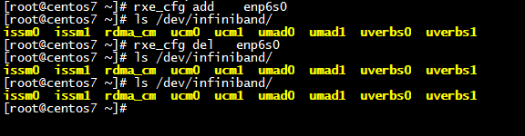
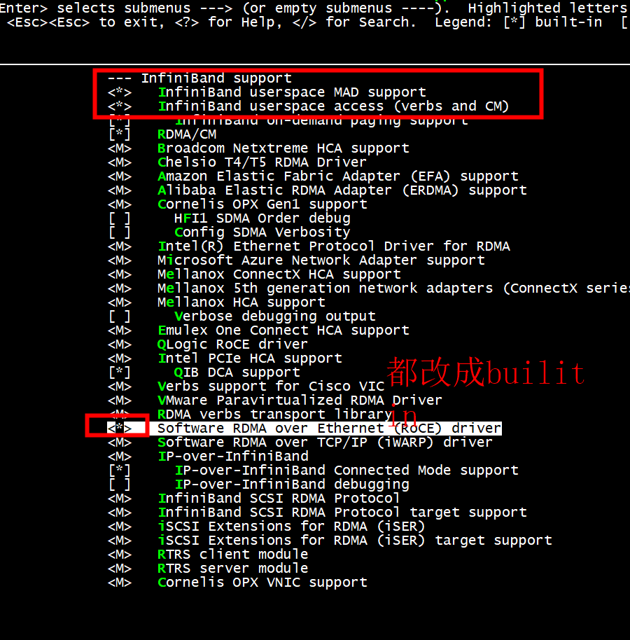
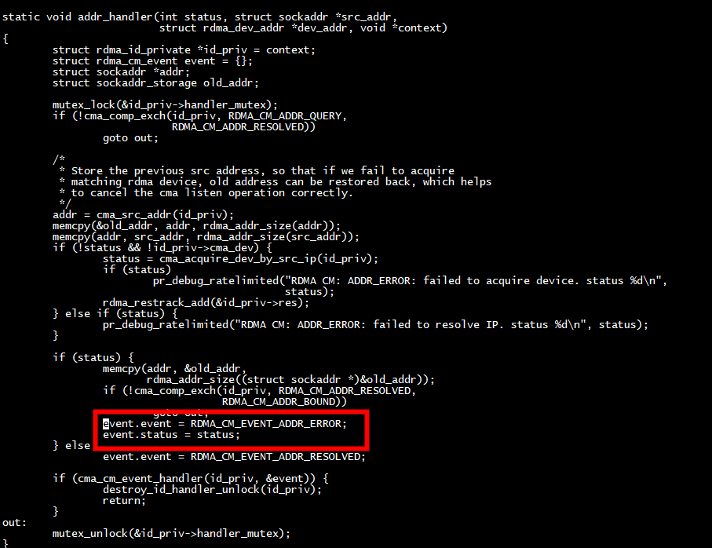
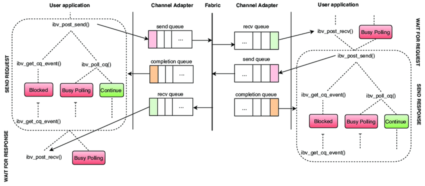

#  librdmacm
[librdmacm](https://github.com/ofiwg/librdmacm/tree/37ae092e626d9cc58a888eedca44f21ccdd7632a)

## rping.c
```
 gcc rping.c  -o rping -lrdmacm -libverbs -lpthread
```

### server

```
root@ubuntu:~# rping -s 192.168.11.22  -v -C 3
server ping data: rdma-ping-0: ABCDEFGHIJKLMNOPQRSTUVWXYZ[\]^_`abcdefghijklmnopqr
server ping data: rdma-ping-1: BCDEFGHIJKLMNOPQRSTUVWXYZ[\]^_`abcdefghijklmnopqrs
server ping data: rdma-ping-2: CDEFGHIJKLMNOPQRSTUVWXYZ[\]^_`abcdefghijklmnopqrst
server DISCONNECT EVENT...
wait for RDMA_READ_ADV state 10
root@ubuntu:~# 
```


### client
```
root@ubuntux86:# rping -c -a 192.168.11.22 -v -C 3
ping data: rdma-ping-0: ABCDEFGHIJKLMNOPQRSTUVWXYZ[\]^_`abcdefghijklmnopqr
ping data: rdma-ping-1: BCDEFGHIJKLMNOPQRSTUVWXYZ[\]^_`abcdefghijklmnopqrs
ping data: rdma-ping-2: CDEFGHIJKLMNOPQRSTUVWXYZ[\]^_`abcdefghijklmnopqrst
root@ubuntux86:# 
```

# lib

## ubuntu

```
root@ubuntu:~/soft-roce/soft-roce# uname -a
Linux ubuntu 5.0.0-23-generic #24~18.04.1-Ubuntu SMP Mon Jul 29 16:10:24 UTC 2019 aarch64 aarch64 aarch64 GNU/Linux
root@ubuntu:~/soft-roce/soft-roce# 
```
```
 apt-get install libibverbs-dev
apt-get install librdmacm-dev
apt install rdma-core
apt-get -y install rdmacm-utils for rping
```
### rxe_cfg

***iptables -F***
```
ibv_devinfo
ibv_devinfo -d rxe0 -v
rxe_cfg status
rxe_cfg start
rxe_cfg add enp125s0f3
[root@centos7 epoll_ibv_poll_cq]# ibv_devices
    device                 node GUID
    ------              ----------------
    rxe0                b20875fffe5fb85e
    rxe1                b20875fffe5fb85b
[root@centos7 epoll_ibv_poll_cq]#
```


新版本采用 rdma link
```
root@ubuntu:~#  rdma link  show
root@ubuntu:~# rxe_cfg add ens4
rxe_cfg: command not found
root@ubuntu:~# 
```

```
root@ubuntu:~# rdma link add rxe_eth0 type rxe netdev ens4
root@ubuntu:~# rdma link show
link rxe_eth0/1 state ACTIVE physical_state LINK_UP netdev ens4 
root@ubuntu:~# 

```
## udp_sock_create4
```
root@ubuntu:~/soft-roce/soft-roce# dmesg | tail -n 10
[   10.586347] bpfilter: Loaded bpfilter_umh pid 2565
[   10.765770] Initializing XFRM netlink socket
[   13.766487] hns-nic HISI00C2:00 enahisic2i0: link up
[   13.766515] IPv6: ADDRCONF(NETDEV_CHANGE): enahisic2i0: link becomes ready
[3712338.459002] rdma_rxe: loading out-of-tree module taints kernel.
[3712338.460156] rdma_rxe: module verification failed: signature and/or required key missing - tainting kernel
[3712338.460272] rdma_rxe: Unknown symbol udp_sock_create4 (err -2)
[3712338.460384] rdma_rxe: Unknown symbol udp_tunnel_sock_release (err -2)
[3712338.460412] rdma_rxe: Unknown symbol setup_udp_tunnel_sock (err -2)
[3712338.460426] rdma_rxe: Unknown symbol udp_sock_create6 (err -2)
```

##  centos
```
 yum install libibverbs-devel libibverbs-utils librdmacm librdmacm-devel librdmacm-utils perl-Switch elfutils-libelf-devel  -y
```

# build
```
/root/softroce/rxe_mr.c: In function ‘rxe_mem_init_user’:
/root/softroce/rxe_mr.c:172:21: error: passing argument 1 of ‘ib_umem_get’ from incompatible pointer type [-Werror=incompatible-pointer-types]
  172 |  umem = ib_umem_get(udata, start, length, access, 0);
      |                     ^~~~~
      |                     |
      |                     struct ib_udata *
In file included from /root/softroce/rxe.h:50,
                 from /root/softroce/rxe_mr.c:34:
./include/rdma/ib_umem.h:81:17: note: expected ‘struct ib_device *’ but argument is of type ‘struct ib_udata *’
   81 | struct ib_umem *ib_umem_get(struct ib_device *device, unsigned long addr,
      |                 ^~~~~~~~~~~
/root/softroce/rxe_mr.c:172:9: error: too many arguments to function ‘ib_umem_get’
  172 |  umem = ib_umem_get(udata, start, length, access, 0);
      |         ^~~~~~~~~~~
In file included from /root/softroce/rxe.h:50,
                 from /root/softroce/rxe_mr.c:34:
./include/rdma/ib_umem.h:81:17: note: declared here
   81 | struct ib_umem *ib_umem_get(struct ib_device *device, unsigned long addr,
```

设置 CONFIG_INFINIBAND_USER_MEM=y
```
ubuntu@ubuntux86:/boot$ grep CONFIG_INFINIBAND_USER_MEM  config-5.13.0-39-generic
CONFIG_INFINIBAND_USER_MEM=y
ubuntu@ubuntux86:/boot$ 
```
更改ib_umem_get
```

int rxe_mem_init_user(struct rxe_pd *pd, u64 start,
                      u64 length, u64 iova, int access, struct ib_udata *udata,
                      struct rxe_mem *mem)
{
        struct rxe_map          **map;
        struct rxe_phys_buf     *buf = NULL;
        struct ib_umem          *umem;
        struct sg_page_iter     sg_iter;
        int                     num_buf;
        void                    *vaddr;
        int err;


         umem = ib_umem_get(pd->ibpd.device, start, length, access);
        //umem = ib_umem_get(udata, start, length, access, 0);
```


#  /dev/infiniband/



#   Unknown symbol ib_unregister_device_queued
```
root@ubuntu:~/soft-roce2# dmesg | tail -n 10
[ 1926.624449] rdma_rxe: Unknown symbol ib_unregister_device_queued (err -2)
[ 1926.624454] rdma_rxe: Unknown symbol ib_dealloc_device (err -2)
[ 1926.624461] rdma_rxe: Unknown symbol setup_udp_tunnel_sock (err -2)
[ 1926.624466] rdma_rxe: Unknown symbol udp_sock_create6 (err -2)
[ 1926.624476] rdma_rxe: Unknown symbol rdma_link_unregister (err -2)
[ 1926.624486] rdma_rxe: Unknown symbol rdma_link_register (err -2)
[ 1926.624503] rdma_rxe: Unknown symbol rdma_get_gid_attr (err -2)
[ 1926.624508] rdma_rxe: Unknown symbol ib_get_eth_speed (err -2)
[ 1926.624514] rdma_rxe: Unknown symbol ib_device_put (err -2)
[ 1926.624523] rdma_rxe: Unknown symbol ib_set_device_ops (err -2)
```

```
modprobe ib_core 
```

```
spool/mail/root
[root@centos7 infiniband]# lsmod | grep ib_core
ib_core               458752  16 ib_iser,rdma_rxe,ib_cm,rdma_cm,ib_umad,ib_srp,ib_isert,ib_uverbs,rpcrdma,hns_roce,ib_ipoib,iw_cm,ib_srpt,hns_roce_hw_v2,ib_ucm,rdma_ucm
You have new mail in /var/spool/mail/root
```
# demod

```
 modprobe ib_core
modprobe ib_uverbs
modprobe udp_tunnel
modprobe ip6_udp_tunnel
insmod  rdma_rxe.ko 
```

# soft roce built-in



# RDMA_CM_EVENT_ADDR_ERROR

```
cma event RDMA_CM_EVENT_ADDR_ERROR, error -110
waiting for addr/route resolution state 1
```


```
(gdb) bt
#0  addr_handler (status=-110, src_addr=0xffff8881081ab210, dev_addr=0xffff88810254f920, context=0xffff88810254f800) at drivers/infiniband/core/cma.c:3455
#1  0xffffffff81c8b428 in process_one_req (_work=0xffff8881081ab330) at drivers/infiniband/core/addr.c:646
#2  0xffffffff810fee9c in process_one_work (worker=worker@entry=0xffff888100d50240, work=0xffff8881081ab330) at kernel/workqueue.c:2390
#3  0xffffffff810ff10a in worker_thread (__worker=0xffff888100d50240) at kernel/workqueue.c:2537
#4  0xffffffff811092be in kthread (_create=0xffff888100d51180) at kernel/kthread.c:376
#5  0xffffffff81003c59 in ret_from_fork () at arch/x86/entry/entry_64.S:308
#6  0x0000000000000000 in ?? ()
(gdb) c
Continuing.
```
## ucma_event_handler 设置

```
(gdb) bt
#0  rdma_create_user_id (event_handler=event_handler@entry=0xffffffff81cdd9e0 <ucma_event_handler>, context=context@entry=0xffff888111bedcc0, ps=RDMA_PS_IB, 
    qp_type=qp_type@entry=IB_QPT_RC) at drivers/infiniband/core/cma.c:1025
#1  0xffffffff81cdd6c6 in ucma_create_id (file=0xffff888109e56b40, inbuf=<optimized out>, in_len=<optimized out>, out_len=<optimized out>)
    at drivers/infiniband/core/ucma.c:464
#2  0xffffffff81cdc472 in ucma_write (filp=<optimized out>, buf=0x7ffdf6297f60 "", len=32, pos=<optimized out>) at drivers/infiniband/core/ucma.c:1744
#3  0xffffffff814438f9 in vfs_write (pos=0x0 <fixed_percpu_data>, count=32, buf=0x7ffdf6297f60 "", file=0xffff88810a86fd00) at fs/read_write.c:582
#4  vfs_write (file=0xffff88810a86fd00, buf=0x7ffdf6297f60 "", count=<optimized out>, pos=0x0 <fixed_percpu_data>) at fs/read_write.c:564
#5  0xffffffff81443e25 in ksys_write (fd=<optimized out>, buf=0x7ffdf6297f60 "", count=32) at fs/read_write.c:637
#6  0xffffffff81443e8a in __do_sys_write (count=<optimized out>, buf=<optimized out>, fd=<optimized out>) at fs/read_write.c:649
#7  __se_sys_write (count=<optimized out>, buf=<optimized out>, fd=<optimized out>) at fs/read_write.c:646
#8  __x64_sys_write (regs=<optimized out>) at fs/read_write.c:646
#9  0xffffffff8201fea9 in do_syscall_x64 (nr=<error reading variable: dwarf2_find_location_expression: Corrupted DWARF expression.>, 
    regs=<error reading variable: dwarf2_find_location_expression: Corrupted DWARF expression.>) at arch/x86/entry/common.c:50
#10 do_syscall_64 (regs=0xffffc9000063ff58, nr=<optimized out>) at arch/x86/entry/common.c:80
#11 0xffffffff822000aa in entry_SYSCALL_64 () at arch/x86/entry/entry_64.S:120
#12 0x00007ffdf6297f54 in ?? ()
#13 0x00007ffdf6298008 in ?? ()
#14 0x0000000000000002 in fixed_percpu_data ()
#15 0x0000000000000000 in ?? ()
```

## ucma_event_handler 回调
```
(gdb) bt
#0  ucma_event_handler (cm_id=0xffff8881062aec00, event=0xffffc90000563d10) at drivers/infiniband/core/ucma.c:335
#1  0xffffffff81cb91a4 in cma_cm_event_handler (id_priv=id_priv@entry=0xffff8881062aec00, event=event@entry=0xffffc90000563d10) at drivers/infiniband/core/cma.c:2131
#2  0xffffffff81cbf37d in addr_handler (status=<error reading variable: dwarf2_find_location_expression: Corrupted DWARF expression.>, src_addr=<optimized out>, 
    dev_addr=<optimized out>, context=0xffff8881062aec00) at drivers/infiniband/core/cma.c:3495
#3  0xffffffff81c8b428 in process_one_req (_work=0xffff88810fd47b30) at drivers/infiniband/core/addr.c:646
#4  0xffffffff810fee9c in process_one_work (worker=worker@entry=0xffff8881008ec600, work=0xffff88810fd47b30) at kernel/workqueue.c:2390
#5  0xffffffff810ff10a in worker_thread (__worker=0xffff8881008ec600) at kernel/workqueue.c:2537
#6  0xffffffff811092be in kthread (_create=0xffff8881008e4f00) at kernel/kthread.c:376
#7  0xffffffff81003c59 in ret_from_fork () at arch/x86/entry/entry_64.S:308
#8  0x0000000000000000 in ?? ()
(gdb)
```
## ucma_get_event
```
(gdb) bt
#0  ucma_get_event (file=0xffff888109e56780, inbuf=0x7f2e68e18c48 "\020\215\341h.\177", in_len=8, out_len=328) at drivers/infiniband/core/ucma.c:371
#1  0xffffffff81cdc472 in ucma_write (filp=<optimized out>, buf=0x7f2e68e18c40 "\f", len=16, pos=<optimized out>) at drivers/infiniband/core/ucma.c:1744
#2  0xffffffff814438f9 in vfs_write (pos=0x0 <fixed_percpu_data>, count=16, buf=0x7f2e68e18c40 "\f", file=0xffff8881078e5600) at fs/read_write.c:582
#3  vfs_write (file=0xffff8881078e5600, buf=0x7f2e68e18c40 "\f", count=<optimized out>, pos=0x0 <fixed_percpu_data>) at fs/read_write.c:564
#4  0xffffffff81443e25 in ksys_write (fd=<optimized out>, buf=0x7f2e68e18c40 "\f", count=16) at fs/read_write.c:637
#5  0xffffffff81443e8a in __do_sys_write (count=<optimized out>, buf=<optimized out>, fd=<optimized out>) at fs/read_write.c:649
#6  __se_sys_write (count=<optimized out>, buf=<optimized out>, fd=<optimized out>) at fs/read_write.c:646
#7  __x64_sys_write (regs=<optimized out>) at fs/read_write.c:646
#8  0xffffffff8201fea9 in do_syscall_x64 (nr=<error reading variable: dwarf2_find_location_expression: Corrupted DWARF expression.>, 
    regs=<error reading variable: dwarf2_find_location_expression: Corrupted DWARF expression.>) at arch/x86/entry/common.c:50
#9  do_syscall_64 (regs=0xffffc9000063ff58, nr=<optimized out>) at arch/x86/entry/common.c:80
#10 0xffffffff822000aa in entry_SYSCALL_64 () at arch/x86/entry/entry_64.S:120
#11 0x00007f2e68e18c40 in ?? ()
#12 0x014800080000000c in ?? ()
#13 0x00007f2e691e62d4 in ?? ()
#14 0x00007f2e64000b60 in ?? ()
#15 0x00007f2e68e18d10 in ?? ()
#16 0x0000000000000000 in ?? ()
```

# Synchronous and asynchronous RDMA communications



 
 
 
# 何设计一个高性能的RDMA系统
[如何设计一个高性能的RDMA系统](https://bigmath.com/article_64d3545dec02330b0a7d0307.html)
 

