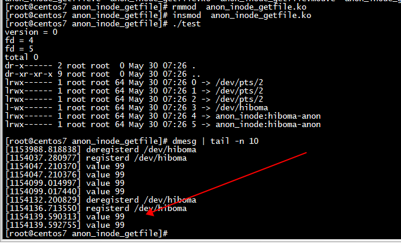

# infinibandevent

uverbs_async_event_fops
```
(gdb) bt
#0  anon_inode_getfile (name=0xffffffff82a44894 "[infinibandevent]", fops=0xffffffff8253a4c0 <uverbs_async_event_fops>, priv=priv@entry=0x0 <fixed_percpu_data>, flags=0)
    at fs/anon_inodes.c:146
#1  0xffffffff81cd2cce in alloc_begin_fd_uobject (obj=<optimized out>, attrs=<optimized out>) at drivers/infiniband/core/rdma_core.c:480
#2  0xffffffff81cd33c1 in rdma_alloc_begin_uobject (obj=0xffff8881110355e0, attrs=attrs@entry=0xffffc90002107c68) at drivers/infiniband/core/rdma_core.c:515
#3  0xffffffff81cd3a56 in uverbs_get_uobject_from_file (object_id=<optimized out>, access=UVERBS_ACCESS_NEW, id=0, attrs=attrs@entry=0xffffc90002107c68)
    at drivers/infiniband/core/rdma_core.c:978
#4  0xffffffff81cd4c93 in uverbs_process_attr (attr_bkey=<optimized out>, uattr=0xffffc90002107cd8, attr_uapi=0xffff88810a440280, pbundle=0xffffc90002107bf8)
    at drivers/infiniband/core/uverbs_ioctl.c:322
#5  uverbs_set_attr (uattr=0xffffc90002107cd8, pbundle=0xffffc90002107bf8) at drivers/infiniband/core/uverbs_ioctl.c:412
#6  ib_uverbs_run_method (num_attrs=<optimized out>, pbundle=0xffffc90002107bf8) at drivers/infiniband/core/uverbs_ioctl.c:444
#7  ib_uverbs_cmd_verbs (ufile=ufile@entry=0xffff88810a464000, hdr=hdr@entry=0xffffc90002107e08, user_attrs=user_attrs@entry=0x7fcdc36e06e8)
    at drivers/infiniband/core/uverbs_ioctl.c:608
#8  0xffffffff81cd56f8 in ib_uverbs_ioctl (filp=<optimized out>, cmd=<optimized out>, arg=140521723791056) at drivers/infiniband/core/uverbs_ioctl.c:637
#9  0xffffffff8145e752 in vfs_ioctl (arg=<error reading variable: dwarf2_find_location_expression: Corrupted DWARF expression.>, cmd=<optimized out>, 
    filp=<error reading variable: dwarf2_find_location_expression: Corrupted DWARF expression.>) at fs/ioctl.c:51
#10 __do_sys_ioctl (arg=140521723791056, cmd=3222805249, fd=4) at fs/ioctl.c:870
#11 __se_sys_ioctl (arg=140521723791056, cmd=3222805249, fd=4) at fs/ioctl.c:856
#12 __x64_sys_ioctl (regs=<optimized out>) at fs/ioctl.c:856
#13 0xffffffff8201fea9 in do_syscall_x64 (nr=<error reading variable: dwarf2_find_location_expression: Corrupted DWARF expression.>, 
    regs=<error reading variable: dwarf2_find_location_expression: Corrupted DWARF expression.>) at arch/x86/entry/common.c:50
#14 do_syscall_64 (regs=0xffffc90002107f58, nr=<optimized out>) at arch/x86/entry/common.c:80
#15 0xffffffff822000aa in entry_SYSCALL_64 () at arch/x86/entry/entry_64.S:120

```