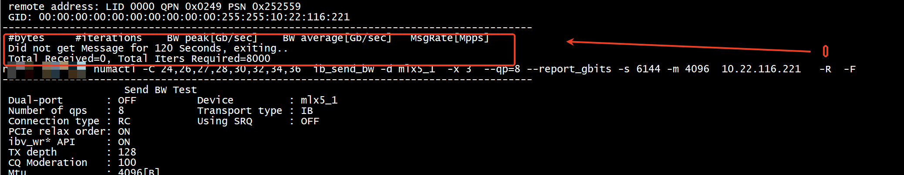
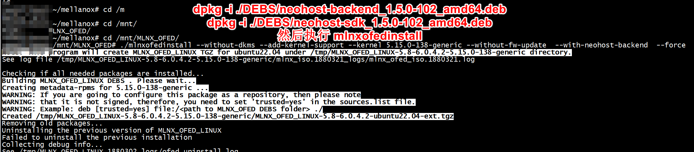

[RDMA测试杂谈](https://mp.weixin.qq.com/s?__biz=Mzg5NzY3NDUyMw==&mid=2247535505&idx=1&sn=8913cd5f4be7fd62d5ae2759a8fa37d9&source=41#wechat_redirect)   

#   Benchmarks

+ RDMA Write Benchmarks(https://hpcadvisorycouncil.atlassian.net/wiki/spaces/HPCWORKS/pages/1284603909/Basic+RDMA+Benchmark+Examples+for+AMD+2nd+Gen+EPYC+CPUs+over+HDR+InfiniBand#RDMA-Write-Benchmarks)  
    + RDMA Write Latency (ib_write_lat)    
    + RDMA Write Bandwidth (ib_write_bw)   
    + RDMA Write Bi-Directional Bandwidth (ib_write_bw -b)       

# qos

[RoCE通过QoS对Mellanox网卡进行限速](https://www.cnblogs.com/CQzhangyu/p/18139026)   

```
ib_write_bw <B_IP> -d mlx5_1 -x 3 --tclass=128
mlnx_qos -i ens10f1np1 --ratelimit=0,0,0,0,4,0,0,0
```

#  Queue Pair 
```
ibv_devinfo -d mlx5_1 -v | grep qp
        max_qp:                         131072
        max_qp_wr:                      32768
        max_qp_rd_atom:                 16
        max_qp_init_rd_atom:            16
        max_raw_ipv6_qp:                0
        max_raw_ethy_qp:                0
        max_mcast_qp_attach:            240
        max_total_mcast_qp_attach:      503316480
                supported_qp:
                supported_qp:
                qp_rate_limit_min:      1kbps
                qp_rate_limit_max:      100000000kbps
                supported_qp:
```

```
ibv_devinfo -d mlx5_1 -v | grep cq
        max_cq:                         16777216
        max_cqe:                        4194303
        cq moderation caps:
                max_cq_count:   65535
                max_cq_period:  4095 us
```


```
mlxlink -d mlx5_1   |grep "Speed"
Speed                           : 100G
Enabled Link Speed (Ext.)       : 0x000007f2 (100G_2X,100G_4X,50G_1X,50G_2X,40G,25G,10G,1G)
Supported Cable Speed (Ext.)    : 0x000002f2 (100G_4X,50G_2X,40G,25G,10G,1G)
```

# ib_write_bw
* -a 和-s 会冲突吗？     
* -R
* max Queue Pair  qp=16384     
``` 
rdma_cm QPs     : ON 
```  


   
+ server
```
 numactl -C 24,26,27,28,30,32,34,36  ib_write_bw -d mlx5_1  -x 3  --qp=8 --report_gbits -s 6144 -m 4096  -a  -F 
```
+ client   
```
numactl -C 24,26,27,28,30,32,34,36  ib_write_bw -d mlx5_1  -x 3  --qp=8 --report_gbits -s 6144 -m 4096  10.22.116.221   -a  -F  
---------------------------------------------------------------------------------------
                    RDMA_Write BW Test
 Dual-port       : OFF          Device         : mlx5_1
 Number of qps   : 8            Transport type : IB
 Connection type : RC           Using SRQ      : OFF
 PCIe relax order: ON
 ibv_wr* API     : ON
 TX depth        : 128
 CQ Moderation   : 100
 Mtu             : 4096[B]
 Link type       : Ethernet
 GID index       : 3
 Max inline data : 0[B]
 rdma_cm QPs     : OFF
 Data ex. method : Ethernet
---------------------------------------------------------------------------------------
 local address: LID 0000 QPN 0x0244 PSN 0xc52d8a RKey 0x23b2c5 VAddr 0x007f09e773f000
 GID: 00:00:00:00:00:00:00:00:00:00:255:255:10:22:116:220
 local address: LID 0000 QPN 0x0245 PSN 0xddc9ac RKey 0x23b2c5 VAddr 0x007f09e7f3f000
 GID: 00:00:00:00:00:00:00:00:00:00:255:255:10:22:116:220
 local address: LID 0000 QPN 0x0246 PSN 0xa0e786 RKey 0x23b2c5 VAddr 0x007f09e873f000
 GID: 00:00:00:00:00:00:00:00:00:00:255:255:10:22:116:220
 local address: LID 0000 QPN 0x0247 PSN 0x33975d RKey 0x23b2c5 VAddr 0x007f09e8f3f000
 GID: 00:00:00:00:00:00:00:00:00:00:255:255:10:22:116:220
 local address: LID 0000 QPN 0x0248 PSN 0x22b6ac RKey 0x23b2c5 VAddr 0x007f09e973f000
 GID: 00:00:00:00:00:00:00:00:00:00:255:255:10:22:116:220
 local address: LID 0000 QPN 0x0249 PSN 0xea49e RKey 0x23b2c5 VAddr 0x007f09e9f3f000
 GID: 00:00:00:00:00:00:00:00:00:00:255:255:10:22:116:220
 local address: LID 0000 QPN 0x024a PSN 0xb3cca5 RKey 0x23b2c5 VAddr 0x007f09ea73f000
 GID: 00:00:00:00:00:00:00:00:00:00:255:255:10:22:116:220
 local address: LID 0000 QPN 0x024b PSN 0x4b9c3a RKey 0x23b2c5 VAddr 0x007f09eaf3f000
 GID: 00:00:00:00:00:00:00:00:00:00:255:255:10:22:116:220
 remote address: LID 0000 QPN 0x0237 PSN 0x6fd172 RKey 0x23b0c1 VAddr 0x007f4639bb2000
 GID: 00:00:00:00:00:00:00:00:00:00:255:255:10:22:116:221
 remote address: LID 0000 QPN 0x0238 PSN 0xa80374 RKey 0x23b0c1 VAddr 0x007f463a3b2000
 GID: 00:00:00:00:00:00:00:00:00:00:255:255:10:22:116:221
 remote address: LID 0000 QPN 0x0239 PSN 0x531ae RKey 0x23b0c1 VAddr 0x007f463abb2000
 GID: 00:00:00:00:00:00:00:00:00:00:255:255:10:22:116:221
 remote address: LID 0000 QPN 0x023a PSN 0x671a65 RKey 0x23b0c1 VAddr 0x007f463b3b2000
 GID: 00:00:00:00:00:00:00:00:00:00:255:255:10:22:116:221
 remote address: LID 0000 QPN 0x023b PSN 0x2ab114 RKey 0x23b0c1 VAddr 0x007f463bbb2000
 GID: 00:00:00:00:00:00:00:00:00:00:255:255:10:22:116:221
 remote address: LID 0000 QPN 0x023c PSN 0x4db2e6 RKey 0x23b0c1 VAddr 0x007f463c3b2000
 GID: 00:00:00:00:00:00:00:00:00:00:255:255:10:22:116:221
 remote address: LID 0000 QPN 0x023d PSN 0xc1914d RKey 0x23b0c1 VAddr 0x007f463cbb2000
 GID: 00:00:00:00:00:00:00:00:00:00:255:255:10:22:116:221
 remote address: LID 0000 QPN 0x023e PSN 0xb747c2 RKey 0x23b0c1 VAddr 0x007f463d3b2000
 GID: 00:00:00:00:00:00:00:00:00:00:255:255:10:22:116:221
---------------------------------------------------------------------------------------
 #bytes     #iterations    BW peak[Gb/sec]    BW average[Gb/sec]   MsgRate[Mpps]
 2          40000           0.073563            0.073361            4.585037
 4          40000            0.15               0.15               4.682289
 8          40000            0.30               0.30               4.683875
 16         40000            0.60               0.60               4.678581
 32         40000            1.20               1.20               4.685143
 64         40000            2.40               2.40               4.683065
 128        40000            4.82               4.79               4.679294
 256        40000            9.64               9.63               4.702411
 512        40000            19.19              19.15              4.676292
```

# ib_send_bw test
-s 1000000    
```
ib_send_bw -d mlx5_1  -x 3 --cpu_util --qp=8 --report_gbits -s 1000000 -m 4096  --run_infinitely
ib_send_bw -d mlx5_1  -x 3 --cpu_util --qp=8 --report_gbits -s 1000000 -m 4096  10.22.116.221  --run_infinitely
```

## params   -a  -F  -b (Bidirectional BW)

+ server

```
numactl -C 24,26,27,28,30,32,34,36  ib_send_bw -d mlx5_1  -x 3  --qp=8 --report_gbits -s 6144 -m 4096  -a  -F  -b

```

+ client     
```
numactl -C 24,26,27,28,30,32,34,36  ib_send_bw -d mlx5_1  -x 3  --qp=8 --report_gbits -s 6144 -m 4096  10.22.116.221   -a  -F  -b
------------------------------------------------------------------------
                    Send Bidirectional BW Test
 Dual-port       : OFF          Device         : mlx5_1
 Number of qps   : 8            Transport type : IB
 Connection type : RC           Using SRQ      : OFF
 PCIe relax order: ON
 ibv_wr* API     : ON
 TX depth        : 128
 RX depth        : 512
 CQ Moderation   : 100
 Mtu             : 4096[B]
 Link type       : Ethernet
 GID index       : 3
 Max inline data : 0[B]
 rdma_cm QPs     : OFF
 Data ex. method : Ethernet
---------------------------------------------------------------------------------------
 local address: LID 0000 QPN 0x0224 PSN 0x4e441e
 GID: 00:00:00:00:00:00:00:00:00:00:255:255:10:22:116:220
 local address: LID 0000 QPN 0x0225 PSN 0xf55eb0
 GID: 00:00:00:00:00:00:00:00:00:00:255:255:10:22:116:220
 local address: LID 0000 QPN 0x0226 PSN 0x3cf23a
 GID: 00:00:00:00:00:00:00:00:00:00:255:255:10:22:116:220
 local address: LID 0000 QPN 0x0227 PSN 0x31de01
 GID: 00:00:00:00:00:00:00:00:00:00:255:255:10:22:116:220
 local address: LID 0000 QPN 0x0228 PSN 0xe2280
 GID: 00:00:00:00:00:00:00:00:00:00:255:255:10:22:116:220
 local address: LID 0000 QPN 0x0229 PSN 0x9c05e2
 GID: 00:00:00:00:00:00:00:00:00:00:255:255:10:22:116:220
 local address: LID 0000 QPN 0x022a PSN 0xf94e99
 GID: 00:00:00:00:00:00:00:00:00:00:255:255:10:22:116:220
 local address: LID 0000 QPN 0x022b PSN 0x95291e
 GID: 00:00:00:00:00:00:00:00:00:00:255:255:10:22:116:220
 remote address: LID 0000 QPN 0x0217 PSN 0x1ceae4
 GID: 00:00:00:00:00:00:00:00:00:00:255:255:10:22:116:221
 remote address: LID 0000 QPN 0x0218 PSN 0xc6b835
 GID: 00:00:00:00:00:00:00:00:00:00:255:255:10:22:116:221
 remote address: LID 0000 QPN 0x0219 PSN 0xf31aa5
 GID: 00:00:00:00:00:00:00:00:00:00:255:255:10:22:116:221
 remote address: LID 0000 QPN 0x021a PSN 0x3ec259
 GID: 00:00:00:00:00:00:00:00:00:00:255:255:10:22:116:221
 remote address: LID 0000 QPN 0x021b PSN 0x48df2f
 GID: 00:00:00:00:00:00:00:00:00:00:255:255:10:22:116:221
 remote address: LID 0000 QPN 0x021c PSN 0x1232f
 GID: 00:00:00:00:00:00:00:00:00:00:255:255:10:22:116:221
 remote address: LID 0000 QPN 0x021d PSN 0xdf832c
 GID: 00:00:00:00:00:00:00:00:00:00:255:255:10:22:116:221
 remote address: LID 0000 QPN 0x021e PSN 0xe32a7f
 GID: 00:00:00:00:00:00:00:00:00:00:255:255:10:22:116:221
---------------------------------------------------------------------------------------
 #bytes     #iterations    BW peak[Gb/sec]    BW average[Gb/sec]   MsgRate[Mpps]
 2          8000           0.120775            0.079737            4.983549
 4          8000           0.243320            0.166756            5.211131
 8          8000             0.49               0.31               4.851479
 16         8000             0.96               0.62               4.850699
 32         8000             1.90               1.24               4.859575
 64         8000             3.83               2.50               4.875418
 128        8000             7.67               5.00               4.878793
 256        8000             15.49              10.00              4.880884
 512        8000             30.03              20.03              4.889346
 1024       8000             59.99              40.21              4.908895
 2048       8000             117.25             79.85              4.873853
 4096       8000             190.65             190.58             5.816108
 8192       8000             193.11             193.00             2.944988
 16384      8000             194.36             194.33             1.482599
```
#  Multiple Devices   
Server side:    
```
run_perftest_multi_devices -d mlx5_0,mlx5_2 -c 0,1 --cmd "ib_write_bw"
```
Client side:   
```
run_perftest_multi_devices -d mlx5_0,mlx5_2 -c 0,1 --cmd "ib_write_bw --report_gbits" --remote <ib interface ip > 
```

#  NEO-Host 

 PCie backpressure/bottleneck, we have a software called NEO-Host that performs lower end diagnosis & performance counters.    

下载deb文件包 wget --quiet http://content.mellanox.com/ofed/MLNX_OFED-5.8-6.0.4.2/MLNX_OFED_LINUX-5.8-6.0.4.2-ubuntu20.04-x86_64.tgz
```
root@ljtest:~/mellanox# cat Dockerfile.txt 
# Build image on top of NVidia MXnet image

# Pin Key Package Versions
MOFED_VER=5.8-6.0.4.2
AZML_SDK_VER=1.25.0

# Other required variables for MOFED drivers
OS_VER=ubuntu20.04
PLATFORM=x86_64

### Install Mellanox Drivers ###
#apt-get update && apt-get install -y libcap2 libfuse-dev && \
#wget --quiet http://content.mellanox.com/ofed/MLNX_OFED-${MOFED_VER}/MLNX_OFED_LINUX-${MOFED_VER}-${OS_VER}-${PLATFORM}.tgz 
tar -xvf MLNX_OFED_LINUX-${MOFED_VER}-${OS_VER}-${PLATFORM}.tgz && \
    MLNX_OFED_LINUX-${MOFED_VER}-${OS_VER}-${PLATFORM}/mlnxofedinstall --user-space-only --without-fw-update --all --without-neohost-backend --force
```
```
find ./ -name '*neo*'
dpkg -i ./DEBS/neohost-backend_1.5.0-102_amd64.deb
dpkg -i ./DEBS/neohost-sdk_1.5.0-102_amd64.deb
```
 

 
## 编译（没有成功）

./mlnxofedinstall --without-dkms --add-kernel-support --kernel 5.15.0-138-generic --without-fw-update  --with-neohost-backend  --force (因为python,编译没有成功）

+ 依赖pip2 python2     
``` 
  apt-get -y install python-pip     
```

```
apt-get install -y -o Dpkg::Options::='--force-confdef' -o Dpkg::Options::='--force-confold' python
E: Package 'python' has no installation candidate
``` 
编辑mlnxofedinstall
```

                        'neohost-backend' =>
                                { name => "neohost-backend", parent => "neohost-backend",
                                selected => 0, installed => 0, rpm_exist => 0, rpm_exist32 => 0,
                                available => 0, mode => "user",
                                dist_req_build => [],
                                dist_req_inst => ["python"],
                                ofa_req_build => [], ofa_req_inst => [], configure_options => '' },
```

`install Python 2 in advance and create the symbolic link /usr/bin/python -> python2.`        
```
ln -sf /usr/bin/python2 /usr/bin/python
```

(Neohost)[https://rpubs.com/iamholger/796477)    

# Husky
Benchmark Suite for RDMA Performance Isolation

**Note: we have unified our system into a general RDMA testing framework `rdma-bench` (https://github.com/host-bench/rdma-bench). Husky will be further developed and maintained in the `test2-isolation` under that framework. This repo will no longer be monitored or updated.** 

## paper
 + NSDI '23 - Understanding RDMA Microarchitecture Resources for Performance Isolation     
 + NSDI '22-  Collie: Finding Performance Anomalies in RDMA Subsystems     

## Quick Start

### Install prerequisites
~~~
sudo apt install cmake make g++ pkg-config libgoogle-glog-dev libgflags-dev
~~~


### Build and Install

~~~
cmake .;
make -j;
sudo make install;
~~~

You should see `RdmaEngine` and `RdmaCtrlTest` under current directory.
The above should be called on all machines that run test engines. An assitant script `rdma_monitor.py` need to be installed in `/tmp` to run the entire test suite.

### Generate Scripts

~~~
cd scripts;
vim example.json;
python3 scripts_gen.py --config example.json;
~~~

Edit configuration file and generate scripts following the above command. Please see below for the detailed description of this configuration file.

### Run Tests
~~~
cd scripts; # no need if you are already under this folder.
# Below are some examples to use this script

# Show the test scripts list
python3 runtest.py --config example.json --list;

# Run all <attacker, victim> combinations
python3 runtest.py --config example.json  --attacker all 

# Run all Cache attackers for all victims combinations
python3 runtest.py --config example.json --attacker Cache-all

# Run all Cache attackers for a single victim
python3 runtest.py --config example.json  --victim large_bw_ib_write_bw.sh --attacker Cache-all

# Run a particular <attacker, victim>
python3 runtest.py --config example.json  --victim large_bw_ib_write_bw.sh --attacker Cache-access_mr_all_r.sh
~~~

## Configuration

### Username and IP list
Username and IP list are for traffic set up. This test suite will call `ssh [username]@[mgmtIP] 'command'` to set up the traffic engine. The list[0] is sender and list[1] is receiver. 

The mgmt and data IP can be different (e.g., the host may have one management NIC and an RDMA NIC). 

### RDMA configurations


"VictimDevice"(and "AttackerDevice") are Infiniband device name, such as "mlx5_0". This can be acquired through `show_gids`.

"VictimGid" is the GID index used by the test suite. For RoCE, we recommend you to use RoCEv2 gid index. This can also be acquired through `show_gids`. 

Below is an example of `show_gids` result, which tells us to set `VictimGid` to be 3.
~~~
$ show_gids
DEV	PORT	INDEX	GID					IPv4  		VER	DEV
---	----	-----	---					------------  	---	---
mlx5_0	1	0	fe80:0000:0000:0000:0ac0:ebff:fe21:03da			v1	rdma0
mlx5_0	1	1	fe80:0000:0000:0000:0ac0:ebff:fe21:03da			v2	rdma0
mlx5_0	1	2	0000:0000:0000:0000:0000:ffff:c0a8:d3f2	192.168.211.242  	v1	rdma0
mlx5_0	1	3	0000:0000:0000:0000:0000:ffff:c0a8:d3f2	192.168.211.242  	v2	rdma0
n_gids_found=4
~~~

"VictimTos" is the Type of Service value of the victim (same for the attacker). You can specify this value (together with the QoS setting of the RNIC) to force the traffic to go through particular NIC queue (traffic class) and use particular NIC buffer. (Note: tos = dscp << 4 & ECN-bit).

The DSCP traffic class mapping can be obtained and set through `mlnx_qos`. Below is an example of `mlnx_qos`:

~~~
$ mlnx_qos -i rdma0
DCBX mode: OS controlled
Priority trust state: dscp
dscp2prio mapping:
	prio:0 dscp:07,06,05,04,03,02,01,00,
	prio:1 dscp:15,14,13,12,11,10,09,08,
	prio:2 dscp:23,22,21,20,19,18,17,16,
	prio:3 dscp:31,30,29,28,27,26,25,24,
	prio:4 dscp:39,38,37,36,35,34,33,32,
	prio:5 dscp:47,46,45,44,43,42,41,40,
	prio:6 dscp:55,54,53,52,51,50,49,48,
	prio:7 dscp:63,62,61,60,59,58,57,56,
... # many other outputs
~~~

"VictimPort" is the *start* port number of the victim application. `RdmaEngine` and `Perftest` may use these ports to set up RDMA connections (RDMA needs out-of-band transmission to exchange metadata for connection setup). For example, if VictimPort is set to 3001, and the victim script sets up 4 RDMA processes, [3001, 3004] will be occupied by the victim application. If the victim and the attacker are collocated on the same host (sharing the same available ports), the start port should be set different. 

### Alpha and MonitorKey

The "Alpha" in the configuration file is a little bit different from the one mentioned in paper. In this test suite, we compute the ratio of the "new performance" over the "old performance". If this ratio is smaller than the "Alpha" (new performance is worse than expectation), the test suite will consider this particular test failed. However, it could be the case that the "old performance" is better than what it should be, users should set this "Alpha" carefully or just implement their own isolation violation spec in `OneTest` of the `runtest.py`. 

The "MonitorKey" is which metric of the `ethtool -S` output will be used as the performance metric prefix. For Mellanox NICs, there are two types of monitor keys to use 
- `rx_vport_rdma_unicast` for separate virtual function (inside VM) or the bare-metal machine 
- `rx_prio[priority_id]` for separate hardware traffic class (e.g., `rx_prio0`).

The actual monitor keys used by the test suite will be `rx_vport_rdma_unicast_bytes` + `rx_vport_rdma_unicast_packets`, or `rx_prio[prio_id]_bytes` + `rx_prio[prio_id]_packets` respectively. NIC from different vendors may have different names or even different mechanisms (rather than `ethtool -S`). Users can edit `rdma_monitor.py` to support other monitoring approaches.
### Misc

"Directory" is where the testing scripts will be generated. 

"Verbose" determines whether the generated testing scripts will omit stderr and stdout output.


## Publications

The corresponding paper can be found here: 
[Understanding RDMA Microarchitecture Resources for Performance Isolation](https://www.usenix.org/conference/nsdi23/presentation/kong)

## Acknowledgement

We would like to express our gratitude to Chelsio, Intel, and NVIDIA for their technical support. In particular, we would like to extend our appreciation to Intel for providing us with valuable feedback and suggestions to enhance this test suite. We are also thankful to NVIDIA for their prompt and insightful feedback, which helped us identify the root causes of our findings and provided corresponding solutions.
