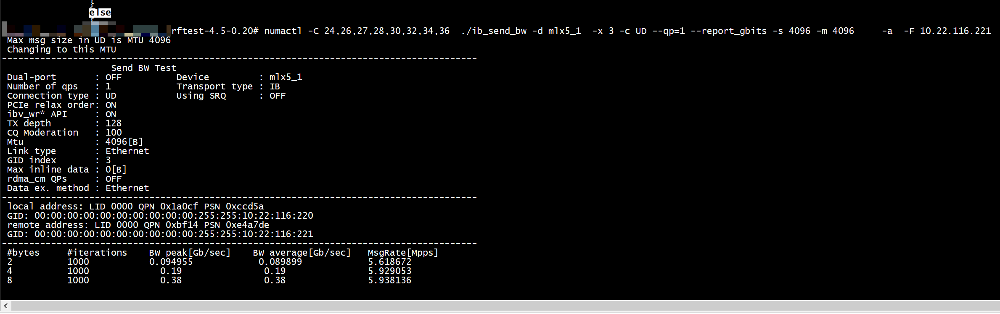

# duration_param
```
multiple definition of `duration_param'; libperftest.a(perftest_resources.o):/root/rdma-benckmark/perftest/src/perftest_resources.c:26: first defined here
```

perftest_resources.c中struct perftest_parameters前面加个static    
```
static struct perftest_parameters* duration_param;

```
# stack smashing detected 

```
numactl -C 24,26,27,28,30,32,34,36  ./ib_send_bw -d mlx5_1  -x 3 -c UD --qp=1 --report_gbits -s 1024 -m 1024     -a  -F 10.22.116.221 
 Max msg size in UD is MTU 1024
 Changing to this MTU
 check MTU over
*** stack smashing detected ***: terminated
Aborted
```


```
./ib_send_bw -V
Version: 5.5
```


```
ib_send_bw  -V
Version: 6.06
```
将代码更新为如下

```

                                /*fix a buffer overflow issue in ppc.*/
                                size_of_cur = sizeof(char[2]);
                                //size_of_cur = (strverscmp(user_param->rem_version, "5.31") >= 0) ? sizeof(char[2]) : sizeof(int);
```

# pertest

英伟达安装的ib_send_bw     
```
ib_send_bw  -V
Version: 6.06
```
[下载perftest-4.5-0.20](https://github.com/linux-rdma/perftest/releases/tag/v4.5-0.20)    
```
root@ubuntu:~/rdma-benckmark/perftest-4.5-0.20# ./ib_send_bw  -V
Version: 6.10
root@ubuntu:~/rdma-benckmark/perftest-4.5-0.20# 
```



# run_iter_bw

```
ib_send_bw -d mlx5_1  -x 3 -c UD --qp=1 --report_gbits -s 4096 -m 4096     -a  -F 10.22.116.221 
```

```
gdb) bt
#0  0x000055555556ebc6 in _new_post_send (enc=0, connection_type=2, op=IBV_WR_SEND, qpt=IBV_QPT_UD, index=0, inl=0, user_param=0x7fffffffded0, ctx=0x7fffffffdcc0)
    at src/perftest_resources.c:473
#1  new_post_send_sge_ud (ctx=0x7fffffffdcc0, index=0, user_param=0x7fffffffded0) at src/perftest_resources.c:713
#2  0x00005555555753a5 in post_send_method (user_param=0x7fffffffded0, index=0, ctx=0x7fffffffdcc0) at src/perftest_resources.c:829
#3  run_iter_bw (ctx=0x7fffffffdcc0, user_param=0x7fffffffded0) at src/perftest_resources.c:3789
#4  0x000055555555b44d in main (argc=<optimized out>, argv=<optimized out>) at src/send_bw.c:448
(gdb) s
```
qp and ud  ah    
```
static inline int _new_post_send(struct pingpong_context *ctx,
        struct perftest_parameters *user_param, int inl, int index,
        enum ibv_qp_type qpt, enum ibv_wr_opcode op, int connection_type, int enc)
{
        int rc;
        int wr_index = index * user_param->post_list;
        struct ibv_send_wr *wr = &ctx->wr[wr_index];

        printf("%s post send qp addr %p, ctx->wr.wr.ud.ah addr %p \n",__func__,ctx->qp[index], ctx->wr[index*user_param->post_list].wr.ud.ah);
```
新方法
ctx->dv_qp[i] = mlx5dv_qp_ex_from_ibv_qp_ex(ctx->qpx[i]);    
```
        int rc;
        int wr_index = index * user_param->post_list;
        struct ibv_send_wr *wr = &ctx->wr[wr_index];
		         printf("%s post send ud qp addr %p, ctx->wr.wr.ud.ah addr %p \n",__func__,ctx->qpx[index], wr->wr.ud.ah);
                if (qpt == IBV_QPT_UD) {
                        ibv_wr_set_ud_addr(
                                ctx->qpx[index],
                                wr->wr.ud.ah,
                                wr->wr.ud.remote_qpn,
                                wr->wr.ud.remote_qkey);
                } else if (qpt == IBV_QPT_DRIVER && connection_type == SRD) {
                        ibv_wr_set_ud_addr(
                                ctx->qpx[index],
                                ctx->ah[index],
                                ctx->rem_qpn[index],
                                DEF_QKEY);
                }

```


```
numactl -C 24,26,27,28,30,32,34,36  ./ib_send_bw -d mlx5_1  -x 3 -c UD --qp=4 --report_gbits -s 4096 -m 4096     -a  -F
 numactl -C 24,26,27,28,30,32,34,36  ./ib_send_bw -d mlx5_1  -x 3 -c UD --qp=4 --report_gbits -s 4096 -m 4096     -a  -F 10.22.116.221  > log.txt
```


## 多播(ib_send_bw multicast send)


```
ibv_detach_mcast
ibv_attach_mcast
ib_send_bw  mcg MGID
```

```
ip route add 225.1.1.20 dev enp61s0f1np1
```

```
The -g, --mcg Send messages to multicast group with 1 QP attached to it.

In your case you only need to add -g in the server side

server:

ib_send_bw -d mlx5_1 -F -g -x 3 -c UD --run_infinitely --report_gbits -M 225.1.1.20

client:

ib_send_bw -d mlx5_1 -F -g -x 3 -c UD --run_infinitely --report_gbits -M 225.1.1.20
```

## rdma_cm_send_ud_connection_parameters


# ud

+ ibv_create_ah    

```
 ctx_connect(
    ctx->ah[i] = ibv_create_ah(ctx->pd,&(attr.ah_attr))
```
+ ibv_modify_qp
```
ctx_modify_qp_to_rtr
    attr->ah_attr.is_global  = 1;
                        attr->ah_attr.grh.dgid = dest->gid;
                        attr->ah_attr.grh.sgid_index = (attr->ah_attr.port_num == user_param->ib_port) ? user_param->gid_index : user_param->gid_index2;
                        attr->ah_attr.grh.hop_limit = 0xFF;
                        attr->ah_attr.grh.traffic_class = user_param->traffic_class;
```


# ethernet_read_data

exchange_versions\ check_sys_data\check_sys_data\ check_mtu 

```
Breakpoint 1, ethernet_read_data (comm=0x7ffd89e86f80, recv_msg=recv_msg@entry=0x7ffd89e87458 "", size=size@entry=16) at src/perftest_communication.c:1609
1609    src/perftest_communication.c: No such file or directory.
(gdb) bt
#0  ethernet_read_data (comm=0x7ffd89e86f80, recv_msg=recv_msg@entry=0x7ffd89e87458 "", size=size@entry=16) at src/perftest_communication.c:1609
#1  0x0000560b63b7c4eb in ctx_xchg_data_ethernet (comm=comm@entry=0x7ffd89e86f80, my_data=my_data@entry=0x7ffd89e87448, rem_data=rem_data@entry=0x7ffd89e87458, size=16)
    at src/perftest_communication.c:1473
#2  0x0000560b63b7cc55 in ctx_xchg_data (size=16, rem_data=0x7ffd89e87458, my_data=0x7ffd89e87448, comm=0x7ffd89e86f80) at src/perftest_communication.c:1630
#3  ctx_xchg_data (size=16, rem_data=0x7ffd89e87458, my_data=0x7ffd89e87448, comm=0x7ffd89e86f80) at src/perftest_communication.c:1622
#4  exchange_versions (user_comm=user_comm@entry=0x7ffd89e86f80, user_param=user_param@entry=0x7ffd89e87250) at src/perftest_communication.c:1817
#5  0x0000560b63b77784 in main (argc=<optimized out>, argv=<optimized out>) at src/send_bw.c:240
(gdb) c
Continuing.

Breakpoint 1, ethernet_read_data (comm=0x7ffd89e86f80, recv_msg=recv_msg@entry=0x7ffd89e86f08 "", size=size@entry=4) at src/perftest_communication.c:1609
1609    in src/perftest_communication.c
(gdb) bt
#0  ethernet_read_data (comm=0x7ffd89e86f80, recv_msg=recv_msg@entry=0x7ffd89e86f08 "", size=size@entry=4) at src/perftest_communication.c:1609
#1  0x0000560b63b7c4eb in ctx_xchg_data_ethernet (comm=0x7ffd89e86f80, my_data=0x7ffd89e86f10, rem_data=0x7ffd89e86f08, size=4) at src/perftest_communication.c:1473
#2  0x0000560b63b7c61d in ctx_xchg_data (size=<optimized out>, rem_data=<optimized out>, my_data=<optimized out>, comm=<optimized out>) at src/perftest_communication.c:1630
#3  ctx_xchg_data (comm=<optimized out>, my_data=<optimized out>, rem_data=<optimized out>, size=<optimized out>) at src/perftest_communication.c:1622
#4  0x0000560b63b7cdb7 in check_sys_data (user_comm=user_comm@entry=0x7ffd89e86f80, user_param=user_param@entry=0x7ffd89e87250) at src/perftest_communication.c:1853
#5  0x0000560b63b77797 in main (argc=<optimized out>, argv=<optimized out>) at src/send_bw.c:242
(gdb) c
Continuing.

Breakpoint 1, ethernet_read_data (comm=0x7ffd89e86f80, recv_msg=recv_msg@entry=0x7ffd89e86f0c "", size=size@entry=4) at src/perftest_communication.c:1609
1609    in src/perftest_communication.c
(gdb) bt
#0  ethernet_read_data (comm=0x7ffd89e86f80, recv_msg=recv_msg@entry=0x7ffd89e86f0c "", size=size@entry=4) at src/perftest_communication.c:1609
#1  0x0000560b63b7c4eb in ctx_xchg_data_ethernet (comm=0x7ffd89e86f80, my_data=0x7ffd89e86f14, rem_data=0x7ffd89e86f0c, size=4) at src/perftest_communication.c:1473
#2  0x0000560b63b7c61d in ctx_xchg_data (size=<optimized out>, rem_data=<optimized out>, my_data=<optimized out>, comm=<optimized out>) at src/perftest_communication.c:1630
#3  ctx_xchg_data (comm=<optimized out>, my_data=<optimized out>, rem_data=<optimized out>, size=<optimized out>) at src/perftest_communication.c:1622
#4  0x0000560b63b7cdd2 in check_sys_data (user_comm=user_comm@entry=0x7ffd89e86f80, user_param=user_param@entry=0x7ffd89e87250) at src/perftest_communication.c:1857
#5  0x0000560b63b77797 in main (argc=<optimized out>, argv=<optimized out>) at src/send_bw.c:242
(gdb) c
Continuing.

Breakpoint 1, ethernet_read_data (comm=0x7ffd89e86f80, recv_msg=recv_msg@entry=0x7ffd89e86ef4 "\313\177", size=size@entry=2) at src/perftest_communication.c:1609
1609    in src/perftest_communication.c
(gdb) bt
#0  ethernet_read_data (comm=0x7ffd89e86f80, recv_msg=recv_msg@entry=0x7ffd89e86ef4 "\313\177", size=size@entry=2) at src/perftest_communication.c:1609
#1  0x0000560b63b7c4eb in ctx_xchg_data_ethernet (comm=0x7ffd89e86f80, my_data=0x7ffd89e86ef0, rem_data=0x7ffd89e86ef4, size=2) at src/perftest_communication.c:1473
#2  0x0000560b63b7c61d in ctx_xchg_data (size=<optimized out>, rem_data=<optimized out>, my_data=<optimized out>, comm=<optimized out>) at src/perftest_communication.c:1630
#3  ctx_xchg_data (comm=<optimized out>, my_data=<optimized out>, rem_data=<optimized out>, size=<optimized out>) at src/perftest_communication.c:1622
#4  0x0000560b63b7cf5a in check_mtu (context=0x7fcb81dd9150, user_param=user_param@entry=0x7ffd89e87250, user_comm=user_comm@entry=0x7ffd89e86f80) at src/perftest_communication.c:1902
#5  0x0000560b63b777aa in main (argc=<optimized out>, argv=<optimized out>) at src/send_bw.c:245
(gdb) c
```