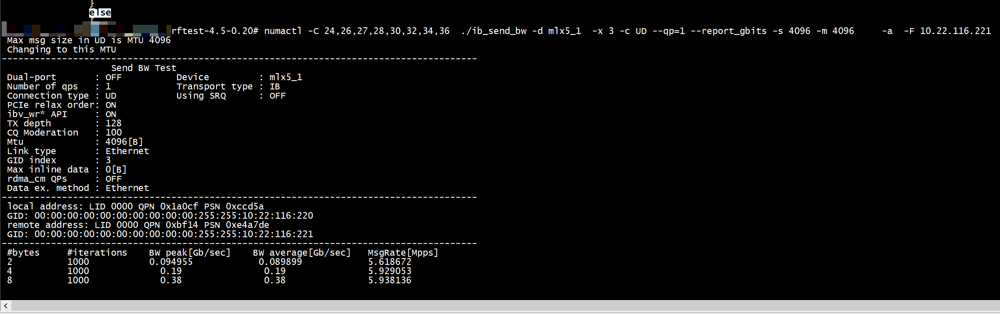

# duration_param
```
multiple definition of `duration_param'; libperftest.a(perftest_resources.o):/root/rdma-benckmark/perftest/src/perftest_resources.c:26: first defined here
```

perftest_resources.c中struct perftest_parameters前面加个static    
```
static struct perftest_parameters* duration_param;

```
# stack smashing detected 

```
numactl -C 24,26,27,28,30,32,34,36  ./ib_send_bw -d mlx5_1  -x 3 -c UD --qp=1 --report_gbits -s 1024 -m 1024     -a  -F 10.22.116.221 
 Max msg size in UD is MTU 1024
 Changing to this MTU
 check MTU over
*** stack smashing detected ***: terminated
Aborted
```


```
./ib_send_bw -V
Version: 5.5
```


```
ib_send_bw  -V
Version: 6.06
```
将代码更新为如下

```

                                /*fix a buffer overflow issue in ppc.*/
                                size_of_cur = sizeof(char[2]);
                                //size_of_cur = (strverscmp(user_param->rem_version, "5.31") >= 0) ? sizeof(char[2]) : sizeof(int);
```

# pertest

英伟达安装的ib_send_bw     
```
ib_send_bw  -V
Version: 6.06
```
[下载perftest-4.5-0.20](https://github.com/linux-rdma/perftest/releases/tag/v4.5-0.20)    
```
root@ljtest:~/rdma-benckmark/perftest-4.5-0.20# ./ib_send_bw  -V
Version: 6.10
root@ljtest:~/rdma-benckmark/perftest-4.5-0.20# 
```
