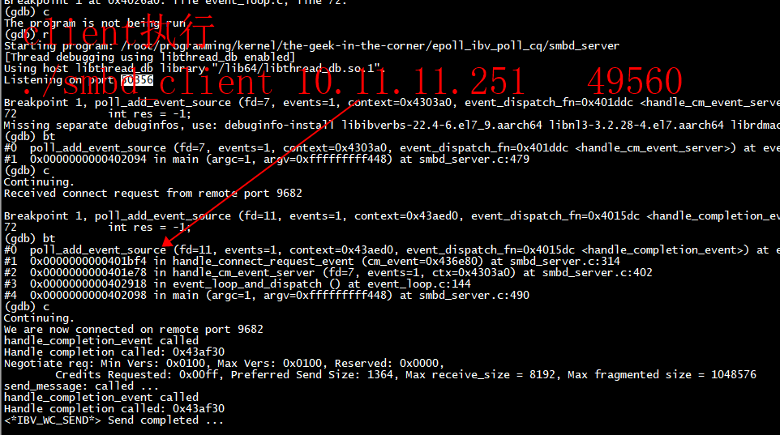

# epoll 回调函数

**handle_completion_event->ibv_poll_cq**

```
poll_add_event_source(connection->comp_chan->fd,
                                  EPOLLIN,
                                  connection,
                                  handle_completion_event)
```


#  接受client新建连接
**1)** rdma_get_cm_event(ev_chan, &cm_event)  
**2)** struct rdma_cm_id *connect_id = cm_event->id;  
**3)** connection->comp_chan = ibv_create_comp_channel(connect_id->verbs);  
**4)** connection->cq = ibv_create_cq(connect_id->verbs,5,NULL,connection->comp_chan,0);  
**5)**  poll_add_event_source(connection->comp_chan->fd,EPOLLIN,connection,handle_completion_event)  
**6)**  handle_completion_event --> ibv_poll_cq


```
(gdb) bt
#0  poll_add_event_source (fd=11, events=1, context=0x43aed0, event_dispatch_fn=0x4015dc <handle_completion_event>) at event_loop.c:72
#1  0x0000000000401bf4 in handle_connect_request_event (cm_event=0x436e80) at smbd_server.c:314
#2  0x0000000000401e78 in handle_cm_event_server (fd=7, events=1, ctx=0x4303a0) at smbd_server.c:402
#3  0x0000000000402918 in event_loop_and_dispatch () at event_loop.c:144
#4  0x0000000000402098 in main (argc=1, argv=0xfffffffff448) at smbd_server.c:490
(gdb) c
```



## spdk

**1)** rdma_get_cm_event(rtransport->event_channel, &event)   
**2)** poller->cq = ibv_create_cq(device->context, num_cqe, poller, NULL, 0);  // 第四个参数是NULL，没有channel   
**3)** reaped = ibv_poll_cq(rpoller->cq, 32, wc);   
没有去调用ibv_create_comp_channel

spdk采用了01_basic-client-server类似的机制， 但是没有调用 ibv_get_cq_event 和ibv_req_notify_cq   
调用ibv_req_notify_cq()检查CQ上是否有WC，如果有就生成event（通知）。后面调用ibv_get_cq_event()就能读出event，就知道cq有WC，再调用ibv_poll_cq（）从cq中获取WC   
```
void build_context(struct ibv_context *verbs)
{
  if (s_ctx) {
    if (s_ctx->ctx != verbs)
      die("cannot handle events in more than one context.");

    return;
  }

  s_ctx = (struct context *)malloc(sizeof(struct context));

  s_ctx->ctx = verbs;

  TEST_Z(s_ctx->pd = ibv_alloc_pd(s_ctx->ctx));
  TEST_Z(s_ctx->comp_channel = ibv_create_comp_channel(s_ctx->ctx));
  TEST_Z(s_ctx->cq = ibv_create_cq(s_ctx->ctx, 10, NULL, s_ctx->comp_channel, 0)); /* cqe=10 is arbitrary */
  TEST_NZ(ibv_req_notify_cq(s_ctx->cq, 0));

  TEST_NZ(pthread_create(&s_ctx->cq_poller_thread, NULL, poll_cq, NULL));
}
```
   


# server

```
[root@centos7 epoll_ibv_poll_cq]# ./smbd_server  
Listening on port 58596
Received connect request from remote port 51159
We are now connected on remote port 51159
handle_completion_event called
Handle completion called: 0x109aaf30
Negotiate req: Min Vers: 0x0100, Max Vers: 0x0100, Reserved: 0x0000, 
        Credits Requested: 0x00ff, Preferred Send Size: 1364, Max receive_size = 8192, Max fragmented size = 1048576
send_message: called ...
handle_completion_event called
Handle completion called: 0x109aaf30
<*IBV_WC_SEND*> Send completed ...
```

# client

```
root@ubuntu:~# ./smbd_client 10.11.11.251   58596
Connecting on port 0
handle_address_resolved_event: Received address resolved event
handle_route_resolved_event called
We are now connected on remote port 58596
send_message: called ...
handle_completion_event called
Handle completion called:
SEND completed
handle_completion_event called
Handle completion called:
Received Negotiate Resp
        Min version: 0x0100,Max version: 0x0100, Negotiated Version: 0x0100, Reserved: 0x0000
        Credits requested: 255 Credits granted: 255, Status: 0, Max Read/Write Size: 1048576
```
