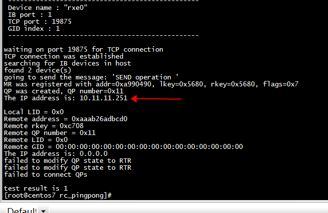
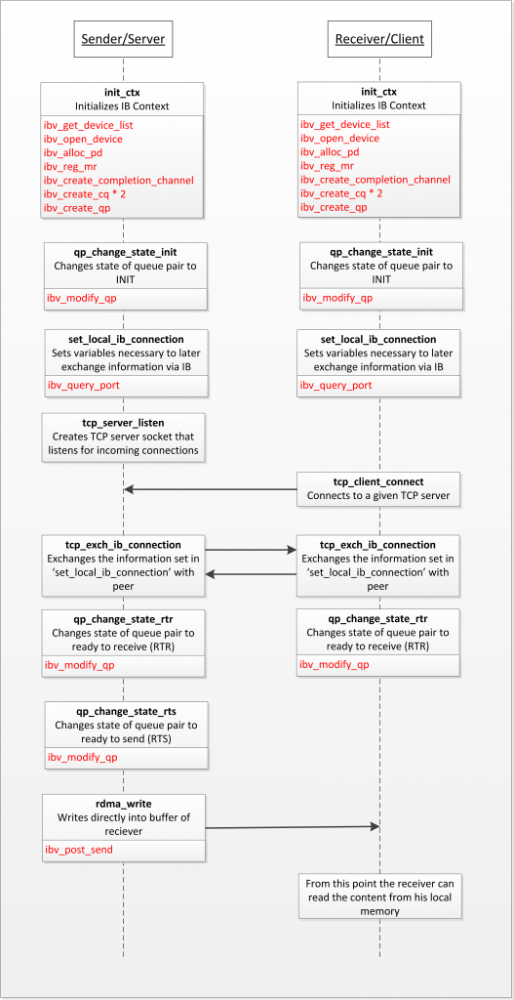

# build

```
 gcc  -Wall  -g -O2 ibv_demo.c   -libverbs -o  ibv_demo
```
# GID

```Shell
[root@centos7 rc_pingpong]#  ibv_devinfo -d rxe0 -v
hca_id: rxe0
        transport:                      InfiniBand (0)
        fw_ver:                         0.0.0
        node_guid:                      b208:75ff:fe5f:b85e
        sys_image_guid:                 0000:0000:0000:0000
        vendor_id:                      0x0000
        vendor_part_id:                 0
        hw_ver:                         0x0
        phys_port_cnt:                  1
        max_mr_size:                    0xffffffffffffffff
        page_size_cap:                  0xfffff000
        max_qp:                         65536
        max_qp_wr:                      16384
        device_cap_flags:               0x00203c76
                                        BAD_PKEY_CNTR
                                        BAD_QKEY_CNTR
                                        AUTO_PATH_MIG
                                        CHANGE_PHY_PORT
                                        UD_AV_PORT_ENFORCE
                                        PORT_ACTIVE_EVENT
                                        SYS_IMAGE_GUID
                                        RC_RNR_NAK_GEN
                                        SRQ_RESIZE
                                        MEM_MGT_EXTENSIONS
        max_sge:                        32
        max_sge_rd:                     32
        max_cq:                         16384
        max_cqe:                        32767
        max_mr:                         2048
        max_pd:                         32764
        max_qp_rd_atom:                 128
        max_ee_rd_atom:                 0
        max_res_rd_atom:                258048
        max_qp_init_rd_atom:            128
        max_ee_init_rd_atom:            0
        atomic_cap:                     ATOMIC_HCA (1)
        max_ee:                         0
        max_rdd:                        0
        max_mw:                         0
        max_raw_ipv6_qp:                0
        max_raw_ethy_qp:                0
        max_mcast_grp:                  8192
        max_mcast_qp_attach:            56
        max_total_mcast_qp_attach:      458752
        max_ah:                         100
        max_fmr:                        0
        max_srq:                        960
        max_srq_wr:                     16384
        max_srq_sge:                    27
        max_pkeys:                      64
        local_ca_ack_delay:             15
        general_odp_caps:
        rc_odp_caps:
                                        NO SUPPORT
        uc_odp_caps:
                                        NO SUPPORT
        ud_odp_caps:
                                        NO SUPPORT
        completion_timestamp_mask not supported
        core clock not supported
        device_cap_flags_ex:            0x0
        tso_caps:
        max_tso:                        0
        rss_caps:
                max_rwq_indirection_tables:                     0
                max_rwq_indirection_table_size:                 0
                rx_hash_function:                               0x0
                rx_hash_fields_mask:                            0x0
        max_wq_type_rq:                 0
        packet_pacing_caps:
                qp_rate_limit_min:      0kbps
                qp_rate_limit_max:      0kbps
        tag matching not supported
                port:   1
                        state:                  PORT_ACTIVE (4)
                        max_mtu:                4096 (5)
                        active_mtu:             1024 (3)
                        sm_lid:                 0
                        port_lid:               0
                        port_lmc:               0x00
                        link_layer:             Ethernet
                        max_msg_sz:             0x800000
                        port_cap_flags:         0x00890000
                        port_cap_flags2:        0x0000
                        max_vl_num:             1 (1)
                        bad_pkey_cntr:          0x0
                        qkey_viol_cntr:         0x0
                        sm_sl:                  0
                        pkey_tbl_len:           64
                        gid_tbl_len:            1024
                        subnet_timeout:         0
                        init_type_reply:        0
                        active_width:           1X (1)
                        active_speed:           2.5 Gbps (1)
                        phys_state:             LINK_UP (5)
                        GID[  0]:               fe80:0000:0000:0000:b208:75ff:fe5f:b85e
                        GID[  1]:               0000:0000:0000:0000:0000:ffff:0a0b:0bfb

[root@centos7 rc_pingpong]# 
```

```Shell
6: enp125s0f3: <BROADCAST,MULTICAST,UP,LOWER_UP> mtu 1500 qdisc pfifo_fast state UP group default qlen 1000
    link/ether b0:08:75:5f:b8:5e brd ff:ff:ff:ff:ff:ff
    inet 10.11.11.251/24 scope global enp125s0f3
       valid_lft forever preferred_lft forever
```

GID[  1]:               0000:0000:0000:0000:0000:ffff:0a0b:0bfb是ip地址  


## rdma_gid2ip

```
/* Important - sockaddr should be a union of sockaddr_in and sockaddr_in6 */
static inline void rdma_gid2ip(struct sockaddr *out, union ibv_gid *gid)
{
#if 0
        if (ipv6_addr_v4mapped((struct in6_addr *)gid)) {
                struct sockaddr_in *out_in = (struct sockaddr_in *)out;
                memset(out_in, 0, sizeof(*out_in));
                out_in->sin_family = AF_INET;
                memcpy(&out_in->sin_addr.s_addr, gid->raw + 12, 4);
        } else {
                struct sockaddr_in6 *out_in = (struct sockaddr_in6 *)out;
                memset(out_in, 0, sizeof(*out_in));
                out_in->sin6_family = AF_INET6;
                memcpy(&out_in->sin6_addr.s6_addr, gid->raw, 16);
        }
#else
            struct sockaddr_in *out_in = (struct sockaddr_in *)out;
            memset(out_in, 0, sizeof(*out_in));
            out_in->sin_family = AF_INET;
            memcpy(&out_in->sin_addr.s_addr, gid->raw + 12, 4);
#endif
}
// static inline void rdma_gid2ip(struct sockaddr *out, union ib_gid *gid)
static int print_ip(union ibv_gid *gid)
{
      struct sockaddr gid_addr;
      char ipAddress[INET_ADDRSTRLEN];
      struct sockaddr_in *ipv4 = (struct sockaddr_in *)&gid_addr;
      //union irdma_sockaddr gid_addr;
      //rdma_gid2ip((struct sockaddr *)&gid_addr, gid);
      rdma_gid2ip(&gid_addr, gid);
      inet_ntop(AF_INET, &(ipv4->sin_addr), ipAddress, INET_ADDRSTRLEN);
      printf("The IP address is: %s\n", ipAddress);

      return 0;
}
```

## port id


```
static int print_port(const struct ibv_port_attr * port_attr)
{

printf("\t\t\tstate:\t\t\t%s (%d)\n",
       port_state_str(port_attr->state), port_attr->state);
printf("\t\t\tsm_lid:\t\t\t%d\n", port_attr->sm_lid);
printf("\t\t\tport_lid:\t\t%d\n", port_attr->lid);
printf("\t\t\tport_lmc:\t\t0x%02x\n", port_attr->lmc);
printf("\t\t\tlink_layer:\t\t%s\n",
                                link_layer_str(port_attr->link_layer));
      return 0;
}
```


# test1

## server

```Shell
[root@centos7 rc_pingpong]# ./ibv_demo  -d rxe0 -g 1
 ------------------------------------------------
 Device name : "rxe0"
 IB port : 1
 TCP port : 19875
 GID index : 1
 ------------------------------------------------

waiting on port 19875 for TCP connection
TCP connection was established
searching for IB devices in host
found 1 device(s)
                        state:                  PORT_ACTIVE (4)
                        sm_lid:                 0
                        port_lid:               0
                        port_lmc:               0x00
                        link_layer:             Ethernet
going to send the message: 'SEND operation '
MR was registered with addr=0x15d10490, lkey=0x10316, rkey=0x10316, flags=0x7
QP was created, QP number=0x111
The IP address is: 10.11.11.251

Local LID = 0x0
Remote address = 0xaaaaf1bb7cd0
Remote rkey = 0x2db8b
Remote QP number = 0x38
Remote LID = 0x0
Remote GID = 00:00:00:00:00:00:00:00:00:00:ff:ff:0a:0b:0b:52
Modified QP state to RTR
QP state was change to RTS
Contents of server buffer: 'RDMA write operaion '

test result is 0

```


## client


```Shell
root@ubuntu:~/the-geek-in-the-corner# ./ibv_demo  10.11.11.251  -d rxe0  -g 1
 ------------------------------------------------
 Device name : "rxe0"
 IB port : 1
 IP : 10.11.11.251
 TCP port : 19875
 GID index : 1
 ------------------------------------------------

TCP connection was established
searching for IB devices in host
found 1 device(s)
MR was registered with addr=0xaaaaf1bb7cd0, lkey=0x2db8b, rkey=0x2db8b, flags=0x7
QP was created, QP number=0x38

Local LID = 0x0
Remote address = 0x15d10490
Remote rkey = 0x10316
Remote QP number = 0x111
Remote LID = 0x0
Remote GID = 00:00:00:00:00:00:00:00:00:00:ff:ff:0a:0b:0b:fb
Receive Request was posted
Modified QP state to RTR
QP state was change to RTS
Message is: ''
RDMA Read Request was posted
completion was found in CQ with status 0x0
Contents of server's buffer: 'RDMA read operat'
Now replacing it with: 'RDMA write operation'
RDMA Write Request was posted
completion was found in CQ with status 0x0

test result is 0


```

##  failed to modify QP state to RTR

```
                        GID[  0]:               fe80:0000:0000:0000:b208:75ff:fe5f:b85e
                        GID[  1]:               0000:0000:0000:0000:0000:ffff:0a0b:0bfb
```
gid index 导致错误   

```
[root@centos7 rc_pingpong]# ./ibv_demo  -d rxe0 -g 0
 ------------------------------------------------
 Device name : "rxe0"
 IB port : 1
 TCP port : 19875
 GID index : 0
 ------------------------------------------------

waiting on port 19875 for TCP connection
TCP connection was established
searching for IB devices in host
found 1 device(s)
                        state:                  PORT_ACTIVE (4)
                        sm_lid:                 0
                        port_lid:               0
                        port_lmc:               0x00
                        link_layer:             Ethernet
going to send the message: 'SEND operation '
MR was registered with addr=0x39490490, lkey=0x1038b, rkey=0x1038b, flags=0x7
QP was created, QP number=0x111
The IP address is: 254.95.184.94

Local LID = 0x0
Remote address = 0xaaaaf4a4bcd0
Remote rkey = 0x2db45
Remote QP number = 0x38
Remote LID = 0x0
Remote GID = fe:80:00:00:00:00:00:00:4a:57:02:ff:fe:64:e7:ac
failed to modify QP state to RTR
failed to modify QP state to RTR
failed to connect QPs

test result is 1
```
 


# rxe ip header


```
static void prepare_udp_hdr(struct sk_buff *skb, __be16 src_port,
                            __be16 dst_port)
{
        struct udphdr *udph;

        __skb_push(skb, sizeof(*udph));
        skb_reset_transport_header(skb);
        udph = udp_hdr(skb);

        udph->dest = dst_port;
        udph->source = src_port;
        udph->len = htons(skb->len);
        udph->check = 0;
}

static void prepare_ipv4_hdr(struct dst_entry *dst, struct sk_buff *skb,
                             __be32 saddr, __be32 daddr, __u8 proto,
                             __u8 tos, __u8 ttl, __be16 df, bool xnet)
{
        struct iphdr *iph;

        skb_scrub_packet(skb, xnet);

        skb_clear_hash(skb);
        skb_dst_set(skb, dst_clone(dst));
        memset(IPCB(skb), 0, sizeof(*IPCB(skb)));

        skb_push(skb, sizeof(struct iphdr));
        skb_reset_network_header(skb);

        iph = ip_hdr(skb);

        iph->version    =       IPVERSION;
        iph->ihl        =       sizeof(struct iphdr) >> 2;
        iph->tot_len    =       htons(skb->len);
        iph->frag_off   =       df;
        iph->protocol   =       proto;
        iph->tos        =       tos;
        iph->daddr      =       daddr;
        iph->saddr      =       saddr;
        iph->ttl        =       ttl;
        __ip_select_ident(dev_net(dst->dev), iph,
                          skb_shinfo(skb)->gso_segs ?: 1);
}
```

## gid2ip



```
 rc =
        ibv_query_gid (res->ib_ctx, config.ib_port, config.gid_idx, &my_gid);
      if (rc)
        {
          fprintf (stderr, "could not get gid for port %d, index %d\n",
                   config.ib_port, config.gid_idx);
          return rc;
        }
        else
        {
             print_ip(&my_gid);
        }
```

```C
/* Important - sockaddr should be a union of sockaddr_in and sockaddr_in6 */
static inline void rdma_gid2ip(struct sockaddr *out, union ibv_gid *gid)
{
#if 0
        if (ipv6_addr_v4mapped((struct in6_addr *)gid)) {
                struct sockaddr_in *out_in = (struct sockaddr_in *)out;
                memset(out_in, 0, sizeof(*out_in));
                out_in->sin_family = AF_INET;
                memcpy(&out_in->sin_addr.s_addr, gid->raw + 12, 4);
        } else {
                struct sockaddr_in6 *out_in = (struct sockaddr_in6 *)out;
                memset(out_in, 0, sizeof(*out_in));
                out_in->sin6_family = AF_INET6;
                memcpy(&out_in->sin6_addr.s6_addr, gid->raw, 16);
        }
#else
            struct sockaddr_in *out_in = (struct sockaddr_in *)out;
            memset(out_in, 0, sizeof(*out_in));
            out_in->sin_family = AF_INET;
            memcpy(&out_in->sin_addr.s_addr, gid->raw + 12, 4);
#endif
}
// static inline void rdma_gid2ip(struct sockaddr *out, union ib_gid *gid)
static int print_ip(union ibv_gid *gid)
{
      struct sockaddr gid_addr;
      char ipAddress[INET_ADDRSTRLEN];
      struct sockaddr_in *ipv4 = (struct sockaddr_in *)&gid_addr;
      //union irdma_sockaddr gid_addr;
      //rdma_gid2ip((struct sockaddr *)&gid_addr, gid);
      rdma_gid2ip(&gid_addr, gid);
      inet_ntop(AF_INET, &(ipv4->sin_addr), ipAddress, INET_ADDRSTRLEN);
      printf("The IP address is: %s\n", ipAddress);

      return 0;
}
```

## struct ibv_qp

***本地qp_num***

```
 memset (&qp_init_attr, 0, sizeof (qp_init_attr));
  qp_init_attr.qp_type = IBV_QPT_RC;
  qp_init_attr.sq_sig_all = 1;
  qp_init_attr.send_cq = res->cq;
  qp_init_attr.recv_cq = res->cq;
  qp_init_attr.cap.max_send_wr = 1;
  qp_init_attr.cap.max_recv_wr = 1;
  qp_init_attr.cap.max_send_sge = 1;
  qp_init_attr.cap.max_recv_sge = 1;
  res->qp = ibv_create_qp (res->pd, &qp_init_attr);
  if (!res->qp)
    {
      fprintf (stderr, "failed to create QP\n");
      rc = 1;
      goto resources_create_exit;
    }
  fprintf (stdout, "QP was created, QP number=0x%x\n", res->qp->qp_num);
```

modify_qp_to_init、 modify_qp_to_rts、modify_qp_to_rtr、  
  在将QP的状态设置为RTR时，还需要填充其它一些属性，包括远端的地址信息(LID, QPN, PSN, GID)等。如果不使用RDMA CM verb API，则需要使用其它方式，比如基于TCP/IP的socket通信，在client/server间交换该信息，例如rc_pingpong@pp_client_exch_dest。client先将自己的***(LID, QPN, PSN, GID)***发送到server，server端读取到这些信息，保存起来，同时将自己的***(LID, QPN, PSN,GID)***发给client。client收到这些信息后，就可以将QP设置为RTR状态了    

# references

[RDMA学习笔记](http://leevj.com/post_wukan/2019-09-28-RDMA%E5%AD%A6%E4%B9%A0%E7%AC%94%E8%AE%B0/)