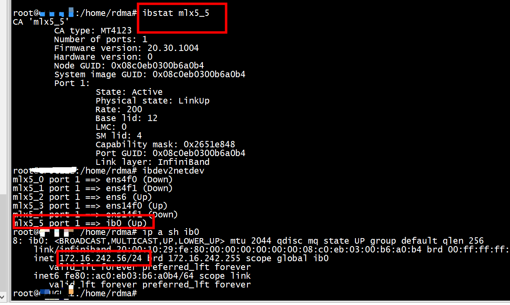
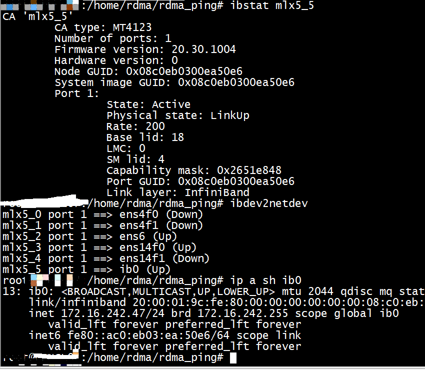
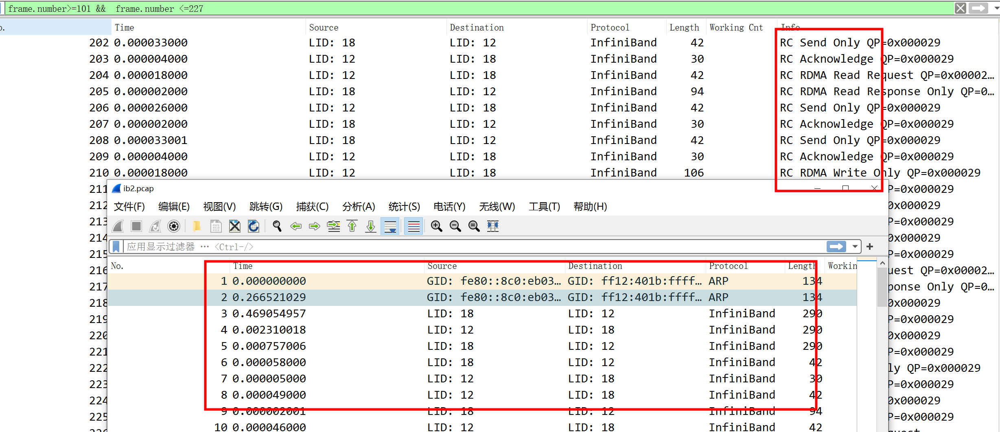

# rping

An utility to test ib device and rdma connection

## build


```
gcc -c rcommon.c -w -o rcommon.o -lpthread -lrdmacm -libverbs
gcc -c rserver.c -w -o rserver.o -lpthread -lrdmacm -libverbs
gcc -c rclient.c -w -o rclient.o -lpthread -lrdmacm -libverbs
gcc -c rping.c -w -o rping.o -lpthread -lrdmacm -libverbs
gcc rcommon.o rserver.o rclient.o rping.o -o rping_test -lpthread -lrdmacm -libverbs
```


# How to test!

### Check rdma_rxe driver 
```
[abc@fed ~]$ modinfo rdma_rxe
filename:       /lib/modules/5.6.6-300.fc32.x86_64/kernel/drivers/infiniband/sw/rxe/rdma_rxe.ko.xz
alias:          rdma-link-rxe
license:        Dual BSD/GPL
description:    Soft RDMA transport
```

 ### Load driver
 ```
 [abc@fed ~]$ modprobe rdma_rxe
 [abc@fed ~]$ lsmod | grep rdma_rxe
rdma_rxe              139264  0
ib_uverbs             147456  2 rdma_rxe,rdma_ucm
ip6_udp_tunnel         16384  1 rdma_rxe
udp_tunnel             16384  1 rdma_rxe
ib_core               405504  13 rdma_cm,ib_ipoib,rdma_rxe,rpcrdma,ib_srpt,ib_srp,iw_cm,ib_iser,ib_umad,ib_isert,rdma_ucm,ib_uverbs,ib_cm
```

### Add soft rdma links
```
[abc@fed ~]$ sudo rdma link add roce8 type rxe netdev enp0s8
[abc@fed ~]$ rdma link 
link rocep0s8/1 state ACTIVE physical_state LINK_UP netdev enp0s8 
```

###  IPoIB

 IPoIB（Internet Protocol over InfiniBand），指利用物理IB网络（包括服务器上的IB卡、IB连接线、IB交换机等）通过IP协议进行连接，并进行数据传输。它提供了基于RDMA之上的IP网络模拟层，允许应用无修改的运行在Infiniband网络上。但是，IPoIB性能比RDMA通信方式性能要低，大多数应用都会采用RDMA方式获取高带宽低延时的收益，少数的关键应用会采用IPoIB方式通信。IPoIB 仍然经过内核层（IP Stack），即会产生大量系统调用，并且涉及 CPU 中断，没有充分发挥  Infiniband 网卡的性能。   

```
root@ubuntu:/home/ubuntu# ethtool -i ib0
driver: mlx5_core[ib_ipoib]
version: 4.9-5.1.0
firmware-version: 20.30.1004 (MT_0000000226)
expansion-rom-version: 
bus-info: 0000:b1:00.0
supports-statistics: yes
supports-test: yes
supports-eeprom-access: no
supports-register-dump: no
supports-priv-flags: yes
root@ubuntu:/home/ubuntu# lspci -k | grep 'b1:00.0' -A 6
b1:00.0 Infiniband controller: Mellanox Technologies MT28908 Family [ConnectX-6]
        Subsystem: Mellanox Technologies MT28908 Family [ConnectX-6]
        Kernel driver in use: mlx5_core
        Kernel modules: mlx5_core
c9:00.0 System peripheral: Intel Corporation Device 09a2 (rev 04)
        Subsystem: Intel Corporation Device 0000
c9:00.1 System peripheral: Intel Corporation Device 09a4 (rev 04)
root@ubuntu:/home/ubuntu#
```

###  rping based on ib

## server



```
./rping_test -s -a 172.16.242.56 -v -C 10
server ping data: rdma-ping-0: ABCDEFGHIJKLMNOPQRSTUVWXYZ[\]^_`abcdefghijklmnopqr
server ping data: rdma-ping-1: BCDEFGHIJKLMNOPQRSTUVWXYZ[\]^_`abcdefghijklmnopqrs
server ping data: rdma-ping-2: CDEFGHIJKLMNOPQRSTUVWXYZ[\]^_`abcdefghijklmnopqrst
server ping data: rdma-ping-3: DEFGHIJKLMNOPQRSTUVWXYZ[\]^_`abcdefghijklmnopqrstu
server ping data: rdma-ping-4: EFGHIJKLMNOPQRSTUVWXYZ[\]^_`abcdefghijklmnopqrstuv
server ping data: rdma-ping-5: FGHIJKLMNOPQRSTUVWXYZ[\]^_`abcdefghijklmnopqrstuvw
server ping data: rdma-ping-6: GHIJKLMNOPQRSTUVWXYZ[\]^_`abcdefghijklmnopqrstuvwx
server ping data: rdma-ping-7: HIJKLMNOPQRSTUVWXYZ[\]^_`abcdefghijklmnopqrstuvwxy
server ping data: rdma-ping-8: IJKLMNOPQRSTUVWXYZ[\]^_`abcdefghijklmnopqrstuvwxyz
server ping data: rdma-ping-9: JKLMNOPQRSTUVWXYZ[\]^_`abcdefghijklmnopqrstuvwxyzA
server DISCONNECT EVENT...
wait for RDMA_READ_ADV state 10
```

## client


```
./rping_test -c -a 172.16.242.56 -d -C 10
count 10
created cm_id 0x5577bcd6d800
cma_event type RDMA_CM_EVENT_ADDR_RESOLVED cma_id 0x5577bcd6d800 (parent)
cma_event type RDMA_CM_EVENT_ROUTE_RESOLVED cma_id 0x5577bcd6d800 (parent)
rdma_resolve_addr - rdma_resolve_route successful
created pd 0x5577bcd6a7f0
created channel 0x5577bcd67720
created cq 0x5577bcd6db90
created qp 0x5577bcd6dec8
rping_setup_buffers called on cb 0x5577bcd66c50
allocated & registered buffers...
cq_thread started.
cma_event type RDMA_CM_EVENT_ESTABLISHED cma_id 0x5577bcd6d800 (parent)
ESTABLISHED
rmda_connect successful
RDMA addr 5577bcd675f0 rkey f9d8 len 64
send completion
recv completion
RDMA addr 5577bcd6e290 rkey e8c8 len 64
send completion
recv completion
RDMA addr 5577bcd675f0 rkey f9d8 len 64
send completion
recv completion
RDMA addr 5577bcd6e290 rkey e8c8 len 64
send completion
recv completion
RDMA addr 5577bcd675f0 rkey f9d8 len 64
send completion
recv completion
RDMA addr 5577bcd6e290 rkey e8c8 len 64
send completion
recv completion
RDMA addr 5577bcd675f0 rkey f9d8 len 64
send completion
recv completion
RDMA addr 5577bcd6e290 rkey e8c8 len 64
send completion
recv completion
RDMA addr 5577bcd675f0 rkey f9d8 len 64
send completion
recv completion
RDMA addr 5577bcd6e290 rkey e8c8 len 64
send completion
recv completion
RDMA addr 5577bcd675f0 rkey f9d8 len 64
send completion
recv completion
RDMA addr 5577bcd6e290 rkey e8c8 len 64
send completion
recv completion
RDMA addr 5577bcd675f0 rkey f9d8 len 64
send completion
recv completion
RDMA addr 5577bcd6e290 rkey e8c8 len 64
send completion
recv completion
RDMA addr 5577bcd675f0 rkey f9d8 len 64
send completion
recv completion
RDMA addr 5577bcd6e290 rkey e8c8 len 64
send completion
recv completion
RDMA addr 5577bcd675f0 rkey f9d8 len 64
send completion
recv completion
RDMA addr 5577bcd6e290 rkey e8c8 len 64
send completion
recv completion
RDMA addr 5577bcd675f0 rkey f9d8 len 64
send completion
recv completion
RDMA addr 5577bcd6e290 rkey e8c8 len 64
send completion
recv completion
rping_free_buffers called on cb 0x5577bcd66c50
cma_event type RDMA_CM_EVENT_DISCONNECTED cma_id 0x5577bcd6d800 (parent)
client DISCONNECT EVENT...
destroy cm_id 0x5577bcd6d800
```

## ibdump

```
ibdump -i 1 -d  mlx5_5 -s  -w /tmp/traces/capture1.pcap 
```


## Main Repos
| Repo | link |
| ------ | ------ |
| rdma-core | https://github.com/linux-rdma/rdma-core |
| librdmacm | https://github.com/ofiwg/librdmacm |