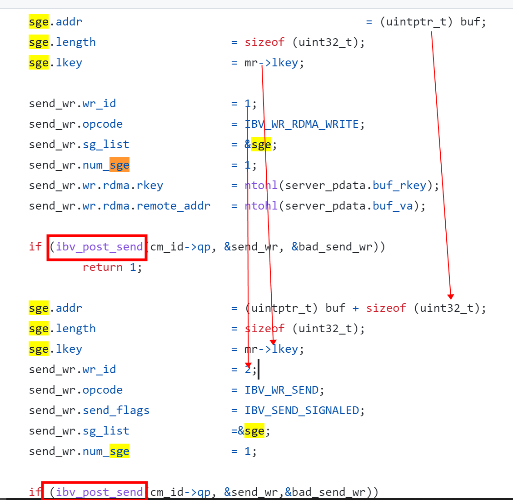
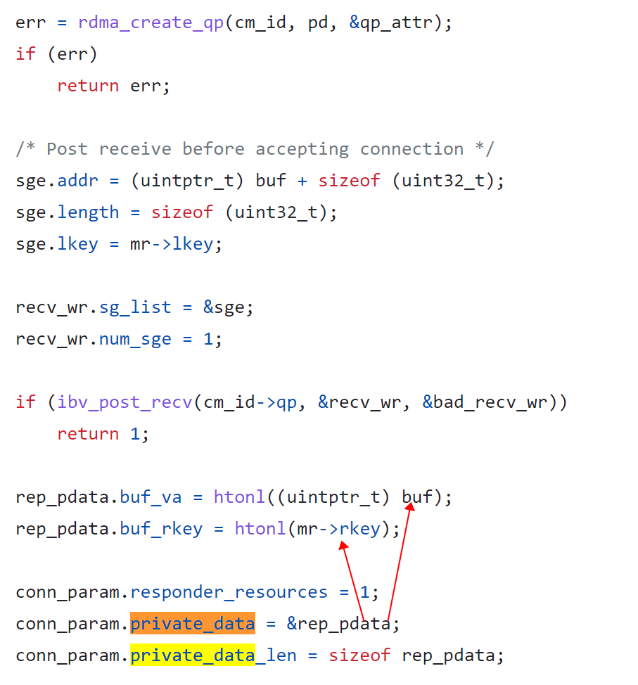
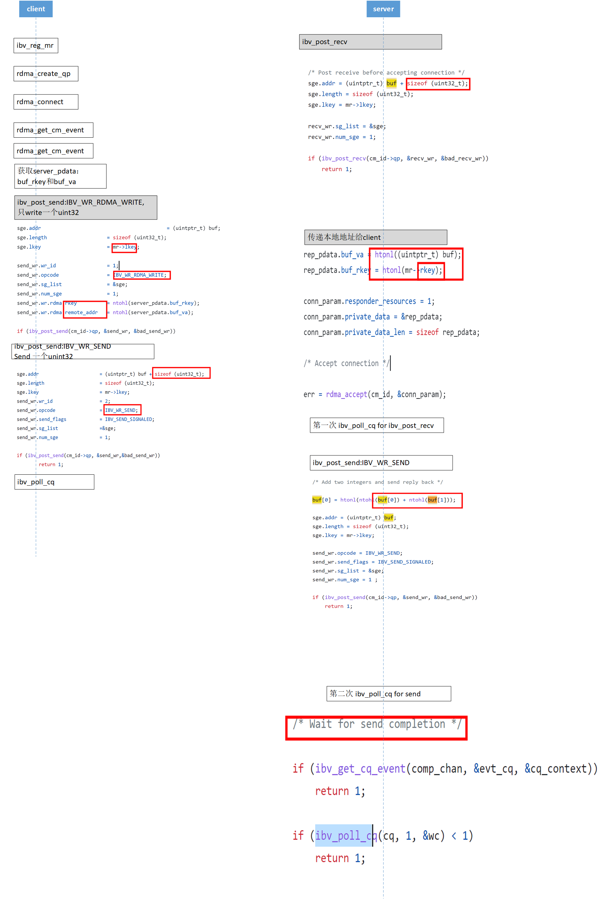

# RDMA-example-application
Writing RDMA applications on Linux Example programs  by Roland Dreier.

source: http://www.digitalvampire.org/rdma-tutorial-2007/notes.pdf

# use

please make sure you have  rdma  and libibverbs  library.

## compiler
client :

$ cc -o client client.c -lrdmacm -libverbs

server :

$ cc -o server server.c -lrdmacm -libverbs

| @shrebhan thanks! 

## run
server :

$ ./server

client : ( syntax:  client [servername] [val1] [val2] )

$./client  10.11.11.251 163 36
163 + 36 = 199

# client

##  使用同一个lkey传输多个内存地址




max_send_wr = 2 发送两个
max_recv_wr = 1 接收一个

```
	qp_attr.cap.max_send_wr = 2; 
	qp_attr.cap.max_send_sge = 1;
	qp_attr.cap.max_recv_wr = 1; 
	qp_attr.cap.max_recv_sge = 1; 

	qp_attr.send_cq        = cq;
	qp_attr.recv_cq        = cq;
	qp_attr.qp_type        = IBV_QPT_RC;
```
## 如何获取 remote 内存 addr 

```
memcpy(&server_pdata, event->param.conn.private_data, sizeof server_pdata);
```

```
send_wr.wr.rdma.rkey          = ntohl(server_pdata.buf_rkey);
send_wr.wr.rdma.remote_addr   = ntohl(server_pdata.buf_va);
```

#  server

## 发送本地内存的remote key 给 client





 