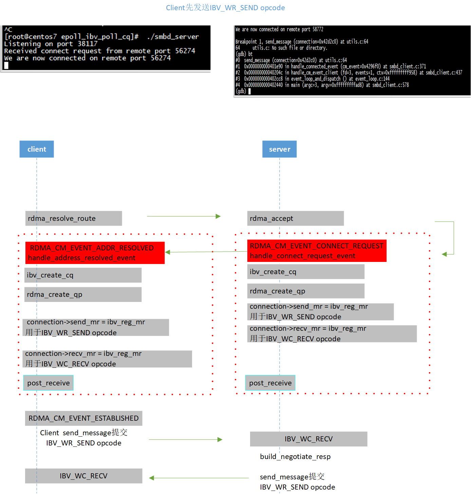
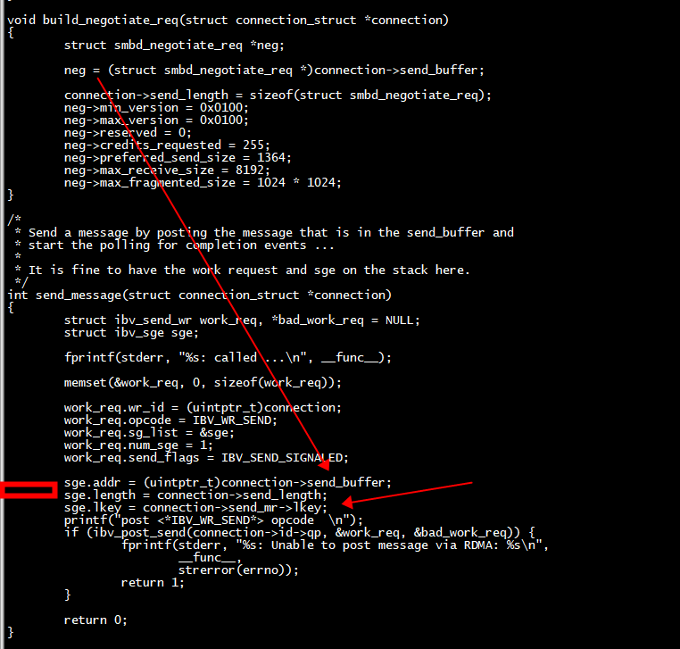
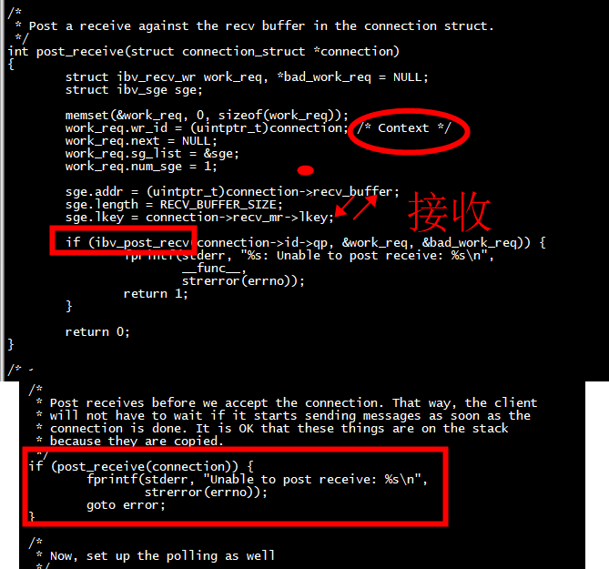

# server
```
[root@centos7 epoll_ibv_poll_cq]#  ./smbd_server
Listening on port 35760
Received connect request from remote port 37593
We are now connected on remote port 37593
handle_completion_event called
Handle completion called: 0x862af30
Negotiate req: Min Vers: 0x0100, Max Vers: 0x0100, Reserved: 0x0000, 
        Credits Requested: 0x00ff, Preferred Send Size: 1364, Max receive_size = 8192, Max fragmented size = 1048576
send_message: called ...
post <*IBV_WR_SEND*> opcode  
handle_completion_event called
Handle completion called: 0x862af30
<*IBV_WC_SEND*> Send completed ...
```



# IBV_WR_SEND opcode 内存


# IBV_WC_RECV opcode 内存
