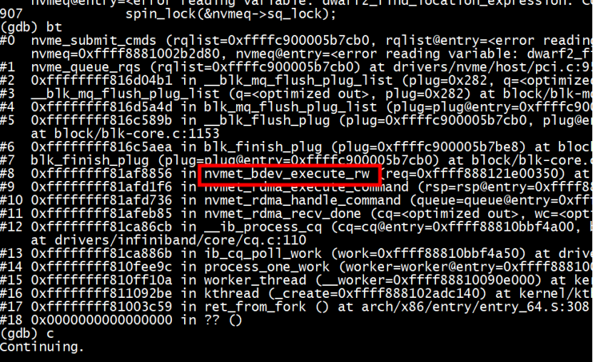

# server
IP:  
```
static int __init rdma_init(void) {
        int ret;
        struct sockaddr_in *addr;
//      char *ip = "192.168.122.152";
        char *ip = "10.11.11.251";
```

## 处理新连接 RDMA_CM_EVENT_CONNECT_REQUEST

```
pd = ib_alloc_pd(cm_id->device, 0);
cq = do_alloc_cq(cm_id);
err = do_alloc_qp(cm_id, pd, cq);
add_to_connection_list(cm_id, pd, cq)
rdma_accept(cm_id, &conn_param)
```

# client
IP:
```

static int __init rdma_init(void)
{
        int ret = 0;
        struct sockaddr_in *addr;
        char *s_ip = "10.11.11.251";
        //char *s_ip = "192.168.122.152";
        char _addr[16] = {0};
        int port = 1;
```

## callback

```C
rdma_recv_done
rdma_send_done
rdma_rdma_read_done
rdma_reg_mr_done
```
### rdma_reg_mr_done 没有被调用 

IB_WR_SEND操作设置IB_SEND_SIGNALED标志  

```
     rdma_d->reg_mr_wr.wr.num_sge = 0;
     rdma_d->reg_mr_wr.wr.send_flags = IB_SEND_SIGNALED;
```

## cq 接口

采用callback（xx_done）,没有采用ib_create_cq（kping）

```

static struct ib_cq *do_alloc_cq(struct rdma_cm_id *cm_id)
{
        struct ib_cq_init_attr cq_attr = {0};

        cq_attr.cqe = 128 * 2;
        cq_attr.comp_vector = 0;
        return ib_alloc_cq(cm_id->device, cm_id, 128 * 2, 0, IB_POLL_WORKQUEUE);
        //return ib_create_cq(cm_id->device, rdma_cq_event_handler, NULL, cm_id, &cq_attr);
}
```
nvme host也是采用ib_alloc_cq   


done被调用


### ib_create_cq（kping）的callback
```C
[106535.956106] [<ffff0000080830b0>] el1_irq+0xb0/0x140
[106535.956108] [<ffff0000080858cc>] arch_cpu_idle+0x44/0x144
[106535.956109] [<ffff000008871b68>] default_idle_call+0x20/0x30
[106535.956110] [<ffff00000812482c>] do_idle+0x158/0x1cc
[106535.956111] [<ffff000008124a3c>] cpu_startup_entry+0x28/0x30
[106535.956112] [<ffff000008091098>] secondary_start_kernel+0x150/0x174
[106535.956161] CPU: 29 PID: 0 Comm: swapper/29 Tainted: G        W  OE  ------------   4.14.0-115.el7a.0.1.aarch64 #1
[106535.956162] Hardware name: Huawei TaiShan 200 (Model 2280)/BC82AMDD, BIOS 1.08 12/14/2019
[106535.956162] Call trace:
[106535.956164] [<ffff000008089e14>] dump_backtrace+0x0/0x23c
[106535.956166] [<ffff00000808a074>] show_stack+0x24/0x2c
[106535.956168] [<ffff0000088568a8>] dump_stack+0x84/0xa8
[106535.956172] [<ffff000001572c48>] krping_cq_event_handler+0x38/0x408 [rdma_krping]
[106535.956178] [<ffff00000149b038>] rxe_send_complete+0xa0/0xbc [rdma_rxe]
[106535.956179] [<ffff0000080dbc54>] tasklet_action+0x88/0x10c
[106535.956179] [<ffff000008081a9c>] __do_softirq+0x11c/0x2f0
[106535.956180] [<ffff0000080db6ac>] irq_exit+0x120/0x150
[106535.956182] [<ffff000008140b08>] __handle_domain_irq+0x78/0xc4
[106535.956183] [<ffff000008081868>] gic_handle_irq+0xa0/0x1b8
[106535.956183] Exception stack(0xffff00001b4cfdf0 to 0xffff00001b4cff3
```

## pd->local_dma_lkey
```
static void init_requests(struct rdma_struct *rdma_d)
{
	// recv request
	rdma_d->recv_sgl.addr = rdma_d->recv_dma_addr;
	rdma_d->recv_sgl.length = PAGE_SIZE;
	rdma_d->recv_sgl.lkey = rdma_d->pd->local_dma_lkey;

	rdma_d->rq_wr.sg_list = &rdma_d->recv_sgl;
	rdma_d->rq_wr.num_sge = 1;
	rdma_d->rq_wr.wr_cqe = &rdma_d->rq_cqe;
	rdma_d->rq_cqe.done = rdma_recv_done;

	// send request
	rdma_d->send_sgl.addr = rdma_d->send_dma_addr;
	rdma_d->send_sgl.length = PAGE_SIZE;
	rdma_d->send_sgl.lkey = rdma_d->pd->local_dma_lkey;
```

## 内存注册

```
static int send_mr(struct rdma_struct *rdma_d)
{
	const struct ib_send_wr *bad_wr = NULL;
	int ret = 0;
	u8 key = 0;
	struct scatterlist sg = {0};
	
	printk(KERN_ERR "%s()\n", __func__);
	ib_update_fast_reg_key(rdma_d->mr, ++key);
	rdma_d->reg_mr_wr.key = rdma_d->mr->rkey;
	// IB_ACCESS_REMOTE_READ: 远程有读取这段内存的权限(当远端做RDMA_READ时需要)
	// IB_ACCESS_REMOTE_WRITE: 远程有写入这段内存的权限(当远端做RDMA_WRITE时需要)
	// IB_ACCESS_LOCAL_WRITE: RDMA模块有写入这段内存的权限(当做RDMA_READ时需要, 因为RDMA_READ需要将远程数据写入这段内存)
	rdma_d->reg_mr_wr.access = IB_ACCESS_REMOTE_READ | IB_ACCESS_REMOTE_WRITE | IB_ACCESS_LOCAL_WRITE;
	if (send_method == BY_SEND_CMD) {
		sg_dma_address(&sg) = rdma_d->send_dma_addr;
	} else
		sg_dma_address(&sg) = rdma_d->rdma_dma_addr;
	sg_dma_len(&sg) = PAGE_SIZE;

	ret = ib_map_mr_sg(rdma_d->mr, &sg, 1, NULL, PAGE_SIZE);
	if (ret < 0 || ret > PAGE_SIZE) {
		printk(KERN_ERR "map_mr_sg failed\n");
		return -1;
	}

	ret = ib_post_send(rdma_d->cm_id->qp, &rdma_d->reg_mr_wr.wr, &bad_wr);
	if (ret) {
		printk(KERN_ERR "post reg_mr_wr failed\n");
		return -2;
	}

	rdma_d->local_key = rdma_d->mr->rkey;
	return 0;
}
```


**1)**  ib_update_fast_reg_key(rdma_d->mr, ++key)

#   rdma_rxe: Packet dropped. QP is not in ready state


对端发送了一个send操作，如果没有进行recv的话会出现“Packet dropped. QP is not in ready state”   


# lkey accessed by  read opcode

rdma_d->local_key   

```
static int read_data_by_rdma_read(struct rdma_struct *rdma_d)
{
	const struct ib_send_wr *bad_wr = NULL;
	int ret;

	printk(KERN_ERR "%s()\n", __func__);
	rdma_d->rdma_read_wr.rkey = rdma_d->remote_key;
	rdma_d->rdma_read_wr.remote_addr = rdma_d->remote_addr;
	rdma_d->rdma_read_sgl.lkey = rdma_d->local_key;
	rdma_d->rdma_read_wr.wr.sg_list->length = PAGE_SIZE;
	rdma_d->rdma_read_wr.wr.next = NULL;
	printk("RDMA read data from rkey=%lld, raddr=0x%llx.\n", rdma_d->remote_key, rdma_d->remote_addr);
	ret = ib_post_send(rdma_d->cm_id->qp, &rdma_d->rdma_read_wr.wr, &bad_wr);
	if (ret) {
		printk(KERN_ERR "post rdma_wr failed\n");
		return -2;
	}
	if (bad_wr != NULL) {
		printk(KERN_ERR "bad_wr is not NULL.");
	}

	return 0;
}
``` 

# qp state

```
        attr->qp_state;
        attr->cur_qp_state;
        attr->path_mtu;
        attr->path_mig_state;
        attr->qkey;
        attr->rq_psn;
        attr->sq_psn;
        attr->dest_qp_num;
        attr->qp_access_flags;
        attr->pkey_index;
        attr->alt_pkey_index;
        attr->sq_draining;
        attr->max_rd_atomic;
        attr->max_dest_rd_atomic;
        attr->min_rnr_timer;
        attr->port_num;
        attr->timeout;
        attr->retry_cnt;
        attr->rnr_retry;
        attr->alt_port_num;
        attr->alt_timeout;;

        init_attr->cap.max_send_wr;
        init_attr->cap.max_recv_wr;
        init_attr->cap.max_send_sge;
        init_attr->cap.max_recv_sge;
        init_attr->cap.max_inline_data;
        init_attr->sq_sig_type == IB_SIGNAL_ALL_WR
```

# 地址 key 的大小端

nvmet_rdma_rw_ctx_init(rsp, addr, key, &sig_attrs);

```
static u16 nvmet_rdma_map_sgl_keyed(struct nvmet_rdma_rsp *rsp,
                struct nvme_keyed_sgl_desc *sgl, bool invalidate)
{
        u64 addr = le64_to_cpu(sgl->addr);
        u32 key = get_unaligned_le32(sgl->key);
        struct ib_sig_attrs sig_attrs;
        int ret;

        rsp->req.transfer_len = get_unaligned_le24(sgl->length);

        /* no data command? */
        if (!rsp->req.transfer_len)
                return 0;

        if (rsp->req.metadata_len)
                nvmet_rdma_set_sig_attrs(&rsp->req, &sig_attrs);

        ret = nvmet_req_alloc_sgls(&rsp->req);
        if (unlikely(ret < 0))
                goto error_out;

        ret = nvmet_rdma_rw_ctx_init(rsp, addr, key, &sig_attrs);
        if (unlikely(ret < 0))
                goto error_out;
        rsp->n_rdma += ret;

        if (invalidate) {
                rsp->invalidate_rkey = key;
                rsp->flags |= NVMET_RDMA_REQ_INVALIDATE_RKEY;
        }

        return 0;

error_out:
        rsp->req.transfer_len = 0;
        return NVME_SC_INTERNAL;
}

```
  
# test


 **client**
 ```
   insmod  rdma_client.ko 
  echo 'hello' >  /sys/kernel/debug/rdma_demo/send 
 ```
 
 ```
 [  573.585950] ************** rdma client test begin 
[  573.586087] event is ADDR_RESOLVED.
[  573.586394] event is ROUTE_RESOLVED.
[  573.586920] do connect.
[  573.602622] event is ESTABLISHED.
[  573.602695] send_mr()
[  573.602739] send_rdma_addr()
[  573.602793] send_rdma_addr(): rkey=769, raddr=0xffff802f98c4b000
[  573.602890] reg_mr done.
[  573.606232] send mr finished.
[  573.630728] rdma_rxe: qp#17 moved to error state
[ 1200.079766] read_data_by_rdma_read()
[ 1200.079849] RDMA read data from rkey=0, raddr=0x0.
[ 1200.080209] rdma_rdma_read_done(): status=0x5.
[10178.393696] read_data_by_rdma_read()
[10178.393778] RDMA read data from rkey=0, raddr=0x0.
[10178.393810] rdma_rdma_read_done(): status=0x5.
 ```
 rdma_rdma_read_done 返回失败了
 
 
  **server**
   ```
 insmod rdma_server.ko 
 
 ``` 
  server 端数据   
 memcpy(rdma_c->recv_buf, "abcdefedcba test", 17);
