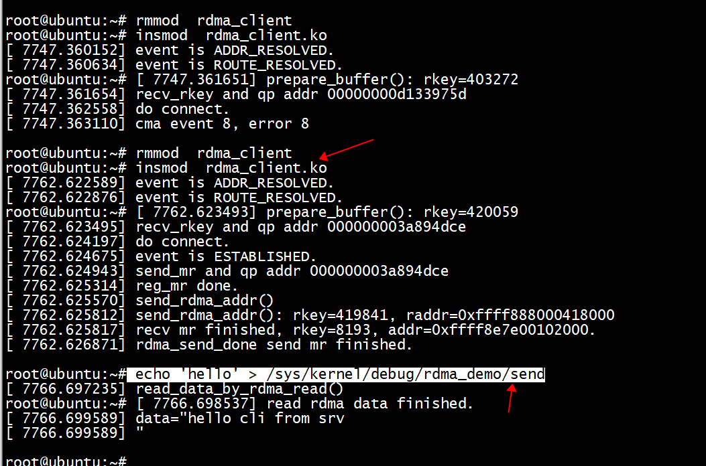
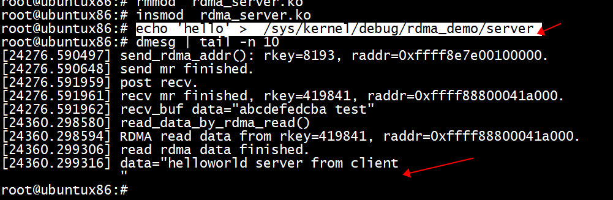

# rdma buf

1) register rdma buf  
2) server and client exchange  rdma buf  

# recv buf
server and client use recv buf to do IB_WR_RDMA_READ  
read_data_by_rdma_read do remote read(_WR_RDMA_READ)


# client

 echo 'hello' > /sys/kernel/debug/rdma_demo/send   
 
 
 
 
 ## os 

```
root@ubuntu:~# uname -a
Linux ubuntu 6.3.2 #5 SMP PREEMPT_DYNAMIC Tue Jun  6 23:22:49 CST 2023 x86_64 x86_64 x86_64 GNU/Linux
root@ubuntu:~# 
```

## IB_POLL_SOFTIRQ pk  IB_POLL_DIRECT

参考nvme_rdma_create_cq      

```
static struct ib_cq *do_alloc_cq(struct rdma_cm_id *cm_id)
{
        struct ib_cq_init_attr cq_attr = {0};
        //enum ib_poll_context poll_ctx;
        //poll_ctx = IB_POLL_DIRECT;

        cq_attr.cqe = 128 * 2;
        cq_attr.comp_vector = 0;
        return ib_alloc_cq(cm_id->device, cm_id, 128 * 2, 0, IB_POLL_SOFTIRQ);
        //return ib_alloc_cq(cm_id->device, cm_id, 128 * 2, 0, poll_ctx);
        //return ib_alloc_cq(cm_id->device, cm_id, 128 * 2, 0, IB_POLL_WORKQUEUE);
        //return ib_create_cq(cm_id->device, rdma_cq_event_handler, NULL, cm_id, &cq_attr);
}
```

## mr

```
           pages_per_mr = 256;
           ret = ib_mr_pool_init(rdma_d->cm_id->qp, &rdma_d->cm_id->qp->rdma_mrs, 64, IB_MR_TYPE_MEM_REG, pages_per_mr, 0);
           rdma_d->mr = ib_mr_pool_get(rdma_d->cm_id->qp, &rdma_d->cm_id->qp->rdma_mrs);
           printk(KERN_ERR "%s(): rkey=%d", __func__, rdma_d->mr->rkey);
```

## connect 

```
 rdma_connect_locked(cm_id, &conn_param)
```

# server

echo 'hello' >  /sys/kernel/debug/rdma_demo/server    

 
 
 
## os 

```
root@ubuntux86:# uname -a
Linux ubuntux86 5.13.0-39-generic #44~20.04.1-Ubuntu SMP Thu Mar 24 16:43:35 UTC 2022 x86_64 x86_64 x86_64 GNU/Linux
root@ubuntux86:
```