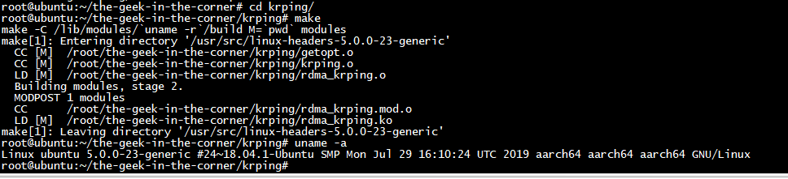
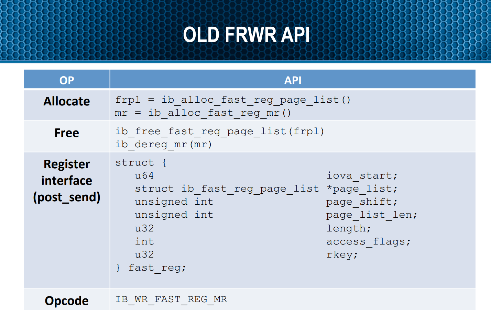
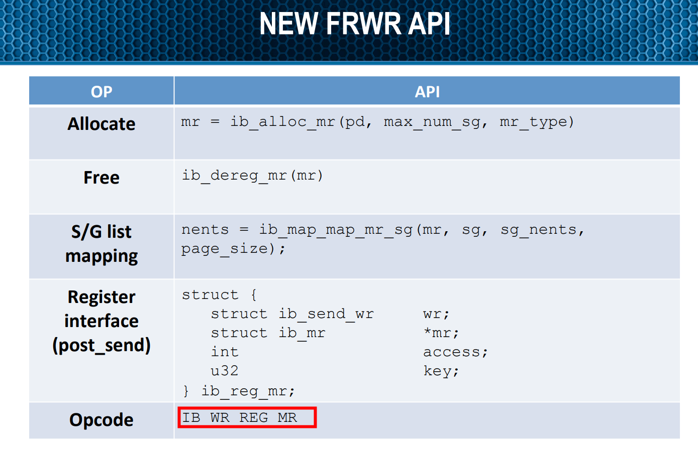
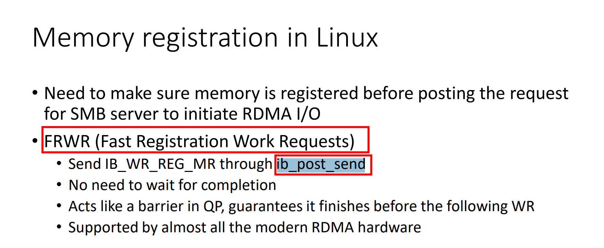

		Kernel Mode RDMA Ping Module
		   Steve Wise - 8/2009
# os

 

 

============
Introduction
============

The krping module is a kernel loadable module that utilizes the Open
Fabrics verbs to implement a client/server ping/pong program.  The module
was implemented as a test vehicle for working with the iwarp branch of
the OFA project.

The goals of this program include:

- Simple harness to test kernel-mode verbs: connection setup, send,
recv, rdma read, rdma write, and completion notifications.

- Client/server model.

- IP addressing used to identify remote peer.

- Transport independent utilizing the RDMA CMA service

- No user-space application needed.

- Just a test utility...nothing more.

This module allows establishing connections and running ping/pong tests
via a /proc entry called /proc/krping.  This simple mechanism allows
starting many kernel threads concurrently and avoids the need for a user
space application.

The krping module is designed to utilize all the major DTO operations:
send, recv, rdma read, and rdma write.  Its goal was to test the API
and as such is not necessarily an efficient test.  Once the connection
is established, the client and server begin a ping/pong loop:

Client				Server
---------------------------------------------------------------------
SEND(ping source buffer rkey/addr/len)

				RECV Completion with ping source info
				RDMA READ from client source MR
				RDMA Read completion
				SEND .go ahead. to client

RECV Completion of .go ahead.
SEND (ping sink buffer rkey/addr/len)	

				RECV Completion with ping sink info
				RDMA Write to client sink MR
				RDMA Write completion
				SEND .go ahead. to client

RECV Completion of .go ahead.
Validate data in source and sink buffers

<repeat the above loop>


============
To build/install the krping module
============

# git clone git://git.openfabrics.org/~swise/krping
# cd krping
<edit Makefile and set KSRC accordingly>
# make && make install
# modprobe rdma_krping

 
# Using Krping
 

Communication from user space is done via the /proc filesystem.
Krping exports file /proc/krping.  Writing commands in ascii format to
/proc/krping will start krping threads in the kernel.  The thread issuing
the write to /proc/krping is used to run the krping test, so it will
block until the test completes, or until the user interrupts the write.

Here is a simple example to start an rping test using the rdma_krping
module.  The server's address is 192.168.69.127.  The client will
connect to this address at port 9999 and issue 100 ping/pong messages.
This example assumes you have two systems connected via IB and the
IPoverIB devices are configured on the 192.168.69/24 subnet accordingly.

## Server:
```text
[root@centos7 krping]# insmod  rdma_krping.ko 
[root@centos7 krping]# echo "server,addr=10.11.11.251,port=9999",verbose >/proc/krping

```
```text
[root@centos7 krping]# dmesg | tail -n 10
[33854.382416] server received read complete
[33854.386410] krping: server ping data (64B max): ||
[33854.391274] Received rkey bc6 addr ffff809f97a7d000 len 64 from peer
[33854.397748] Received rkey bc7 addr ffff809f9732a000 len 64 from peer
[33854.404157] server received read complete
[33854.408151] krping: server ping data (64B max): ||
[33854.413011] Received rkey bc8 addr ffff809f97a7d000 len 64 from peer
[33854.419537] krping: DISCONNECT EVENT...
[33854.423361] krping: wait for RDMA_READ_ADV state 10
[33854.428259] krping: cq completion in ERROR state
```
The echo command above **will block** until the krping test completes,
or the user hits ctrl-c.

##  client:
```text
root@ubuntu:~/krping# insmod  rdma_krping.ko 
root@ubuntu:~/krping# echo "client,addr=10.11.11.251,port=9999,count=100",verbose > /proc/krping
root@ubuntu:~/krping# dmesg | tail -n 10
[32007.305975] krping: ping data (64B max): ||
[32007.327726] krping: ping data (64B max): ||
[32007.349457] krping: ping data (64B max): ||
[32007.371213] krping: ping data (64B max): ||
[32007.392964] krping: ping data (64B max): ||
[32007.414710] krping: ping data (64B max): ||
[32007.436464] krping: ping data (64B max): ||
[32007.458189] krping: ping data (64B max): ||
[32007.479939] krping: ping data (64B max): ||
[32007.501695] krping: ping data (64B max): ||
root@ubuntu:~/krping# dmesg | tail -n 20
[32007.088694] krping: ping data (64B max): ||
[32007.110427] krping: ping data (64B max): ||
[32007.132170] krping: ping data (64B max): ||
[32007.153903] krping: ping data (64B max): ||
[32007.175618] krping: ping data (64B max): ||
[32007.197357] krping: ping data (64B max): ||
[32007.219084] krping: ping data (64B max): ||
[32007.240834] krping: ping data (64B max): ||
[32007.262552] krping: ping data (64B max): ||
[32007.284263] krping: ping data (64B max): ||
[32007.305975] krping: ping data (64B max): ||
[32007.327726] krping: ping data (64B max): ||
[32007.349457] krping: ping data (64B max): ||
[32007.371213] krping: ping data (64B max): ||
[32007.392964] krping: ping data (64B max): ||
[32007.414710] krping: ping data (64B max): ||
[32007.436464] krping: ping data (64B max): ||
[32007.458189] krping: ping data (64B max): ||
[32007.479939] krping: ping data (64B max): ||
[32007.501695] krping: ping data (64B max): ||
```
Just like on the server, the echo command above will block until the
krping test completes, or the user hits ctrl-c.

## insmod  rdma_krping.ko debug=1
```
root@ubuntu:~/krping# rmmod  rdma_krping 
root@ubuntu:~/krping# insmod  rdma_krping.ko debug=1
root@ubuntu:~/krping# echo "client,addr=10.11.11.251,port=9999,count=10",verbose > /proc/krping
root@ubuntu:~/krping# dmesg | tail -n 50
root@ubuntu:~/the-geek-in-the-corner/krping# dmesg | tail -n 50
[32814.675359] send completion
[32814.681807] recv completion
[32814.681822] krping: ping data (64B max): ||
[32814.681824] krping: post_inv = 1, reg_mr new rkey 0xe0b pgsz 4096 len 64 iova_start ffff809f951da000
[32814.681828] RDMA addr ffff809f951da000 rkey e0b len 64
[32814.681880] send completion
[32814.697076] recv completion
[32814.697092] krping: post_inv = 1, reg_mr new rkey 0xe0c pgsz 4096 len 64 iova_start ffff809fb33a7000
[32814.697095] RDMA addr ffff809fb33a7000 rkey e0c len 64
[32814.697149] send completion
[32814.703548] recv completion
[32814.703564] krping: ping data (64B max): ||
[32814.703568] krping: post_inv = 1, reg_mr new rkey 0xe0d pgsz 4096 len 64 iova_start ffff809f951da000
[32814.703570] RDMA addr ffff809f951da000 rkey e0d len 64
[32814.703620] send completion
[32814.718826] recv completion
[32814.718845] krping: post_inv = 1, reg_mr new rkey 0xe0e pgsz 4096 len 64 iova_start ffff809fb33a7000
[32814.718848] RDMA addr ffff809fb33a7000 rkey e0e len 64
[32814.718899] send completion
[32814.725301] recv completion
[32814.725316] krping: ping data (64B max): ||
[32814.725319] krping: post_inv = 1, reg_mr new rkey 0xe0f pgsz 4096 len 64 iova_start ffff809f951da000
[32814.725321] RDMA addr ffff809f951da000 rkey e0f len 64
[32814.725373] send completion
[32814.740578] recv completion
[32814.740596] krping: post_inv = 1, reg_mr new rkey 0xe10 pgsz 4096 len 64 iova_start ffff809fb33a7000
[32814.740599] RDMA addr ffff809fb33a7000 rkey e10 len 64
[32814.740649] send completion
[32814.747054] recv completion
[32814.747071] krping: ping data (64B max): ||
[32814.747074] krping: post_inv = 1, reg_mr new rkey 0xe11 pgsz 4096 len 64 iova_start ffff809f951da000
[32814.747077] RDMA addr ffff809f951da000 rkey e11 len 64
[32814.747133] send completion
[32814.762307] recv completion
[32814.762325] krping: post_inv = 1, reg_mr new rkey 0xe12 pgsz 4096 len 64 iova_start ffff809fb33a7000
[32814.762328] RDMA addr ffff809fb33a7000 rkey e12 len 64
[32814.762379] send completion
[32814.768785] recv completion
[32814.768799] krping: ping data (64B max): ||
[32814.768803] krping: post_inv = 1, reg_mr new rkey 0xe13 pgsz 4096 len 64 iova_start ffff809f951da000
[32814.768805] RDMA addr ffff809f951da000 rkey e13 len 64
[32814.768858] send completion
[32814.784030] recv completion
[32814.784049] krping: post_inv = 1, reg_mr new rkey 0xe14 pgsz 4096 len 64 iova_start ffff809fb33a7000
[32814.784052] RDMA addr ffff809fb33a7000 rkey e14 len 64
[32814.784104] send completion
[32814.790528] recv completion
[32814.790544] krping: ping data (64B max): ||
[32814.790559] krping_free_buffers called on cb 00000000e4f9c523
[32814.790612] destroy cm_id 0000000050f11a58
```


#  krping_cq_event_handler stack

```C
 tasklet_init(&cq->comp_task, rxe_send_complete, (unsigned long)cq)
```

```shell

[106535.956106] [<ffff0000080830b0>] el1_irq+0xb0/0x140
[106535.956108] [<ffff0000080858cc>] arch_cpu_idle+0x44/0x144
[106535.956109] [<ffff000008871b68>] default_idle_call+0x20/0x30
[106535.956110] [<ffff00000812482c>] do_idle+0x158/0x1cc
[106535.956111] [<ffff000008124a3c>] cpu_startup_entry+0x28/0x30
[106535.956112] [<ffff000008091098>] secondary_start_kernel+0x150/0x174
[106535.956161] CPU: 29 PID: 0 Comm: swapper/29 Tainted: G        W  OE  ------------   4.14.0-115.el7a.0.1.aarch64 #1
[106535.956162] Hardware name: Huawei TaiShan 200 (Model 2280)/BC82AMDD, BIOS 1.08 12/14/2019
[106535.956162] Call trace:
[106535.956164] [<ffff000008089e14>] dump_backtrace+0x0/0x23c
[106535.956166] [<ffff00000808a074>] show_stack+0x24/0x2c
[106535.956168] [<ffff0000088568a8>] dump_stack+0x84/0xa8
[106535.956172] [<ffff000001572c48>] krping_cq_event_handler+0x38/0x408 [rdma_krping]
[106535.956178] [<ffff00000149b038>] rxe_send_complete+0xa0/0xbc [rdma_rxe]
[106535.956179] [<ffff0000080dbc54>] tasklet_action+0x88/0x10c
[106535.956179] [<ffff000008081a9c>] __do_softirq+0x11c/0x2f0
[106535.956180] [<ffff0000080db6ac>] irq_exit+0x120/0x150
[106535.956182] [<ffff000008140b08>] __handle_domain_irq+0x78/0xc4
[106535.956183] [<ffff000008081868>] gic_handle_irq+0xa0/0x1b8
[106535.956183] Exception stack(0xffff00001b4cfdf0 to 0xffff00001b4cff3
```

# fast registrations 
IB_WR_REG_MR,IB_WR_LOCAL_INV and IB_WR_SEND_WITH_INV

```text
IBA view of FMRs:

verb: ib_alloc_mr(pd, max_num_sg)			- creates empty MR object
	roughly Allocate L_Key

verb: ib_dereg_mr(mr)					- destroys MR object

verb: ib_map_mr_sg(mr, sg, sg_nents, sg_offset)		- builds a map for MR
	roughly (Re)Register Physical Memory Region

verb: ib_update_fast_reg_key(mr, newkey)		- update key portion of l/rkey

send wr: IB_WR_REG_MR(mr, key)				- moves MR from FREE to VALID and updates
	roughly Fast Register Physical Memory Region	  key portion of l/rkey to key

send_wr: IB_WR_LOCAL_INV(invalidate_rkey)		- invalidate local MR moves MR to FREE

send_wr: IB_SEND_WITH_INV(invalidate_rkey)		- invalidate remote MR moves MR to FREE


To make this all recoverable in the face of errors let there be more than one map present for an
FMR indexed by the key portion of the l/rkeys. 

Alternative view of FMRs:

verb: ib_alloc_mr(pd, max_num_sg)			- create an empty MR object with no maps
							  with l/rkey = [index, key] with index
							  fixed and key some initial value.

verb: ib_update_fast_reg_key(mr, newkey)		- update key portion of l/rkey

verb: ib_map_mr_sg(mr, sg, sg_nents, sg_offset)		- create a new map from allocated memory
							  or by re-using an INVALID map. Maps are
							  all the same size (max_num_sg). The
							  key (index) of this map is the current
							  key from l/rkey. The initial state of
							  the map is FREE. (and thus not usable
							  until a REG_MR work request is used.)

verb: ib_dereg_mr(mr)					- free all maps and the MR.

send_wr: IB_WR_REG_MR(mr, key)				- Find mr->map[key] and change its state
							  to VALID. Associate QP with map since
							  it will be hard to manage multiple QPs
							  trying to use the same MR at the same
							  time with differing states. Fail if the
							  map is not FREE. A map with that key must
							  have been created by ib_map_mr_sg with
							  the same key previously. Check the current
							  number of VALID maps and if this exceeds
							  a limit pause the send queue until there
							  is room to reg another MR.

send_wr: IB_WR_LOCAL_INV (execute)			- Lookup a map with the same index and key
							  Change its state to FREE and dissociate
							  from QP. Leave map contents the same.
			 (complete)			- When the local invalidate operation is
							  completed (after all previous send queue WQEs
							  have completed) change its state to INVALID
							  and place map resources on a free list or
							  free memory.

send_wr: IB_SEND_WITH_INV				- same except at remote end.

retry:							- if a retry occurs for a send queue. Back up
							  the requester to the first incomplete PSN.
							  Change the state of all maps which were
							  VALID at that PSN back to VALID. This will
							  require maintaining a list of valid maps
							  at the boundary of completed and un-completed
							  WQEs.

Arrival of RDMA packet					  Lookup MR from index and map from key and if
							  the state is VALID carry out the memory copy.
 doesn't use this feature thus kernel target won't make attempts to invalide rkey.   
```

```text
 Kernel NVMEoF target checks SGL type field and if this field contains NVME_SGL_FMT_INVALIDATE bit then kernel sends a response with IB_WR_SEND_WITH_INV opcode and provides actual rkey to be invalidated. If there is no NVME_SGL_FMT_INVALIDATE bit then kernel target uses regular IB_WR_SEND opcode.
Kernel NVMEoF host always sets NVME_SGL_FMT_INVALIDATE bit for requests of type NVME_KEY_SGL_FMT_DATA_DESC (SPDK_NVME_SGL_TYPE_KEYED_DATA_BLOCK in SPDK). When kernel host receives a response, it checks wc->wc_flags, if it contains IB_WC_WITH_INVALIDATE that means that the invalidation was done by target, otherwise the host performs local invalidation by posting WR with IB_WR_LOCAL_INV opcode.
So invalidation in kernel target depends on the type of received SGL. SPDK host doesn't set INVALIDATE flag and doesn't use this feature thus kernel target won't make attempts to invalide rkey.   
```

 
 
 

## IB_WR_REG_MR

```
struct ib_reg_wr {
        struct ib_send_wr       wr;
        struct ib_mr            *mr;
        u32                     key;
        int                     access;
};
```

 
 
 ```
	do {
		ib_post_send( IB_WR_LOCAL_INV )
		ib_update_fast_reg_key()
 		ib_map_mr_sg()
 		ib_post_send( IB_WR_REG_MR )
 	} while ( !done )
 ```
 
##  ibv_wr_send_inv(IB_WR_SEND_WITH_INV)

IB_WR_SEND_WITH_INV的cq opcode是IB_WC_SEND
```
static enum ib_wc_opcode wr_to_wc_opcode(enum ib_wr_opcode opcode)
{
        switch (opcode) {
        case IB_WR_RDMA_WRITE:                  return IB_WC_RDMA_WRITE;
        case IB_WR_RDMA_WRITE_WITH_IMM:         return IB_WC_RDMA_WRITE;
        case IB_WR_SEND:                        return IB_WC_SEND;
        case IB_WR_SEND_WITH_IMM:               return IB_WC_SEND;
        case IB_WR_RDMA_READ:                   return IB_WC_RDMA_READ;
        case IB_WR_ATOMIC_CMP_AND_SWP:          return IB_WC_COMP_SWAP;
        case IB_WR_ATOMIC_FETCH_AND_ADD:        return IB_WC_FETCH_ADD;
        case IB_WR_LSO:                         return IB_WC_LSO;
        case IB_WR_SEND_WITH_INV:               return IB_WC_SEND;
        case IB_WR_RDMA_READ_WITH_INV:          return IB_WC_RDMA_READ;
        case IB_WR_LOCAL_INV:                   return IB_WC_LOCAL_INV;
        case IB_WR_REG_MR:                      return IB_WC_REG_MR;
        case IB_WR_BIND_MW:                     return IB_WC_BIND_MW;
        case IB_WR_ATOMIC_WRITE:                return IB_WC_ATOMIC_WRITE;
        case IB_WR_FLUSH:                       return IB_WC_FLUSH;

        default:
                return 0xff;
        }
}
```

## 注册内存

```
krping_setup_buffers -->  krping_setup_wr
```
**  1) **   
cb->reg_mr = ib_alloc_mr(cb->pd,  IB_MR_TYPE_MEM_REG,
                                 cb->page_list_len);
**  2)**  	  
cb->reg_mr_wr.wr.opcode = IB_WR_REG_MR;
cb->reg_mr_wr.mr = cb->reg_mr;
**  3)**  
 ib_map_mr_sg(cb->reg_mr, &sg, 1, NULL, PAGE_SIZE);
**  4) **    
 ib_post_send(cb->qp, &cb->reg_mr_wr.wr, &bad_wr)


```
static u32 krping_rdma_rkey(struct krping_cb *cb, u64 buf, int post_inv)
{
        u32 rkey;
        struct ib_send_wr *bad_wr;
        int ret;
        struct scatterlist sg = {0};

        cb->invalidate_wr.ex.invalidate_rkey = cb->reg_mr->rkey;

        /*
         * Update the reg key.
         */
        ib_update_fast_reg_key(cb->reg_mr, ++cb->key);
        cb->reg_mr_wr.key = cb->reg_mr->rkey;

        /*
         * Update the reg WR with new buf info.
         */
        if (buf == (u64)cb->start_dma_addr)
                cb->reg_mr_wr.access = IB_ACCESS_REMOTE_READ;
        else
                cb->reg_mr_wr.access = IB_ACCESS_REMOTE_WRITE | IB_ACCESS_LOCAL_WRITE;
        sg_dma_address(&sg) = buf;
        sg_dma_len(&sg) = cb->size;

        ret = ib_map_mr_sg(cb->reg_mr, &sg, 1, NULL, PAGE_SIZE);
        BUG_ON(ret <= 0 || ret > cb->page_list_len);

        //pr_info(PFX "post_inv = %d, reg_mr new rkey 0x%x pgsz %u len %lu"
        DEBUG_LOG(PFX "post_inv = %d, reg_mr new rkey 0x%x pgsz %u len %lu"
                " iova_start %llx\n",
                post_inv,
                cb->reg_mr_wr.key,
                cb->reg_mr->page_size,
                (unsigned long)cb->reg_mr->length,
                (unsigned long long)cb->reg_mr->iova);

        if (post_inv)
                ret = ib_post_send(cb->qp, &cb->invalidate_wr, &bad_wr);
        else
                ret = ib_post_send(cb->qp, &cb->reg_mr_wr.wr, &bad_wr);
        if (ret) {
                printk(KERN_ERR PFX "post send error %d\n", ret);
                cb->state = ERROR;
        }
        rkey = cb->reg_mr->rkey;
        return rkey;
}
```

The syntax for krping commands is a string of options separated by commas.
Options can be single keywords, or in the form: option=operand.

Operands can be integers or strings.

Note you must specify the _same_ options on both sides.  For instance,
if you want to use the server_invalidate option, then you must specify
it on both the server and client command lines.

Opcode		Operand Type	Description
------------------------------------------------------------------------
client		none		Initiate a client side krping thread.
server		none		Initiate a server side krping thread.
addr		string		The server's IP address in dotted 
				decimal format.  Note the server can
				use 0.0.0.0 to bind to all devices.
port		integer		The server's port number in host byte 
				order.
count		integer		The number of rping iterations to 
				perform before shutting down the test.  
				If unspecified, the count is infinite.
size		integer		The size of the rping data.  Default for 
				rping is 65 bytes.
verbose		none		Enables printk()s that dump the rping 
				data. Use with caution!
validate	none		Enables validating the rping data on
				each iteration to detect data 
				corruption.
mem_mode	string		Determines how memory will be 
				registered.  Modes include dma,
				and reg.  Default is dma.
server_inv 	none		Valid only in reg mr mode, this 
				option enables invalidating the
				client's reg mr via 
				SEND_WITH_INVALIDATE messages from
				the server.
local_dma_lkey	none		Use the local dma lkey for the source 
				of writes and sends, and in recvs
read_inv	none		Server will use READ_WITH_INV. Only
				valid in reg mem_mode.
				
============
Memory Usage:
============

The krping client uses 4 memory areas:

start_buf - the source of the ping data.  This buffer is advertised to
the server at the start of each iteration, and the server rdma reads
the ping data from this buffer over the wire.

rdma_buf  - the sink of the ping data.  This buffer is advertised to the
server each iteration, and the server rdma writes the ping data that it
read from the start buffer into this buffer.  The start_buf and rdma_buf
contents are then compared if the krping validate option is specified.

recv_buf  - used to recv "go ahead" SEND from the server.  

send_buf  - used to advertise the rdma buffers to the server via SEND
messages.

The krping server uses 3 memory areas:

rdma_buf  - used as the sink of the RDMA READ to pull the ping data
from the client, and then used as the source of an RDMA WRITE to
push the ping data back to the client.

recv_buf  - used to receive rdma rkey/addr/length advertisements from
the client.

send_buf  - used to send "go ahead" SEND messages to the client.


============
Memory Registration Modes:
============

Each of these memory areas are registered with the RDMA device using
whatever memory mode was specified in the command line. The mem_mode
values include: dma, and reg (aka fastreg).  The default mode, if not
specified, is dma.

The dma mem_mode uses a single dma_mr for all memory buffers.

The reg mem_mode uses a reg mr on the client side for the
start_buf and rdma_buf buffers.  Each time the client will advertise
one of these buffers, it invalidates the previous registration and fast
registers the new buffer with a new key.   If the server_invalidate
option is on, then the server will do the invalidation via the "go ahead"
messages using the IB_WR_SEND_WITH_INV opcode.   Otherwise the client
invalidates the mr using the IB_WR_LOCAL_INV work request.

On the server side, reg mem_mode causes the server to use the
reg_mr rkey for its rdma_buf buffer IO.  Before each rdma read and
rdma write, the server will post an IB_WR_LOCAL_INV + IB_WR_REG_MR
WR chain to register the buffer with a new key.  If the krping read-inv
option is set then the server will use IB_WR_READ_WITH_INV to do the
rdma read and skip the IB_WR_LOCAL_INV wr before re-registering the
buffer for the subsequent rdma write operation.

============
Stats
============

While krping threads are executing, you can obtain statistics on the
thread by reading from the /proc/krping file.  If you cat /proc/krping,
you will dump IO statistics for each running krping thread.  The format
is one thread per line, and each thread contains the following stats
separated by white spaces:

Statistic		Description
---------------------------------------------------------------------
Name			krping thread number and device being used.
Send Bytes		Number of bytes transferred in SEND WRs.
Send Messages		Number of SEND WRs posted
Recv Bytes		Number of bytes received via RECV completions.
Recv Messages		Number of RECV WRs completed.
RDMA WRITE Bytes	Number of bytes transferred in RDMA WRITE WRs.
RDMA WRITE Messages	Number of RDMA WRITE WRs posted.
RDMA READ Bytes		Number of bytes transferred via RDMA READ WRs.
RDMA READ Messages	Number of RDMA READ WRs posted.

Here is an example of the server side output for 5 krping threads:

# cat /proc/krping
1-amso0 0 0 16 1 12583960576 192016 0 0
2-mthca0 0 0 16 1 60108570624 917184 0 0
3-mthca0 0 0 16 1 59106131968 901888 0 0
4-mthca1 0 0 16 1 101658394624 1551184 0 0
5-mthca1 0 0 16 1 100201922560 1528960 0 0
#

============
EXPERIMENTAL
============

There are other options that enable micro benchmarks to measure
the kernel rdma performance.  These include:

Opcode		Operand Type	Description
------------------------------------------------------------------------
wlat		none		Write latency test
rlat		none		read latency test
poll		none		enable polling vs blocking for rlat
bw		none		write throughput test
duplex		none		valid only with bw, this
				enables bidirectional mode
tx-depth	none		set the sq depth for bw tests


See the awkit* files to take the data logged in the kernel log
and compute RTT/2 or Gbps results.

Use these at your own risk.


END-OF-FILE
