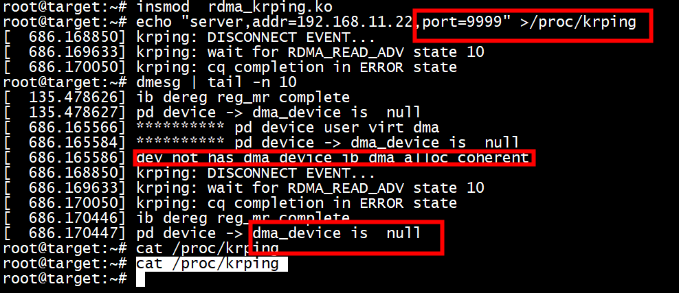
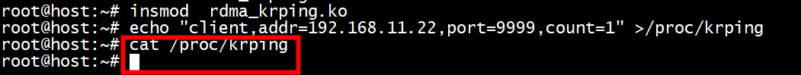
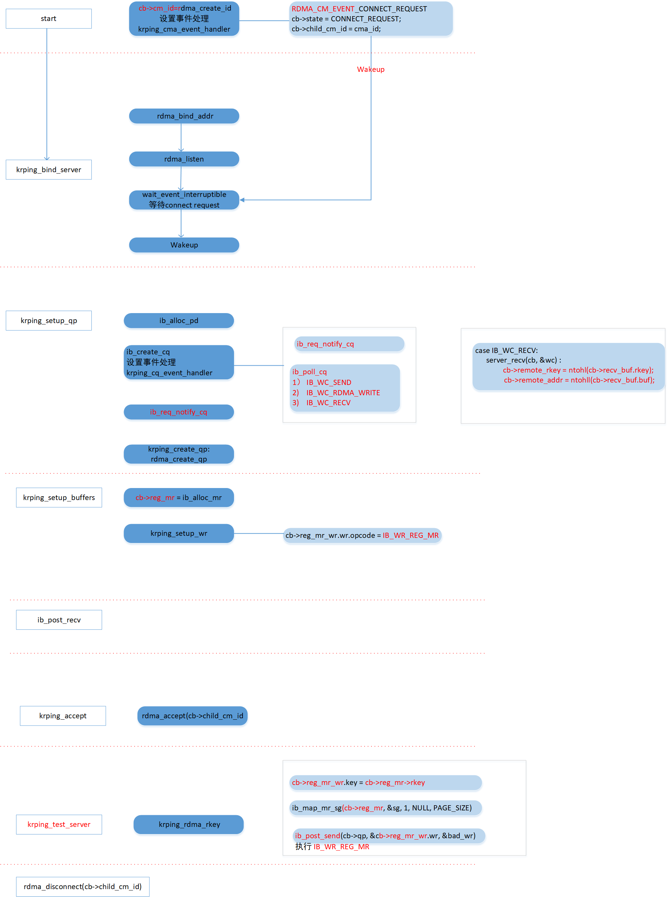
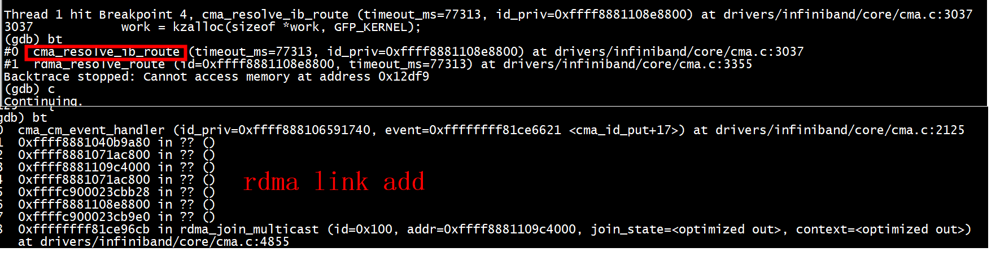
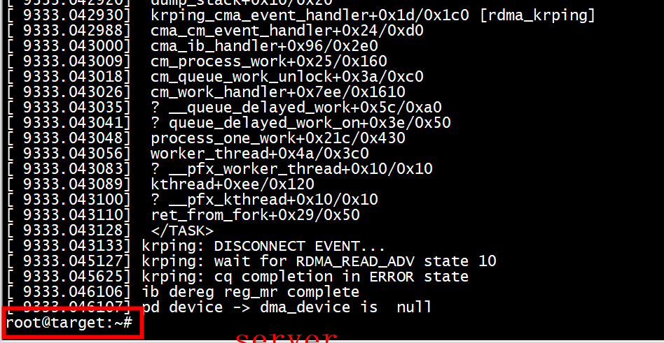
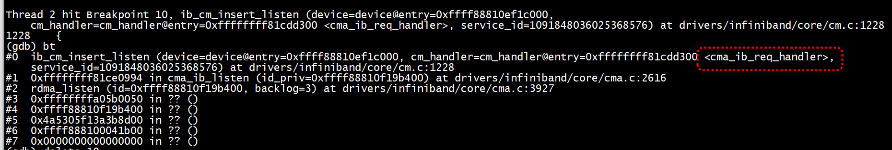
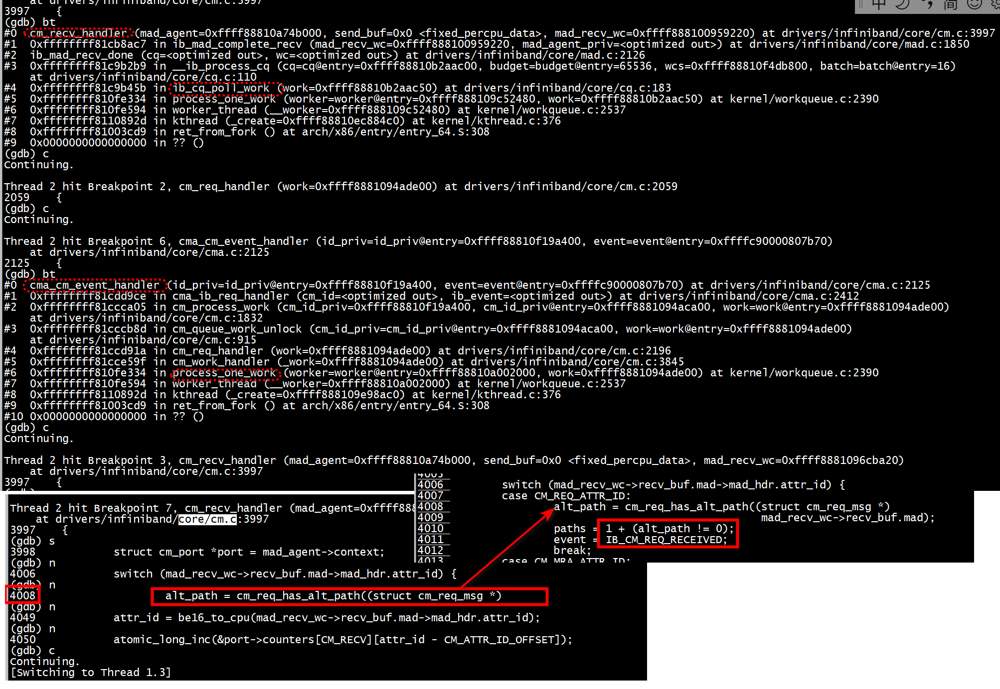
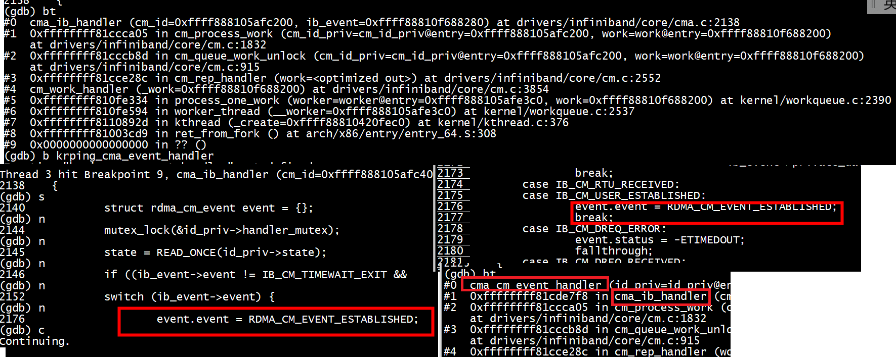
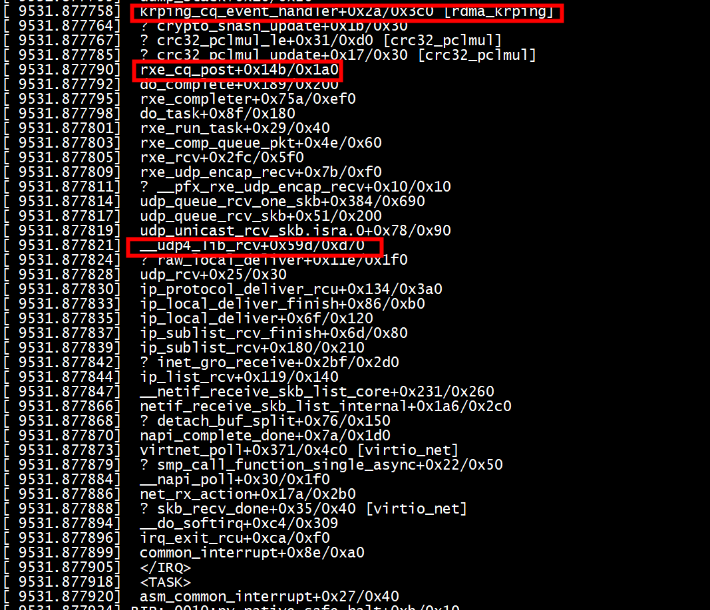

# server

```
root@target:~# uname -a
Linux target 6.3.2 #5 SMP PREEMPT_DYNAMIC Tue Jun  6 23:22:49 CST 2023 x86_64 x86_64 x86_64 GNU/Linux
root@target:~# 
root@target:~# insmod  rdma_krping.ko 
root@target:~# echo "server,addr=192.168.11.22,port=9999" >/proc/krping
```

 
 
 
 
```
krping_run_server
    cb->cm_id = rdma_create_id(&init_net, krping_cma_event_handler, cb, RDMA_PS_TCP, IB_QPT_RC);
``` 
 
# client


```
root@host:~# uname -a
Linux host 6.3.2 #3 SMP PREEMPT_DYNAMIC Tue May 16 15:56:36 CST 2023 x86_64 x86_64 x86_64 GNU/Linux
root@host:~# 
```
只发送一个ping请求   
```
root@host:~# echo "client,addr=192.168.11.22,port=9999,count=1" >/proc/krping
```
 
 
#   Protection Domain


+ 1 目标： 每个节点都至少要有一个PD，每个QP都必须属于一个PD，每个MR也必须属于一个PD。硬件会校验MR和QP的PD是否是同一个   

    
	
+ 2 实现:  
用户在创建QP和MR等资源之前，必须先通过IB框架的接口创建一个PD，拿到它的指针/句柄。接下来在创建QP和MR的时候，需要传入这个PD的指针/句柄，PD信息就会包含在QP和MR中。硬件收发包时，会对QP和MR的PD进行校验    


   + 2.1 创建mr   
   ```
	cb->reg_mr = ib_alloc_mr(cb->pd, IB_MR_TYPE_MEM_REG,
							 cb->page_list_len);
   ```
   + 2.2 创建qp   
   ```
	rdma_create_qp(cb->child_cm_id, cb->pd, &init_attr)
   ```
 
# 框架
server开启debug   
```
root@target:~# insmod  rdma_krping.ko debug=1
root@target:~# echo "server,addr=192.168.11.22,port=9999" >/proc/krping
```


> ## 事件机制 krping_cma_event_handler
 

```
#define rdma_create_id(net, event_handler, context, ps, qp_type)               \
        __rdma_create_kernel_id(net, event_handler, context, ps, qp_type,      \
                                KBUILD_MODNAME)
struct rdma_cm_id *
__rdma_create_kernel_id(struct net *net, rdma_cm_event_handler event_handler,
                        void *context, enum rdma_ucm_port_space ps,
                        enum ib_qp_type qp_type, const char *caller)
{
        struct rdma_id_private *ret;

        ret = __rdma_create_id(net, event_handler, context, ps, qp_type, NULL);
        if (IS_ERR(ret))
                return ERR_CAST(ret);

        rdma_restrack_set_name(&ret->res, caller);
        return &ret->id;
}
EXPORT_SYMBOL(__rdma_create_kernel_id);

__rdma_create_id(struct net *net, rdma_cm_event_handler event_handler,
                 void *context, enum rdma_ucm_port_space ps,
                 enum ib_qp_type qp_type, const struct rdma_id_private *parent)
{
        id_priv->id.event_handler = event_handler;
        init_completion(&id_priv->comp);
        
}
```

cma_cm_event_handler会调用id_priv->id.event_handler    
```
static int cma_cm_event_handler(struct rdma_id_private *id_priv,
                                struct rdma_cm_event *event)
{
        int ret;

        lockdep_assert_held(&id_priv->handler_mutex);

        trace_cm_event_handler(id_priv, event);
        ret = id_priv->id.event_handler(&id_priv->id, event);
        trace_cm_event_done(id_priv, event, ret);
        return ret;
}
```
 
 
 
 
 INIT_DELAYED_WORK(&work->work, cm_work_handler);   
 触发工作队列queue_work 
 ```
 [ 9333.039197]  krping_cma_event_handler+0x1d/0x1c0 [rdma_krping]
[ 9333.039215]  cma_cm_event_handler+0x24/0xd0
[ 9333.039258]  cma_ib_req_handler+0x61a/0x12d0
[ 9333.039275]  cm_process_work+0x25/0x160
[ 9333.039284]  cm_queue_work_unlock+0x3a/0xc0
[ 9333.039293]  cm_req_handler+0x813/0xfa0
[ 9333.039301]  ? finish_task_switch+0x8f/0x300
[ 9333.039331]  cm_work_handler+0x3d4/0x1610
[ 9333.039341]  process_one_work+0x21c/0x430
 ```
 
 cm_process_work调用cma_ib_req_handler   
 ```
 static void cm_process_work(struct cm_id_private *cm_id_priv,
                            struct cm_work *work)
{
   

                ret = cm_id_priv->id.cm_handler(&cm_id_priv->id,
                                                &work->cm_event);
          
}
 ```
> ## listen设置cma 事件callbak（cma_ib_req_handler）

  
 cma_ib_listen会插入cma_ib_req_handler   
 ```
 static int cma_ib_listen(struct rdma_id_private *id_priv)
{
 
        id = ib_cm_insert_listen(id_priv->id.device,
                                 cma_ib_req_handler, svc_id);
        
}
 ```
 
>  ### 处理 RDMA_CM_EVENT_CONNECT_REQUEST
 
 
 + 1 cm_recv_handler设置 event = IB_CM_REQ_RECEIVED，然后调用queue_delayed_work唤醒 cm_work_handler  
 
 + 2  cm_work_handler对于 case IB_CM_REQ_RECEIVED调用cm_req_handler    
 + 3  cm_req_handler --> cm_queue_work_unlock -->  cm_process_work  -->  cm_id_priv->id.cm_handler(cma_ib_req_handler)  
 
 +  4 cma_ib_req_handler 设置 event.event = RDMA_CM_EVENT_CONNECT_REQUEST    
 

> ### 处理RDMA_CM_EVENT_ESTABLISHED   
 cma_ib_handler--> cma_cm_event_handler    
 
 
  

```
#0  cma_ib_handler (cm_id=0xffff888105afc200, ib_event=0xffff88810f688280) at drivers/infiniband/core/cma.c:2138
#1  0xffffffff81ccca05 in cm_process_work (cm_id_priv=cm_id_priv@entry=0xffff888105afc200, work=work@entry=0xffff88810f688200)
    at drivers/infiniband/core/cm.c:1832
#2  0xffffffff81cccb8d in cm_queue_work_unlock (cm_id_priv=cm_id_priv@entry=0xffff888105afc200, work=work@entry=0xffff88810f688200)
    at drivers/infiniband/core/cm.c:915
#3  0xffffffff81cce28c in cm_rep_handler (work=<optimized out>) at drivers/infiniband/core/cm.c:2552
#4  cm_work_handler (_work=0xffff88810f688200) at drivers/infiniband/core/cm.c:3854
#5  0xffffffff810fe334 in process_one_work (worker=worker@entry=0xffff888105afe3c0, work=0xffff88810f688200) at kernel/workqueue.c:2390
#6  0xffffffff810fe594 in worker_thread (__worker=0xffff888105afe3c0) at kernel/workqueue.c:2537
```  
  
> ## 事件机制  krping_cq_event_handler
 
```
krping_setup_qp(struct krping_cb *cb, struct rdma_cm_id *cm_id)

cb->cq = ib_create_cq(cm_id->device, krping_cq_event_handler, NULL,
			      cb, &attr);
	if (!cb->wlat && !cb->rlat && !cb->bw && !cb->frtest) {
		ret = ib_req_notify_cq(cb->cq, IB_CQ_NEXT_COMP);
		if (ret) {
			printk(KERN_ERR PFX "ib_create_cq failed\n");
			goto err2;
		}
	}
```
krping_cq_event_handler调用ib_poll_cq处理各种事件（IB_WC_SEND、IB_WC_RDMA_WRITE……）  


> ### ib_create_cq(cm_id->device, krping_cq_event_handler, NULL,cb, &attr)
mlx4_eq_int --> mlx4_cq_completion --> mlx4_ib_cq_comp -->  krping_cq_event_handler   


```
struct ib_cq *__ib_create_cq(struct ib_device *device,
                             ib_comp_handler comp_handler,
                             void (*event_handler)(struct ib_event *, void *),
                             void *cq_context,
                             const struct ib_cq_init_attr *cq_attr,
                             const char *caller);
#define ib_create_cq(device, cmp_hndlr, evt_hndlr, cq_ctxt, cq_attr) \
        __ib_create_cq((device), (cmp_hndlr), (evt_hndlr), (cq_ctxt), (cq_attr), KBUILD_MODNAME)
```


```
struct mlx4_ib_cq {
        struct ib_cq            ibcq;
        struct mlx4_cq          mcq;
}
int mlx5_ib_create_cq(struct ib_cq *ibcq, const struct ib_cq_init_attr *attr,
                      struct ib_udata *udata)
{
        struct mlx4_ib_cq *cq = to_mcq(ibcq);
        err = mlx5_core_create_cq(dev->mdev, &cq->mcq, cqb, inlen, out, sizeof(out));
        if (udata)
                cq->mcq.tasklet_ctx.comp = mlx5_ib_cq_comp;
        else
                cq->mcq.comp  = mlx5_ib_cq_comp;
 
}
void mlx4_cq_completion(struct mlx4_dev *dev, u32 cqn)
{
        struct mlx4_cq *cq;

        rcu_read_lock();
        cq = radix_tree_lookup(&mlx4_priv(dev)->cq_table.tree,
                               cqn & (dev->caps.num_cqs - 1));

        cq->comp(cq); // cq->mcq.comp  = mlx5_ib_cq_comp
}
```

中断处理中调用mlx4_cq_completion --> mlx4_cq_completion
```
 [<ffffffffa0690c3c>] ? srp_handle_recv+0x22c/0x4e0 [ib_srp]
 [<ffffffffa0690f32>] srp_recv_completion+0x42/0x80 [ib_srp]
 [<ffffffffa06023e7>] mlx4_ib_cq_comp+0x17/0x20 [mlx4_ib]
 [<ffffffffa00812b2>] mlx4_cq_completion+0x42/0x90 [mlx4_core]
 [<ffffffffa0082898>] mlx4_eq_int+0x578/0xd60 [mlx4_core]
 [<ffffffff8103813d>] ? lapic_next_event+0x1d/0x30
 [<ffffffff81014b19>] ? read_tsc+0x9/0x10
 [<ffffffffa008136d>] ? mlx4_cq_tasklet_cb+0x6d/0x130 [mlx4_core]
 [<ffffffff81085755>] ? tasklet_action+0xe5/0x120
 [<ffffffffa0083094>] mlx4_msi_x_interrupt+0x14/0x20 [mlx4_core]
 [<ffffffff810f36a0>] handle_IRQ_event+0x60/0x170
 [<ffffffff81014b19>] ? read_tsc+0x9/0x10
 [<ffffffff810f600e>] handle_edge_irq+0xde/0x180
 [<ffffffff8100fd29>] handle_irq+0x49/0xa0
 [<ffffffff815515cc>] do_IRQ+0x6c/0xf0
 [<ffffffff8100ba53>] ret_from_intr+0x0/0x11
 <EOI> 
 [<ffffffff812faa7e>] ? intel_idle+0xfe/0x1b0
 [<ffffffff812faa61>] ? intel_idle+0xe1/0x1b0
 [<ffffffff814406ca>] cpuidle_idle_call+0x7a/0xe0
 [<ffffffff81009fe6>] cpu_idle+0xb6/0x110
 [<ffffffff815408f9>] start_secondary+0x2c0/0x316
Code:  Bad RIP value.
RIP  [<(null)>] (null)
 RSP <ffff8820f0d23c80>
CR2: 0000000000000000
```


```
static void handle_drain_completion(struct ib_cq *cq,
                                    struct mlx5_ib_drain_cqe *sdrain,
                                    struct mlx5_ib_dev *dev)
{
        struct mlx5_core_dev *mdev = dev->mdev;

        if (cq->poll_ctx == IB_POLL_DIRECT) {
                while (wait_for_completion_timeout(&sdrain->done, HZ / 10) <= 0)
                        ib_process_cq_direct(cq, -1);
                return;
        }

        if (mdev->state == MLX5_DEVICE_STATE_INTERNAL_ERROR) {
                struct mlx5_ib_cq *mcq = to_mcq(cq);
                bool triggered = false;
                unsigned long flags;

                spin_lock_irqsave(&dev->reset_flow_resource_lock, flags);
                /* Make sure that the CQ handler won't run if wasn't run yet */
                if (!mcq->mcq.reset_notify_added)
                        mcq->mcq.reset_notify_added = 1;
                else
                        triggered = true;
                spin_unlock_irqrestore(&dev->reset_flow_resource_lock, flags);

                if (triggered) {
                        /* Wait for any scheduled/running task to be ended */
                        switch (cq->poll_ctx) {
                        case IB_POLL_SOFTIRQ:
                                irq_poll_disable(&cq->iop);
                                irq_poll_enable(&cq->iop);
                                break;
                        case IB_POLL_WORKQUEUE:
                                cancel_work_sync(&cq->work);
                                break;
                        default:
                                WARN_ON_ONCE(1);
                        }
                }

                /* Run the CQ handler - this makes sure that the drain WR will
                 * be processed if wasn't processed yet.
                 */
                mcq->mcq.comp(&mcq->mcq, NULL);
        }

        wait_for_completion(&sdrain->done);
}
```

> ###  ib_req_notify_cq
[SRP Linux driver 系列十二：ib_srpt.c--函数五](https://blog.csdn.net/lincolnjunior_lj/article/details/131807357)
```
static int srpt_process_completion(struct srpt_rdma_ch *ch, int budget)
{
	struct ib_cq *const cq = ch->cq;
	int processed = 0, n = budget;

	do {
		processed += srpt_poll(ch, n);
		n = ib_req_notify_cq(cq, IB_CQ_NEXT_COMP |
				     IB_CQ_REPORT_MISSED_EVENTS);
	} while (n > 0);

	return processed;
}

```
+ 1 首先，通过通道 ch 获取完成队列 cq。
+ 2 进入 do-while 循环，首先通过 srpt_poll 函数处理最多 n 个完成事件，并将已处理的完成事件数量累加到 processed 中。
+ 3 接着，通过 ib_req_notify_cq 函数请求通知完成队列的下一个完成事件，并设置 IB_CQ_NEXT_COMP | IB_CQ_REPORT_MISSED_EVENTS 标志。此操作会阻塞当前线程，直到有完成事件发生或者超时（若未发生完成事件）。   
如果 ib_req_notify_cq 返回的 n 大于 0，则表示有未处理的完成事件，继续进行下一次循环；否则，函数结束并返回已处理的完成事件数量 processed。
 
```
static inline int ib_req_notify_cq(struct ib_cq *cq,
                                   enum ib_cq_notify_flags flags)
{
        return cq->device->ops.req_notify_cq(cq, flags);
}

static int rxe_req_notify_cq(struct ib_cq *ibcq, enum ib_cq_notify_flags flags)
{
        struct rxe_cq *cq = to_rcq(ibcq);
        int ret = 0;
        int empty;
        unsigned long irq_flags;

        spin_lock_irqsave(&cq->cq_lock, irq_flags);
        if (cq->notify != IB_CQ_NEXT_COMP)
                cq->notify = flags & IB_CQ_SOLICITED_MASK;

        empty = queue_empty(cq->queue, QUEUE_TYPE_TO_ULP);

        if ((flags & IB_CQ_REPORT_MISSED_EVENTS) && !empty)
                ret = 1;

        spin_unlock_irqrestore(&cq->cq_lock, irq_flags);

        return ret;
}

```

```
static int srpt_poll(struct srpt_rdma_ch *ch, int budget)
{
	struct ib_cq *const cq = ch->cq;
	struct ib_wc *const wc = ch->wc;
	int i, n, processed = 0;

	while ((n = ib_poll_cq(cq, min_t(int, ARRAY_SIZE(ch->wc), budget),
			       wc)) > 0) {
		for (i = 0; i < n; i++)
			srpt_process_one_compl(ch, &wc[i]);
		budget -= n;
		processed += n;
	}

	return processed;
}

```

> ## ib_poll_cq -mlx4_ib_poll_cq
```
static inline int ib_poll_cq(struct ib_cq *cq, int num_entries,
                             struct ib_wc *wc)
{
        return cq->device->ops.poll_cq(cq, num_entries, wc);
}
```


# dma_unmap_single 导致coredump


```
static void krping_free_buffers(struct krping_cb *cb)
{
        DEBUG_LOG("krping_free_buffers called on cb %p\n", cb);

        if (cb->dma_mr)
                ib_dereg_mr(cb->dma_mr);
        if (cb->rdma_mr)
                ib_dereg_mr(cb->rdma_mr);
        if (cb->start_mr)
                ib_dereg_mr(cb->start_mr);
        if (cb->reg_mr)
        {
                ib_dereg_mr(cb->reg_mr);
                pr_info("ib dereg reg_mr complete");
         }
#if 0
        dma_unmap_single(cb->pd->device->dma_device,
                         dma_unmap_addr(cb, recv_mapping),
                         sizeof(cb->recv_buf), DMA_BIDIRECTIONAL);
        dma_unmap_single(cb->pd->device->dma_device,
                         dma_unmap_addr(cb, send_mapping),
                         sizeof(cb->send_buf), DMA_BIDIRECTIONAL);
#else
        if(NULL == cb->pd->device->dma_device)
                pr_info("pd device -> dma_device is  null \n");
        if(0 != dma_unmap_addr(cb, recv_mapping))
        ib_dma_unmap_single(cb->pd->device,
                         dma_unmap_addr(cb, recv_mapping),
                         sizeof(cb->recv_buf), DMA_BIDIRECTIONAL);
        if(0 != dma_unmap_addr(cb, send_mapping))
        ib_dma_unmap_single(cb->pd->device,
                         dma_unmap_addr(cb, send_mapping),
                         sizeof(cb->send_buf), DMA_BIDIRECTIONAL);
#endif
        ib_dma_free_coherent(cb->pd->device, cb->size, cb->rdma_buf,
                             cb->rdma_dma_addr);

        if (cb->start_buf) {
                ib_dma_free_coherent(cb->pd->device, cb->size, cb->start_buf,
                                     cb->start_dma_addr);
        }
}

```

+ 1 因为cb->pd->device->dma_device等于NULL所以调用dma_unmap_single，dma_unmap_single-->dma_unmap_page_attrs-->get_dma_ops执行dev->dma_ops发生coredump   

```
:#define dma_unmap_single(d, a, s, r) dma_unmap_single_attrs(d, a, s, r, 0)
```

```
static inline void dma_unmap_single_attrs(struct device *dev, dma_addr_t addr,
                size_t size, enum dma_data_direction dir, unsigned long attrs)
{
        return dma_unmap_page_attrs(dev, addr, size, dir, attrs);
}

void dma_unmap_page_attrs(struct device *dev, dma_addr_t addr, size_t size,
                enum dma_data_direction dir, unsigned long attrs)
{
        const struct dma_map_ops *ops = get_dma_ops(dev);

        BUG_ON(!valid_dma_direction(dir));
        if (dma_map_direct(dev, ops) ||
            arch_dma_unmap_page_direct(dev, addr + size))
                dma_direct_unmap_page(dev, addr, size, dir, attrs);
        else if (ops->unmap_page)
                ops->unmap_page(dev, addr, size, dir, attrs);
        debug_dma_unmap_page(dev, addr, size, dir);
}
static inline const struct dma_map_ops *get_dma_ops(struct device *dev)
{
        if (dev->dma_ops)
                return dev->dma_ops;
        return get_arch_dma_ops();
}

```

```
        if(ib_uses_virt_dma(cb->pd->device))
                pr_info("********** pd device user virt dma \n");
        if(NULL == cb->pd->device->dma_device)
                pr_info("********** pd device -> dma_device is  null \n");
```

+ 2   dma_unmap_single改成ib_dma_unmap_single    

```
static inline u64 ib_dma_map_single(struct ib_device *dev,
                                    void *cpu_addr, size_t size,
                                    enum dma_data_direction direction)
{
        if (ib_uses_virt_dma(dev))
                return (uintptr_t)cpu_addr;
        return dma_map_single(dev->dma_device, cpu_addr, size, direction);
}
```

#  mlx5_ib_post_send   

```
 int mlx5_ib_post_send(struct ib_qp *ibqp, const struct ib_send_wr *wr,
                      const struct ib_send_wr **bad_wr, bool drain)
{
    mlx5r_finish_wqe(qp, ctrl, seg, size, cur_edge, idx, wr->wr_id,
    nreq, fence, mlx5_ib_opcode[wr->opcode]);


out:
        if (likely(nreq))
                mlx5r_ring_db(qp, nreq, ctrl);
}
```