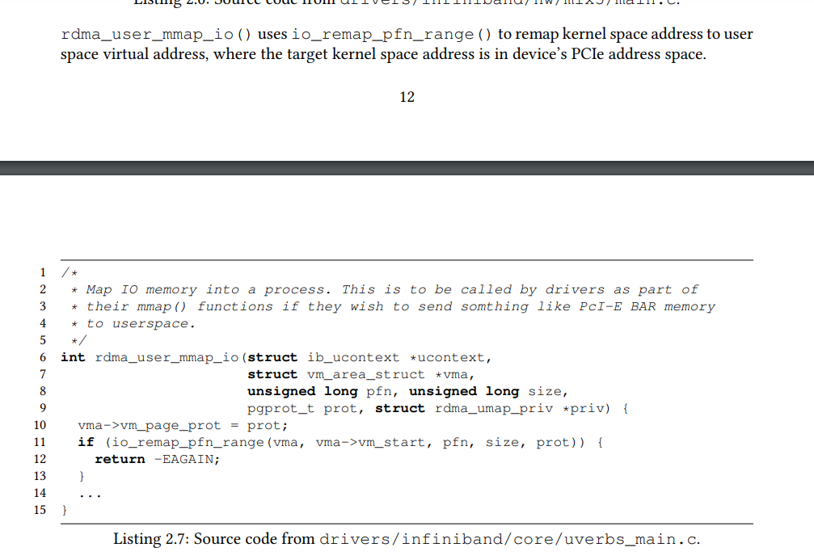

# log_num_mtt

```
root@ubuntu# cat /sys/module/mlx4_core/parameters/log_num_mtt
0
root@ubuntu#  cat /sys/module/mlx4_core/parameters/log_mtts_per_seg
0
root@ubuntu# 
```

# mlx5_ib_reg_user_mr


mlx5_ib_reg_user_mr -->  ib_umem_get  -->  ib_dma_map_sgtable_attrs

## MLX5的MTT配置格式 mkey

```
 // include/linux/mlx5/mlx5_ifc.h
    struct mlx5_ifc_create_mkey_in_bits {          // 该控制信息 走控制通道 传递 给HCA。
        u8         opcode[0x10];
        u8         uid[0x10];
        u8         reserved_at_20[0x10];
        u8         op_mod[0x10];
        u8         reserved_at_40[0x20];
        u8         pg_access[0x1];
        u8         mkey_umem_valid[0x1];
        u8         reserved_at_62[0x1e];
        struct mlx5_ifc_mkc_bits memory_key_mkey_entry;    // 参见下文分析。其中包含va信息(start_address, len) 。
        u8         reserved_at_280[0x80];
        u8         translations_octword_actual_size[0x20];
        u8         reserved_at_320[0x560];
        u8         klm_pas_mtt[][0x20];    // 柔性数组的变长方式，这里 按序添加 iova地址（与下文的start_address即va 构成顺序映射关系）。
    };
```
struct mlx5_ifc_mkc_bits memory_key_mkey_entry 的分析：   
```
struct mlx5_ifc_mkc_bits {
 
        u8         start_addr[0x40];            // va的起始地址
 
        u8         len[0x40];                   // va区域长度
 
       
};
```

```

static void set_mkc_access_pd_addr_fields(void *mkc, int acc, u64 start_addr,
                                          struct ib_pd *pd)
{
        MLX5_SET(mkc, mkc, pd, to_mpd(pd)->pdn);
        MLX5_SET(mkc, mkc, qpn, 0xffffff);
        MLX5_SET64(mkc, mkc, start_addr, start_addr);
}
```

##  umrc ib_create_qp and ib_alloc_cq

```
int mlx5r_umr_resource_init(struct mlx5_ib_dev *dev)
     cq = ib_alloc_cq(&dev->ib_dev, NULL, 128, 0, IB_POLL_SOFTIRQ);
	 qp = ib_create_qp(pd, &init_attr);
	 dev->umrc.qp = qp;
     dev->umrc.cq = cq;
     dev->umrc.pd = pd;
```

## 内核 IB_WR_REG_MR

.post_send = mlx5_ib_post_send_nodrain   

```Text
mlx5_ib_post_send_nodrain -->  handle_qpt_rc --> handle_reg_mr   
                          -->   mlx5r_ring_db   
```

```
static int handle_reg_mr(struct mlx5_ib_qp *qp, const struct ib_send_wr *wr,
                         struct mlx5_wqe_ctrl_seg **ctrl, void **seg, int *size,
                         void **cur_edge, unsigned int idx)
{
        qp->sq.wr_data[idx] = IB_WR_REG_MR;
        (*ctrl)->imm = cpu_to_be32(reg_wr(wr)->key);
        return set_reg_wr(qp, reg_wr(wr), seg, size, cur_edge, true);
}
```


## ib_umem_get

1)   __get_free_page(GFP_KERNEL)   
2)   pin_user_pages_fast   
3)    sg_alloc_append_table_from_pages  
40   ib_dma_map_sgtable_attrs   

##  create_user_odp_mr
1)  mlx5r_odp_create_eq  。  
2)  ib_umem_odp_get。 ib_umem_odp_get不会去分配page， mlx5_ib_mr_wqe_pfault_handler会去分配page   
3)  mlx5_ib_mr_wqe_pfault_handler …… --> pagefault_single_data_segment -->pagefault_mr  -->   pagefault_real_mr  --> ib_umem_odp_map_dma_and_lock  --> ib_umem_odp_map_dma_single_page -->  ib_dma_map_page  

### ib_umem_odp_map_dma_and_lock
1）  hmm_range_fault   
2）  ib_umem_odp_map_dma_single_page -->  ib_dma_map_page     
 
## MLX5_CMD_OP_CREATE_MKEY
mlx5_core_create_mkey   

## pas - Physical Address Structure

```
 pas = (__be64 *)MLX5_ADDR_OF(create_mkey_in, in, klm_pas_mtt);
        if (populate) {
                if (WARN_ON(access_flags & IB_ACCESS_ON_DEMAND)) {
                        err = -EINVAL;
                        goto err_2;
                }
                mlx5_ib_populate_pas(umem, 1UL << mr->page_shift, pas,
                                     pg_cap ? MLX5_IB_MTT_PRESENT : 0);
        }

        /* The pg_access bit allows setting the access flags
         * in the page list submitted with the command. */
        MLX5_SET(create_mkey_in, in, pg_access, !!(pg_cap));

        mkc = MLX5_ADDR_OF(create_mkey_in, in, memory_key_mkey_entry);
        set_mkc_access_pd_addr_fields(mkc, access_flags, iova,
                                      populate ? pd : dev->umrc.pd);
        MLX5_SET(mkc, mkc, free, !populate);
        MLX5_SET(mkc, mkc, access_mode_1_0, MLX5_MKC_ACCESS_MODE_MTT);
        MLX5_SET(mkc, mkc, umr_en, 1);

        MLX5_SET64(mkc, mkc, len, umem->length);
        MLX5_SET(mkc, mkc, bsf_octword_size, 0);
        MLX5_SET(mkc, mkc, translations_octword_size,
                 get_octo_len(iova, umem->length, mr->page_shift));
        MLX5_SET(mkc, mkc, log_page_size, mr->page_shift);
        if (mlx5_umem_needs_ats(dev, umem, access_flags))
                MLX5_SET(mkc, mkc, ma_translation_mode, 1);
        if (populate) {
                MLX5_SET(create_mkey_in, in, translations_octword_actual_size,
                         get_octo_len(iova, umem->length, mr->page_shift));
        }

        err = mlx5_ib_create_mkey(dev, &mr->mmkey, in, inlen);
```


## populate_mtt
```Text
  mlx5_ib_invalidate_range -->mlx5r_umr_update_xlt --> mlx5r_umr_create_xlt   
                                                   --> mlx5_odp_populate_xlt-->  populate_mtt   
												   -->  mlx5r_umr_post_send_wait    
```
# mlx5_ib_post_send

mlx5_ib_post_send -->  mlx5r_ring_db   

其实作为网卡芯片厂商，我们更为关注的还是provider文件夹下面的设备驱动部分。也就是rdma core如何把wqe下发到网卡，让网卡执行dma操作的。

以发送为例，数据面是下面这个函数

    ibv_post_send(qp, wr)

QP下发一个Send WR，参数wr是一个结构体，包含了WR的所有信息。包括wr_id、sge数量、操作码（SEND/WRITE/READ等以及更细分的类型）。

WR经由驱动进一步处理后，会转化成WQE下发给硬件。流程图如下：


# mlx5_ib_post_recv

```
int mlx5_ib_post_recv(struct ib_qp *ibqp, const struct ib_recv_wr *wr,
                      const struct ib_recv_wr **bad_wr, bool drain)
{
        struct mlx5_ib_qp *qp = to_mqp(ibqp);
        struct mlx5_wqe_data_seg *scat;
        struct mlx5_rwqe_sig *sig;
        struct mlx5_ib_dev *dev = to_mdev(ibqp->device);
        struct mlx5_core_dev *mdev = dev->mdev;
        unsigned long flags;
        int err = 0;
        int nreq;
        int ind;
        int i;

        if (unlikely(mdev->state == MLX5_DEVICE_STATE_INTERNAL_ERROR &&
                     !drain)) {
                *bad_wr = wr;
                return -EIO;
        }

        if (qp->type == IB_QPT_GSI)
                return mlx5_ib_gsi_post_recv(ibqp, wr, bad_wr);

        spin_lock_irqsave(&qp->rq.lock, flags);

        ind = qp->rq.head & (qp->rq.wqe_cnt - 1);

        for (nreq = 0; wr; nreq++, wr = wr->next) {
                if (mlx5r_wq_overflow(&qp->rq, nreq, qp->ibqp.recv_cq)) {
                        err = -ENOMEM;
                        *bad_wr = wr;
                        goto out;
                }

                if (unlikely(wr->num_sge > qp->rq.max_gs)) {
                        err = -EINVAL;
                        *bad_wr = wr;
                        goto out;
                }

                scat = mlx5_frag_buf_get_wqe(&qp->rq.fbc, ind);
                if (qp->flags_en & MLX5_QP_FLAG_SIGNATURE)
                        scat++;

                for (i = 0; i < wr->num_sge; i++)
                        set_data_ptr_seg(scat + i, wr->sg_list + i);

                if (i < qp->rq.max_gs) {
                        scat[i].byte_count = 0;
                        scat[i].lkey = dev->mkeys.terminate_scatter_list_mkey;
                        scat[i].addr       = 0;
                }

                if (qp->flags_en & MLX5_QP_FLAG_SIGNATURE) {
                        sig = (struct mlx5_rwqe_sig *)scat;
                        set_sig_seg(sig, qp->rq.max_gs);
                }

                qp->rq.wrid[ind] = wr->wr_id;

                ind = (ind + 1) & (qp->rq.wqe_cnt - 1);
        }

out:
        if (likely(nreq)) {
                qp->rq.head += nreq;

                /* Make sure that descriptors are written before
                 * doorbell record.
                 */
                wmb();

                *qp->db.db = cpu_to_be32(qp->rq.head & 0xffff);
        }

        spin_unlock_irqrestore(&qp->rq.lock, flags);

        return err;
}
```
#  User Access Region

 

The HCA provides a memory region that can be mapped directly to an un-trusted application by
the OS and can be addressed by non-privileged code. This region is used to allow unprivileged
applications to access needed HCA resources, such as ringing DoorBells, from userspace. Each
process should get a distinct page mapped to this region to access HCA for data path operation,
thereby isolating HCA access between the processes.

The isolated, protected and independent direct access to the HCA HW by multiple processes is
implemented via User Access Region (UAR) mechanism.
The UAR is part of PCI address space that is mapped for direct access to the HCA from the CPU.
UAR is comprised of multiple pages, each page containing registers that control the HCA operation. UAR mechanism is used to post execution or control requests to the HCA. It is used by the
HCA to enforce protection and isolation between different processes.
The cross-process isolation and protection is implemented through four key mechanisms:
1. Host SW maps different UAR pages to different consumers, hereby enforcing isolation
between different consumers to access the same page in the HCA control space.
2. Each Control Object can be accessed (controlled) through a UAR page.
3. HCA driver associates a UAR page with a control object while initializing (“opening”) the
object.
4. Prior to executing control operation on the object, HCA validates that the UAR page used to
post the command matches the one specified in the contexts of that object.
***Operation is passed to the HCA by posting WQE to respective Work WQ***, ***updating Doorbell
Record (where applicable) and writing to respective Doorbell Register in the UAR page***associated with that Work WQ. Writing to Doorbell Register of the HCA is further referred to as ringing DoorBell. ***The DoorBell register in the UAR*** is the first 2 DWORDS of the blue-flame buffer

##  UAR Sections
The UAR is implemented as a single BAR register per each function that contains multiple
pages; page size should match the CPU (system) page size, and should be configured at device
initialization. Figure 11 illustrates the structure of the UAR BAR   
  
  
  

## User Access Region and  Kernel Bypass

Kernel Bypass Details   
• Application and Hardware communicate without kernel involvement   
• Depends on zero-copy capabilities   
• Hardware maps registers into app address space   
• Registers are written to ‘poke’ hardware into action   
• Mellanox calls this UAR: User Access Region   


   

   

  

```

static void destroy_qp(struct mlx5_ib_dev *dev, struct mlx5_ib_qp *qp,
                       struct mlx5_ib_qp_base *base, struct ib_udata *udata)
{
        struct mlx5_ib_ucontext *context = rdma_udata_to_drv_context(
                udata, struct mlx5_ib_ucontext, ibucontext);

        if (udata) {
                /* User QP */
                mlx5_ib_db_unmap_user(context, &qp->db);
                ib_umem_release(base->ubuffer.umem);

                /*
                 * Free only the BFREGs which are handled by the kernel.
                 * BFREGs of UARs allocated dynamically are handled by user.
                 */
                if (qp->bfregn != MLX5_IB_INVALID_BFREG)
                        mlx5_ib_free_bfreg(dev, &context->bfregi, qp->bfregn);
                return;
        }

        /* Kernel QP */
        kvfree(qp->sq.wqe_head);
        kvfree(qp->sq.w_list);
        kvfree(qp->sq.wrid);
        kvfree(qp->sq.wr_data);
        kvfree(qp->rq.wrid);
        if (qp->db.db)
                mlx5_db_free(dev->mdev, &qp->db);
        if (qp->buf.frags)
                mlx5_frag_buf_free(dev->mdev, &qp->buf);
}
```

#  odp

  

Common state-of-the-art RDMA technologies register the address mappings of pages that participate in communication in special Memory Translation Tables (MTTs) in host memory andcopy the mappings into Network Interface Cards (NICs),which become responsible for address translation (see Fig. 1).To keep the mappings of registered pages consistent with
changes happening in the page table maintained by the OS, pages are pinned so that their physical locations (frames) do not change while the network accesses them [9], as shown in Fig. 1. Pinning is undesirable for the following reasons:
1) Extensive use of pinning can hinder the memory utilization [10] and is not compatible with some optimizations of the OS (e.g., Transparent Huge Pages).   
2) The applications are responsible to pin and unpin their working set of communication buffers, rendering programming more difficult.   
3) Pinning and unpinning pages requires system callsthat introduce overheads.   
 
  
  
  
  Recently, Mellanox has addressed these issues by introducing On-Demand Paging (ODP) into InfiniBand.
ODP is a feature to page-in/-out communication buffers automatically depending on the situation. It frees developers from manualmemory registrations and management of pin-down caches and achieves automatic memory management. With ODP, when ***the required memory is not mapped into the physical memory***, Host Channel Adapter (HCA) asks the OS to cause page faults and provide the physical memory and its mapping. ODP also allows the communication buffers to be swapped out without deregistration,which can ensure enough memory for computation and, therefore, achieves good communication-computation overlap
 
 #  How does InfiniBand work?
 
 ```Text
 Summary: This post describes the series of coordinated events that occur under the hood between the CPU and NIC through the PCI Express fabric to transmit a message and signal its completion over the InfiniBand interconnect.

The primary method of sending a message over InfiniBand is through the Verbs API. libibverbs is the standard implementation of this API and is maintained by the Linux-RDMA community. There are two kinds of functions in Verbs: slow-path and fast-path functions. Slow-path functions (such as ibv_open_device, ibv_alloc_pd, etc.) are those related to the creation and configuration of resources (such as the Context, Protection Domain, and Memory Region). They are called “slow” because they involve the kernel and hence incur the expensive overhead of a context switch. Fast-path functions (such as ibv_post_send, ibv_poll_cq, etc.) deal with initiation and completion of operations. They are called “fast” because they bypass the kernel and, hence, are much faster than the slow-path functions. The critical path of communication consists primarily of fast-path functions and occasionally a slow-path function such as ibv_reg_mr to register Memory Regions on the fly (depending on the communication middleware). This post focuses on mechanisms that occur after the programmer has executed an ibv_post_send.
 ```
 
## Quick PCIe background

 ```Text
 The Network Interface Card (NIC) is typically attached to the server through a PCI Express (PCIe) slot. The main conductor of the PCIe I/O subsystem is the Root Complex (RC). The RC connects the processor and memory to the PCIe fabric. The PCIe fabric may consist a hierarchy of devices. The peripherals connected to the PCIe fabric are called PCIe endpoints. The PCIe protocol consists of three layers: the Transaction layer, the Data Link layer, and the Physical layer. The first, the upper-most layer, describes the type of transaction occurring. For this post, two types of Transaction Layer Packets (TLPs) are relevant: MemoryWrite (MWr), and Memory Read (MRd). Unlike the standalone MWr TLP, the MRd TLP is coupled with a Completion with Data (CplD) transaction from the target PCIe endpoint which contains the data requested by the initiator. The Data Link layer ensures the successful execution of all transactions using Data Link Layer Packet (DLLP) acknowledgements (ACK/NACK) and a credit-based flow-control mechanism. An initiator can issue a transaction as long as it has enough credits for that transaction. Its credits are replenished when it receives Update Flow Control (UpdateFC) DLLPs from its neighbors. Such a flow-control mechanism allows the PCIe protocol to have multiple outstanding transactions.
 ```
 
## Basic mechanisms involved
  
  First, I will describe how messages are sent using the completely offloaded approach, that is, the CPU only informs the NIC that there is a message to be transmitted; the NIC will do everything else to transmit the data. In such an approach, the CPU is more available for computation activities. However, such an approach***can be detrimental*** for the communication performance***of small messages*** (it will become evident soon). To improve the communication performance in such cases, InfiniBand offers certain operational features which I will describe in the next section.

From a CPU programmer’s perspective, there exists a transmit queue (the send queue in Verbs is the Queue Pair (QP)) and a completion queue (long for CQ in Verbs). The user posts their message descriptor (MD; Work Queue Element/Entry (WQE; wookie) in Verbs) to the transmit queue, after which they poll on the CQ to confirm the completion of the posted message. The user could also request to be notified with an interrupt regarding the completion. However, the polling approach is latency-oriented since there is no context switch to the kernel in the critical path. The actual transmission of a message over the network occurs through coordination between the processor chip and the NIC using memory mapped I/O (MMIO) and direct memory access (DMA) reads and writes. I will describe these steps below the following figure.

 
  
Step 0: The user first enqueues an MD into the TxQ. The network driver then prepares the device-specific MD that contains headers for the NIC, and a pointer to the payload.

Step 1: Using an 8-byte atomic write to a memory-mapped location, the CPU (the network driver) notifies the NIC that a message is ready to be sent. This is called ringing the DoorBell. The RC executes the DoorBell using a MWr PCIe transaction.

Step 2: After the DoorBell ring, the NIC fetches the MD using a DMA read. A MRd PCIe transaction conducts the DMA read.

Step 3:The NIC will then fetch the payload from a registered memory region using another DMA read (another MRd TLP). Note that the virtual address has to be translated to its physical address before the NIC can perform DMA-reads.


***Step 2 dma + Step 3 dma 总共两次***

Step 4: Once the NIC receives the payload, it transmits the read data over the network. Upon a successful transmission, the NIC receives an acknowledgment (ACK) from the target-NIC.

Step 5: Upon the reception of the ACK, the NIC will DMA-write (using a MWr TLP) a completion queue entry (CQE; a.k.a. cookie in Verbs; 64 bytes in Mellanox InfiniBand) to the CQ associated with the TxQ. The CPU will then poll for this completion to make progress.

In summary, the critical data path of each post entails one MMIO write, two DMA reads, and one DMA write. The DMA-reads translate to round-trip PCIe latencies which are expensive. For example, the roundtrip PCIe latency of a ThunderX2 machine is around 125 nanoseconds.
  
## Operational features
Inlining, Postlist, Unsignaled Completions, and Programmed I/O are IB’s operational features that help reduce this overhead. I describe them below considering the depth of the QP to be n.

Postlist: Instead of posting only one WQE per ibv_post_send, IB allows the application to post a linked list of WQEs with just one call to ibv_post_send. It can reduce the number of DoorBell rings from n to 1.

Inlining: Here, the CPU (the network driver) copies the data into the WQE. Hence, with its first DMA read for the WQE, the NIC gets the payload as well, eliminating the second DMA read for the payload.

Unsignaled Completions: Instead of signaling a completion for each WQE, IB allows the application to turn off completions for WQEs provided that at least one out of every n WQEs is signaled. Turning off completions reduces the DMA writes of CQEs by the NIC. Additionally, the application polls fewer CQEs, reducing the overhead of making progress.

BlueFlame: BlueFlame is Mellanox’s terminology for programmed I/O—it writes the WQE along with the DoorBell, cutting off the DMA read for the WQE itself. Note that BlueFlame is used only without Postlist. With Postlist, the NIC will DMA-read the WQEs in the linked list.

To reduce the overheads of the PCIe roundtrip latency, developers typically use both Inlining and BlueFlame together for small messages. It eliminates two PCIe round-trip latencies. While the use of Inlining and BlueFlame is dependent on message size, the use of Postlist and Unsignaled Completions is reliant primarily on the user’s design choices and application semantics.


# references
1) Pitfalls of InfiniBand with On-Demand Paging   
[RDMA 高级](https://zhuanlan.zhihu.com/p/567720023)

 