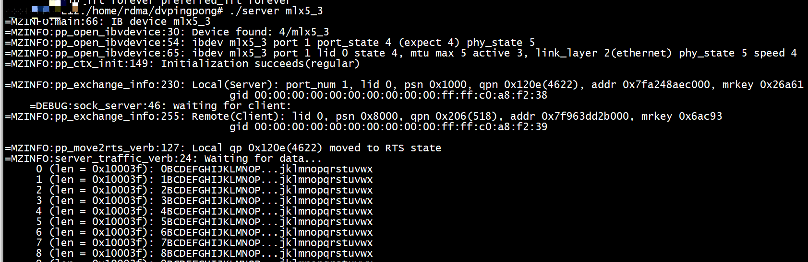
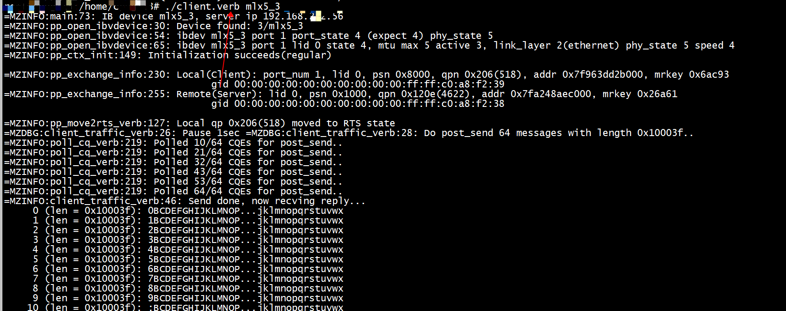

**A simple example to demonstrate how to write a rdma app over:**

    verbs APIs,
    mlx5dv APIs, and
    mlx5dv APIs over VFIO.

# How to run
<pre>
* In server side run: ./server [ib_devname]
* In client side run: ./client.verb [ib_devname] # Client based on verbs API
  or:
  ./client.dv [ib_devname] # Client based on dv API
  or:
  ./client.vfio [pci_name] # Client side based on vfio driver
</pre>

## test1

***run in roce***  
 client.verb.c    
```C
#define SERVER_IP "192.168.242.56"
```
+ server
```Shell
ibdev2netdev 
mlx5_0 port 1 ==> ens4f0 (Down)
mlx5_1 port 1 ==> ens4f1 (Up)
mlx5_2 port 1 ==> ens6 (Up)
mlx5_3 port 1 ==> ens14f0 (Up)
mlx5_4 port 1 ==> ens14f1 (Down)
mlx5_5 port 1 ==> ib0 (Up)
```

+ client
```Shell
ibdev2netdev 
mlx5_0 port 1 ==> ens4f0 (Down)
mlx5_1 port 1 ==> ens4f1 (Up)
mlx5_2 port 1 ==> ens6 (Up)
mlx5_3 port 1 ==> ens14f0 (Up)
mlx5_4 port 1 ==> ens14f1 (Down)
mlx5_5 port 1 ==> ib0 (Up)

```


## test2

```
./client.dv mlx5_3 
=MZINFO:pp_open_ibvdevice:30: Device found: 4/mlx5_3
=MZINFO:pp_open_ibvdevice:54: ibdev mlx5_3 port 1 port_state 4 (expect 4) phy_state 5
=MZINFO:pp_open_ibvdevice:65: ibdev mlx5_3 port 1 lid 0 state 4, mtu max 5 active 3, link_layer 2(ethernet) phy_state 5 speed 4
=MZINFO:pp_ctx_init:149: Initialization succeeds(regular)

=MZERR:pp_create_cq_dv:68(95:Operation not supported) cq alloc_uar() failed
```

```Text
(gdb) b  mlx5dv_devx_umem_reg
Breakpoint 1 at 0x1580
(gdb) set args mlx5_3 
(gdb) r
Starting program: /home/rdma/dvpingpong/client.dv mlx5_3 
[Thread debugging using libthread_db enabled]
Using host libthread_db library "/lib/x86_64-linux-gnu/libthread_db.so.1".
=MZINFO:pp_open_ibvdevice:30: Device found: 4/mlx5_3
=MZINFO:pp_open_ibvdevice:54: ibdev mlx5_3 port 1 port_state 4 (expect 4) phy_state 5
=MZINFO:pp_open_ibvdevice:65: ibdev mlx5_3 port 1 lid 0 state 4, mtu max 5 active 3, link_layer 2(ethernet) phy_state 5 speed 4
=MZINFO:pp_ctx_init:149: Initialization succeeds(regular)


Breakpoint 1, mlx5dv_devx_umem_reg (context=0x7ffff7f09150, addr=0x55555575ec20, size=8, access=7) at ../providers/mlx5/verbs.c:5662
5662    ../providers/mlx5/verbs.c: No such file or directory.
(gdb) bt
#0  mlx5dv_devx_umem_reg (context=0x7ffff7f09150, addr=0x55555575ec20, size=8, access=7) at ../providers/mlx5/verbs.c:5662
#1  0x0000555555557824 in pp_create_cq_dv (ppc=0x55555575c0c0 <ppdv>, dvcq=0x55555575c530 <ppdv+1136>) at pp_dv.c:42
#2  0x0000555555555bdc in main (argc=2, argv=0x7fffffffe5e8) at client.dv.c:92
(gdb) c
Continuing.

Breakpoint 1, mlx5dv_devx_umem_reg (context=0x7ffff7f09150, addr=0x555555764000, size=16384, access=7) at ../providers/mlx5/verbs.c:5662
5662    in ../providers/mlx5/verbs.c
(gdb) bt
#0  mlx5dv_devx_umem_reg (context=0x7ffff7f09150, addr=0x555555764000, size=16384, access=7) at ../providers/mlx5/verbs.c:5662
#1  0x00005555555579d9 in pp_create_cq_dv (ppc=0x55555575c0c0 <ppdv>, dvcq=0x55555575c530 <ppdv+1136>) at pp_dv.c:59
#2  0x0000555555555bdc in main (argc=2, argv=0x7fffffffe5e8) at client.dv.c:92
(gdb) c
Continuing.
=MZERR:pp_create_cq_dv:68(95:Operation not supported) cq alloc_uar() failed
[Inferior 1 (process 61834) exited with code 0377]
(gdb) c
The program is not being run.
(gdb) 
```

# Note
+ For server there's only 1 version, which is based on verbs APIs;
+ These are hardcoded:
  client side:
  + SERVER_IP
  + client_sgid_idx (in client.c);
  + dmac (for RoCE; in pp_dv.c);
  + max_wr_num (number of wr posted; in client..c; Default is PP_MAX_WR);

  server side:
  + server_sgid_idx; max_wr_num(max same as the value in client side, need to improve);

  For max_wr_num not have to be changed; e.g., for debugging you may want to change it to 1.

+ There's no wq overflow check.

<pre>
--
Mark Zhang markzhang@nvidia.com
</pre>

