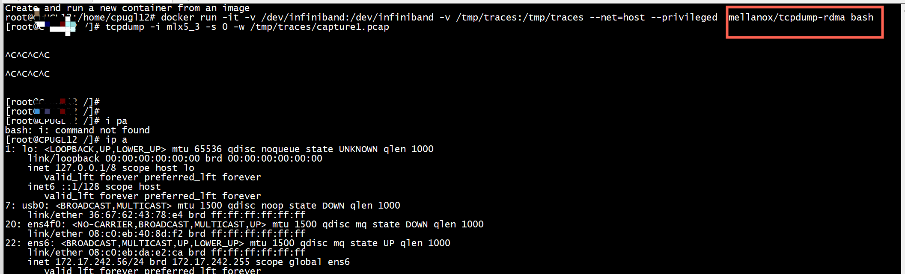
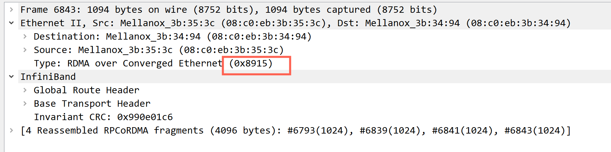
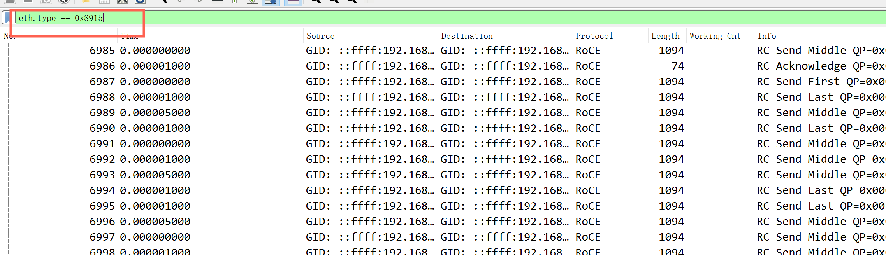
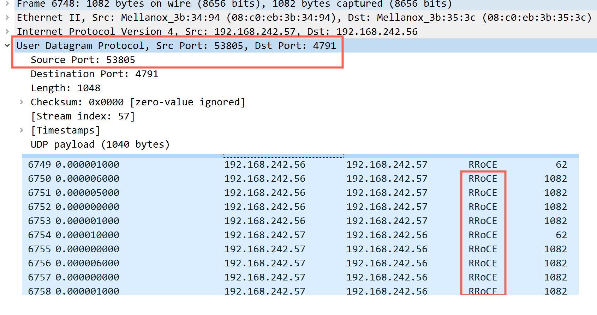
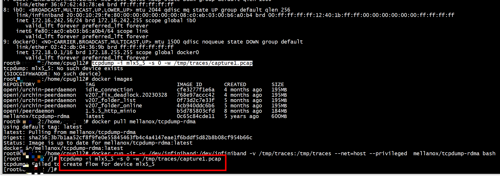
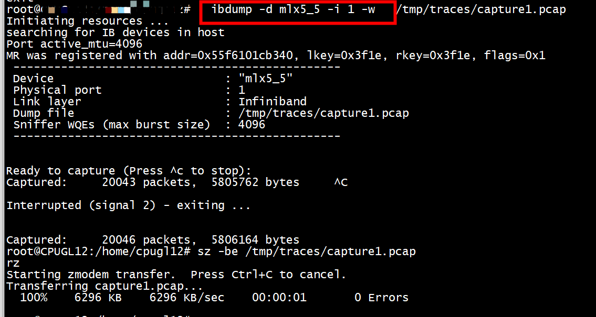
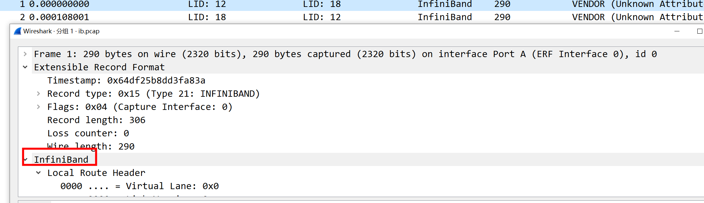

# ofed_info
```
 ofed_info -s
OFED-internal-4.9-5.1.0:
```

#  ibdump

```
ibdev2netdev 
mlx5_0 port 1 ==> ens4f0 (Down)
mlx5_1 port 1 ==> ens4f1 (Up)
mlx5_2 port 1 ==> ens6 (Up)
mlx5_3 port 1 ==> ens14f0 (Up)
mlx5_4 port 1 ==> ens14f1 (Down)
mlx5_5 port 1 ==> ib0 (Up)
```

```
ibdump -d mlx5_5 -i 1
Initiating resources ...
searching for IB devices in host
Port active_mtu=4096
MR was registered with addr=0x56413ad20340, lkey=0x3f1e, rkey=0x3f1e, flags=0x1
 ------------------------------------------------
 Device                         : "mlx5_5"
 Physical port                  : 1
 Link layer                     : Infiniband
 Dump file                      : sniffer.pcap
 Sniffer WQEs (max burst size)  : 4096
 ------------------------------------------------


Ready to capture (Press ^c to stop):
Captured:         7 packets,      938 bytes     ^C

Interrupted (signal 2) - exiting ...


Captured:         9 packets,     1206 bytes
```
但是对roce设备采用ibdump失败了

```
ibdump -d mlx5_3 -i 1
Initiating resources ...
searching for IB devices in host
Port active_mtu=1024
MR was registered with addr=0x55d136715340, lkey=0x9d96, rkey=0x9d96, flags=0x1
 ------------------------------------------------
 Device                         : "mlx5_3"
 Physical port                  : 1
 Link layer                     : Ethernet
 Dump file                      : sniffer.pcap
 Sniffer WQEs (max burst size)  : 4096
 ------------------------------------------------

Failed to set port sniffer1: command interface bad param
```

# roce 

```
 cma_roce_mode -d mlx5_3 -p 1
RoCE v2
```


```
root@ubuntu:/home/rdma/srq_pingpong# modinfo -p  mlx5_core
num_of_groups:Eswitch offloads number of big groups in FDB table. Valid range 1 - 1024. Default 4 (uint)
out_ifname: (string)
guids: (charp)
node_guid:guids configuration. This module parameter will be obsolete!
debug_mask:debug mask: 1 = dump cmd data, 2 = dump cmd exec time, 3 = both. Default=0 (uint)
prof_sel:profile selector. Valid range 0 - 3 (uint)
probe_vf:probe VFs or not, 0 = not probe, 1 = probe. Default = 1 (bool)
root@ubuntu:/home/rdma/srq_pingpong# ls /sys/module/m
mac_hid/         megaraid_sas/    mii/             mlx4_ib/         mlx5_ib/         module/          multipath/       
md4/             mei/             mlx4_core/       mlx5_core/       mlx_compat/      mousedev/        
md_mod/          mei_me/          mlx4_en/         mlx5_fpga_tools/ mlxfw/           mst_pciconf/     
root@ubuntu:/home/rdma/srq_pingpong# ls /sys/module/mlx5_core/
coresize  drivers  holders  initsize  initstate  notes  parameters  refcnt  sections  srcversion  taint  uevent  version
root@ubuntu:/home/rdma/srq_pingpong# ls /sys/module/mlx5_core/parameters/
debug_mask  guids  num_of_groups  out_ifname  probe_vf  prof_sel
root@ubuntu:/home/rdma/srq_pingpong# cat /sys/module/mlx5_core/parameters/guids 
(null)
root@ubuntu:/home/rdma/srq_pingpong# 
```

# tcpdump

```
tcpdump -D
1.ens14f0 [Up, Running]
2.ib0 [Up, Running]
3.ens4f1 [Up, Running]
4.ens6 [Up, Running]
5.any (Pseudo-device that captures on all interfaces) [Up, Running]
6.lo [Up, Running, Loopback]
7.ens4f0 [Up]
8.docker0 [Up]
9.ens14f1 [Up]
10.nflog (Linux netfilter log (NFLOG) interface)
11.nfqueue (Linux netfilter queue (NFQUEUE) interface)
12.usbmon1 (USB bus number 1)
13.usbmon2 (USB bus number 2)
```
tcpdump -i mlx5_3 报错   
```
 tcpdump -i mlx5_3  -w /tmp/traces/capture1.pcap
tcpdump: mlx5_3: No such device exists
(SIOCGIFHWADDR: No such device)
```

##  tcpdump-rdma

***要执行ethtool --set-priv-flags ens14f0 sniffer off***，否则无法抓包

``` Text
1、拉取容器：
docker pull mellanox / tcpdump-rdma

2、启动容器
docker run -it -v /dev/infiniband:/dev/infiniband -v /tmp/traces:/tmp/traces --net=host --privileged  mellanox/tcpdump-rdma bash

现在mellanox/tcpdump-rdma bash 开始使用RDMA设备mlx5_0捕获数据包。 （注意RDMA设备，而不是以太网设备）

3、保存捕获结果到文件

tcpdump -i mlx5_0 -s 0 -w /tmp/traces/capture1.pcap 

这会将数据包保存在容器内外/ tmp / traces目录中的capture1.pcap文件中。
```
```
docker run -it --net=host --privileged \
    -v /dev/infiniband:/dev/infiniband -v /tmp/traces:/tmp/traces \
    mellanox/tcpdump-rdma bash
```
roce报文也需要在mellanox/tcpdump-rdma容器内    




###  roce type

The EtherType is 0x8915 (ROCEv1)   
if the UDP port is 4791* (or whatever you set the preference to) (this is for ROCEv2)   

```
centos7@centos7:~$ cat /sys/class/infiniband/mlx5_1/ports/1/gid_attrs/ndevs/0
enp1s0f1
centos7@centos7:~$ ls /sys/class/infiniband/mlx5_1/ports/1/gid_attrs/ndevs/
0    105  112  12   127  134  141  149  156  163  170  178  185  192  2    206  213  220  228  235  242  25   28  35  42  5   57  64  71  79  86  93
1    106  113  120  128  135  142  15   157  164  171  179  186  193  20   207  214  221  229  236  243  250  29  36  43  50  58  65  72  8   87  94
10   107  114  121  129  136  143  150  158  165  172  18   187  194  200  208  215  222  23   237  244  251  3   37  44  51  59  66  73  80  88  95
100  108  115  122  13   137  144  151  159  166  173  180  188  195  201  209  216  223  230  238  245  252  30  38  45  52  6   67  74  81  89  96
101  109  116  123  130  138  145  152  16   167  174  181  189  196  202  21   217  224  231  239  246  253  31  39  46  53  60  68  75  82  9   97
102  11   117  124  131  139  146  153  160  168  175  182  19   197  203  210  218  225  232  24   247  254  32  4   47  54  61  69  76  83  90  98
103  110  118  125  132  14   147  154  161  169  176  183  190  198  204  211  219  226  233  240  248  26   33  40  48  55  62  7   77  84  91  99
104  111  119  126  133  140  148  155  162  17   177  184  191  199  205  212  22   227  234  241  249  27   34  41  49  56  63  70  78  85  92
centos7@centos7:~$ cat  /sys/class/infiniband/mlx5_1/ports/1/gid_attrs/ndevs/1
enp1s0f1
centos7@centos7:~$ cat /sys/class/infiniband/mlx5_1/ports/1/gid_attrs/types/0
IB/RoCE v1
centos7@centos7:~$ cat /sys/class/infiniband/mlx5_1/ports/1/gid_attrs/types/1
RoCE v2
centos7@centos7:~$ ls  /sys/class/infiniband/mlx5_1/ports/1/gid_attrs/types
0    105  112  12   127  134  141  149  156  163  170  178  185  192  2    206  213  220  228  235  242  25   28  35  42  5   57  64  71  79  86  93
1    106  113  120  128  135  142  15   157  164  171  179  186  193  20   207  214  221  229  236  243  250  29  36  43  50  58  65  72  8   87  94
10   107  114  121  129  136  143  150  158  165  172  18   187  194  200  208  215  222  23   237  244  251  3   37  44  51  59  66  73  80  88  95
100  108  115  122  13   137  144  151  159  166  173  180  188  195  201  209  216  223  230  238  245  252  30  38  45  52  6   67  74  81  89  96
101  109  116  123  130  138  145  152  16   167  174  181  189  196  202  21   217  224  231  239  246  253  31  39  46  53  60  68  75  82  9   97
102  11   117  124  131  139  146  153  160  168  175  182  19   197  203  210  218  225  232  24   247  254  32  4   47  54  61  69  76  83  90  98
103  110  118  125  132  14   147  154  161  169  176  183  190  198  204  211  219  226  233  240  248  26   33  40  48  55  62  7   77  84  91  99
104  111  119  126  133  140  148  155  162  17   177  184  191  199  205  212  22   227  234  241  249  27   34  41  49  56  63  70  78  85  92
centos7@centos7:~$ 
```

#### rocev1

```
ibv_devinfo -d mlx5_3 -v | grep -i GID
                        gid_tbl_len:            256
                        GID[  0]:               fe80:0000:0000:0000:0ac0:ebff:fe3b:353c
                        GID[  1]:               fe80:0000:0000:0000:0ac0:ebff:fe3b:353c
                        GID[  2]:               0000:0000:0000:0000:0000:ffff:c0a8:f238
                        GID[  3]:               0000:0000:0000:0000:0000:ffff:c0a8:f238
```


```
show_gids
DEV     PORT    INDEX   GID                                     IPv4            VER     DEV
---     ----    -----   ---                                     ------------    ---     ---
mlx5_0  1       0       fe80:0000:0000:0000:0ac0:ebff:fe3b:3490                 v1      ens4f0
mlx5_0  1       1       fe80:0000:0000:0000:0ac0:ebff:fe3b:3490                 v2      ens4f0
mlx5_1  1       0       fe80:0000:0000:0000:0ac0:ebff:fe3b:3491                 v1      ens4f1
mlx5_1  1       1       fe80:0000:0000:0000:0ac0:ebff:fe3b:3491                 v2      ens4f1
mlx5_1  1       2       0000:0000:0000:0000:0000:ffff:0a10:f239 10.16.242.57    v1      ens4f1
mlx5_1  1       3       0000:0000:0000:0000:0000:ffff:0a10:f239 10.16.242.57    v2      ens4f1
mlx5_2  1       0       fe80:0000:0000:0000:0ac0:ebff:feda:e2ba                 v1      ens6
mlx5_2  1       1       fe80:0000:0000:0000:0ac0:ebff:feda:e2ba                 v2      ens6
mlx5_2  1       2       0000:0000:0000:0000:0000:ffff:ac11:f239 172.17.242.57   v1      ens6
mlx5_2  1       3       0000:0000:0000:0000:0000:ffff:ac11:f239 172.17.242.57   v2      ens6
mlx5_3  1       0       fe80:0000:0000:0000:0ac0:ebff:fe3b:3494                 v1      ens14f0
mlx5_3  1       1       fe80:0000:0000:0000:0ac0:ebff:fe3b:3494                 v2      ens14f0
mlx5_3  1       2       0000:0000:0000:0000:0000:ffff:c0a8:f239 192.168.242.57          v1      ens14f0
mlx5_3  1       3       0000:0000:0000:0000:0000:ffff:c0a8:f239 192.168.242.57          v2      ens14f0
mlx5_4  1       0       fe80:0000:0000:0000:0ac0:ebff:fe3b:3495                 v1      ens14f1
mlx5_4  1       1       fe80:0000:0000:0000:0ac0:ebff:fe3b:3495                 v2      ens14f1
mlx5_5  1       0       fe80:0000:0000:0000:08c0:eb03:00ea:50de                 v1
n_gids_found=17
```
***通过show_gids 可以查看GID是支持rocev1还是rocev2***

服务端和客户端采用GID[  2]  
```
server:./srq_pingpong  -d mlx5_3  -g 2
client: ./srq_pingpong  -d mlx5_3  192.168.242.57 -g 2 
```

eth.type == 0x8915   


#### rocev2

服务端和客户端采用GID[  3]  
```
server:./srq_pingpong  -d mlx5_3  -g 3
client: ./srq_pingpong  -d mlx5_3  192.168.242.57 -g 3 
```



# ibdump
ibdump -i 1 -d  mlx5_5 -s  -w /tmp/traces/capture1.pcap    






 frame.number >= 20 && frame.number <= 30   



***Base lid: 12,SM lid: 4***  
```
CA 'mlx5_5'
        CA type: MT4123
        Number of ports: 1
        Firmware version: 20.30.1004
        Hardware version: 0
        Node GUID: 0x08c0eb0300b6a0b4
        System image GUID: 0x08c0eb0300b6a0b4
        Port 1:
                State: Active
                Physical state: LinkUp
                Rate: 200
                Base lid: 12
                LMC: 0
                SM lid: 4
                Capability mask: 0x2651e848
                Port GUID: 0x08c0eb0300b6a0b4
                Link layer: InfiniBand
```
***Base lid: 18,SM lid: 4***
```
CA 'mlx5_5'
        CA type: MT4123
        Number of ports: 1
        Firmware version: 20.30.1004
        Hardware version: 0
        Node GUID: 0x08c0eb0300ea50e6
        System image GUID: 0x08c0eb0300ea50e6
        Port 1:
                State: Active
                Physical state: LinkUp
                Rate: 200
                Base lid: 18
                LMC: 0
                SM lid: 4
                Capability mask: 0x2651e848
                Port GUID: 0x08c0eb0300ea50e6
                Link layer: InfiniBand
```

##  Failed to set port sniffer1: command interface bad param  


```
root@ubuntu:~/rc_pingpong# ibdump  -d   mlx5_1  -i 1  -w /tmp/traces/capture1.pcap
Initiating resources ...
searching for IB devices in host
Port active_mtu=1024
MR was registered with addr=0x562e589fba50, lkey=0x4100f, rkey=0x4100f, flags=0x1
 ------------------------------------------------
 Device                         : "mlx5_1"
 Physical port                  : 1
 Link layer                     : Ethernet
 Dump file                      : /tmp/traces/capture1.pcap
 Sniffer WQEs (max burst size)  : 4096
 ------------------------------------------------

Failed to set port sniffer1: command interface bad param
root@ubuntu:~/rc_pingpong# ethtool --show-priv-flags    enp61s0f1np1
Private flags for enp61s0f1np1:
rx_cqe_moder       : on
tx_cqe_moder       : off
rx_cqe_compress    : off
tx_cqe_compress    : off
rx_striding_rq     : on
rx_no_csum_complete: off
xdp_tx_mpwqe       : on
skb_tx_mpwqe       : on
tx_port_ts         : off
dropless_rq        : off
per_channel_stats  : on
tx_xdp_hw_checksum : off
skb_xmit_more      : off
```
